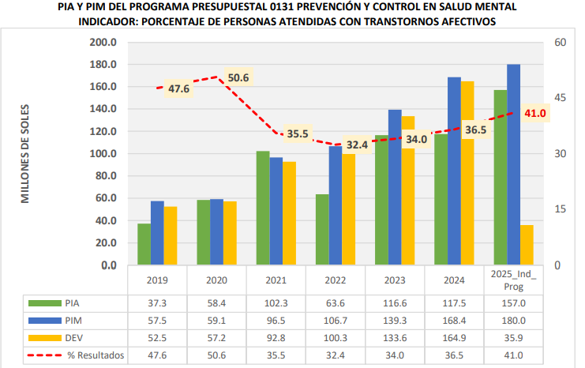
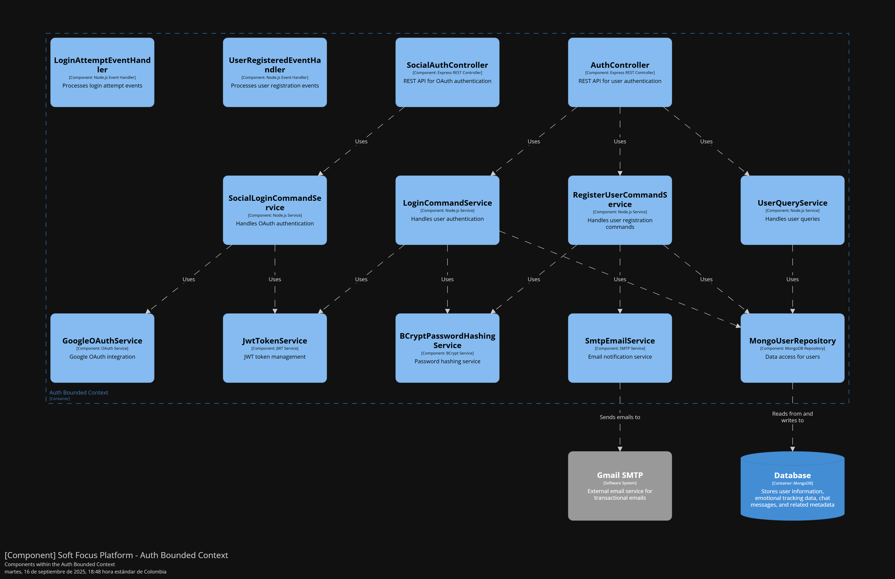
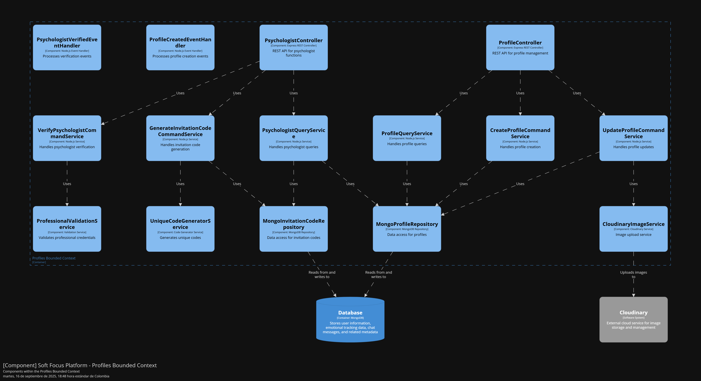
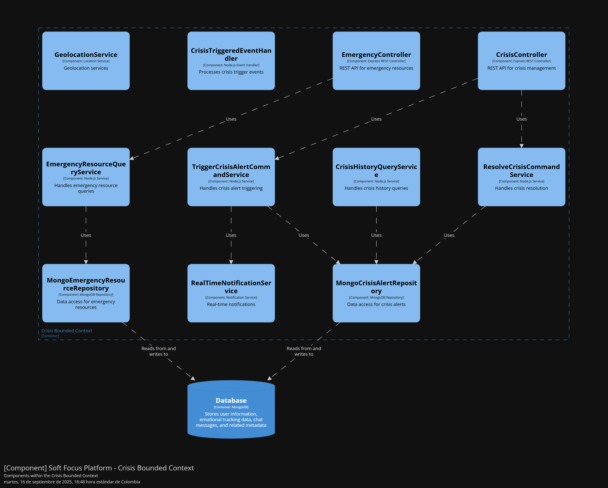
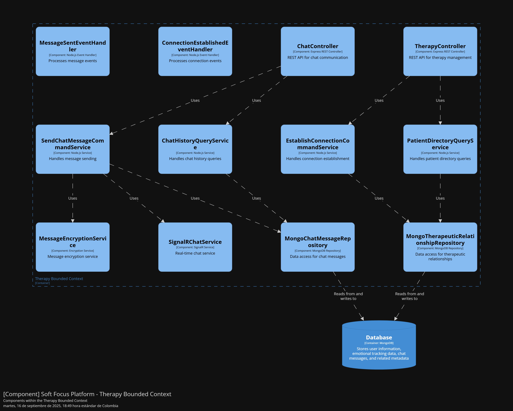
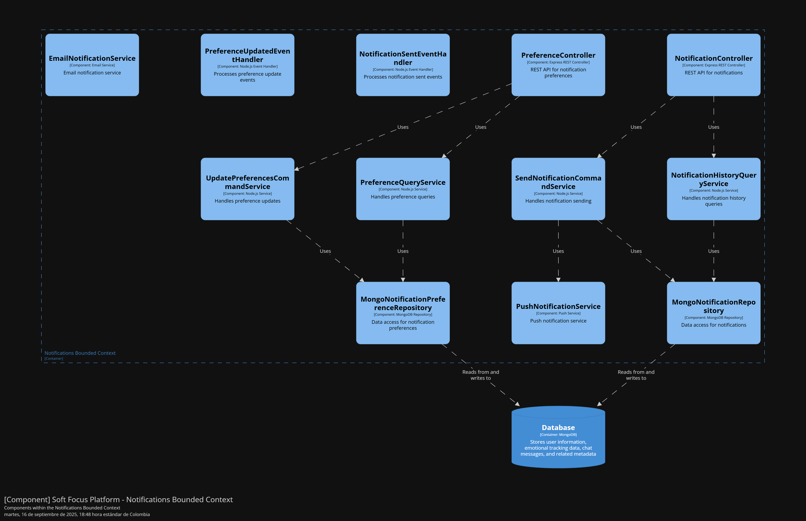
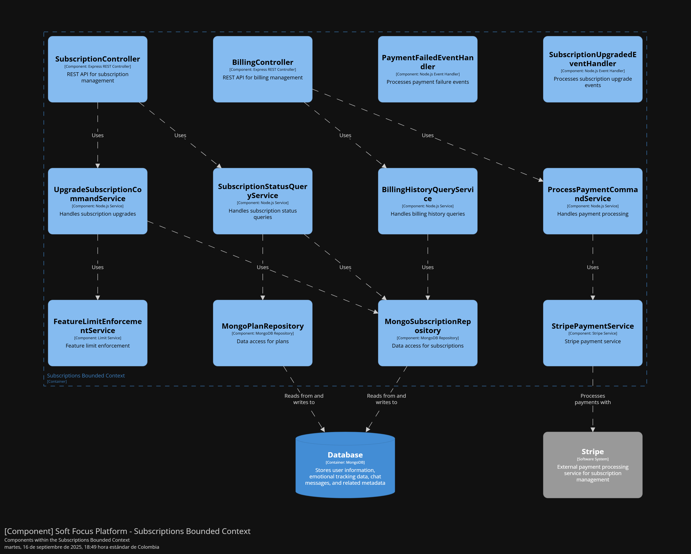
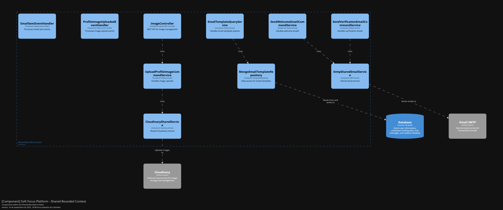

<h1 align="center"><strong>Informe del Trabajo Final</strong></h1>
<h3 align="center"><strong>Universidad Peruana de Ciencias Aplicadas</strong></h3>

    

<h4 align="center"><strong>Ingeniería de Software</strong></h4>
<h4 align="center"><strong>Aplicaciones para Dispositivos Móviles - 1795</strong></h4>
<h4 align="center"><strong>Docente:</strong> Jorge Luis Mayta Guillermo</h4>
<h4 align="center"><strong>Startup:</strong> PsyWell</h4>
<h4 align="center"><strong>Product:</strong> Soft Focus</h4>

<strong>Team members:</strong>

<table align="center"; style="width: 100%; border-collapse: collapse; margin: 0 auto;">
  <tr>
    <th style="border: 1px solid black; padding: 8px; text-align: center;">Nombre</th>
    <th style="border: 1px solid black; padding: 8px; text-align: center;">Código</th>
  </tr>
  </tr>
    <tr>
    <td style="border: 1px solid black; padding: 8px; text-align: center;">Bueno Perales,Mathias Eduardo</td>
    <td style="border: 1px solid black; padding: 8px; text-align: center;">U202313433</td>
  </tr>
  <tr>
    <td style="border: 1px solid black; padding: 8px; text-align: center;">Gutiérrez Condo, Maylhy Olinda </td>
    <td style="border: 1px solid black; padding: 8px; text-align: center;">U202311220</td>
  </tr>
  </tr>
    <tr>
    <td style="border: 1px solid black; padding: 8px; text-align: center;">Luyo Correa, Sandra Paula</td>
    <td style="border: 1px solid black; padding: 8px; text-align: center;">U202314513</td>
  </tr>  
  <tr>
    <td style="border: 1px solid black; padding: 8px; text-align: center;">Roca Tineo,Steven Mathew </td>
    <td style="border: 1px solid black; padding: 8px; text-align: center;">U202311361</td>
  </tr>
    <tr>
    <td style="border: 1px solid black; padding: 8px; text-align: center;">Solis Santa Cruz, Giancarlo Rafael</td>
    <td style="border: 1px solid black; padding: 8px; text-align: center;">U202318615</td>
  </tr>
</table>

<h3 align="center"><strong>Ciclo 2025-20</strong></h3>

# **Registro de Versiones del Informe** 

| Versión | Fecha | Autor | Descripción de modificación |
| :---- | :---- | :---- | :---- |
| TB1 | //2025 | Gutiérrez Condo, Maylhy Olinda   Roca Tineo, Steven Mathew   Bueno Perales, Mathias Eduardo   Luyo Correa, Sandra Paula   Solis Santa Cruz, Giancarlo Rafael | En la primera entrega del informe de nuestro proyecto, hemos realizado los primeros 5 capítulos del informe y también entregamos la primera versión del landing page de Soft Focus. |

 

# **Project Report Collaboration Insights**

# **Tabla de Contenidos**

<ul><a href="#registro-de-versiones-del-informe">Registro de Versiones del Informe</a></ul>

<ul><a href="#project-report-collaboration-insights">Project Report Collaboration Insights</a></ul>

<ul><a href="#contenido">Contenido</a></ul>

<ul><a href="#tabla-de-contenidos">Tabla de Contenidos</a></ul>

<ul><a href="#student-outcome">Student Outcome</a></ul>

<ul><a href="#objetivos-smart">Objetivos SMART</a></ul>

<a href="#capítulo-i-presentación">Capítulo I: Presentación</a>    
    	<ul>
            <a href="#11-startup-profile">1.1. Startup Profile</a> 
	    <ul>
            <a href="#111-descripción-de-la-startup">1.1.1. Descripción de la Startup</a> 
            <a href="#112-perfiles-de-integrantes-del-equipo">1.1.2. Perfiles de Integrantes del Equipo</a> 
	    </ul>
            <a href="#12-solution-profile">1.2. Solution Profile</a> 
	    <ul>
            <a href="#121-antecedentes-y-problemática">1.2.1. Antecedentes y Problemática</a> 
            <a href="#122-lean-ux-process">1.2.2. Lean UX Process</a> 
		<ul>
            <a href="#1221-lean-ux-problem-statements">1.2.2.1. Lean UX Problem Statements</a> 
            <a href="#1222-lean-ux-assumptions">1.2.2.2. Lean UX Assumptions</a> 
            <a href="#1223-lean-ux-hypothesis-statements">1.2.2.3. Lean UX Hypothesis Statements</a> 
            <a href="#1224-lean-ux-canvas">1.2.2.4. Lean UX Canvas</a> 
		</ul>
	    </ul>
            <a href="#13-segmentos-objetivos">1.3. Segmentos Objetivos</a> 
        </ul>    

<a href="#capítulo-ii-requirements-development-and-software-solution-design">Capítulo II: Requirements Development and Software Solution Design</a>
        <ul>
            <a href="#21-competidores">2.1. Competidores</a> 
		<ul>
            <a href="#211-análisis-competitivo">2.1.1. Análisis competitivo</a> 
            <a href="#212-estrategias-y-tácticas-frente-a-competidores">2.1.2. Estrategias y tácticas frente a competidores</a> 
		</ul>
            <a href="#22-entrevistas">2.2. Entrevistas</a> 
		<ul>
            <a href="#221-diseño-de-entrevistas">2.2.1. Diseño de entrevistas</a> 
            <a href="#222-registro-de-entrevistas">2.2.2. Registro de entrevistas</a> 
            <a href="#223-análisis-de-entrevistas">2.2.3. Análisis de entrevistas</a> 
		</ul>
            <a href="#23-needfinding">2.3. Needfinding</a> 
		<ul>
            <a href="#231-user-personas">2.3.1. User Personas</a> 
            <a href="#232-user-task-matrix">2.3.2. User Task Matrix</a> 
            <a href="#233-user-journey-mapping">2.3.3. User Journey Mapping</a> 
            <a href="#234-empathy-mapping">2.3.4. Empathy Mapping</a> 
            <a href="#235-ubiquitous-language">2.3.5. Ubiquitous Language</a> 
		</ul>
            <a href="#24-requirements-specification">2.4. Requirements specification</a> 
		<ul>
            <a href="#241-user-stories">2.4.1. User Stories</a> 
            <a href="#242-impact-mapping">2.4.2. Impact Mapping</a> 
            <a href="#243-product-backlog">2.4.3. Product Backlog</a> 
		</ul>
            <a href="#25-strategic-level-domain-driven-design">2.5. Strategic-Level Domain-Driven Design</a> 
		<ul>
            <a href="#251-eventstorming">2.5.1. EventStorming</a> 
		    <ul>
                <a href="#2511-candidate-context-discovery">2.5.1.1. Candidate Context Discovery</a> 
                <a href="#2512-domain-message-flows-modeling">2.5.1.2. Domain Message Flows Modeling</a> 
                <a href="#2513-bounded-context-canvases">2.5.1.3. Bounded Context Canvases</a> 
		    </ul>
            <a href="#252-context-mapping">2.5.2. Context Mapping</a> 
            <a href="#253-software-architecture">2.5.3. Software Architecture</a> 
		    <ul>
                <a href="#2531-software-architecture-context-level-diagrams">2.5.3.1. Software Architecture Context Level Diagrams</a> 
                <a href="#2532-software-architecture-container-level-diagrams">2.5.3.2. Software Architecture Container Level Diagrams</a> 
                <a href="#2533-software-architecture-deployment-diagrams">2.5.3.3. Software Architecture Deployment Diagrams</a> 
		    </ul>
		</ul>
            <a href="#26-tactical-level-domain-driven-design">2.6. Tactical-Level Domain-Driven Design</a> 
		<ul>
            <a href="#261-bounded-context-auth">2.6.1. Bounded Context: Auth</a> 
		    <ul>
                <a href="#2611-domain-layer">2.6.1.1. Domain Layer</a> 
                <a href="#2612-interface-layer">2.6.1.2. Interface Layer</a> 
                <a href="#2613-application-layer">2.6.1.3. Application Layer</a> 
                <a href="#2614-infrastructure-layer">2.6.1.4 Infrastructure Layer</a> 
                <a href="#2615-bounded-context-software-architecture-component-level-diagrams">2.6.1.5. Bounded Context Software Architecture Component Level Diagrams</a> 
                <a href="#2616-bounded-context-software-architecture-code-level-diagrams">2.6.1.6. Bounded Context Software Architecture Code Level Diagrams</a> 
		        <ul>
                    <a href="#26161-bounded-context-domain-layer-class-diagrams">2.6.1.6.1. Bounded Context Domain Layer Class Diagrams</a> 
                    <a href="#26162-bounded-context-database-design-diagram">2.6.1.6.2. Bounded Context Database Design Diagram</a> 
		        </ul>
		    </ul>
            <a href="#262-bounded-context-profiles">2.6.2. Bounded Context: Profiles</a> 
		    <ul>
                <a href="#2621-domain-layer">2.6.2.1. Domain Layer</a> 
                <a href="#2622-interface-layer">2.6.2.2. Interface Layer</a> 
                <a href="#2623-application-layer">2.6.2.3. Application Layer</a> 
                <a href="#2624-infrastructure-layer">2.6.2.4 Infrastructure Layer</a> 
                <a href="#2625-bounded-context-software-architecture-component-level-diagrams">2.6.2.5. Bounded Context Software Architecture Component Level Diagrams</a> 
                <a href="#2626-bounded-context-software-architecture-code-level-diagrams">2.6.2.6. Bounded Context Software Architecture Code Level Diagrams</a> 
		        <ul>
                    <a href="#26261-bounded-context-domain-layer-class-diagrams">2.6.2.6.1. Bounded Context Domain Layer Class Diagrams</a> 
                    <a href="#26262-bounded-context-database-design-diagram">2.6.2.6.2. Bounded Context Database Design Diagram</a> 
		        </ul>
		    </ul>
            <a href="#263-bounded-context-tracking">2.6.3. Bounded Context: Tracking</a> 
		    <ul>
                <a href="#2631-domain-layer">2.6.3.1. Domain Layer</a> 
                <a href="#2632-interface-layer">2.6.3.2. Interface Layer</a> 
                <a href="#2633-application-layer">2.6.3.3. Application Layer</a> 
                <a href="#2634-infrastructure-layer">2.6.3.4 Infrastructure Layer</a> 
                <a href="#2635-bounded-context-software-architecture-component-level-diagrams">2.6.3.5. Bounded Context Software Architecture Component Level Diagrams</a> 
                <a href="#2636-bounded-context-software-architecture-code-level-diagrams">2.6.3.6. Bounded Context Software Architecture Code Level Diagrams</a> 
		        <ul>
                    <a href="#26361-bounded-context-domain-layer-class-diagrams">2.6.3.6.1. Bounded Context Domain Layer Class Diagrams</a> 
                    <a href="#26362-bounded-context-database-design-diagram">2.6.3.6.2. Bounded Context Database Design Diagram</a> 
		        </ul>
		    </ul>
            <a href="#264-bounded-context-crisis">2.6.4. Bounded Context: Crisis</a> 
		    <ul>
                <a href="#2641-domain-layer">2.6.4.1. Domain Layer</a> 
                <a href="#2642-interface-layer">2.6.4.2. Interface Layer</a> 
                <a href="#2643-application-layer">2.6.4.3. Application Layer</a> 
                <a href="#2644-infrastructure-layer">2.6.4.4 Infrastructure Layer</a> 
                <a href="#2645-bounded-context-software-architecture-component-level-diagrams">2.6.4.5. Bounded Context Software Architecture Component Level Diagrams</a> 
                <a href="#2646-bounded-context-software-architecture-code-level-diagrams">2.6.4.6. Bounded Context Software Architecture Code Level Diagrams</a> 
		        <ul>
                    <a href="#26461-bounded-context-domain-layer-class-diagrams">2.6.4.6.1. Bounded Context Domain Layer Class Diagrams</a> 
                    <a href="#26462-bounded-context-database-design-diagram">2.6.4.6.2. Bounded Context Database Design Diagram</a> 
		        </ul>
		    </ul>
            <a href="#265-bounded-context-therapy">2.6.5. Bounded Context: Therapy</a> 
		    <ul>
                <a href="#2651-domain-layer">2.6.5.1. Domain Layer</a> 
                <a href="#2652-interface-layer">2.6.5.2. Interface Layer</a> 
                <a href="#2653-application-layer">2.6.5.3. Application Layer</a> 
                <a href="#2654-infrastructure-layer">2.6.5.4 Infrastructure Layer</a> 
                <a href="#2655-bounded-context-software-architecture-component-level-diagrams">2.6.5.5. Bounded Context Software Architecture Component Level Diagrams</a> 
                <a href="#2656-bounded-context-software-architecture-code-level-diagrams">2.6.5.6. Bounded Context Software Architecture Code Level Diagrams</a> 
		        <ul>
                    <a href="#26561-bounded-context-domain-layer-class-diagrams">2.6.5.6.1. Bounded Context Domain Layer Class Diagrams</a> 
                    <a href="#26562-bounded-context-database-design-diagram">2.6.5.6.2. Bounded Context Database Design Diagram</a> 
		        </ul>
		    </ul>
            <a href="#266-bounded-context-notifications">2.6.6. Bounded Context: Notifications</a> 
		    <ul>
                <a href="#2661-domain-layer">2.6.6.1. Domain Layer</a> 
                <a href="#2662-interface-layer">2.6.6.2. Interface Layer</a> 
                <a href="#2663-application-layer">2.6.6.3. Application Layer</a> 
                <a href="#2664-infrastructure-layer">2.6.6.4 Infrastructure Layer</a> 
                <a href="#2665-bounded-context-software-architecture-component-level-diagrams">2.6.6.5. Bounded Context Software Architecture Component Level Diagrams</a> 
                <a href="#2666-bounded-context-software-architecture-code-level-diagrams">2.6.6.6. Bounded Context Software Architecture Code Level Diagrams</a> 
		        <ul>
                    <a href="#26661-bounded-context-domain-layer-class-diagrams">2.6.6.6.1. Bounded Context Domain Layer Class Diagrams</a> 
                    <a href="#26662-bounded-context-database-design-diagram">2.6.6.6.2. Bounded Context Database Design Diagram</a> 
		        </ul>
		    </ul>
            <a href="#267-bounded-context-subscriptions">2.6.7. Bounded Context: Subscriptions</a> 
		    <ul>
                <a href="#2671-domain-layer">2.6.7.1. Domain Layer</a> 
                <a href="#2672-interface-layer">2.6.7.2. Interface Layer</a> 
                <a href="#2673-application-layer">2.6.7.3. Application Layer</a> 
                <a href="#2674-infrastructure-layer">2.6.7.4 Infrastructure Layer</a> 
                <a href="#2675-bounded-context-software-architecture-component-level-diagrams">2.6.7.5. Bounded Context Software Architecture Component Level Diagrams</a> 
                <a href="#2676-bounded-context-software-architecture-code-level-diagrams">2.6.7.6. Bounded Context Software Architecture Code Level Diagrams</a> 
		        <ul>
                    <a href="#26761-bounded-context-domain-layer-class-diagrams">2.6.7.6.1. Bounded Context Domain Layer Class Diagrams</a> 
                    <a href="#26762-bounded-context-database-design-diagram">2.6.7.6.2. Bounded Context Database Design Diagram</a> 
		        </ul>
		    </ul>
            <a href="#268-bounded-context-shared">2.6.8. Bounded Context: Shared</a> 
		    <ul>
                <a href="#2681-domain-layer">2.6.8.1. Domain Layer</a> 
                <a href="#2682-interface-layer">2.6.8.2. Interface Layer</a> 
                <a href="#2683-application-layer">2.6.8.3. Application Layer</a> 
                <a href="#2684-infrastructure-layer">2.6.8.4 Infrastructure Layer</a> 
                <a href="#2685-bounded-context-software-architecture-component-level-diagrams">2.6.8.5. Bounded Context Software Architecture Component Level Diagrams</a> 
                <a href="#2686-bounded-context-software-architecture-code-level-diagrams">2.6.8.6. Bounded Context Software Architecture Code Level Diagrams</a> 
		        <ul>
                    <a href="#26861-bounded-context-domain-layer-class-diagrams">2.6.8.6.1. Bounded Context Domain Layer Class Diagrams</a> 
                    <a href="#26862-bounded-context-database-design-diagram">2.6.8.6.2. Bounded Context Database Design Diagram</a> 
		        </ul>
		    </ul>
		</ul>
        </ul>   

<a href="#capítulo-iii-solution-uiux-design">Capítulo III: Solution UI/UX Design</a>
        <ul>
            <a href="#31-product-design">3.1. Product Design</a> 
		<ul>
            <a href="#311-style-guidelines">3.1.1. Style Guidelines</a> 
		    <ul>
                <a href="#3111-general-style-guidelines">3.1.1.1. General Style Guidelines</a> 
		    </ul>
            <a href="#312-information-architecture">3.1.2. Information Architecture</a> 
		    <ul>
                <a href="#3121-organization-systems">3.1.2.1. Organization Systems</a> 
                <a href="#3122-labelling-systems">3.1.2.2. Labelling Systems</a> 
                <a href="#3123-seo-tags-and-meta-tags">3.1.2.3. SEO Tags and Meta Tags</a> 
                <a href="#3124-searching-systems">3.1.2.4. Searching Systems</a> 
                <a href="#3125-navigation-systems">3.1.2.5. Navigation Systems</a> 
		    </ul>
            <a href="#313-landing-page-ui-design">3.1.3. Landing Page UI Design</a> 
		    <ul>
                <a href="#3131-landing-page-wireframe">3.1.3.1. Landing Page Wireframe</a> 
                <a href="#3132-landing-page-mock-up">3.1.3.2. Landing Page Mock-up</a> 
		    </ul>
            <a href="#314-mobile-applications-uxui-design">3.1.4. Mobile Applications UX/UI Design</a> 
		    <ul>
                <a href="#3141-mobile-applications-wireframes">3.1.4.1. Mobile Applications Wireframes</a> 
                <a href="#3142-mobile-applications-wireflow-diagrams">3.1.4.2. Mobile Applications Wireflow Diagrams</a> 
                <a href="#3143-mobile-applications-mock-ups">3.1.4.3. Mobile Applications Mock-ups</a> 
                <a href="#3144-mobile-applications-user-flow-diagrams">3.1.4.4. Mobile Applications User Flow Diagrams</a> 
                <a href="#3145-mobile-applications-prototyping">3.1.4.5. Mobile Applications Prototyping</a> 
		    </ul>
		</ul>
        </ul>    

<a href="#capítulo-iv-product-implementation--validation">Capítulo IV: Product Implementation & Validation</a>
        <ul>
            <a href="#4-product-implementation--validation">4. Product Implementation & Validation</a> 
            <a href="#41-software-configuration-management">4.1. Software Configuration Management</a> 
	<ul>
            <a href="#411-software-development-environment-configuration">4.1.1. Software Development Environment Configuration</a> 
            <a href="#412-source-code-management">4.1.2. Source Code Management</a> 
            <a href="#413-source-code-style-guide--conventions">4.1.3. Source Code Style Guide & Conventions</a> 
            <a href="#414-software-deployment-configuration">4.1.4. Software Deployment Configuration</a> 
	</ul>
            <a href="#42-landing-page--mobile-application-implementation">4.2. Landing Page & Mobile Application Implementation</a> 
		<ul>
            <a href="#421-sprint-1">4.2.1. Sprint 1</a> 
			<ul>
            <a href="#4211-sprint-planning-1">4.2.1.1. Sprint Planning 1</a> 
            <a href="#4212-sprint-backlog-1">4.2.1.2. Sprint Backlog 1</a> 
            <a href="#4213-development-evidence-for-sprint-review">4.2.1.3. Development Evidence for Sprint Review</a> 
            <a href="#4214-testing-suite-evidence-for-sprint-review">4.2.1.4. Testing Suite Evidence for Sprint Review</a> 
            <a href="#4215-execution-evidence-for-sprint-review">4.2.1.5. Execution Evidence for Sprint Review</a> 
            <a href="#4216-services-documentation-evidence-for-sprint-review">4.2.1.6. Services Documentation Evidence for Sprint Review</a> 
            <a href="#4217-software-deployment-evidence-for-sprint-review">4.2.1.7. Software Deployment Evidence for Sprint Review</a> 
            <a href="#4218-team-collaboration-insights-during-sprint">4.2.1.8. Team Collaboration Insights during Sprint</a> 
			</ul>
            <a href="#422-sprint-2">4.2.2. Sprint 2</a> 
			<ul>
            <a href="#4221-sprint-planning-2">4.2.2.1. Sprint Planning 2</a> 
            <a href="#4222-sprint-backlog-2">4.2.2.2. Sprint Backlog 2</a> 
            <a href="#4223-development-evidence-for-sprint-review">4.2.2.3. Development Evidence for Sprint Review</a> 
            <a href="#4224-testing-suite-evidence-for-sprint-review">4.2.2.4. Testing Suite Evidence for Sprint Review</a> 
            <a href="#4225-execution-evidence-for-sprint-review">4.2.2.5. Execution Evidence for Sprint Review</a> 
            <a href="#4226-services-documentation-evidence-for-sprint-review">4.2.2.6. Services Documentation Evidence for Sprint Review</a> 
            <a href="#4227-software-deployment-evidence-for-sprint-review">4.2.2.7. Software Deployment Evidence for Sprint Review</a> 
            <a href="#4228-team-collaboration-insights-during-sprint">4.2.2.8. Team Collaboration Insights during Sprint</a> 
			</ul>
            <a href="#423-sprint-3">4.2.3. Sprint 3</a> 
			<ul>
            <a href="#4231-sprint-planning-3">4.2.3.1. Sprint Planning 3</a> 
            <a href="#4232-sprint-backlog-3">4.2.3.2. Sprint Backlog 3</a> 
            <a href="#4233-development-evidence-for-sprint-review">4.2.3.3. Development Evidence for Sprint Review</a> 
            <a href="#4234-testing-suite-evidence-for-sprint-review">4.2.3.4. Testing Suite Evidence for Sprint Review</a> 
            <a href="#4235-execution-evidence-for-sprint-review">4.2.3.5. Execution Evidence for Sprint Review</a> 
            <a href="#4236-services-documentation-evidence-for-sprint-review">4.2.3.6. Services Documentation Evidence for Sprint Review</a> 
            <a href="#4237-software-deployment-evidence-for-sprint-review">4.2.3.7. Software Deployment Evidence for Sprint Review</a> 
            <a href="#4238-team-collaboration-insights-during-sprint">4.2.3.8. Team Collaboration Insights during Sprint</a> 
			</ul>
		</ul>
            <a href="#43-validation-interviews">4.3. Validation Interviews</a> 
		<ul>
            <a href="#431-diseño-de-entrevistas">4.3.1. Diseño de Entrevistas</a> 
            <a href="#432-registro-de-entrevistas">4.3.2. Registro de Entrevistas</a> 
            <a href="#433-evaluaciones-según-heurísticas">4.3.3. Evaluaciones según heurísticas</a> 
		</ul>
        </ul>        

<a href="#conclusiones">Conclusiones</a>
<ul>
    <a href="#conclusiones-y-recomendaciones">Conclusiones y recomendaciones</a> 
    <a href="#video-app-validation">Video App Validation</a> 
    <a href="#video-about-the-product">Video About the product</a> 
    <a href="#video-about-the-team">Video About the team</a>
</ul>

<ul><a href="#glosario">Glosario</a></ul>

<a href="#bibliografía">Bibliografía</a>

<a href="#anexos">Anexos</a>

# **Student Outcome**

# **Objetivos SMART**

# **Capítulo I: Presentación**

## **1.1. Startup Profile**

### **1.1.1. Descripción de la Startup**
PsyWell es una startup tecnológica orientada al desarrollo de soluciones digitales que fortalecen la salud mental a través del seguimiento continuo y la intervención temprana. Esta iniciativa surge como respuesta a la necesidad urgente de brindar apoyo psicológico constante entre sesiones terapéuticas, considerando que el acceso a los servicios de salud mental en el Perú presenta serias limitaciones.

Como señalan Piazza y Fiestas (2015), “sólo una de cada cinco personas que presentaron algún trastorno durante los últimos 12 meses recibió tratamiento durante ese período” (p. 338). Esta brecha de atención evidencia la necesidad de contar con herramientas complementarias que amplíen el alcance de la atención psicológica y ofrezcan acompañamiento accesible, oportuno y confiable para la población.

Fundada por estudiantes de Ingeniería de Software de la Universidad Peruana de Ciencias Aplicadas, la startup busca democratizar el acceso a herramientas digitales de bienestar emocional, conectando a profesionales de la salud mental con personas que requieren orientación, monitoreo y recursos inmediatos para gestionar sus emociones.

**Servicios y producto principal**

Su producto principal es Soft Focus, una plataforma digital que combina inteligencia artificial con recursos clínicos validados para ofrecer un espacio de autocuidado y un sistema de monitoreo terapéutico en tiempo real.

De esta manera, Soft Focus no sólo apoya a las personas en el manejo de sus emociones, sino que también optimiza la labor de los profesionales de la salud mental al proporcionar datos confiables y herramientas para la toma de decisiones.

**Visión**

Ser la plataforma líder en Latinoamérica en monitoreo y prevención de la salud mental, reduciendo las brechas de acceso y brindando soporte oportuno tanto a pacientes como a profesionales.

**Misión**

Proporcionar herramientas tecnológicas accesibles, seguras y efectivas que fortalezcan la relación paciente–psicólogo, promuevan el autocuidado emocional y prevengan crisis mediante intervenciones oportunas y personalizadas.

### **1.1.2. Perfiles de Integrantes del Equipo**

## **1.2. Solution Profile**

### **1.2.1. Antecedentes y Problemática**
What – ¿Cuál es el problema?

En el sector de la salud mental en el Perú, existe una gran brecha entre la demanda de atención psicológica y la disponibilidad de servicios. Muchas personas no acceden a tratamiento oportuno debido a limitaciones de recursos, costos y tiempos de espera. Además, entre las sesiones terapéuticas no existe un acompañamiento constante, lo que dificulta la continuidad del proceso y aumenta el riesgo de recaídas emocionales o crisis no atendidas (Piazza & Fiestas, 2015).

When – ¿Cuándo sucede el problema?

El problema ocurre cada vez que un paciente requiere soporte emocional entre sesiones y no cuenta con herramientas de monitoreo ni recursos inmediatos para gestionar sus emociones. Esta situación es especialmente crítica en momentos de estrés, ansiedad o depresión, donde la falta de intervención temprana puede agravar los síntomas y generar crisis que requieren atención de urgencia (Ministerio de Salud, 2022).

Where – ¿Dónde ocurre el problema?

La problemática se manifiesta principalmente en contextos urbanos y periurbanos del Perú, donde si bien existen psicólogos y centros de salud mental comunitarios, la cobertura es insuficiente. En zonas rurales, el problema es aún más agudo, pues la oferta de servicios es mínima y los pacientes dependen de traslados largos y costosos para acceder a un profesional.

Who – ¿Quiénes están involucrados?

Las personas más afectadas son los pacientes que presentan trastornos emocionales o psicológicos y no cuentan con apoyo constante. También se ven impactados los psicólogos y profesionales de la salud mental, quienes carecen de herramientas digitales que les permitan monitorear a sus pacientes en tiempo real. Asimismo, familiares y cuidadores se enfrentan a la incertidumbre de no contar con información confiable sobre el estado emocional de sus seres queridos (MINSA, 2022).

Why – ¿Por qué ocurre esta situación?

La falta de digitalización en el sector salud, sumada a la limitada cobertura de profesionales de la salud mental, son las principales causas de esta brecha. En el Perú, menos del 20% de las personas que requieren atención psicológica la reciben, debido a la baja disponibilidad de servicios, estigmatización social y altos costos privados. Además, la infraestructura tecnológica para dar continuidad a los tratamientos es casi inexistente.

How – ¿En qué condiciones usan el producto?

Los pacientes y psicólogos que accedan a la plataforma Soft Focus lo harán desde entornos diversos, utilizando dispositivos móviles o computadoras. La interfaz debe ser amigable, accesible y garantizar la confidencialidad de los datos. El producto será usado en el día a día como un espacio de autocuidado (ejercicios, recursos emocionales) y como un sistema de seguimiento terapéutico en tiempo real, que proporcione alertas y métricas confiables para los profesionales.

How Much – ¿Cuánto cuesta no resolverlo?

Los costos de no atender este problema son elevados. En términos sociales, la falta de apoyo oportuno incrementa la tasa de abandono terapéutico y las crisis emocionales no controladas, lo que repercute en ausentismo laboral, bajo rendimiento académico y deterioro de las relaciones familiares. Según la Organización Mundial de la Salud (2020), la depresión y la ansiedad generan pérdidas económicas de más de 1 billón de dólares anuales en productividad a nivel global. En el Perú, la falta de atención psicológica contribuye a perpetuar desigualdades sociales y limita las oportunidades de las personas para alcanzar su bienestar integral.

    

### **1.2.2. Lean UX Process**

#### **1.2.2.1. Lean UX Problem Statements**
**Problem Statement 1:**  
 Nuestra plataforma ha sido diseñada para ayudar a usuarios generales a gestionar su bienestar emocional y prevenir crisis a través de un acompañamiento digital continuo. A través de herramientas como registro diario de emociones, ejercicios de relajación y recomendaciones personalizadas, buscamos ofrecer apoyo inmediato y accesible en la vida cotidiana.

 Hemos observado que una gran parte de la población joven en Perú presenta altos niveles de ansiedad, depresión y estrés, pero no accede a servicios de salud mental de manera frecuente debido a factores como el costo, el estigma y la falta de disponibilidad de especialistas (MINSA, 2017, como se cita en Arango Mendoza, Cayetano Ramos, Hu Vilchez, & Ríos Baca, 2022). Esto genera un vacío en la atención, dejando a las personas sin recursos efectivos para manejar sus emociones en momentos críticos.

 **¿Cómo podemos mejorar el acceso al apoyo emocional diario, brindando a los usuarios una plataforma accesible y confiable que les permita registrar su estado, recibir intervenciones inmediatas y fortalecer su autocuidado emocional?**

**Problem Statement 2:**  
 Soft Focus fue creado con el objetivo de facilitar el trabajo de psicólogos y profesionales de la salud mental mediante un sistema de seguimiento continuo y comunicación digital con sus pacientes. La plataforma integra métricas emocionales, alertas de crisis y asignación de tareas terapéuticas para fortalecer el vínculo clínico fuera de la sesión presencial.

 Hemos identificado que muchos psicólogos carecen de herramientas digitales para monitorear a sus pacientes entre consultas, lo que dificulta detectar crisis a tiempo, medir la adherencia terapéutica y dar seguimiento a los avances clínicos. Este vacío genera que el progreso terapéutico sea más lento y que se pierdan oportunidades de intervención temprana.

 **¿Cómo podemos ayudar a los profesionales de la salud mental a monitorear de manera continua a sus pacientes, ofreciendo un dashboard digital que integre alertas, reportes clínicos y herramientas de seguimiento, fortaleciendo así la eficacia y continuidad del tratamiento?**

#### **1.2.2.2. Lean UX Assumptions**

1. **Creo que mis clientes necesitan** una forma accesible y confiable de registrar su estado emocional y recibir apoyo inmediato en momentos de crisis.

2. **Estas necesidades se pueden resolver con** una plataforma digital que combine calendario emocional, alertas de crisis, chat con psicólogos y biblioteca de recursos terapéuticos.

3. **Mis clientes iniciales son (o serán)** jóvenes adultos entre 18 y 35 años interesados en autocuidado emocional y psicólogos clínicos que buscan dar seguimiento continuo a sus pacientes.

4. **El valor \#1 que un cliente quiere de mi servicio es** sentirse acompañado y apoyado de manera constante, con recursos inmediatos que reduzcan el impacto de una crisis emocional.

5. **El cliente también puede obtener estos beneficios adicionales** autoconocimiento a través de su historial emocional, prevención de recaídas, reportes clínicos automatizados y fortalecimiento de la relación terapéutica.

6. **Voy a adquirir la mayoría de mis clientes a través de** campañas en redes sociales, alianzas con clínicas psicológicas, convenios con universidades y recomendaciones de boca a boca.

7. **Haré dinero a través de** un modelo freemium (funciones básicas gratuitas y funciones avanzadas de pago), suscripciones premium para usuarios y planes profesionales para psicólogos.

8. **Mi competencia principal en el mercado será** aplicaciones generales de bienestar (meditación, journaling, música), servicios de telepsicología limitados a consultas en línea y métodos informales como diarios personales o notas en el celular.

9. **Los venceremos debido a** que ofrecemos una solución integral, accesible y diseñada específicamente para la salud mental, con foco tanto en el paciente como en el profesional, además de ser intuitiva y empática.

10. **Mi mayor riesgo de producto es** que los usuarios no mantengan constancia en el uso del calendario emocional o que los psicólogos perciban la herramienta como una carga adicional en lugar de un apoyo.

11. **Resolveremos esto a través de** una experiencia de usuario intuitiva, recordatorios personalizados, gamificación para fomentar la adherencia y casos de uso demostrados que evidencien el beneficio en tiempo, dinero y efectividad terapéutica.

1. **¿Quién es el usuario?**  
    Los usuarios son jóvenes adultos (18–35 años) que buscan apoyo emocional diario y psicólogos clínicos que desean mejorar el seguimiento de sus pacientes.

2. **¿Dónde encaja nuestro producto en su trabajo o vida?**  
    Soft Focus encaja en la rutina diaria de los usuarios al registrar emociones y recibir apoyo inmediato, y en el trabajo de los psicólogos al proporcionar métricas y alertas entre sesiones.

3. **¿Qué problemas tiene nuestro producto que resolver?**  
    La falta de acompañamiento emocional constante, la dificultad de acceder a psicólogos con frecuencia y la ausencia de herramientas digitales para seguimiento clínico estructurado.

4. **¿Cuándo y cómo es nuestro producto usado?**  
    Se usa a diario en el registro emocional , en momentos críticos con el botón de crisis, y durante las sesiones cuando el psicólogo revisa métricas y reportes en el dashboard.

5. **¿Qué características son importantes?**  
    Calendario emocional, alertas preventivas, botón de crisis, chat directo con psicólogos, biblioteca de recursos terapéuticos, reportes automáticos y diseño adaptado a móviles.

6. **¿Cómo debe verse nuestro producto y cómo comportarse?**  
    Debe verse empático, simple y profesional, con colores calmantes e íconos claros. Debe comportarse de forma rápida, confiable y segura, facilitando la interacción sin requerir conocimientos técnicos previos.

#### **1.2.2.3. Lean UX Hypothesis Statements**

**Hypothesis Statement 1 :**

**Creemos que** los registros diarios de emociones combinados con recomendaciones personalizadas (como películas, ejercicios de respiración, meditaciones o música calmante) ayudarán a los usuarios generales (18–35 años) a mejorar su autoconocimiento, reducir el malestar emocional y detectar patrones recurrentes en su estado de ánimo. Sabremos que estamos bien cuando los usuarios expresen en sus comentarios que se sienten más acompañados y conscientes de sus emociones, cuando al menos el 60% de los usuarios activos realicen cuatro o más registros semanales y hagan uso de las recomendaciones ofrecidas, y cuando se observe un aumento del 15% en la continuidad de uso de la aplicación semana a semana.

**Hypothesis Statement 2 :**

**Creemos que** un dashboard profesional con alertas de crisis, métricas emocionales y herramientas de seguimiento permitirá a los psicólogos intervenir oportunamente y mejorar la eficacia terapéutica. Sabremos que esto es cierto cuando los psicólogos reporten que las alertas han facilitado intervenciones más rápidas, cuando al menos el 40% de ellos utilicen las alertas y reportes clínicos semanalmente y cuando se evidencie una disminución del 20% en los casos de crisis no atendidas entre pacientes registrados en la plataforma.

#### **1.2.2.4. Lean UX Canvas**

## **1.3. Segmentos Objetivos**
### **Segmento Objetivo 1:**

###  **Usuarios generales (autoayuda y pacientes en terapia)**

Este segmento está conformado por personas que buscan apoyo emocional y herramientas inmediatas para gestionar su salud mental en la vida cotidiana. Incluye a quienes no se encuentran actualmente en tratamiento psicológico, pero desean fortalecer su bienestar emocional, así como a pacientes que utilizan la plataforma como complemento de sus terapias.

**Características demográficas:**

* **Ubicación:** Principalmente en zonas urbanas del Perú, con mayor concentración en Lima Metropolitana y ciudades intermedias como Arequipa, Trujillo y Cusco.

* **Edad:** Entre 18 y 35 años, dado que la literatura científica señala que el 75% de los trastornos de salud mental se manifiestan antes de los 25 años (Reid, 2013, como se cita en Arango Mendoza, Cayetano Ramos, Hu Vilchez, & Ríos Baca, 2022).

* **Nivel socioeconómico:** Clase media y media-baja, con acceso a smartphones e internet. En Lima Metropolitana, el 93.2% de la población cuenta con un dispositivo móvil (INEI, 2021).

**Necesidades principales:**

* Manejo diario de emociones como estrés, ansiedad o tristeza.

* Acceso a herramientas inmediatas durante momentos de crisis.

* Registro y seguimiento de su estado emocional mediante un calendario digital.

* Comunicación directa con un terapeuta, en caso de encontrarse en tratamiento.

**Desafíos:**

* Limitaciones económicas que restringen el acceso a consultas psicológicas frecuentes.

* Persistencia del estigma social que inhibe la búsqueda de ayuda profesional.

* Uso de recursos no estructurados (videos, música o aplicaciones generales) sin respaldo clínico ni supervisión profesional.

### **Segmento Objetivo 2:** 
### **Profesionales de la salud mental**

 Este segmento está integrado por psicólogos clínicos y de la salud que requieren herramientas digitales para optimizar el seguimiento de sus pacientes, reducir las brechas de atención y aumentar la efectividad de sus intervenciones terapéuticas.

**Características demográficas:**

* **Ubicación:** Mayor concentración en Lima Metropolitana y capitales regionales, donde se encuentra la mayor oferta de profesionales.

* **Edad:** Entre 28 y 50 años, con una media aproximada de 35 años.

* **Nivel socioeconómico:** Profesionales independientes o asociados a clínicas privadas y consultorios de tamaño pequeño o mediano.

**Necesidades principales:**

* Monitoreo en tiempo real del estado emocional de sus pacientes.

* Alertas inmediatas ante situaciones de crisis.

* Herramientas para asignar ejercicios, recursos y tareas terapéuticas personalizadas.

* Reportes clínicos claros para evaluar la evolución del paciente.

**Desafíos:**

* La escasez de profesionales frente a la alta demanda: en Perú existen únicamente 5.06 psicólogos y 0.76 psiquiatras por cada 100,000 habitantes (MINSA, 2017, como se cita en Arango Mendoza et al., 2022, p. 2).

* Brechas significativas de acceso: en áreas urbanas alcanzan el 69%, mientras que  en zonas rurales ascienden hasta el 93.2% (MINSA, 2018a, como se cita en Arango Mendoza et al., 2022).

* Sobrecarga laboral y falta de sistemas digitales adaptados al contexto peruano que faciliten el seguimiento continuo de los pacientes.

# **Capítulo II: Requirements Development and Software Solution Design**

## **2.1. Competidores**

### **2.1.1. Análisis competitivo**

# Competitive analysis landscape

**¿¿Cuál es el análisis de las ventajas y desventajas de las empresas que compiten con nosotros? ¿Cómo nos comparamos en términos de fortalezas y debilidades respecto a ellos? ¿Se vislumbran oportunidades para destacarnos de la competencia y de qué manera podríamos sacar provecho de ellas?**  
_El propósito de este análisis competitivo es evaluar las ventajas y desventajas de Qualix y su producto Textiflow en comparación con los competidores, con el fin de crear estrategias y diseños que nos permitan competir de manera efectiva en el mercado._

|                           | Soft Focus | psiConecta | Momentu | Wysa |
|---------------------------|------------|--------------|--------------|--------------|
| **Perfil**                |            |              |              |              |
| Overview                  |      Plataforma digital de bienestar mental que combina IA con recursos clínicos validados. Ofrece seguimiento en tiempo real, para asi optimizar la labor de terapeutas y empoderar a sus usuarios cotidianos.      |   Una plataforma e-Health peruana que conecta a las personas con psicólogos calificados, enfocada en brindar atención personalizada en salud mental.         |  Startup mexicana que ofrece una plataforma de salud mental corporativa, orientada a empleadores en toda Latinoamérica. |  Aplicación de bienestar emocional basada en IA. Funciona como un chatbot conversacional que utiliza técnicas de Terapia Cognitivo-Conductual para apoyar el bienestar mental.           |
| Ventaja competitiva   ¿Qué valor ofrece a los clientes? | - Integración de IA y respaldo clínico en una misma plataforma.   - Enfoque dual: soporte continuo para usuarios y herramientas para profesionales. | - Facilita el acceso a atención psicológica profesional en Perú.   - Atención personalizada mediante una red de profesionales. | - Servicios de salud mental integrados como beneficio corporativo.   - Uso de pruebas estandarizadas para evaluar necesidades y promover bienestar laboral. | - Costos mucho más bajos que la terapia tradicional.   - Combina IA + profesionales (modelo híbrido).   - Escucha activa y ejercicios prácticos en cualquier momento.  |
| **Perfil de Marketing**   |            |              |              |              |
| Mercado objetivo          | - Usuarios generales (18–35 años, nivel medio/bajo, urbanos, Perú).   - Psicólogos clínicos y de la salud que requieren seguimiento digital a sus pacientes.       | Personas en Perú que buscan terapia psicológica online, especialmente quienes requieren soporte profesional accesible.           |  Empresas que buscan ofrecer salud mental como parte de sus beneficios a empleados en Latinoamérica.            | - Jóvenes y adultos con ansiedad, estrés o depresión leve.   - Empresas que buscan programas de bienestar para empleados.   |
| Estrategias de marketing  | - Posicionamiento cultural y local (Perú, Latinoamérica).   - Alianzas educativas/universitarias, promoción en redes sociales, campañas de sensibilización.           | - Presencia digital orientada al mercado local.   - Posiblemente alianzas con profesionales independientes o clínicas.           | - B2B: venta directa a empresas y alianzas corporativas.   - Participación en redes de inversión e innovación regionales.            |   - Alianzas con empresas y aseguradoras.   - Comunicación centrada en el bienestar accesible y confidencial.           |
| **Perfil de Producto**    |            |              |              |              |
| Productos & Servicios     | Plataforma móvil  que ofrece check-ins emocionales, chat IA, seguimiento, alertas, biblioteca de recursos, conexión con psicólogo, crisis, calendario emocional.          | - Plataforma para conexión con psicólogos.   - Sesiones terapéuticas en línea a través de psicólogos afiliados.             |  Plataforma corporativa para evaluación y seguimiento del bienestar mental de empleados.            |  - Chatbot de IA para autocuidado emocional.   - Ejercicios de mindfulness, diarios emocionales y recursos clínicos.            |
| Precios & Costos          | - Plan gratuito para usuarios generales; Premium de USD 12.99/mes.   - Planes para psicólogos: Básico USD 39.99/mes o Premium USD 69.99/mes.         |  El modelo de negocio incluye pago por sesión o suscripción, con costos variables según profesional.            |  Modelo empresarial B2B, con licencias por empleado o por paquete de servicios.            | - Versión gratuita con IA.   - Suscripciones desde USD 5 – 30/mes (según país y plan).             |
| Canales de distribución   (Web y/o Móvil) | - Landing web y app móvil (Android/iOS) con descargas directas.   - Interfaz web para profesionales (dashboard clínico). | - Web   - Posible integración de canales online como WhatsApp. | - Web para empresas.   - Plataforma interna para empleados. | - App móvil (iOS y Android).   - Web |
| **Análisis SWOT**         |            |              |              |              |
| Fortalezas                | - Alineación con la realidad peruana.   - IA + evidencia clínica.   - Funcionalidades integrales (check-in, crisis, contenido, alertas).          | - Enfoque local, respaldo profesional.   - Asegura calidad en la atención y evita perfiles falsos.             | - Diseño pensado para usuarios jóvenes y empresas que buscan programas de wellness.   - Programas de salud mental para empleados, un segmento con alto potencial en LATAM.            |  - Pionera en uso de IA clínica validada en salud mental.   - Escalabilidad global.   - Única app que cubre los 5 tipos de intervención en crisis (detección, información, autoayuda, contacto profesional, notificación).           |
| Debilidades               | - Necesidad de validación clínica rigurosa y confianza del usuario.  - Costos de desarrollo e IA pueden ser altos.   - Penetración limitada fuera de Lima o zonas menos conectadas.        |  - No incluye herramientas de autoayuda o IA integradas.   - Se centra en conexión directa, sin módulos de autoayuda o gamificación.         |  - Al abarcar psicología, mindfulness y coaching, puede perder foco y parecer poco especializado.   - Dependencia de coaches y facilitadores externos: Calidad variable según el profesional.            |  - Aunque tiene versión en español, gran parte de sus contenidos y comunidad están en inglés, lo que reduce engagement en LATAM.            |
| Oportunidades             | - Alto crecimiento del mercado digital de salud mental.  - Posibilidad de alianzas con universidades, clínicas, sistema público.        |  -  Mayor aceptación de teleterapia post-pandemia.   - Ofrecer talleres, cursos de bienestar o programas de prevención del burnout.        | - Público más abierto a apps y programas digitales.   - Alianzas con EPS, aseguradoras y startups de HR: Integración en beneficios corporativos de salud.             |  - Vincular métricas biométricas (sueño, frecuencia cardiaca) para enriquecer el monitoreo emocional.             |
| Amenazas                  | - Competidores globales fuerte inversión (BetterHelp, Wysa, etc.).   - Regulaciones de privacidad de datos sensibles.   - Barrera tecnológica en zonas rurales (acceso a internet).           |  - Nuevos competidores digitales con servicios más integrales.   - Cambios en licencias para psicólogos digitales podrían restringir su operación.           |  - Mercado saturado de contenidos de bienestar gratuitos en YouTube, TikTok o podcasts.   - Falta de diferenciación frente a startups locales que ofrezcan psicología online a menor costo.            | - El manejo de información sensible de salud puede volverse más regulado, afectando su modelo de negocio.   - Riesgo de que autoridades sanitarias cuestionen la seguridad del uso de IA en terapias psicológicas.             |

### **2.1.2. Estrategias y tácticas frente a competidores**

En base al análisis competitivo efectuado anticipadamente, se logró identificar con exactitud las fortalezas, oportunidades, debilidades y amenazas destacadas de los competidores. Dicha información resulta clave para asi poder trazar estrategias y tácticas de superación hacia la competencia, cuando el servicio entre al mercado. A continuación, se brindará una serie de estrategias y tácticas trazadas para alcanzar nuestro objetivo:

---

### Afrontando las fortalezas de nuestros competidores:
- Plataformas con amplia base de usuarios y presencia internacional/regional.

- Integración con profesionales humanos y, en algunos casos, IA avanzada.

- Ofertas diversificadas: terapia, mindfulness, coaching, wellness corporativo.

Comprendemos que nuestras fortalezas son:
- Plataformas con amplia base de usuarios y presencia internacional/regional.

- Integración con profesionales humanos y, en algunos casos, IA avanzada.

- Ofertas diversificadas: terapia, mindfulness, coaching, wellness corporativo.

Entonces, podemos aplicar las siguientes estrategias y tácticas:

#### Estrategias
- Posicionar a Soft Focus como una solución especializada y cercana al contexto local, más relevante que las plataformas globales.

#### Tácticas
- Enfatizar la adaptación cultural y lingüística.

- Integrar evidencia visual, reportes y alertas personalizadas.

- Destacar testimonios de usuarios y profesionales peruanos.

---

### Afrontando las debilidades de nuestros competidores:
- Altos costos que limitan el acceso a personas de bajos ingresos.

- Dependencia de psicólogos humanos → baja escalabilidad.

- Falta de personalización real en el acompañamiento (IA genérica o coaching no validado clínicamente).

Comprendemos que nuestras debilidades son:
- Menor visibilidad de marca.

- Producto aún en fase temprana de desarrollo.

Entonces, podemos aplicar las siguientes estrategias y tácticas:

#### Estrategias
- Diferenciarnos con un modelo híbrido accesible (IA + profesionales), enfocado en escalabilidad y bajo costo.

#### Tácticas
- Ofrecer un plan freemium para captar usuarios jóvenes.

- Mantener una iteración rápida según feedback local.

- Brindar soporte técnico y contacto directo en la misma plataforma

---

### Afrontando las oportunidades de nuestros competidores:
- Mayor interés global en la salud mental digital post-pandemia.

- Expansión del mercado corporativo (wellness laboral).

- Digitalización creciente en LATAM con acceso masivo a smartphones.

Comprendemos que nuestras oportunidades son:
- Convertirnos en el estándar peruano de monitoreo y prevención en salud mental.

- Atacar un nicho desatendido: jóvenes de 18 a 35 años y pacientes con acceso limitado a consultas frecuentes.

Entonces, podemos aplicar las siguientes estrategias y tácticas:

#### Estrategias
- Aprovechar el momento de digitalización y posicionarnos como solución clínicamente confiable y escalable en LATAM.

#### Tácticas
- Pilotos con universidades, EPS y consultorios locales.

- Reportes automáticos y paneles para terapeutas.

- Recursos educativos dentro de la app (autoayuda validada).

---

### Afrontando las amenazas de nuestros competidores:
- Entrada de apps globales con grandes presupuestos de marketing.

- Preferencia de usuarios por recursos gratuitos (YouTube, TikTok, podcasts).

- Desconfianza hacia la IA en temas de salud mental.

- Regulación de datos sensibles y licencias sanitarias.

Comprendemos que nuestras amenazas son:
- Baja tracción inicial frente a marcas globales.

- Riesgo de ser vistos como “una app más” en un mercado saturado.

Entonces, podemos aplicar las siguientes estrategias y tácticas:

#### Estrategias
- Construir confianza y legitimidad mediante validación científica y cercanía cultural.

#### Tácticas
- Certificaciones de privacidad y cumplimiento normativo.

- Alianzas con gremios de psicólogos y MINSA.

- Campañas educativas que muestren casos reales de impacto positivo.

## **2.2. Entrevistas**

#### La sección abarca el proceso de investigación de nuestros segmentos objetivos mediante la recolección de información en base a entrevistas.

### **2.2.1. Diseño de entrevistas**

### Segmento Objetivo #1: Usuarios generales (autoayuda y pacientes en terapia)
##### *Preguntas dirigidas a personas que buscan apoyo emocional o que usan la plataforma como complemento de su terapia.*
---

**Características demográficas:**
1. ¿Cuál es tu edad?
2. ¿En qué ciudad vives actualmente?
3. ¿Actualmente te encuentras en tratamiento psicológico o usas recursos de autoayuda?

**Preguntas Principales:**
1. ¿Qué sueles hacer actualmente cuando te sientes estresado, ansioso o triste?

2. ¿Usas alguna aplicación, recurso digital o técnica para manejar tus emociones? ¿Cuál?

3. ¿Cómo registras o haces seguimiento de tu estado de ánimo (si es que lo haces)?

4. ¿En qué momentos sientes que más necesitarías apoyo o recordatorios para manejar tus emociones?

5. ¿Has tenido dificultades para acceder a un psicólogo por costos, tiempo o disponibilidad?

6. ¿Qué tan cómodo/a te sentirías registrando información personal sobre tu estado emocional en una app?

**Preguntas sobre el Proyecto (Soft Focus):**
1. ¿Qué te parecería tener una aplicación que te permita registrar tu estado emocional día a día y recibir recomendaciones personalizadas?

2. ¿Qué herramientas te gustaría encontrar en una plataforma así? (ejercicios de relajación, meditación, diarios de emociones, alertas, etc.)

3. ¿Considerarías útil que la aplicación te conecte con un psicólogo de manera directa en caso de emergencia o necesidad?

4. ¿Preferirías que la plataforma te brinde recordatorios automáticos o que tú configures cuándo recibirlos?

5. ¿Qué nivel de confianza te generaría que la aplicación utilice inteligencia artificial para darte recomendaciones?

### Segmento Objetivo #2: Profesionales de la salud mental
##### *Preguntas dirigidas a psicólogos clínicos y de la salud.*
---
**Características demográficas:**
1. ¿Cuál es tu edad?
2. ¿En qué ciudad trabajas y en qué contexto (consulta privada, clínica, universidad, hospital)?
3. ¿Cuántos años de experiencia tienes como psicólogo/a clínico?

**Preguntas Principales:**
1. ¿Cómo realizas actualmente el seguimiento de tus pacientes entre sesiones?
2. ¿Sueles pedirles que registren emociones, pensamientos o actividades? ¿Cómo lo hacen?
3. ¿Qué dificultades encuentras para dar seguimiento continuo a tus pacientes?
4. ¿Qué tan útil sería para ti recibir alertas cuando un paciente esté en crisis o con indicadores de riesgo alto?
5. ¿Qué tipo de reportes o indicadores te ayudarían más a evaluar el progreso de un paciente?
6. ¿Has utilizado antes alguna aplicación o herramienta digital para complementar tu práctica? ¿Cuál fue tu experiencia?

**Preguntas sobre el Proyecto (Soft Focus):**
1. ¿Qué opinas de contar con una plataforma que te permita monitorear en tiempo real el estado emocional de tus pacientes?
2. ¿Qué funcionalidades consideras más valiosas? (ej. envío de ejercicios, historial de emociones, alertas de crisis, reportes automáticos).
3. ¿Te gustaría que la plataforma se integre con tus sesiones presenciales/virtuales o que funcione como un espacio aparte?
4. ¿Qué preocupaciones tendrías respecto a la confidencialidad y seguridad de los datos de tus pacientes?
5. ¿Estarías dispuesto/a a recomendar una herramienta como esta a tus pacientes? ¿Por qué sí o por qué no?

### **2.2.2. Registro de entrevistas**

### **2.2.3. Análisis de entrevistas**

## **2.3. Needfinding**

### **2.3.1. User Personas**

### **2.3.2. User Task Matrix**

### **2.3.3. User Journey Mapping**

### **2.3.4. Empathy Mapping**

### **2.3.5. Ubiquitous Language**

## **2.4. Requirements specification**

### **2.4.1. User Stories**
## **EPICS**

| Epic ID | Título | Descripción |
|---------|--------|-------------|
| EP01 | Estructura y Navegación de Landing | Header, navegación, secciones informativas y call-to-action |
| EP02 | Planes, Testimonios y Contacto | Comparación de planes, testimonios dinámicos y formulario de contacto |
| EP03 | Autenticación y Registro | Login, registro, social login y gestión de cuentas de usuarios |
| EP04 | Gestión de Perfiles de Usuario | Perfiles diferenciados para usuarios generales, pacientes y psicólogos |
| EP05 | Check-ins y Seguimiento Emocional | Check-ins diarios, registro emocional y seguimiento de estados de ánimo |
| EP06 | IA y Recomendaciones | Chat con IA emocional, reconocimiento facial y recomendaciones personalizadas |
| EP07 | Crisis y Emergencias | Botón de crisis, alertas inmediatas y herramientas de contención |
| EP08 | Conexión Psicólogo-Paciente | Sistema de códigos, vinculación y comunicación directa |
| EP09 | Dashboard Profesional | Panel de control para psicólogos, monitoreo de pacientes y reportes |
| EP10 | Biblioteca de Recursos | Ejercicios, técnicas terapéuticas y contenido asignado por psicólogos |
| EP11 | Notificaciones y Recordatorios | Push notifications, recordatorios personalizables y alertas |
| EP12 | Suscripciones y Planes | Gestión de planes gratuito/premium, pagos y funcionalidades por plan |

## **USER STORIES**

| Story ID | Título | Descripción | Criterios de Aceptación | Epic ID |
|----------|--------|-------------|------------------------|---------|
| US01 | Visualizar header con navegación | Como visitante, Quiero ver un header fijo con logo y menú de navegación, Para acceder fácilmente a las diferentes secciones de la página. | **Escenario 1:** Header visible y fijo Given que el visitante accede a la landing page When navega por la página Then el header permanece fijo en la parte superior mostrando logo "Soft Focus" y menú (Inicio, Funcionalidades, Planes, Contacto/Descarga)  **Escenario 2:** Navegación funcional Given que el visitante ve el menú de navegación When hace clic en cualquier opción del menú Then la página se desplaza suavemente a la sección correspondiente | EP01 |
| US02 | Acceder a descarga de app | Como visitante, Quiero ver botones destacados para descargar la app, Para acceder rápidamente a las tiendas de aplicaciones. | **Escenario 1:** Botones en header y CTA final Given que el visitante navega por la landing When observa header y sección final Then ve botones "Descargar App" destacados visualmente  **Escenario 2:** Redirección a tiendas Given que el visitante hace clic en descargar When el sistema detecta su dispositivo Then redirige a App Store (iOS) o Google Play (Android) | EP01 |
| US03 | Visualizar contenido principal y funcionalidades | Como visitante, Quiero ver secciones hero, problema/solución y funcionalidades, Para entender el propósito y beneficios de la aplicación. | **Escenario 1:** Sección hero atractiva Given que el visitante accede a la landing When llega a la página Then ve imagen de la app, mensaje "Tu acompañamiento emocional, todos los días" y CTA  **Escenario 2:** Información clara de funcionalidades Given que el visitante explora la página When revisa las secciones Then ve problema/solución, beneficios con íconos y funcionalidades por tipo de usuario (generales/pacientes vs psicólogos) | EP01 |
| US04 | Comparar planes y precios | Como visitante interesado, Quiero ver una tabla comparativa de planes, Para elegir la opción que mejor se adapte a mis necesidades. | **Escenario 1:** Tabla comparativa completa Given que el visitante accede a la sección planes When revisa las opciones Then ve planes para usuarios (Gratuito vs Premium $12.99/mes) y psicólogos (Básica $39.99/mes vs Premium $69.99/mes)  **Escenario 2:** CTAs funcionales Given que el visitante decide actuar When hace clic en "Empieza Gratis" o "Solicitar Licencia" Then es redirigido a tiendas o formulario según corresponda | EP02 |
| US05 | Ver testimonios dinámicos | Como visitante, Quiero leer testimonios auténticos de usuarios reales, Para generar confianza en la aplicación. | **Escenario 1:** Testimonios del backend Given que existen reseñas aprobadas en el sistema When el visitante accede a la sección testimonios Then ve comentarios reales filtrados automáticamente en formato carrusel  **Escenario 2:** Respaldo con testimonios estáticos Given que no hay suficientes reseñas reales When el visitante ve la sección Then se muestran testimonios predefinidos para mantener credibilidad | EP02 |
| US06 | Contactar para información de planes profesionales | Como psicólogo interesado, Quiero llenar un formulario de contacto, Para recibir información sobre los planes de suscripción profesionales. | **Escenario 1:** Formulario de contacto funcional Given que el psicólogo quiere más información sobre planes When accede al formulario Then puede completar campos: nombre, email, tipo de práctica, mensaje  **Escenario 2:** Envío por email exitoso Given que el psicólogo completa y envía el formulario When se procesa la información Then el sistema envía email con los datos y muestra confirmación | EP02 |
| US07 | Acceder a footer con información legal | Como visitante, Quiero encontrar información legal y redes sociales en el footer, Para conocer términos de uso y seguir a la empresa. | **Escenario 1:** Footer completo Given que el visitante llega al final de la página When revisa el footer Then encuentra contacto, Términos y Condiciones, Política de Privacidad y redes sociales  **Escenario 2:** Enlaces externos funcionales Given que el visitante hace clic en redes sociales When se procesan los enlaces Then se abren en nueva pestaña las páginas oficiales | EP02 |
| US08 | Registrarse con email y contraseña | Como nuevo usuario, Quiero registrarme con email y contraseña, Para crear mi cuenta en la aplicación. | Escenario 1: Registro exitoso Given que el usuario accede a la pantalla de registro When completa email, contraseña, confirmar contraseña y acepta términos Then el sistema crea la cuenta y envía email de verificación  Escenario 2: Validación de datos Given que el usuario ingresa datos inválidos When intenta registrarse Then el sistema muestra errores específicos (email inválido, contraseña débil, etc.) | EP03 |
| US09 | Iniciar sesión con credenciales | Como usuario registrado, Quiero iniciar sesión con email y contraseña, Para acceder a mi cuenta personal. | Escenario 1: Login exitoso Given que el usuario tiene una cuenta verificada When ingresa credenciales correctas Then accede al dashboard correspondiente a su tipo de usuario  Escenario 2: Credenciales incorrectas Given que el usuario ingresa datos incorrectos When intenta iniciar sesión Then el sistema muestra mensaje de error sin especificar si es email o contraseña | EP03 |
| US10 | Autenticarse con redes sociales | Como usuario, Quiero iniciar sesión con Google o Facebook, Para acceder rápidamente sin crear contraseña. | Escenario 1: Social login exitoso Given que el usuario selecciona login social When autoriza el acceso desde Google/Facebook Then el sistema crea/accede a la cuenta automáticamente  Escenario 2: Primera vez con social login Given que es la primera vez usando social login When completa la autorización Then el sistema solicita información adicional requerida (tipo de usuario) | EP03 |
| US11 | Seleccionar tipo de usuario al registrarse | Como nuevo usuario, Quiero seleccionar si soy usuario general o psicólogo, Para acceder a las funcionalidades correspondientes. | Escenario 1: Selección de tipo de usuario Given que el usuario completa el registro When llega a la pantalla de selección de perfil Then puede elegir entre "Usuario General" y "Psicólogo"  Escenario 2: Validación para psicólogos Given que el usuario selecciona "Psicólogo" When procede con el registro Then el sistema solicita información adicional para validar credenciales profesionales | EP04 |
| US12 | Completar perfil de usuario general | Como usuario general, Quiero completar mi perfil básico, Para personalizar mi experiencia en la app. | Escenario 1: Información básica Given que el usuario general accede por primera vez When completa el onboarding Then ingresa: nombre, edad, intereses, objetivos de bienestar emocional  Escenario 2: Configuración de notificaciones Given que el usuario completa su perfil When llega a configuraciones Then puede activar/desactivar recordatorios de check-ins diarios | EP04 |
| US13 | Completar perfil de psicólogo | Como psicólogo, Quiero completar mi perfil profesional, Para usar las herramientas especializadas. | Escenario 1: Información profesional Given que el psicólogo se registra When completa el perfil Then ingresa: nombre, colegio profesional, número de colegiatura, especialidades, años de experiencia  Escenario 2: Generación de código de invitación Given que el psicólogo completa su perfil When accede al dashboard Then el sistema genera automáticamente su código único para invitar pacientes | EP04 |
| US14 | Realizar check-in diario | Como usuario, Quiero completar mi check-in emocional diario, Para registrar mi estado de ánimo y recibir recomendaciones. | Escenario 1: Check-in básico Given que el usuario accede a la app When selecciona "Check-in diario" Then responde preguntas predeterminadas sobre su estado emocional  Escenario 2: Check-in personalizado por psicólogo Given que el usuario tiene psicólogo asignado When realiza el check-in Then ve preguntas adicionales personalizadas por su terapeuta | EP05 |
| US15 | Ver historial de estados emocionales | Como usuario, Quiero visualizar mi progreso emocional en el tiempo, Para entender mis patrones y mejoras. | Escenario 1: Gráfico de evolución Given que el usuario ha completado varios check-ins When accede a "Mi Progreso" Then ve gráficos de su evolución emocional semanal y mensual  Escenario 2: Identificación de patrones Given que el usuario revisa su historial When observa los datos Then puede identificar días de mejora/empeoramiento con notas contextuales | EP05 |
| US16 | Configurar recordatorios de check-in | Como usuario, Quiero personalizar recordatorios para mis check-ins, Para mantener consistencia en mi seguimiento. | Escenario 1: Configuración de horarios Given que el usuario accede a configuraciones When selecciona recordatorios Then puede establecer hora preferida y frecuencia de notificaciones  Escenario 2: Desactivar recordatorios Given que el usuario no quiere notificaciones When modifica configuraciones Then puede desactivar completamente los recordatorios automáticos | EP05 |
| US17 | Chatear con IA emocional | Como usuario, Quiero conversar con la IA sobre mi estado emocional, Para recibir apoyo inmediato y técnicas de manejo. | Escenario 1: Chat básico disponible Given que el usuario se siente mal When accede al chat con IA Then puede describir su situación y recibir respuestas empáticas y sugerencias de técnicas  Escenario 2: Limitaciones para usuarios gratuitos Given que el usuario tiene plan gratuito When usa el chat IA Then tiene limitación de 3 conversaciones por semana | EP06 |
| US18 | Usar reconocimiento facial de emociones | Como usuario, Quiero que la app analice mis expresiones faciales, Para obtener un análisis objetivo de mi estado emocional. | Escenario 1: Análisis facial opcional Given que el usuario inicia un check-in When se le ofrece el análisis facial Then puede activar la cámara para análisis de expresiones  Escenario 2: Resultados del análisis Given que el usuario completa el análisis facial When la IA procesa la imagen Then recibe feedback sobre emociones detectadas y sugerencias basadas en el análisis | EP06 |
| US19 | Recibir recomendaciones personalizadas | Como usuario, Quiero recibir sugerencias de contenido según mi estado, Para mejorar mi bienestar emocional. | Escenario 1: Recomendaciones automáticas Given que el usuario completa un check-in When reporta estado emocional bajo Then recibe recomendaciones de ejercicios de respiración, música relajante, películas positivas  Escenario 2: Recomendaciones del psicólogo Given que el usuario tiene psicólogo asignado When su terapeuta le asigna contenido Then ve una sección "Asignado por tu terapeuta" con recursos específicos | EP06 |
| US20 | Activar botón de crisis | Como usuario en crisis, Quiero presionar un botón de emergencia, Para recibir ayuda inmediata de mi psicólogo. | Escenario 1: Alerta a psicólogo Given que el usuario tiene psicólogo asignado When presiona el botón de crisis Then se envía alerta inmediata al terapeuta con ubicación y estado actual  Escenario 2: Recursos de autoayuda Given que el usuario no tiene psicólogo asignado When activa el botón de crisis Then accede a recursos de emergencia, líneas de ayuda y técnicas de contención inmediata | EP07 |
| US21 | Acceder a herramientas de contención | Como usuario en crisis, Quiero usar técnicas de contención inmediata, Para estabilizar mi estado emocional. | Escenario 1: Técnicas de respiración Given que el usuario está en crisis When accede a herramientas de contención Then encuentra ejercicios guiados de respiración, relajación muscular y mindfulness  Escenario 2: Contenido calmante Given que el usuario necesita distracción positiva When busca herramientas de contención Then accede a música relajante, videos de meditación y contenido visual calmante | EP07 |
| US22 | Conectarse con psicólogo mediante código | Como paciente, Quiero ingresar el código de mi psicólogo, Para establecer la conexión terapéutica en la app. | Escenario 1: Código válido Given que el paciente tiene un código de su psicólogo When lo ingresa en la sección "Conectar con psicólogo" Then se establece la vinculación y aparece el perfil del terapeuta  Escenario 2: Código inválido Given que el paciente ingresa un código incorrecto When intenta conectarse Then recibe mensaje de error y opción para reintentar o contactar soporte | EP08 |
| US23 | Generar código de invitación | Como psicólogo, Quiero generar códigos únicos, Para invitar a mis pacientes a conectarse conmigo. | Escenario 1: Generación automática Given que el psicólogo accede a su dashboard When ve la sección "Invitar pacientes" Then encuentra su código único generado automáticamente  Escenario 2: Compartir código Given que el psicólogo quiere invitar un paciente When selecciona "Compartir código" Then puede enviarlo por mensaje, email o mostrarlo en pantalla | EP08 |
| US24 | Chatear con pacientes | Como psicólogo, Quiero comunicarme directamente con mis pacientes, Para brindar contención emocional entre sesiones. | Escenario 1: Chat en tiempo real Given que el psicólogo tiene pacientes conectados When accede al chat de un paciente específico Then puede enviar mensajes de texto en tiempo real  Escenario 2: Mensajes de contención Given que el paciente está en crisis When el psicólogo recibe la alerta Then puede responder inmediatamente con mensajes de apoyo y técnicas específicas | EP08 |
| US25 | Ver lista básica de pacientes | Como psicólogo, Quiero ver una lista simple de mis pacientes, Para acceder rápidamente a su información. | Escenario 1: Lista de pacientes Given que el psicólogo accede a su dashboard When revisa sus pacientes Then ve lista con nombre, último check-in y estado básico (bien/regular/mal)  Escenario 2: Acceso directo al perfil Given que el psicólogo selecciona un paciente When hace clic en su nombre Then accede directamente al perfil básico del paciente | EP09 |
| US26 | Ver perfil básico de paciente | Como psicólogo, Quiero ver información esencial del paciente, Para conocer su estado actual sin complejidad. | Escenario 1: Información básica Given que el psicólogo accede al perfil de un paciente When revisa la información Then ve check-ins recientes, estado emocional actual y medicamentos registrados  Escenario 2: Historial simple Given que el psicólogo revisa el historial When ve los datos Then encuentra lista cronológica de check-ins con fechas y estados emocionales | EP09 |
| US27 | Asignar ejercicios y recursos | Como psicólogo, Quiero asignar actividades específicas a mis pacientes, Para complementar el tratamiento terapéutico. | Escenario 1: Biblioteca de recursos Given que el psicólogo quiere asignar contenido When accede a la biblioteca de intervenciones Then puede seleccionar ejercicios categorizados por trastorno, técnica y nivel de urgencia  Escenario 2: Asignación personalizada Given que el psicólogo selecciona recursos When los asigna a un paciente específico Then aparecen en la sección "Asignado por tu terapeuta" del paciente | EP09 |
| US28 | Recibir alertas de crisis | Como psicólogo, Quiero ser notificado cuando un paciente está en crisis, Para brindar apoyo inmediato. | Escenario 1: Alerta inmediata Given que un paciente presiona botón de crisis When se procesa la alerta Then el psicólogo recibe notificación push con nombre del paciente  Escenario 2: Acceso rápido al chat Given que el psicólogo recibe alerta de crisis When abre la notificación Then accede directamente al chat con el paciente en crisis | EP09 |
| US29 | Acceder a biblioteca de ejercicios | Como usuario, Quiero explorar ejercicios de bienestar, Para mejorar mi estado emocional de forma autónoma. | Escenario 1: Ejercicios generales Given que el usuario accede a la biblioteca When explora las categorías Then encuentra ejercicios de respiración, mindfulness, relajación muscular y técnicas de manejo de ansiedad  Escenario 2: Contenido limitado para gratuitos Given que el usuario tiene plan gratuito When accede a la biblioteca Then ve contenido básico con opción de upgrade para acceso completo | EP10 |
| US30 | Realizar ejercicios guiados | Como usuario, Quiero seguir ejercicios paso a paso, Para practicar técnicas terapéuticas correctamente. | Escenario 1: Ejercicio interactivo Given que el usuario selecciona un ejercicio When lo inicia Then recibe instrucciones audio/visuales paso a paso con temporizadores  Escenario 2: Registro de progreso Given que el usuario completa un ejercicio When finaliza la sesión Then puede calificar su efectividad y el sistema registra su progreso | EP10 |
| US31 | Ver contenido asignado por terapeuta | Como paciente, Quiero acceder a recursos específicos de mi psicólogo, Para seguir mi plan de tratamiento personalizado. | Escenario 1: Sección dedicada Given que el paciente tiene psicólogo asignado When accede a la app Then ve claramente la sección "Asignado por tu terapeuta" con contenido específico  Escenario 2: Seguimiento de cumplimiento Given que el paciente completa tareas asignadas When las marca como completadas Then el psicólogo recibe notificación del progreso | EP10 |
| US32 | Ver recomendaciones de películas y series | Como usuario, Quiero recibir sugerencias de contenido audiovisual, Para mejorar mi estado de ánimo con entretenimiento apropiado. | Escenario 1: Recomendaciones por estado de ánimo Given que el usuario completa un check-in When reporta su estado emocional Then ve recomendaciones de películas/series con imagen, sinopsis y trailer  Escenario 2: Redirección a plataformas Given que el usuario selecciona contenido recomendado When hace clic en "Ver ahora" Then es redirigido a Netflix, Prime Video u otra plataforma disponible | EP10 |
| US33 | Explorar música recomendada | Como usuario, Quiero acceder a música según mi estado emocional, Para usar la musicoterapia como herramienta de bienestar. | Escenario 1: Sugerencias musicales Given que el usuario busca contenido calmante When accede a recomendaciones musicales Then ve canciones/playlists con imagen del álbum y descripción del efecto emocional  Escenario 2: Reproducción externa Given que el usuario selecciona música When presiona el botón de reproducir Then es redirigido a Spotify, Apple Music u otra plataforma musical | EP10 |
| US34 | Ver videos de técnicas terapéuticas | Como usuario, Quiero acceder a videos educativos sobre técnicas de bienestar, Para aprender ejercicios de forma visual. | Escenario 1: Biblioteca de videos Given que el usuario busca técnicas visuales When accede a la sección de videos Then encuentra contenido de YouTube sobre respiración, meditación y relajación  Escenario 2: Reproducción integrada Given que el usuario selecciona un video When lo reproduce Then se abre reproductor integrado o redirige a YouTube según configuración | EP10 |
| US35 | Recibir recomendaciones de lugares | Como usuario, Quiero obtener sugerencias de lugares cercanos, Para realizar actividades que mejoren mi estado de ánimo. | Escenario 1: Lugares por estado de ánimo Given que el usuario reporta estado emocional bajo When solicita recomendaciones de lugares Then ve sugerencias de parques, cafés, centros culturales cercanos obtenidos de Google Places  Escenario 2: Consideración del clima Given que el usuario quiere salir When se generan recomendaciones Then el sistema considera el clima actual para sugerir actividades indoor/outdoor apropiadas | EP10 |
| US36 | Usar calendario emocional | Como usuario, Quiero registrar mi estado de ánimo en un calendario, Para visualizar mis patrones emocionales de forma simple. | Escenario 1: Marcar días con emojis Given que el usuario completa un check-in When registra su estado emocional Then puede seleccionar un emoji predefinido que se marca en el calendario del día  Escenario 2: Vista mensual del calendario Given que el usuario accede al calendario When revisa el mes actual Then ve todos los días marcados con emojis representando su estado emocional histórico | EP05 |
| US37 | Recibir notificaciones push | Como usuario, Quiero recibir alertas en mi dispositivo, Para mantenerme al día con mi seguimiento emocional. | Escenario 1: Recordatorios de check-in Given que el usuario tiene recordatorios activados When llega la hora configurada Then recibe notificación push para realizar su check-in diario  Escenario 2: Alertas de crisis para psicólogos Given que un paciente activa el botón de crisis When se procesa la alerta Then el psicólogo recibe notificación inmediata con prioridad alta | EP11 |
| US38 | Configurar preferencias de notificaciones | Como usuario, Quiero personalizar qué notificaciones recibir, Para controlar las interrupciones según mis necesidades. | Escenario 1: Configuración granular Given que el usuario accede a configuraciones When modifica notificaciones Then puede activar/desactivar recordatorios, alertas, mensajes del psicólogo por separado  Escenario 2: Horarios de silencio Given que el usuario quiere períodos sin notificaciones When configura horarios Then puede establecer "modo silencio" en horarios específicos | EP11 |
| US39 | Upgradar a plan premium | Como usuario, Quiero actualizar mi suscripción, Para acceder a funcionalidades avanzadas. | Escenario 1: Comparación de planes Given que el usuario gratuito ve limitaciones When accede a "Actualizar plan" Then ve comparación clara entre plan gratuito y premium con beneficios específicos  Escenario 2: Proceso de pago Given que el usuario decide upgradar When selecciona plan premium Then puede pagar a través de App Store/Google Play y obtiene acceso inmediato | EP12 |
| US40 | Gestionar suscripción de psicólogo | Como psicólogo, Quiero administrar mi plan de suscripción, Para ajustarlo según mi práctica profesional. | Escenario 1: Upgrade de plan profesional Given que el psicólogo tiene plan básico When necesita más funcionalidades Then puede upgradar a plan premium con análisis básico y pacientes ilimitados  Escenario 2: Gestión de facturación Given que el psicólogo administra su suscripción When accede a configuraciones de cuenta Then puede ver historial de pagos, cambiar método de pago y descargar facturas | EP12 |
| US41 | Explorar directorio de psicólogos | Como usuario general, Quiero ver un directorio de psicólogos disponibles, Para encontrar un profesional que se adapte a mis necesidades. | Escenario 1: Visualización del directorio Given que el usuario general accede a "Buscar Psicólogo" When explora el directorio Then ve perfiles con foto, nombre, especialidades, años de experiencia, calificaciones y precio por sesión  Escenario 2: Filtros de búsqueda Given que el usuario quiere encontrar un especialista When aplica filtros Then puede filtrar por especialidad, precio, calificación y disponibilidad | EP08 |
| US42 | Solicitar conexión con psicólogo | Como usuario general, Quiero solicitar conexión con un psicólogo del directorio, Para obtener sus datos de contacto. | Escenario 1: Solicitud exitosa Given que el usuario selecciona un psicólogo When presiona "Solicitar conexión" Then el sistema muestra los datos de contacto del psicólogo (email, teléfono, WhatsApp)  Escenario 2: Instrucciones claras Given que se muestran los datos de contacto When el usuario los ve Then aparecen instrucciones sobre cómo proceder con el contacto externo y obtener el código | EP08 |

## **TECHNICAL STORIES**

| ID | Título Técnico | Descripción | Relacionado con |
|----|----------------|-------------|-----------------|
| TS01 | Implementar Auth bounded context | Como developer, quiero crear el contexto de autenticación con registro, login y social login. | US08, US09, US10 |
| TS02 | Configurar esquemas de usuario en MongoDB | Como developer, quiero diseñar colecciones para usuarios con roles diferenciados. | US08, US11 |
| TS03 | Implementar sistema JWT y OAuth | Como developer, quiero crear autenticación segura con tokens y proveedores externos. | US09, US10 |
| TS04 | Crear Profiles bounded context | Como developer, quiero implementar gestión de perfiles diferenciados por tipo de usuario. | US11, US12, US13 |
| TS05 | Generar códigos únicos para psicólogos | Como developer, quiero implementar lógica de generación automática de códigos de invitación. | US13, US23 |
| TS06 | Implementar Tracking bounded context | Como developer, quiero crear el contexto de seguimiento emocional y check-ins. | US14, US15, US16, US36 |
| TS07 | Diseñar esquema de check-ins emocionales | Como developer, quiero estructurar almacenamiento de registros diarios en MongoDB. | US14, US15 |
| TS08 | Sistema de calendario con emojis | Como developer, quiero implementar registro y visualización de estados emocionales por fecha. | US36 |
| TS09 | Crear Crisis bounded context | Como developer, quiero implementar manejo de alertas de crisis y recursos de emergencia. | US20, US21, US28 |
| TS10 | Sistema de alertas en tiempo real | Como developer, quiero usar WebSockets para notificaciones inmediatas de crisis. | US20, US28 |
| TS11 | Implementar Therapy bounded context | Como developer, quiero crear el contexto de relación terapéutica  | US22, US23, US24, US25, US26, US27 |
| TS12 | Directorio público de psicólogos | Como developer, quiero crear endpoint para mostrar perfiles públicos de psicólogos disponibles. | US41,US42 |
| TS13 | Sistema de solicitudes de conexión | Como developer, quiero implementar flujo de solicitud y entrega de datos de contacto. | US41,US42 |
| TS14 | Chat en tiempo real psicólogo-paciente | Como developer, quiero implementar WebSockets para comunicación directa. | US24 |
| TS15 | Crear Content bounded context | Como developer, quiero implementar biblioteca de recursos y asignaciones terapéuticas. | US27, US29, US30, US31 |
| TS16 | Base de datos de ejercicios categorizados | Como developer, quiero crear colección con ejercicios organizados por tipo y nivel. | US29, US30 |
| TS17 | Sistema de asignaciones terapeuta-paciente | Como developer, quiero implementar funcionalidad para asignar contenido específico. | US27, US31 |
| TS18 | Implementar AI bounded context | Como developer, quiero integrar servicios de IA para chat emocional y reconocimiento facial. | US17, US18, US19 |
| TS19 | Integración con Google Gemini API | Como developer, quiero conectar con IA conversacional para chat emocional. | US17 |
| TS20 | API de reconocimiento de expresiones faciales | Como developer, quiero integrar servicio para análisis de emociones por cámara. | US18 |
| TS21 | Crear Integrations bounded context | Como developer, quiero implementar conexiones con APIs externas de contenido. | US32, US33, US34, US35 |
| TS22 | Integración con APIs de streaming | Como developer, quiero conectar con servicios de películas y series para recomendaciones. | US32 |
| TS23 | Integración con APIs musicales | Como developer, quiero conectar con Spotify/Apple Music para sugerencias musicales. | US33 |
| TS24 | Integración con YouTube API | Como developer, quiero obtener videos de técnicas terapéuticas. | US34 |
| TS25 | Integración con Google Places y clima | Como developer, quiero obtener recomendaciones de lugares y datos meteorológicos. | US35 |
| TS26 | Implementar Notifications bounded context | Como developer, quiero crear sistema de notificaciones push personalizables. | US37, US38 |
| TS27 | Configuración granular de notificaciones | Como developer, quiero permitir personalización detallada de alertas por usuario. | US38 |
| TS28 | Crear Subscriptions bounded context | Como developer, quiero implementar gestión de planes y limitaciones por suscripción. | US39, US40 |
| TS29 | Integración con App Store/Google Play | Como developer, quiero conectar con plataformas de pago para gestión de suscripciones. | US39, US40 |
| TS30 | Sistema de limitaciones por plan | Como developer, quiero implementar control de acceso según tipo de suscripción. | US17, US29, US39, US40 |
| TS31 | Implementar Shared services | Como developer, quiero crear servicios compartidos para email, storage y validaciones comunes. | Múltiples US |
| TS32 | Servicio de email con templates | Como developer, quiero implementar envío de emails transaccionales con plantillas. | US08 |
| TS33 | Integración con Cloudinary | Como developer, quiero implementar subida y gestión de imágenes en la nube. | US13 |
| TS34 | Rate limiting para usuarios gratuitos | Como developer, quiero implementar limitaciones de uso según plan de suscripción. | US17 |

## **SPIKE STORIES**

| Spike ID | Título | Descripción | Criterios de Aceptación | Time |
|----------|--------|-------------|------------------------|----------|
| SP01 | Investigar APIs de IA para chat emocional | Como equipo de desarrollo (backend), Quiero evaluar Google Gemini, OpenAI y Claude APIs, Para seleccionar la mejor opción para chat emocional con limitaciones gratuitas. | **1.** Comparar precios y límites gratuitos **2.** Evaluar calidad de respuestas empáticas **3.** Probar integración con HttpClient en C# **4.** Documentar recomendación con PoC funcional | 8 horas |
| SP02 | Investigar reconocimiento facial de emociones | Como equipo de desarrollo (móvil), Quiero evaluar APIs gratuitas para análisis de expresiones faciales, Para implementar detección emocional por cámara en ambas plataformas móviles. | **1.** Identificar APIs gratuitas disponibles **2.** Probar integración con cámara en Flutter **3.** Evaluar integración en Kotlin Android **4.** Comparar precisión y limitaciones entre plataformas | 8 horas |
| SP03 | Investigar integración con APIs de contenido multimedia | Como equipo de desarrollo (backend), Quiero evaluar APIs de Netflix, Spotify, YouTube y Google Places, Para implementar recomendaciones personalizadas. | **1.** Verificar disponibilidad y documentación **2.** Probar autenticación y límites **3.** Evaluar calidad de datos obtenidos **4.** Documentar endpoints en Swagger | 12 horas |
| SP04 | Investigar Firebase FCM para notificaciones push | Como equipo de desarrollo (móvil y backend), Quiero evaluar Firebase Cloud Messaging, Para enviar notificaciones de crisis y recordatorios a dispositivos móviles. | **1.** Configurar proyecto Firebase **2.** Integrar FCM en Flutter **3.** Integrar FCM en Kotlin Android **4.** Probar envío desde backend C# | 10 horas |
| SP05 | Investigar almacenamiento de imágenes | Como equipo de desarrollo (backend), Quiero evaluar Cloudinary vs alternativas, Para implementar subida y gestión de fotos de perfil. | **1.** Comparar servicios disponibles **2.** Probar SDK para .NET **3.** Evaluar integración con MongoDB **4.** Documentar configuración recomendada | 4 horas |
| SP06 | Investigar SignalR para chat en tiempo real | Como equipo de desarrollo (backend y móvil), Quiero evaluar SignalR, Para implementar comunicación instantánea entre psicólogo y paciente. | **1.** Configurar SignalR Hub en backend **2.** Probar cliente SignalR en Flutter **3.** Probar cliente en Kotlin Android **4.** Evaluar rendimiento y latencia | 8 horas |
| SP07 | Investigar validación de psicólogos | Como equipo de desarrollo (web y backend), Quiero investigar métodos para validar credenciales profesionales, Para asegurar acceso solo a psicólogos certificados. | **1.** Investigar APIs de colegios profesionales **2.** Diseñar proceso de validación manual **3.** Evaluar documentación requerida **4.** Documentar flujo de aprobación | 4 horas |
| SP08 | Definir estrategia de desarrollo móvil dual | Como equipo de desarrollo (móvil), Quiero planificar el desarrollo con Flutter y Kotlin nativo, Para optimizar funcionalidades específicas en cada plataforma. | **1.** Definir qué desarrollar en Flutter **2.** Definir qué desarrollar en Kotlin nativo **3.** Planificar comunicación entre apps **4.** Documentar estrategia de deployment | 6 horas |

### **2.4.2. Impact Mapping**

### **2.4.3. Product Backlog**

[Trello Board - Soft Focus](https://trello.com/invite/b/68c0dd854014c2ed0d7503e8/ATTIb37740f886db46e6ff99474fb44be9a884CEC71B/soft-focus)

| Orden | User Story Id | Título | Descripción | Story Points |
|-------|---------------|--------|-------------|--------------|
| 1 | US01 | Visualizar header con navegación | Como visitante, Quiero ver un header fijo con logo y menú de navegación, Para acceder fácilmente a las diferentes secciones de la página. | 2 |
| 2 | US02 | Acceder a descarga de app | Como visitante, Quiero ver botones destacados para descargar la app, Para acceder rápidamente a las tiendas de aplicaciones. | 2 |
| 3 | US03 | Visualizar contenido principal y funcionalidades | Como visitante, Quiero ver secciones hero, problema/solución y funcionalidades, Para entender el propósito y beneficios de la aplicación. | 3 |
| 4 | US04 | Comparar planes y precios | Como visitante interesado, Quiero ver una tabla comparativa de planes, Para elegir la opción que mejor se adapte a mis necesidades. | 3 |
| 5 | US05 | Ver testimonios dinámicos | Como visitante, Quiero leer testimonios auténticos de usuarios reales, Para generar confianza en la aplicación. | 2 |
| 6 | US06 | Contactar para información de planes profesionales | Como psicólogo interesado, Quiero llenar un formulario de contacto, Para recibir información sobre los planes de suscripción profesionales. | 3 |
| 7 | US07 | Acceder a footer con información legal | Como visitante, Quiero encontrar información legal y redes sociales en el footer, Para conocer términos de uso y seguir a la empresa. | 1 |
| 8 | US08 | Registrarse con email y contraseña | Como nuevo usuario, Quiero registrarme con email y contraseña, Para crear mi cuenta en la aplicación. | 3 |
| 9 | US09 | Iniciar sesión con credenciales | Como usuario registrado, Quiero iniciar sesión con email y contraseña, Para acceder a mi cuenta personal. | 2 |
| 10 | US10 | Autenticarse con redes sociales | Como usuario, Quiero iniciar sesión con Google o Facebook, Para acceder rápidamente sin crear contraseña. | 3 |
| 11 | US11 | Seleccionar tipo de usuario al registrarse | Como nuevo usuario, Quiero seleccionar si soy usuario general o psicólogo, Para acceder a las funcionalidades correspondientes. | 2 |
| 12 | US12 | Completar perfil de usuario general | Como usuario general, Quiero completar mi perfil básico, Para personalizar mi experiencia en la app. | 3 |
| 13 | US13 | Completar perfil de psicólogo | Como psicólogo, Quiero completar mi perfil profesional, Para usar las herramientas especializadas. | 3 |
| 14 | US14 | Realizar check-in diario | Como usuario, Quiero completar mi check-in emocional diario, Para registrar mi estado de ánimo y recibir recomendaciones. | 5 |
| 15 | US15 | Ver historial de estados emocionales | Como usuario, Quiero visualizar mi progreso emocional en el tiempo, Para entender mis patrones y mejoras. | 3 |
| 16 | US16 | Configurar recordatorios de check-in | Como usuario, Quiero personalizar recordatorios para mis check-ins, Para mantener consistencia en mi seguimiento. | 2 |
| 17 | US17 | Chatear con IA emocional | Como usuario, Quiero conversar con la IA sobre mi estado emocional, Para recibir apoyo inmediato y técnicas de manejo. | 5 |
| 18 | US18 | Usar reconocimiento facial de emociones | Como usuario, Quiero que la app analice mis expresiones faciales, Para obtener un análisis objetivo de mi estado emocional. | 5 |
| 19 | US19 | Recibir recomendaciones personalizadas | Como usuario, Quiero recibir sugerencias de contenido según mi estado, Para mejorar mi bienestar emocional. | 3 |
| 20 | US20 | Activar botón de crisis | Como usuario en crisis, Quiero presionar un botón de emergencia, Para recibir ayuda inmediata de mi psicólogo. | 5 |
| 21 | US21 | Acceder a herramientas de contención | Como usuario en crisis, Quiero usar técnicas de contención inmediata, Para estabilizar mi estado emocional. | 3 |
| 22 | US22 | Conectarse con psicólogo mediante código | Como paciente, Quiero ingresar el código de mi psicólogo, Para establecer la conexión terapéutica en la app. | 3 |
| 23 | US23 | Generar código de invitación | Como psicólogo, Quiero generar códigos únicos, Para invitar a mis pacientes a conectarse conmigo. | 2 |
| 24 | US24 | Chatear con pacientes | Como psicólogo, Quiero comunicarme directamente con mis pacientes, Para brindar contención emocional entre sesiones. | 5 |
| 25 | US25 | Ver lista básica de pacientes | Como psicólogo, Quiero ver una lista simple de mis pacientes, Para acceder rápidamente a su información. | 3 |
| 26 | US26 | Ver perfil básico de paciente | Como psicólogo, Quiero ver información esencial del paciente, Para conocer su estado actual sin complejidad. | 3 |
| 27 | US27 | Asignar ejercicios y recursos | Como psicólogo, Quiero asignar actividades específicas a mis pacientes, Para complementar el tratamiento terapéutico. | 3 |
| 28 | US28 | Recibir alertas de crisis | Como psicólogo, Quiero ser notificado cuando un paciente está en crisis, Para brindar apoyo inmediato. | 3 |
| 29 | US29 | Acceder a biblioteca de ejercicios | Como usuario, Quiero explorar ejercicios de bienestar, Para mejorar mi estado emocional de forma autónoma. | 3 |
| 30 | US30 | Realizar ejercicios guiados | Como usuario, Quiero seguir ejercicios paso a paso, Para practicar técnicas terapéuticas correctamente. | 3 |
| 31 | US31 | Ver contenido asignado por terapeuta | Como paciente, Quiero acceder a recursos específicos de mi psicólogo, Para seguir mi plan de tratamiento personalizado. | 2 |
| 32 | US32 | Ver recomendaciones de películas y series | Como usuario, Quiero recibir sugerencias de contenido audiovisual, Para mejorar mi estado de ánimo con entretenimiento apropiado. | 3 |
| 33 | US33 | Explorar música recomendada | Como usuario, Quiero acceder a música según mi estado emocional, Para usar la musicoterapia como herramienta de bienestar. | 3 |
| 34 | US34 | Ver videos de técnicas terapéuticas | Como usuario, Quiero acceder a videos educativos sobre técnicas de bienestar, Para aprender ejercicios de forma visual. | 2 |
| 35 | US35 | Recibir recomendaciones de lugares | Como usuario, Quiero obtener sugerencias de lugares cercanos, Para realizar actividades que mejoren mi estado de ánimo. | 3 |
| 36 | US36 | Usar calendario emocional | Como usuario, Quiero registrar mi estado de ánimo en un calendario, Para visualizar mis patrones emocionales de forma simple. | 3 |
| 37 | US37 | Recibir notificaciones push | Como usuario, Quiero recibir alertas en mi dispositivo, Para mantenerme al día con mi seguimiento emocional. | 2 |
| 38 | US38 | Configurar preferencias de notificaciones | Como usuario, Quiero personalizar qué notificaciones recibir, Para controlar las interrupciones según mis necesidades. | 2 |
| 39 | US39 | Upgradar a plan premium | Como usuario, Quiero actualizar mi suscripción, Para acceder a funcionalidades avanzadas. | 3 |
| 40 | US40 | Gestionar suscripción de psicólogo | Como psicólogo, Quiero administrar mi plan de suscripción, Para ajustarlo según mi práctica profesional. | 3 |
| 41 | US41 | Explorar directorio de psicólogos | Como usuario general, Quiero ver un directorio de psicólogos disponibles, Para encontrar un profesional que se adapte a mis necesidades. | 5 |
| 42 | US42 | Solicitar conexión con psicólogo | Como usuario general, Quiero solicitar conexión con un psicólogo del directorio, Para obtener sus datos de contacto. | 3 |

## **2.5. Strategic-Level Domain-Driven Design**

### **2.5.1. EventStorming**

#### **2.5.1.1. Candidate Context Discovery**

#### **2.5.1.2. Domain Message Flows Modeling**

#### **2.5.1.3. Bounded Context Canvases**

### **2.5.2. Context Mapping**

### **2.5.3. Software Architecture**

#### **2.5.3.1. Software Architecture Context Level Diagrams**

    

#### **2.5.3.2. Software Architecture Container Level Diagrams**

    

#### **2.5.3.3. Software Architecture Deployment Diagrams**

    

## **2.6. Tactical-Level Domain-Driven Design**

### **2.6.1. Bounded Context: Auth**

#### **2.6.1.1. Domain Layer**

En esta capa representamos el core de la autenticación y las reglas de negocio fundamentales del sistema.

**Entities:**
- `User`: Entidad principal que representa a un usuario del sistema con propiedades como Id, Email, HashedPassword, Role, CreatedAt y IsActive. Encapsula las reglas de negocio relacionadas con la gestión de usuarios.
- `Role`: Entidad que define los roles disponibles (UserGeneral, Psychologist, Admin) con sus respectivos permisos y restricciones.

**Value Objects:**
- `Email`: Objeto de valor que garantiza que las direcciones de correo cumplan con el formato válido y sean únicas en el sistema.
- `Password`: Objeto de valor que encapsula la lógica de validación de contraseñas seguras (mínimo 8 caracteres, mayúsculas, números, símbolos especiales).
- `UserId`: Identificador único inmutable que representa la identidad de un usuario en el dominio.

**Aggregates:**
- `UserAggregate`: Agrupa la entidad User con sus Value Objects y mantiene la consistencia de las operaciones de autenticación, registro y gestión de roles.

**Domain Services:**
- `IPasswordHashingService`: Interface que define el contrato para el servicio de hash de contraseñas.
- `ITokenValidationService`: Interface para la validación y generación de tokens de autenticación.

**Repositories (Interfaces):**
- `IUserRepository`: Interface que define los métodos de persistencia para usuarios (FindByEmail, Save, Delete, etc.).

#### **2.6.1.2. Interface Layer**
Esta capa maneja la comunicación con el exterior a través de controladores REST.

**Controllers:**
- `AuthController`: Expone endpoints REST para /api/auth/register, /api/auth/login, /api/auth/logout. Maneja las requests HTTP y delega la lógica a la capa de aplicación.
- `SocialAuthController`: Gestiona endpoints para autenticación OAuth con Google y Facebook (/api/auth/google, /api/auth/facebook).

#### **2.6.1.3. Application Layer**
Orquesta los flujos de proceso de negocio y coordina entre el dominio y la infraestructura.

**Command Services:**
- `RegisterUserCommandService`: Procesa el comando de registro de usuarios, validando datos, creando el User aggregate y persistiéndolo.
- `LoginCommandService`: Maneja el flujo de autenticación, validando credenciales y generando tokens JWT.
- `SocialLoginCommandService`: Gestiona la autenticación mediante proveedores OAuth externos.

**Query Services:**
- `UserQueryService`: Maneja consultas relacionadas con usuarios como obtener perfil, validar existencia, etc.

**Event Handlers:**
- `UserRegisteredEventHandler`: Procesa eventos cuando un usuario se registra exitosamente, enviando emails de bienvenida.
- `LoginAttemptEventHandler`: Maneja eventos de intentos de login para auditoría y seguridad.

#### **2.6.1.4 Infrastructure Layer**
Implementa el acceso a servicios externos y persistencia de datos.

**Persistence/Repositories:**
- `MongoUserRepository`: Implementación concreta del IUserRepository usando MongoDB como base de datos, con operaciones CRUD optimizadas.

**External Services:**
- `BCryptPasswordHashingService`: Implementación del servicio de hash usando la librería BCrypt para máxima seguridad.
- `JwtTokenService`: Servicio que genera y valida tokens JWT con claims personalizados y tiempos de expiración.
- `GoogleOAuthService`: Integración con la API de Google para autenticación OAuth.
- `FacebookOAuthService`: Servicio para manejar autenticación con Facebook.

#### **2.6.1.5. Bounded Context Software Architecture Component Level Diagrams**

    

#### **2.6.1.6. Bounded Context Software Architecture Code Level Diagrams**

##### **2.6.1.6.1. Bounded Context Domain Layer Class Diagrams**

##### **2.6.1.6.2. Bounded Context Database Design Diagram**

### **2.6.2. Bounded Context: Profiles**

#### **2.6.2.1. Domain Layer**
Esta capa encapsula las reglas de negocio para la gestión de perfiles de usuarios y psicólogos.

**Entities:**
- `UserProfile`: Entidad base que representa el perfil de cualquier usuario con propiedades como UserId, Name, Age, ProfilePhotoUrl, Interests, CreatedAt y UpdatedAt. Define comportamientos para actualizar información personal.
- `PsychologistProfile`: Entidad especializada que extiende las capacidades de perfil para profesionales, incluyendo LicenseNumber, Specialties, YearsOfExperience, IsVerified y InvitationCode.
- `InvitationCode`: Entidad que representa códigos únicos generados para psicólogos, con propiedades como Code, PsychologistId, IsActive, CreatedAt y ExpiresAt.

**Value Objects:**
- `ProfessionalLicense`: Objeto de valor que valida el formato y autenticidad del número de colegiatura profesional según estándares peruanos.
- `Specialty`: Enumera y valida las especialidades psicológicas disponibles (Clínica, Educativa, Organizacional, etc.).
- `ProfilePhoto`: Encapsula URL, metadata y validaciones para imágenes de perfil.

**Aggregates:**
- `ProfileAggregate`: Mantiene consistencia entre el perfil base y las extensiones profesionales, asegurando integridad referencial.

**Domain Services:**
- `ICodeGenerationService`: Define el contrato para generar códigos de invitación únicos y seguros.
- `IProfileValidationService`: Interface para validar credenciales profesionales contra bases de datos oficiales.

**Repositories (Interfaces):**
- `IProfileRepository`: Define métodos para persistencia de perfiles (FindByUserId, Save, UpdatePhoto, etc.).
- `IInvitationCodeRepository`: Interface para gestión de códigos de invitación.

#### **2.6.2.2. Interface Layer**
Expone funcionalidades de perfiles a través de APIs REST bien definidas.

**Controllers:**
- `ProfileController`: Maneja endpoints /api/profiles para operaciones CRUD de perfiles generales, incluyendo actualización de datos personales y configuraciones.
- `PsychologistController`: Gestiona endpoints específicos /api/psychologists para funciones profesionales como generación de códigos y verificación de credenciales.

#### **2.6.2.3. Application Layer**
Coordina los flujos de negocio relacionados con la gestión de perfiles.

**Command Services:**
- `CreateProfileCommandService`: Procesa la creación de perfiles iniciales tras el registro, estableciendo configuraciones por defecto.
- `UpdateProfileCommandService`: Maneja actualizaciones de información personal validando permisos y consistencia de datos.
- `GenerateInvitationCodeCommandService`: Crea códigos únicos para psicólogos verificados con tiempo de expiración.
- `VerifyPsychologistCommandService`: Procesa la verificación de credenciales profesionales.

**Query Services:**
- `ProfileQueryService`: Resuelve consultas sobre perfiles, configuraciones de usuario y datos públicos.
- `PsychologistQueryService`: Maneja consultas específicas del directorio profesional y códigos de invitación.

**Event Handlers:**
- `ProfileCreatedEventHandler`: Procesa eventos de creación de perfil, enviando emails de bienvenida personalizados.
- `PsychologistVerifiedEventHandler`: Maneja la verificación exitosa, habilitando funciones profesionales.

#### **2.6.2.4 Infrastructure Layer**
Implementa persistencia y servicios externos para gestión de perfiles.

**Persistence/Repositories:**
- `MongoProfileRepository`: Implementación de persistencia usando MongoDB con índices optimizados para búsquedas por UserId y tipo de perfil.
- `MongoInvitationCodeRepository`: Gestiona códigos con TTL automático y búsquedas eficientes.

**External Services:**
- `UniqueCodeGeneratorService`: Genera códigos alfanuméricos únicos de 8 caracteres con validaciones de unicidad.
- `CloudinaryImageService`: Integración con Cloudinary para subida, transformación y gestión de fotos de perfil.
- `ProfessionalValidationService`: Servicio que valida credenciales contra registros oficiales de colegios profesionales.

#### **2.6.2.5. Bounded Context Software Architecture Component Level Diagrams**

    

#### **2.6.2.6. Bounded Context Software Architecture Code Level Diagrams**

##### **2.6.2.6.1. Bounded Context Domain Layer Class Diagrams**

##### **2.6.2.6.2. Bounded Context Database Design Diagram**

### **2.6.3. Bounded Context: Tracking**

#### **2.6.3.1. Domain Layer**
Representa el núcleo del seguimiento emocional y registro de estados de ánimo.

**Entities:**
- `CheckIn`: Entidad principal que registra el estado emocional diario con UserId, EmotionalLevel, Symptoms, Notes, CreatedAt y CompletedAt.
- `EmotionalCalendar`: Entidad que mantiene el registro histórico de emociones por fecha con UserId, Date, EmotionalEmoji y Mood.
- `TrackingHistory`: Entidad que agrega datos históricos para análisis de patrones emocionales.

**Value Objects:**
- `EmotionalLevel`: Escala del 1-10 que representa la intensidad emocional con validaciones de rango.
- `EmotionalEmoji`: Conjunto predefinido de emojis que representan estados emocionales específicos.
- `TrackingPeriod`: Objeto que define períodos de análisis (diario, semanal, mensual).

**Aggregates:**
- `TrackingAggregate`: Mantiene consistencia entre check-ins diarios, calendario emocional e historial.

**Domain Services:**
- `IPatternAnalysisService`: Interface para detectar patrones emocionales en el histórico del usuario.
- `ITrackingReminderService`: Define servicios para gestionar recordatorios personalizados.

**Repositories (Interfaces):**
- `ICheckInRepository`: Persistencia de check-ins diarios con consultas temporales.
- `IEmotionalCalendarRepository`: Gestión del calendario emocional con agregaciones por período.

#### **2.6.3.2. Interface Layer**
APIs para interacción con el sistema de seguimiento emocional.

**Controllers:**
- `CheckInController`: Endpoints /api/checkins para registro diario y consulta de estados emocionales.
- `TrackingController`: Gestiona /api/tracking para análisis históricos y patrones emocionales.

#### **2.6.3.3. Application Layer**
Orquesta los procesos de seguimiento y análisis emocional.

**Command Services:**
- `CreateCheckInCommandService`: Procesa check-ins diarios validando completitud y consistencia temporal.
- `UpdateEmotionalCalendarCommandService`: Actualiza el calendario con nuevos registros emocionales.

**Query Services:**
- `TrackingHistoryQueryService`: Consultas complejas para análisis de tendencias y patrones emocionales.
- `CheckInQueryService`: Recupera check-ins por usuario, fecha y período específico.

**Event Handlers:**
- `CheckInCompletedEventHandler`: Procesa eventos de check-in completado, actualizando métricas y patrones.

#### **2.6.3.4 Infrastructure Layer**
Implementación de persistencia y análisis de datos emocionales.

**Persistence/Repositories:**
- `MongoCheckInRepository`: Persistencia optimizada con índices temporales y agregaciones para análisis.
- `MongoEmotionalCalendarRepository`: Almacenamiento eficiente del calendario con consultas por rango de fechas.

**External Services:**
- `PatternAnalysisService`: Servicio que implementa algoritmos para detectar tendencias emocionales.
- `NotificationSchedulerService`: Programa recordatorios basados en horarios personalizados del usuario.

#### **2.6.3.5. Bounded Context Software Architecture Component Level Diagrams**

    

#### **2.6.3.6. Bounded Context Software Architecture Code Level Diagrams**

##### **2.6.3.6.1. Bounded Context Domain Layer Class Diagrams**

##### **2.6.3.6.2. Bounded Context Database Design Diagram**

### **2.6.4. Bounded Context: Crisis**

#### **2.6.4.1. Domain Layer**
Encapsula las reglas críticas para manejo de situaciones de emergencia emocional.

**Entities:**
- `CrisisAlert`: Entidad central que representa una alerta de crisis con UserId, Severity, Location, Timestamp, Status y ResolutionNotes. Incluye lógica para escalamiento automático.
- `EmergencyResource`: Entidad que almacena recursos de contención con Type, Content, Category, Effectiveness y Usage statistics.
- `CrisisSession`: Rastrea sesiones de contención activas con duración, recursos utilizados y outcome.

**Value Objects:**
- `SeverityLevel`: Escala crítica (Low, Medium, High, Critical) con reglas de escalamiento automático.
- `CrisisLocation`: Coordenadas geográficas para respuesta de emergencia cuando sea necesario.
- `ResourceType`: Categoriza recursos (BreathingExercise, MindfulnessTechnique, EmergencyContact).

**Aggregates:**
- `CrisisAggregate`: Mantiene consistencia entre alertas, recursos utilizados y resolución de crisis.

**Domain Services:**
- `ICrisisEscalationService`: Define reglas para escalamiento automático según severidad.
- `IEmergencyNotificationService`: Interface para notificaciones prioritarias.

**Repositories (Interfaces):**
- `ICrisisAlertRepository`: Persistencia de alertas con consultas por urgencia y usuario.
- `IEmergencyResourceRepository`: Gestión de biblioteca de recursos de contención.

#### **2.6.4.2. Interface Layer**
APIs críticas para manejo inmediato de emergencias emocionales.

**Controllers:**
- `CrisisController`: Endpoints /api/crisis/alert para activación inmediata de alertas y recursos de emergencia.
- `EmergencyController`: Gestiona /api/emergency/resources para acceso rápido a herramientas de contención.

#### **2.6.4.3. Application Layer**
Coordina respuestas rápidas y eficientes ante situaciones críticas.

**Command Services:**
- `TriggerCrisisAlertCommandService`: Procesa activación inmediata del botón de crisis con notificación automática al psicólogo.
- `ResolveConsumerisCommandService`: Maneja el cierre de alertas y registro de resolución.

**Query Services:**
- `EmergencyResourceQueryService`: Consultas rápidas para recursos de contención categorizados por efectividad.
- `CrisisHistoryQueryService`: Análisis de patrones de crisis para prevención.

**Event Handlers:**
- `CrisisTriggeredEventHandler`: Procesa eventos de crisis activando notificaciones inmediatas y logging de auditoría.

#### **2.6.4.4 Infrastructure Layer**
Servicios críticos para respuesta inmediata ante emergencias.

**Persistence/Repositories:**
- `MongoCrisisAlertRepository`: Almacenamiento optimizado para consultas de alta prioridad y auditoría.
- `MongoEmergencyResourceRepository`: Biblioteca de recursos con métricas de efectividad.

**External Services:**
- `RealTimeNotificationService`: Notificaciones push inmediatas con máxima prioridad.
- `GeolocationService`: Servicios de localización para contexto geográfico de crisis.

#### **2.6.4.5. Bounded Context Software Architecture Component Level Diagrams**

    

#### **2.6.4.6. Bounded Context Software Architecture Code Level Diagrams**

##### **2.6.4.6.1. Bounded Context Domain Layer Class Diagrams**

##### **2.6.4.6.2. Bounded Context Database Design Diagram**

### **2.6.5. Bounded Context: Therapy**

#### **2.6.5.1. Domain Layer**
Modela las relaciones terapéuticas y comunicación profesional.

**Entities:**
- `TherapeuticRelationship`: Entidad que vincula psicólogo y paciente con ConnectionCode, StartDate, Status, IsActive y SessionCount.
- `ChatMessage`: Representa mensajes del chat terapéutico con SenderId, ReceiverId, Content, Timestamp, IsRead y MessageType.
- `PatientDirectory`: Registro de pacientes conectados con información básica y estado de relación.

**Value Objects:**
- `ConnectionCode`: Código único de 8 caracteres para establecer vínculos terapéuticos.
- `MessageContent`: Valida contenido de mensajes con límites de caracteres y filtros de contenido.
- `TherapyStatus`: Estados de relación (Active, Paused, Terminated, Pending).

**Aggregates:**
- `TherapyAggregate`: Mantiene consistencia entre relaciones, mensajes y directorio de pacientes.

**Domain Services:**
- `IConnectionValidationService`: Valida códigos y establece conexiones seguras.
- `IChatModerationService`: Interface para moderación de contenido en chat terapéutico.

**Repositories (Interfaces):**
- `ITherapeuticRelationshipRepository`: Gestión de relaciones psicólogo-paciente.
- `IChatMessageRepository`: Persistencia de mensajes con encriptación.

#### **2.6.5.2. Interface Layer**
APIs para comunicación terapéutica y gestión de pacientes.

**Controllers:**
- `TherapyController`: Endpoints /api/therapy para gestión de relaciones y conexiones mediante códigos.
- `ChatController`: Maneja /api/chat para comunicación en tiempo real entre psicólogo y paciente.

#### **2.6.5.3. Application Layer**
Orquesta los flujos de comunicación terapéutica.

**Command Services:**
- `EstablishConnectionCommandService`: Procesa códigos de invitación y establece relaciones terapéuticas.
- `SendChatMessageCommandService`: Maneja envío de mensajes con validaciones y encriptación.

**Query Services:**
- `PatientDirectoryQueryService`: Consultas del dashboard de pacientes para psicólogos.
- `ChatHistoryQueryService`: Recupera historial de conversaciones con paginación.

**Event Handlers:**
- `ConnectionEstablishedEventHandler`: Procesa nuevas conexiones activando funciones premium para pacientes.
- `MessageSentEventHandler`: Maneja eventos de mensajes para notificaciones y auditoría.

#### **2.6.5.4 Infrastructure Layer**
Implementación segura para comunicación terapéutica.

**Persistence/Repositories:**
- `MongoTherapeuticRelationshipRepository`: Relaciones con índices optimizados por psicólogo y estado.
- `MongoChatMessageRepository`: Mensajes encriptados con búsqueda temporal eficiente.

**External Services:**
- `SignalRChatService`: Chat en tiempo real usando SignalR para comunicación instantánea.
- `MessageEncryptionService`: Encriptación end-to-end para privacidad de conversaciones terapéuticas.

#### **2.6.5.5. Bounded Context Software Architecture Component Level Diagrams**

    

#### **2.6.5.6. Bounded Context Software Architecture Code Level Diagrams**

##### **2.6.5.6.1. Bounded Context Domain Layer Class Diagrams**

##### **2.6.5.6.2. Bounded Context Database Design Diagram**

### **2.6.6. Bounded Context: Notifications**

#### **2.6.6.1. Domain Layer**
Modela el sistema de notificaciones y preferencias de usuario.

**Entities:**
- `Notification`: Entidad principal con UserId, Type, Content, Priority, Status, ScheduledAt y DeliveredAt.
- `NotificationPreference`: Configuraciones personalizadas con UserId, NotificationType, IsEnabled, Schedule y DeliveryMethod.
- `NotificationTemplate`: Plantillas predefinidas con Type, Title, Body y Variables.

**Value Objects:**
- `NotificationType`: Tipos de notificaciones (CheckinReminder, CrisisAlert, MessageReceived, AssignmentDue).
- `Priority`: Niveles de prioridad (Low, Normal, High, Critical) con tiempos de entrega.
- `DeliveryStatus`: Estados de entrega (Pending, Sent, Delivered, Failed).

**Aggregates:**
- `NotificationAggregate`: Mantiene consistencia entre notificaciones, preferencias y templates.

**Domain Services:**
- `INotificationSchedulingService`: Interface para programación inteligente de recordatorios.
- `IDeliveryOptimizationService`: Optimiza horarios de entrega según comportamiento del usuario.

**Repositories (Interfaces):**
- `INotificationRepository`: Persistencia de notificaciones con consultas por usuario y estado.
- `INotificationPreferenceRepository`: Gestión de preferencias personalizadas.

#### **2.6.6.2. Interface Layer**
APIs para gestión de notificaciones y configuración de preferencias.

**Controllers:**
- `NotificationController`: Endpoints /api/notifications para envío y consulta de notificaciones.
- `PreferenceController`: Gestiona /api/preferences para configuración personalizada.

#### **2.6.6.3. Application Layer**
Orquesta el sistema de notificaciones inteligentes.

**Command Services:**
- `SendNotificationCommandService`: Procesa envío de notificaciones respetando preferencias del usuario.
- `UpdatePreferencesCommandService`: Actualiza configuraciones de notificación con validaciones.

**Query Services:**
- `NotificationHistoryQueryService`: Consulta historial de notificaciones con filtros por tipo y fecha.
- `PreferenceQueryService`: Recupera configuraciones activas del usuario.

**Event Handlers:**
- `NotificationSentEventHandler`: Procesa eventos de envío para métricas y reintento en caso de falla.
- `PreferenceUpdatedEventHandler`: Actualiza configuraciones de entrega cuando cambian preferencias.

#### **2.6.6.4 Infrastructure Layer**
Implementación de servicios de notificación multiplataforma.

**Persistence/Repositories:**
- `MongoNotificationRepository`: Almacenamiento con índices por usuario, tipo y fecha de entrega.
- `MongoNotificationPreferenceRepository`: Configuraciones con consultas optimizadas.

**External Services:**
- `FirebaseFCMService`: Integración con Firebase Cloud Messaging para notificaciones push.
- `EmailNotificationService`: Servicio de email para notificaciones no críticas.

#### **2.6.6.5. Bounded Context Software Architecture Component Level Diagrams**

    

#### **2.6.6.6. Bounded Context Software Architecture Code Level Diagrams**

##### **2.6.6.6.1. Bounded Context Domain Layer Class Diagrams**

##### **2.6.6.6.2. Bounded Context Database Design Diagram**

### **2.6.7. Bounded Context: Subscriptions**

#### **2.6.7.1. Domain Layer**
Encapsula lógica de planes de suscripción y limitaciones de funcionalidades.

**Entities:**
- `Subscription`: Entidad principal con UserId, PlanType, Status, StartDate, EndDate, AutoRenew y PaymentMethod.
- `Plan`: Define planes disponibles con Name, Price, Features, Limitations y IsActive.
- `Usage`: Rastrea uso de funcionalidades con UserId, Feature, Count, ResetDate y Limit.

**Value Objects:**
- `PlanType`: Enumera planes (Free, UserPremium, PsychologistBasic, PsychologistPremium).
- `SubscriptionStatus`: Estados (Active, Expired, Cancelled, PendingPayment).
- `FeatureLimit`: Límites por funcionalidad (ChatMessages, StorageSpace, PatientCount).

**Aggregates:**
- `SubscriptionAggregate`: Mantiene consistencia entre suscripciones, planes y uso de funcionalidades.

**Domain Services:**
- `IFeatureLimitService`: Interface para validar y controlar límites de uso.
- `IBillingService`: Gestión de facturación y renovaciones automáticas.

**Repositories (Interfaces):**
- `ISubscriptionRepository`: Persistencia de suscripciones con consultas por usuario y estado.
- `IPlanRepository`: Gestión de planes disponibles y sus características.

#### **2.6.7.2. Interface Layer**
APIs para gestión de suscripciones y facturación.

**Controllers:**
- `SubscriptionController`: Endpoints /api/subscriptions para gestión de planes y upgrades.
- `BillingController`: Gestiona /api/billing para facturación e historial de pagos.

#### **2.6.7.3. Application Layer**
Coordina upgrades, downgrades y control de funcionalidades.

**Command Services:**
- `UpgradeSubscriptionCommandService`: Procesa cambios de plan con activación inmediata de funcionalidades.
- `ProcessPaymentCommandService`: Maneja pagos y renovaciones automáticas.

**Query Services:**
- `SubscriptionStatusQueryService`: Consulta estado actual y límites de uso del usuario.
- `BillingHistoryQueryService`: Historial de pagos y facturas para usuario.

**Event Handlers:**
- `SubscriptionUpgradedEventHandler`: Activa nuevas funcionalidades cuando se mejora el plan.
- `PaymentFailedEventHandler`: Maneja fallos de pago con notificaciones y grace period.

#### **2.6.7.4 Infrastructure Layer**
Integración con plataformas de pago y gestión de límites.

**Persistence/Repositories:**
- `MongoSubscriptionRepository`: Suscripciones con consultas eficientes por usuario y fecha.
- `MongoPlanRepository`: Planes con características y límites configurables.

**External Services:**
- `AppStorePaymentService`: Integración con App Store para suscripciones iOS.
- `GooglePlayBillingService`: Gestión de pagos en Google Play Store.
- `FeatureLimitEnforcementService`: Control en tiempo real de límites por funcionalidad.

#### **2.6.7.5. Bounded Context Software Architecture Component Level Diagrams**

    

#### **2.6.7.6. Bounded Context Software Architecture Code Level Diagrams**

##### **2.6.7.6.1. Bounded Context Domain Layer Class Diagrams**

##### **2.6.7.6.2. Bounded Context Database Design Diagram**

### **2.6.8. Bounded Context: Shared**

#### **2.6.8.1. Domain Layer**
Servicios básicos compartidos entre todos los bounded contexts.

**Entities:**
- `EmailTemplate`: Plantillas de email con TemplateId, Name, Subject, HtmlBody y Variables para emails de verificación y bienvenida.

**Value Objects:**
- `EmailAddress`: Validación de formato de correo electrónico con verificaciones básicas.
- `ImageUrl`: URL válida de Cloudinary con validaciones de formato.

**Aggregates:**
- `SharedResourceAggregate`: Consistencia entre templates de email y configuraciones de servicios.

**Domain Services:**
- `IImageUploadService`: Interface para subida de fotos de perfil a Cloudinary.
- `IEmailService`: Interface para envío de emails transaccionales básicos.

**Repositories (Interfaces):**
- `IEmailTemplateRepository`: Gestión de plantillas de email predefinidas.

#### **2.6.8.2. Interface Layer**
Servicios utilitarios básicos accesibles desde otros bounded contexts.

**Controllers:**
- `ImageController`: Endpoints /api/images/upload para subida de fotos de perfil de psicólogos.

#### **2.6.8.3. Application Layer**
Servicios compartidos para funcionalidades transversales.

**Command Services:**
- `UploadProfileImageCommandService`: Subida de fotos de perfil a Cloudinary con validaciones de formato y tamaño.
- `SendVerificationEmailCommandService`: Envío de emails de verificación usando plantillas predefinidas.
- `SendWelcomeEmailCommandService`: Emails de bienvenida personalizados por tipo de usuario.

**Query Services:**
- `EmailTemplateQueryService`: Consulta de plantillas disponibles por tipo de email.

**Event Handlers:**
- `ProfileImageUploadedEventHandler`: Procesa subida exitosa actualizando URL en perfil del usuario.
- `EmailSentEventHandler`: Registra envío exitoso de emails para auditoría básica.

#### **2.6.8.4 Infrastructure Layer**
Implementación de servicios externos esenciales.

**Persistence/Repositories:**
- `MongoEmailTemplateRepository`: Plantillas básicas para verificación, bienvenida y notificaciones.

**External Services:**
- `CloudinaryImageService`: Subida, transformación básica y gestión de fotos de perfil usando SDK de Cloudinary.
- `SmtpEmailService`: Envío de emails usando SMTP con plantillas HTML y texto plano.

#### **2.6.8.5. Bounded Context Software Architecture Component Level Diagrams**

    

#### **2.6.8.6. Bounded Context Software Architecture Code Level Diagrams**

##### **2.6.8.6.1. Bounded Context Domain Layer Class Diagrams**

##### **2.6.8.6.2. Bounded Context Database Design Diagram**

# **Capítulo III: Solution UI/UX Design**

## **3.1. Product Design**

### **3.1.1. Style Guidelines**

#### **3.1.1.1. General Style Guidelines**

### **3.1.2. Information Architecture**

#### **3.1.2.1. Organization Systems**

#### **3.1.2.2. Labelling Systems**

#### **3.1.2.3. SEO Tags and Meta Tags**

#### **3.1.2.4. Searching Systems**

#### **3.1.2.5. Navigation Systems**

### **3.1.3. Landing Page UI Design**

#### **3.1.3.1. Landing Page Wireframe**

#### **3.1.3.2. Landing Page Mock-up**

### **3.1.4. Mobile Applications UX/UI Design**

#### **3.1.4.1. Mobile Applications Wireframes**

#### **3.1.4.2. Mobile Applications Wireflow Diagrams**

#### **3.1.4.3. Mobile Applications Mock-ups**

#### **3.1.4.4. Mobile Applications User Flow Diagrams**

#### **3.1.4.5. Mobile Applications Prototyping**

# **Capítulo IV: Product Implementation & Validation**

## **4. Product Implementation & Validation**

## **4.1. Software Configuration Management**

### **4.1.1. Software Development Environment Configuration**

### **4.1.2. Source Code Management**

### **4.1.3. Source Code Style Guide & Conventions**

### **4.1.4. Software Deployment Configuration**

## **4.2. Landing Page & Mobile Application Implementation**

### **4.2.1. Sprint 1**

#### **4.2.1.1. Sprint Planning 1**

#### **4.2.1.2. Sprint Backlog 1**

#### **4.2.1.3. Development Evidence for Sprint Review**

#### **4.2.1.4. Testing Suite Evidence for Sprint Review**

#### **4.2.1.5. Execution Evidence for Sprint Review**

#### **4.2.1.6. Services Documentation Evidence for Sprint Review**

#### **4.2.1.7. Software Deployment Evidence for Sprint Review**

#### **4.2.1.8. Team Collaboration Insights during Sprint**

### **4.2.2. Sprint 2**

#### **4.2.2.1. Sprint Planning 2**

#### **4.2.2.2. Sprint Backlog 2**

#### **4.2.2.3. Development Evidence for Sprint Review**

#### **4.2.2.4. Testing Suite Evidence for Sprint Review**

#### **4.2.2.5. Execution Evidence for Sprint Review**

#### **4.2.2.6. Services Documentation Evidence for Sprint Review**

#### **4.2.2.7. Software Deployment Evidence for Sprint Review**

#### **4.2.2.8. Team Collaboration Insights during Sprint**

### **4.2.3. Sprint 3**

#### **4.2.3.1. Sprint Planning 3**

#### **4.2.3.2. Sprint Backlog 3**

#### **4.2.3.3. Development Evidence for Sprint Review**

#### **4.2.3.4. Testing Suite Evidence for Sprint Review**

#### **4.2.3.5. Execution Evidence for Sprint Review**

#### **4.2.3.6. Services Documentation Evidence for Sprint Review**

#### **4.2.3.7. Software Deployment Evidence for Sprint Review**

#### **4.2.3.8. Team Collaboration Insights during Sprint**

## **4.3. Validation Interviews**

### **4.3.1. Diseño de Entrevistas**

### **4.3.2. Registro de Entrevistas**

### **4.3.3. Evaluaciones según heurísticas**

# **Conclusiones**

## **Conclusiones y recomendaciones**

## **Video App Validation**

## **Video About the product**

## **Video About the team**

# **Glosario**

# **Bibliografía**
* Arango Mendoza, E. M., Cayetano Ramos, E. P., Hu Vilchez, S. R., & Ríos Baca, C. A. (2022). Harmony, aplicativo móvil para reducir las brechas de atención en salud mental (Tesis de Maestría, Pontificia Universidad Católica del Perú).PUCP..https://tesis.pucp.edu.pe/items/d082b4ed-6fc1-40e8-b68d-a427055d1212 

* Ministerio de Salud. (2025). Programa presupuestal 0131: Control y prevención en salud mental – Reporte de seguimiento 2025. MINSA.https://www.google.com/url?sa=t&rct=j&q=&esrc=s&source=web&cd=&cad=rja&uact=8&ved=2ahUKEwjY6Nz0rsqPAxVcLLkGHYyqMYgQFnoECAoQAQ&url=https%3A%2F%2Fwww.mef.gob.pe%2Fcontenidos%2Fpresu_publ%2Fppr%2Fprog_presupuestal%2Farticulados%2F0131_control_prevencion_salud_mental.pdf&usg=AOvVaw2dV69TElJeEM_f695vKy7B&opi=89978449

* Organización Mundial de la Salud. (2017). Depresión y otros trastornos mentales comunes: estimaciones mundiales de la salud. OMS.https://www.who.int/es/news-room/fact-sheets/detail/depression#:~:text=Se%20estima%20que%20el%203,personas%20sufren%20depresión%20(1).

* Piazza, M., & Fiestas, F. (2015). Estudio transversal de uso de servicios de salud mental en cinco ciudades del Perú. Salud mental, 38(5), 337-345.https://www.scielo.org.mx/scielo.php?pid=S0185-33252015000500337&script=sci_arttext 

# **Anexos**
 
 ## **Product Backlog - Sprints**

[https://trello.com/invite/b/68c0dd854014c2ed0d7503e8/ATTIb37740f886db46e6ff99474fb44be9a884CEC71B/soft-focus](https://trello.com/invite/b/68c0dd854014c2ed0d7503e8/ATTIb37740f886db46e6ff99474fb44be9a884CEC71B/soft-focus)