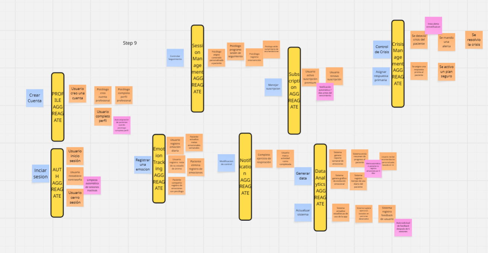
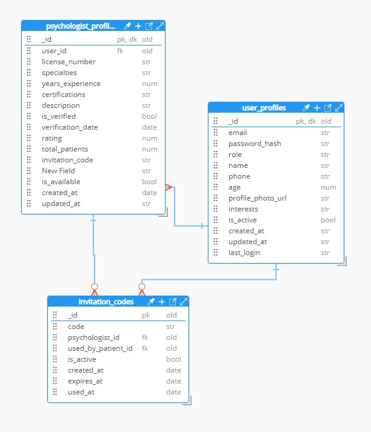
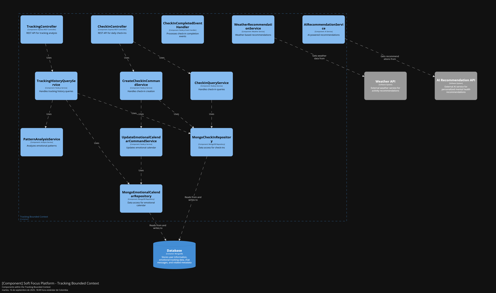

<h1 align="center"><strong>Informe del Trabajo Final</strong></h1>
<h3 align="center"><strong>Universidad Peruana de Ciencias Aplicadas</strong></h3>

<p align="center">
    
</p>

<h4 align="center"><strong>Ingeniería de Software</strong></h4>
<h4 align="center"><strong>Aplicaciones para Dispositivos Móviles - 1795</strong></h4>
<h4 align="center"><strong>Docente:</strong> Jorge Luis Mayta Guillermo</h4>
<h4 align="center"><strong>Startup:</strong> PsyWell</h4>
<h4 align="center"><strong>Product:</strong> Soft Focus</h4>

<p align="center"><strong>Team members:</strong></p>

<table align="center"; style="width: 100%; border-collapse: collapse; margin: 0 auto;">
  <tr>
    <th style="border: 1px solid black; padding: 8px; text-align: center;">Nombre</th>
    <th style="border: 1px solid black; padding: 8px; text-align: center;">Código</th>
  </tr>
  </tr>
    <tr>
    <td style="border: 1px solid black; padding: 8px; text-align: center;">Bueno Perales,Mathias Eduardo</td>
    <td style="border: 1px solid black; padding: 8px; text-align: center;">U202313433</td>
  </tr>
  <tr>
    <td style="border: 1px solid black; padding: 8px; text-align: center;">Gutiérrez Condo, Maylhy Olinda </td>
    <td style="border: 1px solid black; padding: 8px; text-align: center;">U202311220</td>
  </tr>
  </tr>
    <tr>
    <td style="border: 1px solid black; padding: 8px; text-align: center;">Luyo Correa, Sandra Paula</td>
    <td style="border: 1px solid black; padding: 8px; text-align: center;">U202314513</td>
  </tr>  
  <tr>
    <td style="border: 1px solid black; padding: 8px; text-align: center;">Roca Tineo,Steven Mathew </td>
    <td style="border: 1px solid black; padding: 8px; text-align: center;">U202311361</td>
  </tr>
    <tr>
    <td style="border: 1px solid black; padding: 8px; text-align: center;">Solis Santa Cruz, Giancarlo Rafael</td>
    <td style="border: 1px solid black; padding: 8px; text-align: center;">U202318615</td>
  </tr>
</table>

<h3 align="center"><strong>Ciclo 2025-20</strong></h3>

<hr>

<a id="registro-de-versiones-del-informe"></a>
# **Registro de Versiones del Informe** 

| Versión | Fecha | Autor | Descripción de modificación |
| :---- | :---- | :---- | :---- |
| TB1 | 18/09/2025 | Gutiérrez Condo, Maylhy Olinda <br> Roca Tineo, Steven Mathew <br> Bueno Perales, Mathias Eduardo <br> Luyo Correa, Sandra Paula <br> Solis Santa Cruz, Giancarlo Rafael | En la primera entrega del informe de nuestro proyecto, hemos realizado los primeros capítulos del informe y definimos todas las entidades que emplearemsos en Soft Focus. |
| TP | 11/10/2025 | Gutiérrez Condo, Maylhy Olinda <br> Roca Tineo, Steven Mathew <br> Bueno Perales, Mathias Eduardo <br> Luyo Correa, Sandra Paula <br> Solis Santa Cruz, Giancarlo Rafael | En la entrega parcial del informe de nuestro proyecto, hemos realizado el tercer capitulo del informe y cumplimos con el primer sprint que comprende la landing page y un avance del backend de Soft Focus. |
| TB2 | 14/11/2025 | Gutiérrez Condo, Maylhy Olinda <br> Roca Tineo, Steven Mathew <br> Bueno Perales, Mathias Eduardo <br> Luyo Correa, Sandra Paula <br> Solis Santa Cruz, Giancarlo Rafael | En la tercera entrega del informe de nuestro proyecto, cumplido con el segundo sprint que comprende la finalizacion total del backend asi como la entrega de la app movil en Android de SoftFocus. |

<hr>

<br>

<a id="project-report-collaboration-insights"></a>
# **Project Report Collaboration Insights**

<p align="center">
    
</p>

<a id="tabla-de-contenidos"></a>
# **Tabla de Contenidos**


<ul><a href="#registro-de-versiones-del-informe">Registro de Versiones del Informe</a></ul>

<ul><a href="#project-report-collaboration-insights">Project Report Collaboration Insights</a></ul>

<ul><a href="#contenido">Contenido</a></ul>

<ul><a href="#tabla-de-contenidos">Tabla de Contenidos</a></ul>

<ul><a href="#student-outcome">Student Outcome</a></ul>

<ul><a href="#objetivos-smart">Objetivos SMART</a></ul>

<a href="#capítulo-i-presentación">Capítulo I: Presentación</a>    
    	<ul>
            <a href="#11-startup-profile">1.1. Startup Profile</a><br>
	    <ul>
            <a href="#111-descripción-de-la-startup">1.1.1. Descripción de la Startup</a><br>
            <a href="#112-perfiles-de-integrantes-del-equipo">1.1.2. Perfiles de Integrantes del Equipo</a><br>
	    </ul>
            <a href="#12-solution-profile">1.2. Solution Profile</a><br>
	    <ul>
            <a href="#121-antecedentes-y-problemática">1.2.1. Antecedentes y Problemática</a><br>
            <a href="#122-lean-ux-process">1.2.2. Lean UX Process</a><br>
		<ul>
            <a href="#1221-lean-ux-problem-statements">1.2.2.1. Lean UX Problem Statements</a><br>
            <a href="#1222-lean-ux-assumptions">1.2.2.2. Lean UX Assumptions</a><br>
            <a href="#1223-lean-ux-hypothesis-statements">1.2.2.3. Lean UX Hypothesis Statements</a><br>
            <a href="#1224-lean-ux-canvas">1.2.2.4. Lean UX Canvas</a><br>
		</ul>
	    </ul>
            <a href="#13-segmentos-objetivos">1.3. Segmentos Objetivos</a><br>
        </ul>    

<a href="#capítulo-ii-requirements-development-and-software-solution-design">Capítulo II: Requirements Development and Software Solution Design</a>
        <ul>
            <a href="#21-competidores">2.1. Competidores</a><br>
		<ul>
            <a href="#211-análisis-competitivo">2.1.1. Análisis competitivo</a><br>
            <a href="#212-estrategias-y-tácticas-frente-a-competidores">2.1.2. Estrategias y tácticas frente a competidores</a><br>
		</ul>
            <a href="#22-entrevistas">2.2. Entrevistas</a><br>
		<ul>
            <a href="#221-diseño-de-entrevistas">2.2.1. Diseño de entrevistas</a><br>
            <a href="#222-registro-de-entrevistas">2.2.2. Registro de entrevistas</a><br>
            <a href="#223-análisis-de-entrevistas">2.2.3. Análisis de entrevistas</a><br>
		</ul>
            <a href="#23-needfinding">2.3. Needfinding</a><br>
		<ul>
            <a href="#231-user-personas">2.3.1. User Personas</a><br>
            <a href="#232-user-task-matrix">2.3.2. User Task Matrix</a><br>
            <a href="#233-user-journey-mapping">2.3.3. User Journey Mapping</a><br>
            <a href="#234-empathy-mapping">2.3.4. Empathy Mapping</a><br>
            <a href="#235-ubiquitous-language">2.3.5. Ubiquitous Language</a><br>
		</ul>
            <a href="#24-requirements-specification">2.4. Requirements specification</a><br>
		<ul>
            <a href="#241-user-stories">2.4.1. User Stories</a><br>
            <a href="#242-impact-mapping">2.4.2. Impact Mapping</a><br>
            <a href="#243-product-backlog">2.4.3. Product Backlog</a><br>
		</ul>
            <a href="#25-strategic-level-domain-driven-design">2.5. Strategic-Level Domain-Driven Design</a><br>
		<ul>
            <a href="#251-eventstorming">2.5.1. EventStorming</a><br>
		    <ul>
                <a href="#2511-candidate-context-discovery">2.5.1.1. Candidate Context Discovery</a><br>
                <a href="#2512-domain-message-flows-modeling">2.5.1.2. Domain Message Flows Modeling</a><br>
                <a href="#2513-bounded-context-canvases">2.5.1.3. Bounded Context Canvases</a><br>
		    </ul>
            <a href="#252-context-mapping">2.5.2. Context Mapping</a><br>
            <a href="#253-software-architecture">2.5.3. Software Architecture</a><br>
		    <ul>
                <a href="#2531-software-architecture-context-level-diagrams">2.5.3.1. Software Architecture Context Level Diagrams</a><br>
                <a href="#2532-software-architecture-container-level-diagrams">2.5.3.2. Software Architecture Container Level Diagrams</a><br>
                <a href="#2533-software-architecture-deployment-diagrams">2.5.3.3. Software Architecture Deployment Diagrams</a><br>
		    </ul>
		</ul>
            <a href="#26-tactical-level-domain-driven-design">2.6. Tactical-Level Domain-Driven Design</a><br>
		<ul>
            <a href="#261-bounded-context-auth">2.6.1. Bounded Context: Auth</a><br>
		    <ul>
                <a href="#2611-domain-layer">2.6.1.1. Domain Layer</a><br>
                <a href="#2612-interface-layer">2.6.1.2. Interface Layer</a><br>
                <a href="#2613-application-layer">2.6.1.3. Application Layer</a><br>
                <a href="#2614-infrastructure-layer">2.6.1.4 Infrastructure Layer</a><br>
                <a href="#2615-bounded-context-software-architecture-component-level-diagrams">2.6.1.5. Bounded Context Software Architecture Component Level Diagrams</a><br>
                <a href="#2616-bounded-context-software-architecture-code-level-diagrams">2.6.1.6. Bounded Context Software Architecture Code Level Diagrams</a><br>
		        <ul>
                    <a href="#26161-bounded-context-domain-layer-class-diagrams">2.6.1.6.1. Bounded Context Domain Layer Class Diagrams</a><br>
                    <a href="#26162-bounded-context-database-design-diagram">2.6.1.6.2. Bounded Context Database Design Diagram</a><br>
		        </ul>
		    </ul>
            <a href="#262-bounded-context-profiles">2.6.2. Bounded Context: Profiles</a><br>
		    <ul>
                <a href="#2621-domain-layer">2.6.2.1. Domain Layer</a><br>
                <a href="#2622-interface-layer">2.6.2.2. Interface Layer</a><br>
                <a href="#2623-application-layer">2.6.2.3. Application Layer</a><br>
                <a href="#2624-infrastructure-layer">2.6.2.4 Infrastructure Layer</a><br>
                <a href="#2625-bounded-context-software-architecture-component-level-diagrams">2.6.2.5. Bounded Context Software Architecture Component Level Diagrams</a><br>
                <a href="#2626-bounded-context-software-architecture-code-level-diagrams">2.6.2.6. Bounded Context Software Architecture Code Level Diagrams</a><br>
		        <ul>
                    <a href="#26261-bounded-context-domain-layer-class-diagrams">2.6.2.6.1. Bounded Context Domain Layer Class Diagrams</a><br>
                    <a href="#26262-bounded-context-database-design-diagram">2.6.2.6.2. Bounded Context Database Design Diagram</a><br>
		        </ul>
		    </ul>
            <a href="#263-bounded-context-tracking">2.6.3. Bounded Context: Tracking</a><br>
		    <ul>
                <a href="#2631-domain-layer">2.6.3.1. Domain Layer</a><br>
                <a href="#2632-interface-layer">2.6.3.2. Interface Layer</a><br>
                <a href="#2633-application-layer">2.6.3.3. Application Layer</a><br>
                <a href="#2634-infrastructure-layer">2.6.3.4 Infrastructure Layer</a><br>
                <a href="#2635-bounded-context-software-architecture-component-level-diagrams">2.6.3.5. Bounded Context Software Architecture Component Level Diagrams</a><br>
                <a href="#2636-bounded-context-software-architecture-code-level-diagrams">2.6.3.6. Bounded Context Software Architecture Code Level Diagrams</a><br>
		        <ul>
                    <a href="#26361-bounded-context-domain-layer-class-diagrams">2.6.3.6.1. Bounded Context Domain Layer Class Diagrams</a><br>
                    <a href="#26362-bounded-context-database-design-diagram">2.6.3.6.2. Bounded Context Database Design Diagram</a><br>
		        </ul>
		    </ul>
            <a href="#264-bounded-context-crisis">2.6.4. Bounded Context: Crisis</a><br>
		    <ul>
                <a href="#2641-domain-layer">2.6.4.1. Domain Layer</a><br>
                <a href="#2642-interface-layer">2.6.4.2. Interface Layer</a><br>
                <a href="#2643-application-layer">2.6.4.3. Application Layer</a><br>
                <a href="#2644-infrastructure-layer">2.6.4.4 Infrastructure Layer</a><br>
                <a href="#2645-bounded-context-software-architecture-component-level-diagrams">2.6.4.5. Bounded Context Software Architecture Component Level Diagrams</a><br>
                <a href="#2646-bounded-context-software-architecture-code-level-diagrams">2.6.4.6. Bounded Context Software Architecture Code Level Diagrams</a><br>
		        <ul>
                    <a href="#26461-bounded-context-domain-layer-class-diagrams">2.6.4.6.1. Bounded Context Domain Layer Class Diagrams</a><br>
                    <a href="#26462-bounded-context-database-design-diagram">2.6.4.6.2. Bounded Context Database Design Diagram</a><br>
		        </ul>
		    </ul>
            <a href="#265-bounded-context-therapy">2.6.5. Bounded Context: Therapy</a><br>
		    <ul>
                <a href="#2651-domain-layer">2.6.5.1. Domain Layer</a><br>
                <a href="#2652-interface-layer">2.6.5.2. Interface Layer</a><br>
                <a href="#2653-application-layer">2.6.5.3. Application Layer</a><br>
                <a href="#2654-infrastructure-layer">2.6.5.4 Infrastructure Layer</a><br>
                <a href="#2655-bounded-context-software-architecture-component-level-diagrams">2.6.5.5. Bounded Context Software Architecture Component Level Diagrams</a><br>
                <a href="#2656-bounded-context-software-architecture-code-level-diagrams">2.6.5.6. Bounded Context Software Architecture Code Level Diagrams</a><br>
		        <ul>
                    <a href="#26561-bounded-context-domain-layer-class-diagrams">2.6.5.6.1. Bounded Context Domain Layer Class Diagrams</a><br>
                    <a href="#26562-bounded-context-database-design-diagram">2.6.5.6.2. Bounded Context Database Design Diagram</a><br>
		        </ul>
		    </ul>
            <a href="#266-bounded-context-notifications">2.6.6. Bounded Context: Notifications</a><br>
		    <ul>
                <a href="#2661-domain-layer">2.6.6.1. Domain Layer</a><br>
                <a href="#2662-interface-layer">2.6.6.2. Interface Layer</a><br>
                <a href="#2663-application-layer">2.6.6.3. Application Layer</a><br>
                <a href="#2664-infrastructure-layer">2.6.6.4 Infrastructure Layer</a><br>
                <a href="#2665-bounded-context-software-architecture-component-level-diagrams">2.6.6.5. Bounded Context Software Architecture Component Level Diagrams</a><br>
                <a href="#2666-bounded-context-software-architecture-code-level-diagrams">2.6.6.6. Bounded Context Software Architecture Code Level Diagrams</a><br>
		        <ul>
                    <a href="#26661-bounded-context-domain-layer-class-diagrams">2.6.6.6.1. Bounded Context Domain Layer Class Diagrams</a><br>
                    <a href="#26662-bounded-context-database-design-diagram">2.6.6.6.2. Bounded Context Database Design Diagram</a><br>
		        </ul>
		    </ul>
            <a href="#267-bounded-context-subscriptions">2.6.7. Bounded Context: Subscriptions</a><br>
		    <ul>
                <a href="#2671-domain-layer">2.6.7.1. Domain Layer</a><br>
                <a href="#2672-interface-layer">2.6.7.2. Interface Layer</a><br>
                <a href="#2673-application-layer">2.6.7.3. Application Layer</a><br>
                <a href="#2674-infrastructure-layer">2.6.7.4 Infrastructure Layer</a><br>
                <a href="#2675-bounded-context-software-architecture-component-level-diagrams">2.6.7.5. Bounded Context Software Architecture Component Level Diagrams</a><br>
                <a href="#2676-bounded-context-software-architecture-code-level-diagrams">2.6.7.6. Bounded Context Software Architecture Code Level Diagrams</a><br>
		        <ul>
                    <a href="#26761-bounded-context-domain-layer-class-diagrams">2.6.7.6.1. Bounded Context Domain Layer Class Diagrams</a><br>
                    <a href="#26762-bounded-context-database-design-diagram">2.6.7.6.2. Bounded Context Database Design Diagram</a><br>
		        </ul>
		    </ul>
            <a href="#268-bounded-context-shared">2.6.8. Bounded Context: Shared</a><br>
		    <ul>
                <a href="#2681-domain-layer">2.6.8.1. Domain Layer</a><br>
                <a href="#2682-interface-layer">2.6.8.2. Interface Layer</a><br>
                <a href="#2683-application-layer">2.6.8.3. Application Layer</a><br>
                <a href="#2684-infrastructure-layer">2.6.8.4 Infrastructure Layer</a><br>
                <a href="#2685-bounded-context-software-architecture-component-level-diagrams">2.6.8.5. Bounded Context Software Architecture Component Level Diagrams</a><br>
                <a href="#2686-bounded-context-software-architecture-code-level-diagrams">2.6.8.6. Bounded Context Software Architecture Code Level Diagrams</a><br>
		        <ul>
                    <a href="#26861-bounded-context-domain-layer-class-diagrams">2.6.8.6.1. Bounded Context Domain Layer Class Diagrams</a><br>
                    <a href="#26862-bounded-context-database-design-diagram">2.6.8.6.2. Bounded Context Database Design Diagram</a><br>
		        </ul>
		    </ul>
		</ul>
        </ul>   

<a href="#capítulo-iii-solution-uiux-design">Capítulo III: Solution UI/UX Design</a>
        <ul>
            <a href="#31-product-design">3.1. Product Design</a><br>
		<ul>
            <a href="#311-style-guidelines">3.1.1. Style Guidelines</a><br>
		    <ul>
                <a href="#3111-general-style-guidelines">3.1.1.1. General Style Guidelines</a><br>
		    </ul>
            <a href="#312-information-architecture">3.1.2. Information Architecture</a><br>
		    <ul>
                <a href="#3121-organization-systems">3.1.2.1. Organization Systems</a><br>
                <a href="#3122-labelling-systems">3.1.2.2. Labelling Systems</a><br>
                <a href="#3123-seo-tags-and-meta-tags">3.1.2.3. SEO Tags and Meta Tags</a><br>
                <a href="#3124-searching-systems">3.1.2.4. Searching Systems</a><br>
                <a href="#3125-navigation-systems">3.1.2.5. Navigation Systems</a><br>
		    </ul>
            <a href="#313-landing-page-ui-design">3.1.3. Landing Page UI Design</a><br>
		    <ul>
                <a href="#3131-landing-page-wireframe">3.1.3.1. Landing Page Wireframe</a><br>
                <a href="#3132-landing-page-mock-up">3.1.3.2. Landing Page Mock-up</a><br>
		    </ul>
            <a href="#314-mobile-applications-uxui-design">3.1.4. Mobile Applications UX/UI Design</a><br>
		    <ul>
                <a href="#3141-mobile-applications-wireframes">3.1.4.1. Mobile Applications Wireframes</a><br>
                <a href="#3142-mobile-applications-wireflow-diagrams">3.1.4.2. Mobile Applications Wireflow Diagrams</a><br>
                <a href="#3143-mobile-applications-mock-ups">3.1.4.3. Mobile Applications Mock-ups</a><br>
                <a href="#3144-mobile-applications-user-flow-diagrams">3.1.4.4. Mobile Applications User Flow Diagrams</a><br>
                <a href="#3145-mobile-applications-prototyping">3.1.4.5. Mobile Applications Prototyping</a><br>
		    </ul>
		</ul>
        </ul>    

<a href="#capítulo-iv-product-implementation--validation">Capítulo IV: Product Implementation & Validation</a>
        <ul>
            <a href="#4-product-implementation--validation">4. Product Implementation & Validation</a><br>
            <a href="#41-software-configuration-management">4.1. Software Configuration Management</a><br>
	<ul>
            <a href="#411-software-development-environment-configuration">4.1.1. Software Development Environment Configuration</a><br>
            <a href="#412-source-code-management">4.1.2. Source Code Management</a><br>
            <a href="#413-source-code-style-guide--conventions">4.1.3. Source Code Style Guide & Conventions</a><br>
            <a href="#414-software-deployment-configuration">4.1.4. Software Deployment Configuration</a><br>
	</ul>
            <a href="#42-landing-page--mobile-application-implementation">4.2. Landing Page & Mobile Application Implementation</a><br>
		<ul>
            <a href="#421-sprint-1">4.2.1. Sprint 1</a><br>
			<ul>
            <a href="#4211-sprint-planning-1">4.2.1.1. Sprint Planning 1</a><br>
            <a href="#4212-sprint-backlog-1">4.2.1.2. Sprint Backlog 1</a><br>
            <a href="#4213-development-evidence-for-sprint-review">4.2.1.3. Development Evidence for Sprint Review</a><br>
            <a href="#4214-testing-suite-evidence-for-sprint-review">4.2.1.4. Testing Suite Evidence for Sprint Review</a><br>
            <a href="#4215-execution-evidence-for-sprint-review">4.2.1.5. Execution Evidence for Sprint Review</a><br>
            <a href="#4216-services-documentation-evidence-for-sprint-review">4.2.1.6. Services Documentation Evidence for Sprint Review</a><br>
            <a href="#4217-software-deployment-evidence-for-sprint-review">4.2.1.7. Software Deployment Evidence for Sprint Review</a><br>
            <a href="#4218-team-collaboration-insights-during-sprint">4.2.1.8. Team Collaboration Insights during Sprint</a><br>
			</ul>
            <a href="#422-sprint-2">4.2.2. Sprint 2</a><br>
			<ul>
            <a href="#4221-sprint-planning-2">4.2.2.1. Sprint Planning 2</a><br>
            <a href="#4222-sprint-backlog-2">4.2.2.2. Sprint Backlog 2</a><br>
            <a href="#4223-development-evidence-for-sprint-review">4.2.2.3. Development Evidence for Sprint Review</a><br>
            <a href="#4224-testing-suite-evidence-for-sprint-review">4.2.2.4. Testing Suite Evidence for Sprint Review</a><br>
            <a href="#4225-execution-evidence-for-sprint-review">4.2.2.5. Execution Evidence for Sprint Review</a><br>
            <a href="#4226-services-documentation-evidence-for-sprint-review">4.2.2.6. Services Documentation Evidence for Sprint Review</a><br>
            <a href="#4227-software-deployment-evidence-for-sprint-review">4.2.2.7. Software Deployment Evidence for Sprint Review</a><br>
            <a href="#4228-team-collaboration-insights-during-sprint">4.2.2.8. Team Collaboration Insights during Sprint</a><br>
			</ul>
            <a href="#423-sprint-3">4.2.3. Sprint 3</a><br>
			<ul>
            <a href="#4231-sprint-planning-3">4.2.3.1. Sprint Planning 3</a><br>
            <a href="#4232-sprint-backlog-3">4.2.3.2. Sprint Backlog 3</a><br>
            <a href="#4233-development-evidence-for-sprint-review">4.2.3.3. Development Evidence for Sprint Review</a><br>
            <a href="#4234-testing-suite-evidence-for-sprint-review">4.2.3.4. Testing Suite Evidence for Sprint Review</a><br>
            <a href="#4235-execution-evidence-for-sprint-review">4.2.3.5. Execution Evidence for Sprint Review</a><br>
            <a href="#4236-services-documentation-evidence-for-sprint-review">4.2.3.6. Services Documentation Evidence for Sprint Review</a><br>
            <a href="#4237-software-deployment-evidence-for-sprint-review">4.2.3.7. Software Deployment Evidence for Sprint Review</a><br>
            <a href="#4238-team-collaboration-insights-during-sprint">4.2.3.8. Team Collaboration Insights during Sprint</a><br>
			</ul>
		</ul>
            <a href="#43-validation-interviews">4.3. Validation Interviews</a><br>
		<ul>
            <a href="#431-diseño-de-entrevistas">4.3.1. Diseño de Entrevistas</a><br>
            <a href="#432-registro-de-entrevistas">4.3.2. Registro de Entrevistas</a><br>
            <a href="#433-evaluaciones-según-heurísticas">4.3.3. Evaluaciones según heurísticas</a><br>
		</ul>
        </ul>        

<a href="#conclusiones">Conclusiones</a>
<ul>
    <a href="#conclusiones-y-recomendaciones">Conclusiones y recomendaciones</a><br>
    <a href="#video-app-validation">Video App Validation</a><br>
    <a href="#video-about-the-product">Video About the product</a><br>
    <a href="#video-about-the-team">Video About the team</a>
</ul>

<ul><a href="#glosario">Glosario</a></ul>

<a href="#bibliografía">Bibliografía</a>

<a href="#anexos">Anexos</a>

<hr>

<a id="student-outcome"></a>
# **Student Outcome**

En Ingeniería de Software, un Student Outcome representa las capacidades, conocimientos y actitudes que un estudiante debe demostrar al graduarse, relacionadas con el diseño, desarrollo y gestión de sistemas de software de calidad. <br>
<br>

| Criterio específico | Acciones realizadas  | Conclusiones  |
| :---- | :---- | :---- |
| **Actualiza conceptos y conocimientos necesarios para su desarrollo profesional y en especial para su proyecto en soluciones de software.**<br>  | <br>**TB1:**<br> <br>**Gutiérrez Condo, Maylhy Olinda**<br> Al elaborar la descripción de la startup, aplicar Lean UX (Problem Statements, Assumptions e Hypothesis Statements) y diseñar diferentes niveles de diagramas de arquitectura y dominio, actualicé y reforcé mis conocimientos en metodologías ágiles y en diseño de software. Estas actividades me permitieron integrar conceptos teóricos con prácticas aplicadas, fortaleciendo mi desarrollo profesional y aportando valor a mi proyecto en soluciones de software con una base más sólida y actualizada. <br>**Roca Tineo,Steven Mathew**<br> La elaboración de User Stories, el diseño del Product Backlog y la aplicación de Domain-Driven Design en sus distintos niveles (Domain, Interface, Application e Infrastructure), junto con el diagrama de base de datos por Bounded Context, me permitió actualizar y consolidar conocimientos en gestión ágil y arquitectura de software. Estas prácticas fortalecen mi desarrollo profesional y aportan al proyecto bases técnicas y metodológicas más sólidas para el diseño de soluciones de software efectivas y escalables.<br>**Bueno Perales,Mathias Eduardo**<br> Al desarrollar el análisis competitivo, diseñar y registrar entrevistas, así como evaluar estrategias frente a competidores, actualicé y fortalecí mis conocimientos en investigación de mercado y gestión de información. Estas actividades me permitieron aplicar conceptos clave para el desarrollo profesional y aportar insumos valiosos al proyecto de soluciones de software, asegurando que las decisiones se basen en información actualizada y relevante. <br>**Luyo Correa, Sandra Paula**<br> La elaboración de User Personas, User Task Matrix, User Journey Mapping, Empathy Mapping y la definición de un Ubiquitous Language me permitió actualizar y reforzar conceptos clave en diseño centrado en el usuario y comunicación dentro del desarrollo de software. Estas actividades fortalecen mi crecimiento profesional y aportan al proyecto una visión más clara, coherente y alineada con las necesidades reales de los usuarios. <br>**Solis Santa Cruz, Giancarlo Rafael**<br> La realización de actividades como EventStorming, Candidate Context Discovery, Domain Message Flows Modeling, Bounded Context Canvases, Context Mapping, Lean UX Canvas y el análisis de antecedentes y problemática W-H me permitió actualizar y fortalecer conocimientos en diseño de dominios, modelado de procesos y metodologías ágiles. Estas prácticas contribuyen a mi desarrollo profesional y aportan bases más sólidas y actualizadas para el avance de mi proyecto en soluciones de software. <br> <br>**TP:**<br> <br>**Gutiérrez Condo, Maylhy Olinda**<br> El desarrollo del diseño UI de la landing page y las aplicaciones móviles, incluyendo wireframes, mock-ups y prototipos, junto con la implementación de la sección features y el uso de nuevas librerías, me permitió actualizar y reforzar mis conocimientos en diseño de interfaces, experiencia de usuario y desarrollo front-end. Estas actividades fortalecen mi crecimiento profesional y aportan al proyecto una base más sólida y actualizada en soluciones de software orientadas a la usabilidad y la innovación. <br>**Roca Tineo,Steven Mathew**<br> La elaboración de guías de estilo, la definición de la arquitectura de información, la configuración del entorno de desarrollo y despliegue, junto con la implementación de la sección main de la landing page y los contextos de autenticación, IA y usuarios, me permitió actualizar y fortalecer mis conocimientos en diseño de interfaces, estructuración de sistemas y desarrollo de software. Estas actividades contribuyen significativamente a mi desarrollo profesional y aportan al proyecto una base técnica más sólida, moderna y alineada con las mejores prácticas en soluciones de software. <br>**Bueno Perales,Mathias Eduardo**<br> Durante la planificación y ejecución del sprint, la documentación de evidencias, las pruebas y la colaboración en equipo, además de la implementación de la sección FAQ de la landing page y el tracking context, pude reforzar y actualizar mis conocimientos en metodologías ágiles, control de versiones y desarrollo orientado a componentes. Estas experiencias fortalecieron mi desarrollo profesional, permitiéndome aplicar prácticas actualizadas que contribuyen al crecimiento técnico y a la mejora continua del proyecto en soluciones de software. <br>**Luyo Correa, Sandra Paula**<br> El desarrollo de wireframes, mock-ups y prototipos para la aplicación móvil, junto con la realización de entrevistas de validación y la implementación de la sección About de la landing page y del teraphy context, me permitió actualizar mis conocimientos en diseño UX/UI, validación de usuarios y desarrollo de interfaces dinámicas. Estas experiencias fortalecieron mi formación profesional, impulsando la aplicación de conceptos actuales que enriquecen la calidad y efectividad del proyecto en soluciones de software. <br>**Solis Santa Cruz, Giancarlo Rafael**<br> La creación de diagramas de wireflow y user flow para la aplicación móvil, junto con la configuración del entorno de desarrollo, la gestión del código fuente y la definición de convenciones de estilo, además de la implementación de la sección Planes de la landing page y el notification context, me permitió actualizar mis conocimientos en arquitectura de software, control de versiones y diseño de experiencia de usuario. Estas actividades fortalecieron mi desarrollo profesional, aportando habilidades técnicas y metodológicas clave para el avance y la calidad del proyecto en soluciones de software. |<br>**TB1:**<br> Los integrantes demostramos ser capaces de actualizar conceptos que son necesarios para nuestro desarrollo en un ambito profesional y encontramos soluciones de software para cumplir el objetivo.  <br>**TP:**<br> Todos los integrantes demostramos capacidad de mantener al dia los conceptos clave para el desarrollo profesional, al realizar landing page y backend aplicamos nuestro conocimiento en soluciones de software. | 
| **Reconoce la necesidad del aprendizaje permanente para el desempeño profesional y el desarrollo de proyectos en soluciones de software.**<br>  | <br>**TB1:**<br> <br>**Gutiérrez Condo, Maylhy Olinda**<br> La elaboración de la descripción de la startup, la aplicación de Lean UX y el diseño de diversos diagramas de arquitectura y dominio me permitió comprender que el aprendizaje permanente es esencial para el desempeño profesional. Estas actividades evidencian la necesidad de actualizar y profundizar constantemente en metodologías ágiles y arquitecturas de software, con el fin de garantizar el desarrollo de proyectos sólidos, escalables y alineados a las demandas actuales del sector tecnológico. <br>**Roca Tineo,Steven Mathew**<br> La elaboración de User Stories, el Product Backlog y la aplicación de Domain-Driven Design en sus diferentes capas, junto con el diseño de la base de datos en un Bounded Context, me permitió reconocer la necesidad del aprendizaje permanente para fortalecer mi desempeño profesional. Estas actividades muestran que la actualización continua en metodologías ágiles y en arquitectura de software es esencial para garantizar el desarrollo exitoso y sostenible de proyectos en soluciones de software. <br>**Bueno Perales,Mathias Eduardo**<br> La realización del análisis competitivo, el diseño y registro de entrevistas, así como la definición de estrategias frente a competidores, me permitió reconocer la importancia del aprendizaje permanente. Estas actividades impulsaron la adquisición de nuevos conocimientos y habilidades que fortalecen mi desempeño profesional y contribuyen al desarrollo de proyectos en soluciones de software con una visión más informada y estratégica. <br>**Luyo Correa, Sandra Paula**<br> La realización de User Personas, User Task Matrix, User Journey Mapping, Empathy Mapping y la definición de un Ubiquitous Language me permitió reconocer que el aprendizaje permanente es fundamental para mejorar el desempeño profesional. Estas actividades demuestran la importancia de adquirir y actualizar continuamente conocimientos en metodologías de diseño centrado en el usuario y comunicación efectiva, asegurando así el desarrollo exitoso de proyectos en soluciones de software. <br>**Solis Santa Cruz, Giancarlo Rafael**<br> La aplicación de técnicas como EventStorming, Candidate Context Discovery, Domain Message Flows Modeling, Bounded Context Canvases, Context Mapping, Lean UX Canvas y el análisis de antecedentes y problemática W-H me permitió reconocer la importancia del aprendizaje permanente. Estas actividades evidencian que la actualización constante en metodologías de diseño y arquitectura de software es esencial para mejorar mi desempeño profesional y asegurar el desarrollo exitoso de proyectos en soluciones de software. <br> <br>**TP:**<br> <br>**Gutiérrez Condo, Maylhy Olinda**<br> La elaboración de wireframes, mock-ups y prototipos tanto para la landing page como para las aplicaciones móviles, junto con la implementación de la sección features y el uso de nuevas librerías, me permitió reconocer la importancia del aprendizaje permanente. Estas actividades evidencian que la mejora continua en diseño UX/UI y desarrollo front-end es esencial para mantener la calidad, innovación y competitividad en proyectos de soluciones de software. <br>**Roca Tineo,Steven Mathew**<br> La elaboración de guías de estilo, la definición de la arquitectura de información, la configuración del entorno de desarrollo y despliegue, así como la implementación de la sección main de la landing page y los contextos de autenticación, IA y usuarios, me permitió reconocer la importancia del aprendizaje permanente. Estas experiencias demostraron que la actualización constante en diseño, arquitectura y desarrollo de software es esencial para mantener un desempeño profesional eficiente y garantizar la calidad e innovación en los proyectos de soluciones tecnológicas. <br>**Bueno Perales,Mathias Eduardo**<br> A lo largo del sprint, al participar en la planificación, documentación de evidencias, pruebas, despliegue y trabajo colaborativo, además de implementar la sección FAQ de la landing page y el tracking context, comprendí que el aprendizaje permanente es esencial para mantener un desempeño profesional competitivo. Cada etapa del proceso me permitió identificar nuevas herramientas y enfoques que fortalecen mis capacidades y aportan valor al desarrollo continuo de proyectos en soluciones de software. <br>**Luyo Correa, Sandra Paula**<br> Al elaborar los wireframes, mock-ups y prototipos de la aplicación móvil, realizar entrevistas de validación e implementar la sección About de la landing page junto al teraphy context, comprendí la importancia del aprendizaje continuo para mantener un desempeño profesional efectivo. Cada una de estas tareas evidenció que la actualización constante en diseño, validación de usuarios y desarrollo de software es clave para adaptarse a nuevas tecnologías y garantizar la calidad en los proyectos de soluciones digitales. <br>**Solis Santa Cruz, Giancarlo Rafael**<br> Durante la elaboración de los diagramas wireflow y user flow de la aplicación móvil, la gestión del código fuente, la definición de guías de estilo y la implementación de la sección Planes de la landing page junto al notification context, comprendí que el aprendizaje permanente es fundamental para el desarrollo profesional. Cada una de estas tareas me permitió identificar nuevas herramientas, prácticas y enfoques que fortalecen mis capacidades técnicas y favorecen la evolución constante en el desarrollo de proyectos de software. |<br>**TB1:**<br> Los integrantes mostramos gran capacidad de aprendizaje para mejorar nuestro desarrollo del proyecto en soluciones de software.  <br>**TP:**<br> Tuvimos capacidad de aprendizaje de nuestras previas observaciones y mejoramos nuestro trabajo, manteniendo un orden que nos deja entregar un buen producto de software. |

<br>

<a id="objetivos-smart"></a>
# **Objetivos SMART**


| Integrantes | Objetivo SMART 1  | Objetivo SMART 2 |
| :---- | :---- | :---- |
| Bueno Perales, Mathias Eduardo  | Cuando termine mi carrera, quiero desarrollar aplicaciones que faciliten la vida a las personas en base a sus necesidades, aplicando todo lo aprendido durante mi etapa universitaria. | Especializarme en Analisis de Datos en un tiempo corto después de culminar la carrera, de manera que pueda abrir las puertas a otros sectores relacionados con mi carrera. |
| Gutierrez Condo, Maylhy Olinda |  Desarrollar un portafolio con al menos 2 aplicaciones móviles funcionales, publicadas en GitHub antes de finalizar la carrera, de modo que evidencien mis competencias en desarrollo móvil y buenas prácticas de programación | Obtener certificaciones profesionales en Ciberseguridad y en Ciencia de Datos en un plazo máximo de 1 año y medio después de mi graduación, para fortalecer mi perfil profesional y acceder a oportunidades laborales en el sector tecnológico.  |
| Luyo Correa, Sandra Paula | Al culminar mi carrera, obtener una certificación internacional en metodologías ágiles (Scrum Master o Product Owner), para fortalecer mis competencias en gestión de proyectos y mejorar mis oportunidades en equipos de desarrollo de software. | Tras finalizar la carrera, completar una maestría en Ingeniería de Software con el fin de ampliar mis conocimientos y aumentar mis oportunidades en el ámbito profesional. |
| Roca Tineo, Steven Mathew | Desarrollar un portafolio de ciberseguridad con 2 proyectos técnicos, documentados y publicados en GitHub antes de finalizar mi carrera universitaria, para demostrar mis competencias técnicas en desarrollo seguro y posicionarme como candidato competitivo para roles especializados en ciberseguridad. | Completar la maestría en Ciberseguridad en mi universidad y obtener una certificación profesional en cloud security dentro de los primeros años después de mi graduación de pregrado, para alcanzar el nivel de expertise necesario que me permita acceder a posiciones especializadas en seguridad en la nube y ciberseguridad |
| Solis Santa Cruz,Giancarlo Rafael | Obtener la certificación Microsoft Azure Fundamentals en los primeros 6 meses después de mi graduación, dedicando un mínimo de 5 horas de estudio semanales y completando simulacros de examen, con el fin de reforzar mis competencias en servicios en la nube y mejorar mi empleabilidad en el área cloud. | Realizar una especialización en Ciencia de Datos dentro de los 2 años posteriores a mi graduación, dedicando al menos 5 horas semanales al estudio de Python y análisis de datos, con el fin de mejorar mis habilidades técnicas y aumentar mis oportunidades de empleo en el área de tecnología.  |


<a id="capítulo-i-presentación"></a>

# **Capítulo I: Presentación**


<a id="11-startup-profile"></a>

## **1.1. Startup Profile**

<a id="111-descripción-de-la-startup"></a>

### **1.1.1. Descripción de la Startup**

PsyWell es una startup tecnológica orientada al desarrollo de soluciones digitales que fortalecen la salud mental a través del seguimiento continuo y la intervención temprana. Esta iniciativa surge como respuesta a la necesidad urgente de brindar apoyo psicológico constante entre sesiones terapéuticas, considerando que el acceso a los servicios de salud mental en el Perú presenta serias limitaciones.

Como señalan Piazza y Fiestas (2015), “sólo una de cada cinco personas que presentaron algún trastorno durante los últimos 12 meses recibió tratamiento durante ese período” (p. 338). Esta brecha de atención evidencia la necesidad de contar con herramientas complementarias que amplíen el alcance de la atención psicológica y ofrezcan acompañamiento accesible, oportuno y confiable para la población.

Fundada por estudiantes de Ingeniería de Software de la Universidad Peruana de Ciencias Aplicadas, la startup busca democratizar el acceso a herramientas digitales de bienestar emocional, conectando a profesionales de la salud mental con personas que requieren orientación, monitoreo y recursos inmediatos para gestionar sus emociones.

**Servicios y producto principal**

Su producto principal es Soft Focus, una plataforma digital que combina inteligencia artificial con recursos clínicos validados para ofrecer un espacio de autocuidado y un sistema de monitoreo terapéutico en tiempo real.

De esta manera, Soft Focus no sólo apoya a las personas en el manejo de sus emociones, sino que también optimiza la labor de los profesionales de la salud mental al proporcionar datos confiables y herramientas para la toma de decisiones.

**Visión**

Ser la plataforma líder en Latinoamérica en monitoreo y prevención de la salud mental, reduciendo las brechas de acceso y brindando soporte oportuno tanto a pacientes como a profesionales.

**Misión**

Proporcionar herramientas tecnológicas accesibles, seguras y efectivas que fortalezcan la relación paciente–psicólogo, promuevan el autocuidado emocional y prevengan crisis mediante intervenciones oportunas y personalizadas.

<a id="112-perfiles-de-integrantes-del-equipo"></a>

### **1.1.2. Perfiles de Integrantes del Equipo**

<p align="center">
    
</p>
<p align="center">
    
</p>
<p align="center">
    
</p>
<p align="center">
    
</p>
<p align="center">
    
</p>

<a id="12-solution-profile"></a>

## **1.2. Solution Profile**


<a id="121-antecedentes-y-problemática"></a>

### **1.2.1. Antecedentes y Problemática**

What – ¿Cuál es el problema?

En el sector de la salud mental en el Perú, existe una gran brecha entre la demanda de atención psicológica y la disponibilidad de servicios. Muchas personas no acceden a tratamiento oportuno debido a limitaciones de recursos, costos y tiempos de espera. Además, entre las sesiones terapéuticas no existe un acompañamiento constante, lo que dificulta la continuidad del proceso y aumenta el riesgo de recaídas emocionales o crisis no atendidas (Piazza & Fiestas, 2015).

When – ¿Cuándo sucede el problema?

El problema ocurre cada vez que un paciente requiere soporte emocional entre sesiones y no cuenta con herramientas de monitoreo ni recursos inmediatos para gestionar sus emociones. Esta situación es especialmente crítica en momentos de estrés, ansiedad o depresión, donde la falta de intervención temprana puede agravar los síntomas y generar crisis que requieren atención de urgencia (Ministerio de Salud, 2022).

Where – ¿Dónde ocurre el problema?

La problemática se manifiesta principalmente en contextos urbanos y periurbanos del Perú, donde si bien existen psicólogos y centros de salud mental comunitarios, la cobertura es insuficiente. En zonas rurales, el problema es aún más agudo, pues la oferta de servicios es mínima y los pacientes dependen de traslados largos y costosos para acceder a un profesional.

Who – ¿Quiénes están involucrados?

Las personas más afectadas son los pacientes que presentan trastornos emocionales o psicológicos y no cuentan con apoyo constante. También se ven impactados los psicólogos y profesionales de la salud mental, quienes carecen de herramientas digitales que les permitan monitorear a sus pacientes en tiempo real. Asimismo, familiares y cuidadores se enfrentan a la incertidumbre de no contar con información confiable sobre el estado emocional de sus seres queridos (MINSA, 2022).

Why – ¿Por qué ocurre esta situación?

La falta de digitalización en el sector salud, sumada a la limitada cobertura de profesionales de la salud mental, son las principales causas de esta brecha. En el Perú, menos del 20% de las personas que requieren atención psicológica la reciben, debido a la baja disponibilidad de servicios, estigmatización social y altos costos privados. Además, la infraestructura tecnológica para dar continuidad a los tratamientos es casi inexistente.

How – ¿En qué condiciones usan el producto?

Los pacientes y psicólogos que accedan a la plataforma Soft Focus lo harán desde entornos diversos, utilizando dispositivos móviles o computadoras. La interfaz debe ser amigable, accesible y garantizar la confidencialidad de los datos. El producto será usado en el día a día como un espacio de autocuidado (ejercicios, recursos emocionales) y como un sistema de seguimiento terapéutico en tiempo real, que proporcione alertas y métricas confiables para los profesionales.

How Much – ¿Cuánto cuesta no resolverlo?

Los costos de no atender este problema son elevados. En términos sociales, la falta de apoyo oportuno incrementa la tasa de abandono terapéutico y las crisis emocionales no controladas, lo que repercute en ausentismo laboral, bajo rendimiento académico y deterioro de las relaciones familiares. Según la Organización Mundial de la Salud (2020), la depresión y la ansiedad generan pérdidas económicas de más de 1 billón de dólares anuales en productividad a nivel global. En el Perú, la falta de atención psicológica contribuye a perpetuar desigualdades sociales y limita las oportunidades de las personas para alcanzar su bienestar integral.

<p align="center">
    
</p>
Figura1 .Cuadro de analisis de transtornos afectivos por porcentaje de personas

<a id="122-lean-ux-process"></a>

### **1.2.2. Lean UX Process**


<a id="1221-lean-ux-problem-statements"></a>

#### **1.2.2.1. Lean UX Problem Statements**

**Problem Statement 1:**  
 Nuestra plataforma ha sido diseñada para ayudar a usuarios generales a gestionar su bienestar emocional y prevenir crisis a través de un acompañamiento digital continuo. A través de herramientas como registro diario de emociones, ejercicios de relajación y recomendaciones personalizadas, buscamos ofrecer apoyo inmediato y accesible en la vida cotidiana.

 Hemos observado que una gran parte de la población joven en Perú presenta altos niveles de ansiedad, depresión y estrés, pero no accede a servicios de salud mental de manera frecuente debido a factores como el costo, el estigma y la falta de disponibilidad de especialistas (MINSA, 2017, como se cita en Arango Mendoza, Cayetano Ramos, Hu Vilchez, & Ríos Baca, 2022). Esto genera un vacío en la atención, dejando a las personas sin recursos efectivos para manejar sus emociones en momentos críticos.

 **¿Cómo podemos mejorar el acceso al apoyo emocional diario, brindando a los usuarios una plataforma accesible y confiable que les permita registrar su estado, recibir intervenciones inmediatas y fortalecer su autocuidado emocional?**

**Problem Statement 2:**  
 Soft Focus fue creado con el objetivo de facilitar el trabajo de psicólogos y profesionales de la salud mental mediante un sistema de seguimiento continuo y comunicación digital con sus pacientes. La plataforma integra métricas emocionales, alertas de crisis y asignación de tareas terapéuticas para fortalecer el vínculo clínico fuera de la sesión presencial.

 Hemos identificado que muchos psicólogos carecen de herramientas digitales para monitorear a sus pacientes entre consultas, lo que dificulta detectar crisis a tiempo, medir la adherencia terapéutica y dar seguimiento a los avances clínicos. Este vacío genera que el progreso terapéutico sea más lento y que se pierdan oportunidades de intervención temprana.

 **¿Cómo podemos ayudar a los profesionales de la salud mental a monitorear de manera continua a sus pacientes, ofreciendo un dashboard digital que integre alertas, reportes clínicos y herramientas de seguimiento, fortaleciendo así la eficacia y continuidad del tratamiento?**

<a id="1222-lean-ux-assumptions"></a>

#### **1.2.2.2. Lean UX Assumptions**


1. **Creo que mis clientes necesitan** una forma accesible y confiable de registrar su estado emocional y recibir apoyo inmediato en momentos de crisis.

2. **Estas necesidades se pueden resolver con** una plataforma digital que combine calendario emocional, alertas de crisis, chat con psicólogos y biblioteca de recursos terapéuticos.

3. **Mis clientes iniciales son (o serán)** jóvenes adultos entre 18 y 35 años interesados en autocuidado emocional y psicólogos clínicos que buscan dar seguimiento continuo a sus pacientes.

4. **El valor \#1 que un cliente quiere de mi servicio es** sentirse acompañado y apoyado de manera constante, con recursos inmediatos que reduzcan el impacto de una crisis emocional.

5. **El cliente también puede obtener estos beneficios adicionales** autoconocimiento a través de su historial emocional, prevención de recaídas, reportes clínicos automatizados y fortalecimiento de la relación terapéutica.

6. **Voy a adquirir la mayoría de mis clientes a través de** campañas en redes sociales, alianzas con clínicas psicológicas, convenios con universidades y recomendaciones de boca a boca.

7. **Haré dinero a través de** un modelo freemium (funciones básicas gratuitas y funciones avanzadas de pago), suscripciones premium para usuarios y planes profesionales para psicólogos.

8. **Mi competencia principal en el mercado será** aplicaciones generales de bienestar (meditación, journaling, música), servicios de telepsicología limitados a consultas en línea y métodos informales como diarios personales o notas en el celular.

9. **Los venceremos debido a** que ofrecemos una solución integral, accesible y diseñada específicamente para la salud mental, con foco tanto en el paciente como en el profesional, además de ser intuitiva y empática.

10. **Mi mayor riesgo de producto es** que los usuarios no mantengan constancia en el uso del calendario emocional o que los psicólogos perciban la herramienta como una carga adicional en lugar de un apoyo.

11. **Resolveremos esto a través de** una experiencia de usuario intuitiva, recordatorios personalizados, gamificación para fomentar la adherencia y casos de uso demostrados que evidencien el beneficio en tiempo, dinero y efectividad terapéutica.

1. **¿Quién es el usuario?**  
    Los usuarios son jóvenes adultos (18–35 años) que buscan apoyo emocional diario y psicólogos clínicos que desean mejorar el seguimiento de sus pacientes.

2. **¿Dónde encaja nuestro producto en su trabajo o vida?**  
    Soft Focus encaja en la rutina diaria de los usuarios al registrar emociones y recibir apoyo inmediato, y en el trabajo de los psicólogos al proporcionar métricas y alertas entre sesiones.

3. **¿Qué problemas tiene nuestro producto que resolver?**  
    La falta de acompañamiento emocional constante, la dificultad de acceder a psicólogos con frecuencia y la ausencia de herramientas digitales para seguimiento clínico estructurado.

4. **¿Cuándo y cómo es nuestro producto usado?**  
    Se usa a diario en el registro emocional , en momentos críticos con el botón de crisis, y durante las sesiones cuando el psicólogo revisa métricas y reportes en el dashboard.

5. **¿Qué características son importantes?**  
    Calendario emocional, alertas preventivas, botón de crisis, chat directo con psicólogos, biblioteca de recursos terapéuticos, reportes automáticos y diseño adaptado a móviles.

6. **¿Cómo debe verse nuestro producto y cómo comportarse?**  
    Debe verse empático, simple y profesional, con colores calmantes e íconos claros. Debe comportarse de forma rápida, confiable y segura, facilitando la interacción sin requerir conocimientos técnicos previos.


<a id="1223-lean-ux-hypothesis-statements"></a>

#### **1.2.2.3. Lean UX Hypothesis Statements**


**Hypothesis Statement 1 :**

**Creemos que** los registros diarios de emociones combinados con recomendaciones personalizadas (como películas, ejercicios de respiración, meditaciones o música calmante) ayudarán a los usuarios generales (18–35 años) a mejorar su autoconocimiento, reducir el malestar emocional y detectar patrones recurrentes en su estado de ánimo. Sabremos que estamos bien cuando los usuarios expresen en sus comentarios que se sienten más acompañados y conscientes de sus emociones, cuando al menos el 60% de los usuarios activos realicen cuatro o más registros semanales y hagan uso de las recomendaciones ofrecidas, y cuando se observe un aumento del 15% en la continuidad de uso de la aplicación semana a semana.

**Hypothesis Statement 2 :**

**Creemos que** un dashboard profesional con alertas de crisis, métricas emocionales y herramientas de seguimiento permitirá a los psicólogos intervenir oportunamente y mejorar la eficacia terapéutica. Sabremos que esto es cierto cuando los psicólogos reporten que las alertas han facilitado intervenciones más rápidas, cuando al menos el 40% de ellos utilicen las alertas y reportes clínicos semanalmente y cuando se evidencie una disminución del 20% en los casos de crisis no atendidas entre pacientes registrados en la plataforma.

<a id="1224-lean-ux-canvas"></a>

#### **1.2.2.4. Lean UX Canvas**

<p align="center">
    
</p>
Grafico 2.Lean ux canvas

<a id="13-segmentos-objetivos"></a>

## **1.3. Segmentos Objetivos**

### **Segmento Objetivo 1:**


###  **Usuarios generales (autoayuda y pacientes en terapia)**

Este segmento está conformado por personas que buscan apoyo emocional y herramientas inmediatas para gestionar su salud mental en la vida cotidiana. Incluye a quienes no se encuentran actualmente en tratamiento psicológico, pero desean fortalecer su bienestar emocional, así como a pacientes que utilizan la plataforma como complemento de sus terapias.

**Características demográficas:**

* **Ubicación:** Principalmente en zonas urbanas del Perú, con mayor concentración en Lima Metropolitana y ciudades intermedias como Arequipa, Trujillo y Cusco.

* **Edad:** Entre 18 y 35 años, dado que la literatura científica señala que el 75% de los trastornos de salud mental se manifiestan antes de los 25 años (Reid, 2013, como se cita en Arango Mendoza, Cayetano Ramos, Hu Vilchez, & Ríos Baca, 2022).

* **Nivel socioeconómico:** Clase media y media-baja, con acceso a smartphones e internet. En Lima Metropolitana, el 93.2% de la población cuenta con un dispositivo móvil (INEI, 2021).

**Necesidades principales:**

* Manejo diario de emociones como estrés, ansiedad o tristeza.

* Acceso a herramientas inmediatas durante momentos de crisis.

* Registro y seguimiento de su estado emocional mediante un calendario digital.

* Comunicación directa con un terapeuta, en caso de encontrarse en tratamiento.

**Desafíos:**

* Limitaciones económicas que restringen el acceso a consultas psicológicas frecuentes.

* Persistencia del estigma social que inhibe la búsqueda de ayuda profesional.

* Uso de recursos no estructurados (videos, música o aplicaciones generales) sin respaldo clínico ni supervisión profesional.

### **Segmento Objetivo 2:** 

### **Profesionales de la salud mental**

 Este segmento está integrado por psicólogos clínicos y de la salud que requieren herramientas digitales para optimizar el seguimiento de sus pacientes, reducir las brechas de atención y aumentar la efectividad de sus intervenciones terapéuticas.

**Características demográficas:**

* **Ubicación:** Mayor concentración en Lima Metropolitana y capitales regionales, donde se encuentra la mayor oferta de profesionales.

* **Edad:** Entre 28 y 50 años, con una media aproximada de 35 años.

* **Nivel socioeconómico:** Profesionales independientes o asociados a clínicas privadas y consultorios de tamaño pequeño o mediano.

**Necesidades principales:**

* Monitoreo en tiempo real del estado emocional de sus pacientes.

* Alertas inmediatas ante situaciones de crisis.

* Herramientas para asignar ejercicios, recursos y tareas terapéuticas personalizadas.

* Reportes clínicos claros para evaluar la evolución del paciente.

**Desafíos:**

* La escasez de profesionales frente a la alta demanda: en Perú existen únicamente 5.06 psicólogos y 0.76 psiquiatras por cada 100,000 habitantes (MINSA, 2017, como se cita en Arango Mendoza et al., 2022, p. 2).

* Brechas significativas de acceso: en áreas urbanas alcanzan el 69%, mientras que  en zonas rurales ascienden hasta el 93.2% (MINSA, 2018a, como se cita en Arango Mendoza et al., 2022).

* Sobrecarga laboral y falta de sistemas digitales adaptados al contexto peruano que faciliten el seguimiento continuo de los pacientes.


<a id="capítulo-ii-requirements-development-and-software-solution-design"></a>

# **Capítulo II: Requirements Development and Software Solution Design**


<a id="21-competidores"></a>

## **2.1. Competidores**


<a id="211-análisis-competitivo"></a>

### **2.1.1. Análisis competitivo**


# Competitive analysis landscape

**¿¿Cuál es el análisis de las ventajas y desventajas de las empresas que compiten con nosotros? ¿Cómo nos comparamos en términos de fortalezas y debilidades respecto a ellos? ¿Se vislumbran oportunidades para destacarnos de la competencia y de qué manera podríamos sacar provecho de ellas?**  
_El propósito de este análisis competitivo es evaluar las ventajas y desventajas de PsyWell y su producto SoftFocus en comparación con los competidores, con el fin de crear estrategias y diseños que nos permitan competir de manera efectiva en el mercado._

|                           | Soft Focus | psiConecta | Momentu | Wysa |
|---------------------------|------------|--------------|--------------|--------------|
| **Perfil**                |            |              |              |              |
| Overview                  |      Plataforma digital de bienestar mental que combina IA con recursos clínicos validados. Ofrece seguimiento en tiempo real, para asi optimizar la labor de terapeutas y empoderar a sus usuarios cotidianos.      |   Una plataforma e-Health peruana que conecta a las personas con psicólogos calificados, enfocada en brindar atención personalizada en salud mental.         |  Startup mexicana que ofrece una plataforma de salud mental corporativa, orientada a empleadores en toda Latinoamérica. |  Aplicación de bienestar emocional basada en IA. Funciona como un chatbot conversacional que utiliza técnicas de Terapia Cognitivo-Conductual para apoyar el bienestar mental.           |
| Ventaja competitiva <br> ¿Qué valor ofrece a los clientes? | - Integración de IA y respaldo clínico en una misma plataforma. <br> - Enfoque dual: soporte continuo para usuarios y herramientas para profesionales. | - Facilita el acceso a atención psicológica profesional en Perú. <br> - Atención personalizada mediante una red de profesionales. | - Servicios de salud mental integrados como beneficio corporativo. <br> - Uso de pruebas estandarizadas para evaluar necesidades y promover bienestar laboral. | - Costos mucho más bajos que la terapia tradicional. <br> - Combina IA + profesionales (modelo híbrido). <br> - Escucha activa y ejercicios prácticos en cualquier momento.  |
| **Perfil de Marketing**   |            |              |              |              |
| Mercado objetivo          | - Usuarios generales (18–35 años, nivel medio/bajo, urbanos, Perú). <br> - Psicólogos clínicos y de la salud que requieren seguimiento digital a sus pacientes.       | Personas en Perú que buscan terapia psicológica online, especialmente quienes requieren soporte profesional accesible.           |  Empresas que buscan ofrecer salud mental como parte de sus beneficios a empleados en Latinoamérica.            | - Jóvenes y adultos con ansiedad, estrés o depresión leve. <br> - Empresas que buscan programas de bienestar para empleados.   |
| Estrategias de marketing  | - Posicionamiento cultural y local (Perú, Latinoamérica). <br> - Alianzas educativas/universitarias, promoción en redes sociales, campañas de sensibilización.           | - Presencia digital orientada al mercado local. <br> - Posiblemente alianzas con profesionales independientes o clínicas.           | - B2B: venta directa a empresas y alianzas corporativas. <br> - Participación en redes de inversión e innovación regionales.            |   - Alianzas con empresas y aseguradoras. <br> - Comunicación centrada en el bienestar accesible y confidencial.           |
| **Perfil de Producto**    |            |              |              |              |
| Productos & Servicios     | Plataforma móvil  que ofrece check-ins emocionales, chat IA, seguimiento, alertas, biblioteca de recursos, conexión con psicólogo, crisis, calendario emocional.          | - Plataforma para conexión con psicólogos. <br> - Sesiones terapéuticas en línea a través de psicólogos afiliados.             |  Plataforma corporativa para evaluación y seguimiento del bienestar mental de empleados.            |  - Chatbot de IA para autocuidado emocional. <br> - Ejercicios de mindfulness, diarios emocionales y recursos clínicos.            |
| Precios & Costos          | - Plan gratuito para usuarios generales; Premium de USD 12.99/mes. <br> - Planes para psicólogos: Básico USD 39.99/mes o Premium USD 69.99/mes.         |  El modelo de negocio incluye pago por sesión o suscripción, con costos variables según profesional.            |  Modelo empresarial B2B, con licencias por empleado o por paquete de servicios.            | - Versión gratuita con IA. <br> - Suscripciones desde USD 5 – 30/mes (según país y plan).             |
| Canales de distribución <br> (Web y/o Móvil) | - Landing web y app móvil (Android/iOS) con descargas directas. <br> - Interfaz web para profesionales (dashboard clínico). | - Web <br> - Posible integración de canales online como WhatsApp. | - Web para empresas. <br> - Plataforma interna para empleados. | - App móvil (iOS y Android). <br> - Web |
| **Análisis SWOT**         |            |              |              |              |
| Fortalezas                | - Alineación con la realidad peruana. <br> - IA + evidencia clínica. <br> - Funcionalidades integrales (check-in, crisis, contenido, alertas).          | - Enfoque local, respaldo profesional. <br> - Asegura calidad en la atención y evita perfiles falsos.             | - Diseño pensado para usuarios jóvenes y empresas que buscan programas de wellness. <br> - Programas de salud mental para empleados, un segmento con alto potencial en LATAM.            |  - Pionera en uso de IA clínica validada en salud mental. <br> - Escalabilidad global. <br> - Única app que cubre los 5 tipos de intervención en crisis (detección, información, autoayuda, contacto profesional, notificación).           |
| Debilidades               | - Necesidad de validación clínica rigurosa y confianza del usuario.<br> - Costos de desarrollo e IA pueden ser altos. <br> - Penetración limitada fuera de Lima o zonas menos conectadas.        |  - No incluye herramientas de autoayuda o IA integradas. <br> - Se centra en conexión directa, sin módulos de autoayuda o gamificación.         |  - Al abarcar psicología, mindfulness y coaching, puede perder foco y parecer poco especializado. <br> - Dependencia de coaches y facilitadores externos: Calidad variable según el profesional.            |  - Aunque tiene versión en español, gran parte de sus contenidos y comunidad están en inglés, lo que reduce engagement en LATAM.            |
| Oportunidades             | - Alto crecimiento del mercado digital de salud mental.<br> - Posibilidad de alianzas con universidades, clínicas, sistema público.        |  -  Mayor aceptación de teleterapia post-pandemia. <br> - Ofrecer talleres, cursos de bienestar o programas de prevención del burnout.        | - Público más abierto a apps y programas digitales. <br> - Alianzas con EPS, aseguradoras y startups de HR: Integración en beneficios corporativos de salud.             |  - Vincular métricas biométricas (sueño, frecuencia cardiaca) para enriquecer el monitoreo emocional.             |
| Amenazas                  | - Competidores globales fuerte inversión (BetterHelp, Wysa, etc.). <br> - Regulaciones de privacidad de datos sensibles. <br> - Barrera tecnológica en zonas rurales (acceso a internet).           |  - Nuevos competidores digitales con servicios más integrales. <br> - Cambios en licencias para psicólogos digitales podrían restringir su operación.           |  - Mercado saturado de contenidos de bienestar gratuitos en YouTube, TikTok o podcasts. <br> - Falta de diferenciación frente a startups locales que ofrezcan psicología online a menor costo.            | - El manejo de información sensible de salud puede volverse más regulado, afectando su modelo de negocio. <br> - Riesgo de que autoridades sanitarias cuestionen la seguridad del uso de IA en terapias psicológicas.             |

<a id="212-estrategias-y-tácticas-frente-a-competidores"></a>

### **2.1.2. Estrategias y tácticas frente a competidores**


En base al análisis competitivo efectuado anticipadamente, se logró identificar con exactitud las fortalezas, oportunidades, debilidades y amenazas destacadas de los competidores. Dicha información resulta clave para asi poder trazar estrategias y tácticas de superación hacia la competencia, cuando el servicio entre al mercado. A continuación, se brindará una serie de estrategias y tácticas trazadas para alcanzar nuestro objetivo:

---

### Afrontando las fortalezas de nuestros competidores:

- Plataformas con amplia base de usuarios y presencia internacional/regional.

- Integración con profesionales humanos y, en algunos casos, IA avanzada.

- Ofertas diversificadas: terapia, mindfulness, coaching, wellness corporativo.


Comprendemos que nuestras fortalezas son:
- Plataformas con amplia base de usuarios y presencia internacional/regional.

- Integración con profesionales humanos y, en algunos casos, IA avanzada.

- Ofertas diversificadas: terapia, mindfulness, coaching, wellness corporativo.

Entonces, podemos aplicar las siguientes estrategias y tácticas:

#### Estrategias

- Posicionar a Soft Focus como una solución especializada y cercana al contexto local, más relevante que las plataformas globales.

#### Tácticas

- Enfatizar la adaptación cultural y lingüística.

- Integrar evidencia visual, reportes y alertas personalizadas.

- Destacar testimonios de usuarios y profesionales peruanos.


---

### Afrontando las debilidades de nuestros competidores:

- Altos costos que limitan el acceso a personas de bajos ingresos.

- Dependencia de psicólogos humanos → baja escalabilidad.

- Falta de personalización real en el acompañamiento (IA genérica o coaching no validado clínicamente).

Comprendemos que nuestras debilidades son:
- Menor visibilidad de marca.

- Producto aún en fase temprana de desarrollo.

Entonces, podemos aplicar las siguientes estrategias y tácticas:

#### Estrategias

- Diferenciarnos con un modelo híbrido accesible (IA + profesionales), enfocado en escalabilidad y bajo costo.

#### Tácticas

- Ofrecer un plan freemium para captar usuarios jóvenes.

- Mantener una iteración rápida según feedback local.

- Brindar soporte técnico y contacto directo en la misma plataforma

---

### Afrontando las oportunidades de nuestros competidores:

- Mayor interés global en la salud mental digital post-pandemia.

- Expansión del mercado corporativo (wellness laboral).

- Digitalización creciente en LATAM con acceso masivo a smartphones.


Comprendemos que nuestras oportunidades son:
- Convertirnos en el estándar peruano de monitoreo y prevención en salud mental.

- Atacar un nicho desatendido: jóvenes de 18 a 35 años y pacientes con acceso limitado a consultas frecuentes.


Entonces, podemos aplicar las siguientes estrategias y tácticas:

#### Estrategias

- Aprovechar el momento de digitalización y posicionarnos como solución clínicamente confiable y escalable en LATAM.

#### Tácticas

- Pilotos con universidades, EPS y consultorios locales.

- Reportes automáticos y paneles para terapeutas.

- Recursos educativos dentro de la app (autoayuda validada).

---

### Afrontando las amenazas de nuestros competidores:

- Entrada de apps globales con grandes presupuestos de marketing.

- Preferencia de usuarios por recursos gratuitos (YouTube, TikTok, podcasts).

- Desconfianza hacia la IA en temas de salud mental.

- Regulación de datos sensibles y licencias sanitarias.


Comprendemos que nuestras amenazas son:
- Baja tracción inicial frente a marcas globales.

- Riesgo de ser vistos como “una app más” en un mercado saturado.


Entonces, podemos aplicar las siguientes estrategias y tácticas:

#### Estrategias

- Construir confianza y legitimidad mediante validación científica y cercanía cultural.

#### Tácticas

- Certificaciones de privacidad y cumplimiento normativo.

- Alianzas con gremios de psicólogos y MINSA.

- Campañas educativas que muestren casos reales de impacto positivo.


<a id="22-entrevistas"></a>

## **2.2. Entrevistas**


#### La sección abarca el proceso de investigación de nuestros segmentos objetivos mediante la recolección de información en base a entrevistas.

<a id="221-diseño-de-entrevistas"></a>

### **2.2.1. Diseño de entrevistas**


### Segmento Objetivo #1: Usuarios generales (autoayuda y pacientes en terapia)
##### *Preguntas dirigidas a personas que buscan apoyo emocional o que usan la plataforma como complemento de su terapia.*
---

**Características demográficas:**

1. ¿Cuál es tu edad?
2. ¿En qué ciudad vives actualmente?
3. ¿Actualmente te encuentras en tratamiento psicológico o usas recursos de autoayuda?

**Preguntas Principales:**

1. ¿Qué sueles hacer actualmente cuando te sientes estresado, ansioso o triste?

2. ¿Usas alguna aplicación, recurso digital o técnica para manejar tus emociones? ¿Cuál?

3. ¿Cómo registras o haces seguimiento de tu estado de ánimo (si es que lo haces)?

4. ¿En qué momentos sientes que más necesitarías apoyo o recordatorios para manejar tus emociones?

5. ¿Has tenido dificultades para acceder a un psicólogo por costos, tiempo o disponibilidad?

6. ¿Qué tan cómodo/a te sentirías registrando información personal sobre tu estado emocional en una app?

**Preguntas sobre el Proyecto (Soft Focus):**

1. ¿Qué te parecería tener una aplicación que te permita registrar tu estado emocional día a día y recibir recomendaciones personalizadas?

2. ¿Qué herramientas te gustaría encontrar en una plataforma así? (ejercicios de relajación, meditación, diarios de emociones, alertas, etc.)

3. ¿Considerarías útil que la aplicación te conecte con un psicólogo de manera directa en caso de emergencia o necesidad?

4. ¿Preferirías que la plataforma te brinde recordatorios automáticos o que tú configures cuándo recibirlos?

5. ¿Qué nivel de confianza te generaría que la aplicación utilice inteligencia artificial para darte recomendaciones?

### Segmento Objetivo #2: Profesionales de la salud mental
##### *Preguntas dirigidas a psicólogos clínicos y de la salud.*
---
**Características demográficas:**

1. ¿Cuál es tu edad?
2. ¿En qué ciudad trabajas y en qué contexto (consulta privada, clínica, universidad, hospital)?
3. ¿Cuántos años de experiencia tienes como psicólogo/a clínico?

**Preguntas Principales:**

1. ¿Cómo realizas actualmente el seguimiento de tus pacientes entre sesiones?
2. ¿Sueles pedirles que registren emociones, pensamientos o actividades? ¿Cómo lo hacen?
3. ¿Qué dificultades encuentras para dar seguimiento continuo a tus pacientes?
4. ¿Qué tan útil sería para ti recibir alertas cuando un paciente esté en crisis o con indicadores de riesgo alto?
5. ¿Qué tipo de reportes o indicadores te ayudarían más a evaluar el progreso de un paciente?
6. ¿Has utilizado antes alguna aplicación o herramienta digital para complementar tu práctica? ¿Cuál fue tu experiencia?

**Preguntas sobre el Proyecto (Soft Focus):**

1. ¿Qué opinas de contar con una plataforma que te permita monitorear en tiempo real el estado emocional de tus pacientes?
2. ¿Qué funcionalidades consideras más valiosas? (ej. envío de ejercicios, historial de emociones, alertas de crisis, reportes automáticos).
3. ¿Te gustaría que la plataforma se integre con tus sesiones presenciales/virtuales o que funcione como un espacio aparte?
4. ¿Qué preocupaciones tendrías respecto a la confidencialidad y seguridad de los datos de tus pacientes?
5. ¿Estarías dispuesto/a a recomendar una herramienta como esta a tus pacientes? ¿Por qué sí o por qué no?

<a id="222-registro-de-entrevistas"></a>

### **2.2.2. Registro de entrevistas**

### Segmento 1: Usuarios generales (autoayuda y pacientes en terapia)

| Entrevistado 1 | Santiago |
| :---- | :---- |
| Edad | 19 años |
| Distrito/Ciudad | Cercado de Lima |
|  | No está en tratamiento psicológico. Maneja sus emociones dependiendo de su día, buscando apoyo en amigos o a través de la música para aliviar el estrés. Ha intentado acceder a psicólogos, pero el costo y la falta de tiempo han sido barreras. Considera valiosa una aplicación que lo ayude a manejar sus emociones, especialmente con ejercicios de relajación y conexión directa con un psicólogo. Aceptaría que la IA recopile información siempre que sea confiable y segura. |
| Timing: 00:03 – 05:27 min | [Entrevista 1 Soft Focus.mp4](https://bit.ly/4nfJbj2)  |

| Entrevistado 2 | Manuel |
| :---- | :---- |
| Edad | 19 años |
| Distrito/Ciudad | Lima |
|    | Manuel tampoco se encuentra en tratamiento psicológico. Para manejar sus emociones suele distraerse y evitar el estrés, sin usar aplicaciones. Le gustaría contar con recordatorios en momentos de mayor dificultad y recibir recomendaciones de expertos. Si bien le parece buena idea una aplicación que conecte con psicólogos en emergencias, tiene dudas sobre la seguridad de su información y no cree que la IA pueda gestionar mejor las emociones que una persona. |
| Timing: 05:27 – 09:37 min | [Entrevista 2 Soft Focus.mp4](https://bit.ly/4nfJbj2) |

| Entrevistado 3 | Victor Li  |
| :---- | :---- |
| Edad | 19 años |
| Distrito/Ciudad | Bellavista |
|   | Victor no utiliza recursos de autoayuda ni lleva un registro de su estado de ánimo. Ante tristeza o soledad suele buscar distracciones. Los costos son el principal obstáculo para acudir a psicólogos. Considera útil que una aplicación pueda enviar recordatorios, trabajar con IA y dar recomendaciones personalizadas. Aceptaría compartir información siempre que se garantice privacidad. Piensa que la IA puede complementar el trabajo de los psicólogos, brindando apoyo adicional. |
| Timing: 09:38 – 15:41 min | [Entrevista 3 Soft Focus.mp4](https://bit.ly/4nfJbj2) |


### Segmento 2: Profesionales de la salud mental

| Entrevistado 4 | Alondra Delgado |
| :---- | :---- |
| Edad | 24 años |
| Distrito/Ciudad | Lima |
| | Psicóloga con 2 años de experiencia en consultas privadas y clínicas. Suele apoyarse en anotaciones, grabaciones consentidas y diarios emocionales de los pacientes, aunque a veces es difícil dar seguimiento por falta de tiempo. Considera crucial recibir notificaciones cuando un usuario atraviesa una crisis, así como disponer de gráficos que muestren la evolución de cada paciente. Le interesa que la app se integre con las sesiones y garantice confidencialidad, permitiendo acceso solo al psicólogo. Recomienda una herramienta así como apoyo y medio de involucramiento de los pacientes.  |
| Timing: 15:41 – 23:10 min | [Entrevista 4 Soft Focus.mp4](https://bit.ly/4nfJbj2) |

| Entrevistado 5 | Andrea Salazar |
| :---- | :---- |
| Edad | 27 años |
| Distrito/Ciudad | Arequipa |
| | Con 2 años de experiencia, trabaja en consultorio privado. Durante las sesiones pregunta sobre la semana de sus pacientes y les asigna actividades para la siguiente. Recoge información sobre situaciones y conductas. Le gustaría contar con alertas, aunque reconoce que no todos los pacientes aceptarían por temas de privacidad. Considera fundamental el seguimiento de emociones y la generación de reportes. También valora poder integrar ejercicios personalizados y que la app complemente sus sesiones. Recomendaría la herramienta solo si comprueba su utilidad y la seguridad de los datos. |
| Timing: 23:10 – 31:57 min | [Entrevista 5 Soft Focus.mp4](https://bit.ly/4nfJbj2) |

| Entrevistado 6 | Edwyn Lopez |
| :---- | :---- |
| Edad | 26 años |
| Distrito/Ciudad | Lima |
|  | Psicólogo con 2 años de experiencia en Lima. Sus pacientes suelen llevar registros emocionales, aunque no siempre son constantes, lo que dificulta ver progresos. Para él, las alertas inmediatas serían muy útiles para actuar en crisis. Ha probado aplicaciones de relajación, pero ninguna orientada al trabajo clínico. Le interesa que la app proporcione datos precisos, ejercicios personalizados y reportes gráficos para usar en consulta. Es muy consciente de la importancia de la confidencialidad y cree que una solución así sería valiosa, especialmente para jóvenes más acostumbrados a la tecnología. |
| Timing:31:57 – 36:28 min | [Entrevista 6 Soft Focus.mp4](https://bit.ly/4nfJbj2) |

Ver las entrevistas en Microsoft Stream: https://bit.ly/4nfJbj2

<a id="223-análisis-de-entrevistas"></a>

### **2.2.3. Análisis de entrevistas**


<p align="center">
  
</p> 

Grafico 3.Tabla que acceden a psicologos

<p align="center">
  
</p> 

Grafico 4.Tabla respecto a barras de acceso

<p align="center">
  
</p> 

Grafico 5.Tabla de interes a una app de salud mental

<p align="center">
  
</p> 
Grafico 6.Tabla de prioridades de psicologos

<a id="23-needfinding"></a>

## **2.3. Needfinding**

<a id="231-user-personas"></a>

### **2.3.1. User Personas**

Para el presente proyecto Soft Focus, la elaboración de User Personas constituye un paso fundamental dentro del análisis del dominio, ya que permite representar de manera estructurada a los segmentos objetivo identificados. Estas fichas han sido construidas a partir de la información obtenida en entrevistas a usuarios potenciales y del análisis comparativo de soluciones existentes en el mercado, lo que facilitó reconocer patrones en cuanto a necesidades, objetivos, dificultades y motivaciones. Cada User Persona sintetiza características demográficas, profesionales y conductuales de los usuarios clave de la plataforma. La finalidad de este artefacto es proporcionar una representación clara y consistente de nuestro público objetivo, de manera que oriente el diseño y desarrollo de Soft Focus hacia una solución alineada con las expectativas y el contexto real de quienes harán uso de la herramienta.

<ins>**User Persona del Segmento Objetivo #1: Usuarios generales (autoayuda y pacientes en terapia)**</ins>

**Figura**  
*User Persona del Segmento Objetivo #1 de Soft Focus*  

<p align="center">

</p>

*Nota.* Elaboración propia. Elaborado en UXPressia.

<ins>**User Persona del Segmento Objetivo #2: Profesionales de la salud mental**</ins>

**Figura**  
*User Persona del Segmento Objetivo #2 de Soft Focus*  

<p align="center">

</p>


*Nota.* Elaboración propia. Elaborado en UXPressia.

<a id="232-user-task-matrix"></a>

### **2.3.2. User Task Matrix**


En esta sección se presenta el User Task Matrix, una herramienta que organiza y concentra las tareas que los usuarios de los segmentos objetivos de Soft Focus definidos previamente, Leonardo Mendoza y Gabriela Torres, realizan para alcanzar sus metas cotidianas relacionadas con el objetivo de la aplicación. Es importante destacar que estas tareas se refieren a acciones que los usuarios llevan a cabo en su contexto real, independientemente de la existencia de una solución tecnológica.

Este artefacto permite identificar patrones, similitudes y diferencias entre los segmentos, así como resaltar aquellas tareas que poseen mayor frecuencia e importancia en la vida de los usuarios. Estos hallazgos facilitan la priorización de funcionalidades que deben ser consideradas dentro del diseño de la plataforma Soft Focus.

<ins>**User Persona del Segmento Objetivo #1: Usuarios generales (autoayuda y pacientes en terapia)**</ins>

**Figura**  
*User Task Matrix de Soft Focus*  

<p align="center">

</p>

*Nota.* Elaboración propia. Elaborado en Canva.

<a id="233-user-journey-mapping"></a>

### **2.3.3. User Journey Mapping**

En esta sección se presentan los User Journey Maps correspondientes a los User Personas definidos en el proyecto Soft Focus, con el propósito de ilustrar el end-to-end journey que realizan nuestros usuarios objetivos. Estos mapas muestran las fases, objetivos, acciones, puntos de contacto, emociones, frustraciones y oportunidades de mejora que experimentan tanto Leonardo Mendoza y Gabriela Torres, permitiendo comprender sus necesidades y problemáticas reales. Cada mapa se vincula directamente con la ficha de su User Persona y se presenta mediante diagramas elaborados en la herramienta indicada.

<ins>**User Journey Map del Segmento Objetivo #1: Usuarios generales (autoayuda y pacientes en terapia)**</ins>

**Figura**  
*User Journey Map del Segmento Objetivo #1 de Soft Focus*  

<p align="center">

</p>

*Nota.* Elaboración propia. Elaborado en UXPressia.

<ins>**User Journey Map del Segmento Objetivo #2: Profesionales de la salud mental**</ins>

**Figura**  
*User Journey Map del Segmento Objetivo #2 de Soft Focus*  

<p align="center">

</p>

*Nota.* Elaboración propia. Elaborado en UXPressia.

<a id="234-empathy-mapping"></a>

### **2.3.4. Empathy Mapping**

En esta sección, se presentan los Empathy Maps desarrollados para cada uno de los User Personas, Leonardo Mendoza y Gabriela Torres, descritos anteriormente. El proceso de elaboración consistió en colocar al usuario al centro del análisis y, a partir de ahí, responder de manera colaborativa a preguntas clave que permiten comprender en profundidad su experiencia y se identificaron los pains y los gains de cada perfil. Los Empathy Maps resultantes ofrecen una visión clara de sus comportamientos, emociones y expectativas, lo que servirá de guía para diseñar una solución empática, relevante y centrada en el usuario. Cada uno de los mapas se documenta con capturas de la herramienta indicada a continuación.

<ins>**Empathy Map del Segmento Objetivo #1: Usuarios generales (autoayuda y pacientes en terapia)**</ins>

**Figura**  
*Empathy Map del Segmento Objetivo #1 de Soft Focus*  

<p align="center">

</p>

*Nota.* Elaboración propia. Elaborado en UXPressia.

<ins>**Empathy Map del Segmento Objetivo #2: Profesionales de la salud mental**</ins>

**Figura**  
*Empathy Map del Segmento Objetivo #2 de Soft Focus*  

<p align="center">

</p>

*Nota.* Elaboración propia. Elaborado en UXPressia.

<a id="235-ubiquitous-language"></a>

### **2.3.5. Ubiquitous Language**

En esta sección, se presenta un glosario de términos clave del dominio en el que se enmarca el proyecto Soft Focus. El propósito es establecer un lenguaje compartido, sin ambigüedades, que facilite la comunicación entre los miembros del equipo, los usuarios y los diferentes stakeholders. Este glosario se centra exclusivamente en conceptos relacionados con el sector de la salud mental y el bienestar emocional, evitando términos técnicos de ingeniería de software. Mantener actualizado este Ubiquitous Language permitirá asegurar que todos los participantes comprendan de forma clara y consistente los objetivos, procesos y necesidades vinculados a la solución propuesta.


* **Emotional State (Estado emocional):** Condición afectiva que experimenta una persona en un momento determinado, influenciada por pensamientos, entorno y experiencias recientes.

* **Crisis Alert (Alerta de crisis):** Notificación generada cuando un usuario muestra indicadores de riesgo emocional o psicológico que requieren atención inmediata.

* **Self-Report (Autorreporte):** Registro realizado por el propio usuario sobre sus emociones, pensamientos o actividades cotidianas, con el fin de dar seguimiento a su estado mental.

* **Therapeutic Exercise (Ejercicio terapéutico):** Actividad diseñada por un profesional de la salud mental para ayudar a un paciente a manejar emociones, desarrollar habilidades de afrontamiento o mejorar su bienestar psicológico.

* **Patient Progress (Progreso del paciente):** Cambios observados en el estado emocional, cognitivo o conductual de un paciente a lo largo del tiempo, como resultado de su tratamiento o proceso terapéutico.

* **Emotional Tracking (Seguimiento emocional):** Monitoreo sistemático y continuo del estado emocional de un usuario, con el fin de identificar patrones, variaciones o riesgos.

* **Well-being (Bienestar):** Estado general de equilibrio físico, emocional y social que contribuye a la calidad de vida de una persona.

* **Therapeutic Session (Sesión terapéutica):** Encuentro entre un profesional de la salud mental y un paciente, en el que se trabaja sobre objetivos emocionales y conductuales.

* **Support Network (Red de apoyo):** Conjunto de familiares, amigos o instituciones que acompañan y ayudan a una persona en momentos de dificultad emocional o psicológica.

* **Confidentiality (Confidencialidad):** Principio ético que asegura que la información personal y emocional compartida por un paciente sea protegida y no divulgada sin su consentimiento.

* **Risk Indicator (Indicador de riesgo):** Señal o evidencia de que un paciente podría encontrarse en una situación de vulnerabilidad emocional, como síntomas de depresión, ansiedad o conductas de riesgo.

* **Therapist (Terapeuta / Psicólogo clínico):** Profesional especializado en salud mental que brinda acompañamiento,diagnóstico y tratamiento a pacientes con dificultades emocionales o psicológicas.

<a id="24-requirements-specification"></a>

## **2.4. Requirements specification**


<a id="241-user-stories"></a>

### **2.4.1. User Stories**

## **EPICS**

| Epic ID | Título | Descripción |
|---------|--------|-------------|
| EP01 | Estructura y Navegación de Landing | Header, navegación, secciones informativas y call-to-action |
| EP02 | Planes, Testimonios y Contacto | Comparación de planes, testimonios dinámicos y formulario de contacto |
| EP03 | Autenticación y Registro | Login, registro, social login y gestión de cuentas de usuarios |
| EP04 | Gestión de Perfiles de Usuario | Perfiles diferenciados para usuarios generales, pacientes y psicólogos |
| EP05 | Check-ins y Seguimiento Emocional | Check-ins diarios, registro emocional y seguimiento de estados de ánimo |
| EP06 | IA y Recomendaciones | Chat con IA emocional, reconocimiento facial y recomendaciones personalizadas |
| EP07 | Crisis y Emergencias | Botón de crisis, alertas inmediatas y herramientas de contención |
| EP08 | Conexión Psicólogo-Paciente | Sistema de códigos, vinculación y comunicación directa |
| EP09 | Dashboard Profesional | Panel de control para psicólogos, monitoreo de pacientes y reportes |
| EP10 | Biblioteca de Recursos | Ejercicios, técnicas terapéuticas y contenido asignado por psicólogos |
| EP11 | Notificaciones y Recordatorios | Push notifications, recordatorios personalizables y alertas |
| EP12 | Suscripciones y Planes | Gestión de planes gratuito/premium, pagos y funcionalidades por plan |

## **USER STORIES**

| Story ID | Título | Descripción | Criterios de Aceptación | Epic ID |
|----------|--------|-------------|------------------------|---------|
| US01 | Visualizar header con navegación | Como visitante, Quiero ver un header fijo con logo y menú de navegación, Para acceder fácilmente a las diferentes secciones de la página. | **Escenario 1:** Header visible y fijo<br/>Given que el visitante accede a la landing page<br/>When navega por la página<br/>Then el header permanece fijo en la parte superior mostrando logo "Soft Focus" y menú (Inicio, Funcionalidades, Planes, Contacto/Descarga)<br/><br/>**Escenario 2:** Navegación funcional<br/>Given que el visitante ve el menú de navegación<br/>When hace clic en cualquier opción del menú<br/>Then la página se desplaza suavemente a la sección correspondiente | EP01 |
| US02 | Acceder a descarga de app | Como visitante, Quiero ver botones destacados para descargar la app, Para acceder rápidamente a las tiendas de aplicaciones. | **Escenario 1:** Botones en header y CTA final<br/>Given que el visitante navega por la landing<br/>When observa header y sección final<br/>Then ve botones "Descargar App" destacados visualmente<br/><br/>**Escenario 2:** Redirección a tiendas<br/>Given que el visitante hace clic en descargar<br/>When el sistema detecta su dispositivo<br/>Then redirige a App Store (iOS) o Google Play (Android) | EP01 |
| US03 | Visualizar contenido principal y funcionalidades | Como visitante, Quiero ver secciones hero, problema/solución y funcionalidades, Para entender el propósito y beneficios de la aplicación. | **Escenario 1:** Sección hero atractiva<br/>Given que el visitante accede a la landing<br/>When llega a la página<br/>Then ve imagen de la app, mensaje "Tu acompañamiento emocional, todos los días" y CTA<br/><br/>**Escenario 2:** Información clara de funcionalidades<br/>Given que el visitante explora la página<br/>When revisa las secciones<br/>Then ve problema/solución, beneficios con íconos y funcionalidades por tipo de usuario (generales/pacientes vs psicólogos) | EP01 |
| US04 | Comparar planes y precios | Como visitante interesado, Quiero ver una tabla comparativa de planes, Para elegir la opción que mejor se adapte a mis necesidades. | **Escenario 1:** Tabla comparativa completa<br/>Given que el visitante accede a la sección planes<br/>When revisa las opciones<br/>Then ve planes para usuarios (Gratuito vs Premium $12.99/mes) y psicólogos (Básica $39.99/mes vs Premium $69.99/mes)<br/><br/>**Escenario 2:** CTAs funcionales<br/>Given que el visitante decide actuar<br/>When hace clic en "Empieza Gratis" o "Solicitar Licencia"<br/>Then es redirigido a tiendas o formulario según corresponda | EP02 |
| US05 | Acceder a preguntas frecuentes | Como visitante, Quiero acceder a preguntas frecuentes expandibles, Para resolver dudas comunes sobre la aplicación. | **Escenario 1:** Preguntas expandibles<br/>Given que el visitante accede a la sección FAQ<br/>When hace clic en una pregunta<br/>Then se expande mostrando la respuesta completa<br/><br/>**Escenario 2:** Información clara y concisa <br/>Given que el visitante lee las FAQ<br/>When revisa las respuestas<br/>TThen encuentra información específica sobre seguridad, beneficios y funcionalidades | EP02 |
| US06 | Conocer información de la empresa |Como visitante, Quiero conocer información sobre la empresa, Para generar confianza en la plataforma. | **Escenario 1:** Información corporativa<br/>Given que el visitante accede a "Quiénes Somos"<br/>When lee el contenido<br/>Then encuentra misión, visión y propósito de PsyWell<br/><br/>**Escenario 2:** Enlaces de descarga visibles<br/>Given que el visitante revisa la información<br/>When termina de leer sobre la empresa<br/>Then ve claramente los botones de descarga para App Store y Google Play | EP02 |
| US07 | Acceder a footer con información legal | Como visitante, Quiero encontrar información legal y redes sociales en el footer, Para conocer términos de uso y seguir a la empresa. | **Escenario 1:** Footer completo<br/>Given que el visitante llega al final de la página<br/>When revisa el footer<br/>Then encuentra contacto, Términos y Condiciones, Política de Privacidad y redes sociales<br/><br/>**Escenario 2:** Enlaces externos funcionales<br/>Given que el visitante hace clic en redes sociales<br/>When se procesan los enlaces<br/>Then se abren en nueva pestaña las páginas oficiales | EP02 |
| US08 | Registrarse con email y contraseña | Como nuevo usuario, Quiero registrarme con email y contraseña, Para crear mi cuenta en la aplicación. | Escenario 1: Registro exitoso<br/>Given que el usuario accede a la pantalla de registro<br/>When completa email, contraseña, confirmar contraseña y acepta términos<br/>Then el sistema crea la cuenta y envía email de verificación<br/><br/>Escenario 2: Validación de datos<br/>Given que el usuario ingresa datos inválidos<br/>When intenta registrarse<br/>Then el sistema muestra errores específicos (email inválido, contraseña débil, etc.) | EP03 |
| US09 | Iniciar sesión con credenciales | Como usuario registrado, Quiero iniciar sesión con email y contraseña, Para acceder a mi cuenta personal. | Escenario 1: Login exitoso<br/>Given que el usuario tiene una cuenta verificada<br/>When ingresa credenciales correctas<br/>Then accede al dashboard correspondiente a su tipo de usuario<br/><br/>Escenario 2: Credenciales incorrectas<br/>Given que el usuario ingresa datos incorrectos<br/>When intenta iniciar sesión<br/>Then el sistema muestra mensaje de error sin especificar si es email o contraseña | EP03 |
| US10 | Autenticarse con redes sociales | Como usuario, Quiero iniciar sesión con Google o Facebook, Para acceder rápidamente sin crear contraseña. | Escenario 1: Social login exitoso<br/>Given que el usuario selecciona login social<br/>When autoriza el acceso desde Google/Facebook<br/>Then el sistema crea/accede a la cuenta automáticamente<br/><br/>Escenario 2: Primera vez con social login<br/>Given que es la primera vez usando social login<br/>When completa la autorización<br/>Then el sistema solicita información adicional requerida (tipo de usuario) | EP03 |
| US11 | Seleccionar tipo de usuario al registrarse | Como nuevo usuario, Quiero seleccionar si soy usuario general o psicólogo, Para acceder a las funcionalidades correspondientes. | Escenario 1: Selección de tipo de usuario<br/>Given que el usuario completa el registro<br/>When llega a la pantalla de selección de perfil<br/>Then puede elegir entre "Usuario General" y "Psicólogo"<br/><br/>Escenario 2: Validación para psicólogos<br/>Given que el usuario selecciona "Psicólogo"<br/>When procede con el registro<br/>Then el sistema solicita información adicional para validar credenciales profesionales | EP04 |
| US12 | Completar perfil de usuario general | Como usuario general, Quiero completar mi perfil básico, Para personalizar mi experiencia en la app. | Escenario 1: Información básica<br/>Given que el usuario general accede por primera vez<br/>When completa el onboarding<br/>Then ingresa: nombre, edad, intereses, objetivos de bienestar emocional<br/><br/>Escenario 2: Configuración de notificaciones<br/>Given que el usuario completa su perfil<br/>When llega a configuraciones<br/>Then puede activar/desactivar recordatorios de check-ins diarios | EP04 |
| US13 | Completar perfil de psicólogo | Como psicólogo, Quiero completar mi perfil profesional, Para usar las herramientas especializadas. | Escenario 1: Información profesional<br/>Given que el psicólogo se registra<br/>When completa el perfil<br/>Then ingresa: nombre, colegio profesional, número de colegiatura, especialidades, años de experiencia<br/><br/>Escenario 2: Generación de código de invitación<br/>Given que el psicólogo completa su perfil<br/>When accede al dashboard<br/>Then el sistema genera automáticamente su código único para invitar pacientes | EP04 |
| US14 | Realizar check-in diario | Como usuario, Quiero completar mi check-in emocional diario, Para registrar mi estado de ánimo y recibir recomendaciones. | Escenario 1: Check-in básico<br/>Given que el usuario accede a la app<br/>When selecciona "Check-in diario"<br/>Then responde preguntas predeterminadas sobre su estado emocional<br/><br/>Escenario 2: Check-in personalizado por psicólogo<br/>Given que el usuario tiene psicólogo asignado<br/>When realiza el check-in<br/>Then ve preguntas adicionales personalizadas por su terapeuta | EP05 |
| US15 | Ver historial de estados emocionales | Como usuario, Quiero visualizar mi progreso emocional en el tiempo, Para entender mis patrones y mejoras. | Escenario 1: Gráfico de evolución<br/>Given que el usuario ha completado varios check-ins<br/>When accede a "Mi Progreso"<br/>Then ve gráficos de su evolución emocional semanal y mensual<br/><br/>Escenario 2: Identificación de patrones<br/>Given que el usuario revisa su historial<br/>When observa los datos<br/>Then puede identificar días de mejora/empeoramiento con notas contextuales | EP05 |
| US16 | Configurar recordatorios de check-in | Como usuario, Quiero personalizar recordatorios para mis check-ins, Para mantener consistencia en mi seguimiento. | Escenario 1: Configuración de horarios<br/>Given que el usuario accede a configuraciones<br/>When selecciona recordatorios<br/>Then puede establecer hora preferida y frecuencia de notificaciones<br/><br/>Escenario 2: Desactivar recordatorios<br/>Given que el usuario no quiere notificaciones<br/>When modifica configuraciones<br/>Then puede desactivar completamente los recordatorios automáticos | EP05 |
| US17 | Chatear con IA emocional | Como usuario, Quiero conversar con la IA sobre mi estado emocional, Para recibir apoyo inmediato y técnicas de manejo. | Escenario 1: Chat básico disponible<br/>Given que el usuario se siente mal<br/>When accede al chat con IA<br/>Then puede describir su situación y recibir respuestas empáticas y sugerencias de técnicas<br/><br/>Escenario 2: Limitaciones para usuarios gratuitos<br/>Given que el usuario tiene plan gratuito<br/>When usa el chat IA<br/>Then tiene limitación de 3 conversaciones por semana | EP06 |
| US18 | Usar reconocimiento facial de emociones | Como usuario, Quiero que la app analice mis expresiones faciales, Para obtener un análisis objetivo de mi estado emocional. | Escenario 1: Análisis facial opcional<br/>Given que el usuario inicia un check-in<br/>When se le ofrece el análisis facial<br/>Then puede activar la cámara para análisis de expresiones<br/><br/>Escenario 2: Resultados del análisis<br/>Given que el usuario completa el análisis facial<br/>When la IA procesa la imagen<br/>Then recibe feedback sobre emociones detectadas y sugerencias basadas en el análisis | EP06 |
| US19 | Recibir recomendaciones personalizadas | Como usuario, Quiero recibir sugerencias de contenido según mi estado, Para mejorar mi bienestar emocional. | Escenario 1: Recomendaciones automáticas<br/>Given que el usuario completa un check-in<br/>When reporta estado emocional bajo<br/>Then recibe recomendaciones de ejercicios de respiración, música relajante, películas positivas<br/><br/>Escenario 2: Recomendaciones del psicólogo<br/>Given que el usuario tiene psicólogo asignado<br/>When su terapeuta le asigna contenido<br/>Then ve una sección "Asignado por tu terapeuta" con recursos específicos | EP06 |
| US20 | Activar botón de crisis | Como usuario en crisis, Quiero presionar un botón de emergencia, Para recibir ayuda inmediata de mi psicólogo. | Escenario 1: Alerta a psicólogo<br/>Given que el usuario tiene psicólogo asignado<br/>When presiona el botón de crisis<br/>Then se envía alerta inmediata al terapeuta con ubicación y estado actual<br/><br/>Escenario 2: Recursos de autoayuda<br/>Given que el usuario no tiene psicólogo asignado<br/>When activa el botón de crisis<br/>Then accede a recursos de emergencia, líneas de ayuda y técnicas de contención inmediata | EP07 |
| US21 | Acceder a herramientas de contención | Como usuario en crisis, Quiero usar técnicas de contención inmediata, Para estabilizar mi estado emocional. | Escenario 1: Técnicas de respiración<br/>Given que el usuario está en crisis<br/>When accede a herramientas de contención<br/>Then encuentra ejercicios guiados de respiración, relajación muscular y mindfulness<br/><br/>Escenario 2: Contenido calmante<br/>Given que el usuario necesita distracción positiva<br/>When busca herramientas de contención<br/>Then accede a música relajante, videos de meditación y contenido visual calmante | EP07 |
| US22 | Conectarse con psicólogo mediante código | Como paciente, Quiero ingresar el código de mi psicólogo, Para establecer la conexión terapéutica en la app. | Escenario 1: Código válido<br/>Given que el paciente tiene un código de su psicólogo<br/>When lo ingresa en la sección "Conectar con psicólogo"<br/>Then se establece la vinculación y aparece el perfil del terapeuta<br/><br/>Escenario 2: Código inválido<br/>Given que el paciente ingresa un código incorrecto<br/>When intenta conectarse<br/>Then recibe mensaje de error y opción para reintentar o contactar soporte | EP08 |
| US23 | Generar código de invitación | Como psicólogo, Quiero generar códigos únicos, Para invitar a mis pacientes a conectarse conmigo. | Escenario 1: Generación automática<br/>Given que el psicólogo accede a su dashboard<br/>When ve la sección "Invitar pacientes"<br/>Then encuentra su código único generado automáticamente<br/><br/>Escenario 2: Compartir código<br/>Given que el psicólogo quiere invitar un paciente<br/>When selecciona "Compartir código"<br/>Then puede enviarlo por mensaje, email o mostrarlo en pantalla | EP08 |
| US24 | Chatear con pacientes | Como psicólogo, Quiero comunicarme directamente con mis pacientes, Para brindar contención emocional entre sesiones. | Escenario 1: Chat en tiempo real<br/>Given que el psicólogo tiene pacientes conectados<br/>When accede al chat de un paciente específico<br/>Then puede enviar mensajes de texto en tiempo real<br/><br/>Escenario 2: Mensajes de contención<br/>Given que el paciente está en crisis<br/>When el psicólogo recibe la alerta<br/>Then puede responder inmediatamente con mensajes de apoyo y técnicas específicas | EP08 |
| US25 | Ver lista básica de pacientes | Como psicólogo, Quiero ver una lista simple de mis pacientes, Para acceder rápidamente a su información. | Escenario 1: Lista de pacientes<br/>Given que el psicólogo accede a su dashboard<br/>When revisa sus pacientes<br/>Then ve lista con nombre, último check-in y estado básico (bien/regular/mal)<br/><br/>Escenario 2: Acceso directo al perfil<br/>Given que el psicólogo selecciona un paciente<br/>When hace clic en su nombre<br/>Then accede directamente al perfil básico del paciente | EP09 |
| US26 | Ver perfil básico de paciente | Como psicólogo, Quiero ver información esencial del paciente, Para conocer su estado actual sin complejidad. | Escenario 1: Información básica<br/>Given que el psicólogo accede al perfil de un paciente<br/>When revisa la información<br/>Then ve check-ins recientes, estado emocional actual y medicamentos registrados<br/><br/>Escenario 2: Historial simple<br/>Given que el psicólogo revisa el historial<br/>When ve los datos<br/>Then encuentra lista cronológica de check-ins con fechas y estados emocionales | EP09 |
| US27 | Asignar ejercicios y recursos | Como psicólogo, Quiero asignar actividades específicas a mis pacientes, Para complementar el tratamiento terapéutico. | Escenario 1: Biblioteca de recursos<br/>Given que el psicólogo quiere asignar contenido<br/>When accede a la biblioteca de intervenciones<br/>Then puede seleccionar ejercicios categorizados por trastorno, técnica y nivel de urgencia<br/><br/>Escenario 2: Asignación personalizada<br/>Given que el psicólogo selecciona recursos<br/>When los asigna a un paciente específico<br/>Then aparecen en la sección "Asignado por tu terapeuta" del paciente | EP09 |
| US28 | Recibir alertas de crisis | Como psicólogo, Quiero ser notificado cuando un paciente está en crisis, Para brindar apoyo inmediato. | Escenario 1: Alerta inmediata<br/>Given que un paciente presiona botón de crisis<br/>When se procesa la alerta<br/>Then el psicólogo recibe notificación push con nombre del paciente<br/><br/>Escenario 2: Acceso rápido al chat<br/>Given que el psicólogo recibe alerta de crisis<br/>When abre la notificación<br/>Then accede directamente al chat con el paciente en crisis | EP09 |
| US29 | Acceder a biblioteca de ejercicios | Como usuario, Quiero explorar ejercicios de bienestar, Para mejorar mi estado emocional de forma autónoma. | Escenario 1: Ejercicios generales<br/>Given que el usuario accede a la biblioteca<br/>When explora las categorías<br/>Then encuentra ejercicios de respiración, mindfulness, relajación muscular y técnicas de manejo de ansiedad<br/><br/>Escenario 2: Contenido limitado para gratuitos<br/>Given que el usuario tiene plan gratuito<br/>When accede a la biblioteca<br/>Then ve contenido básico con opción de upgrade para acceso completo | EP10 |
| US30 | Realizar ejercicios guiados | Como usuario, Quiero seguir ejercicios paso a paso, Para practicar técnicas terapéuticas correctamente. | Escenario 1: Ejercicio interactivo<br/>Given que el usuario selecciona un ejercicio<br/>When lo inicia<br/>Then recibe instrucciones audio/visuales paso a paso con temporizadores<br/><br/>Escenario 2: Registro de progreso<br/>Given que el usuario completa un ejercicio<br/>When finaliza la sesión<br/>Then puede calificar su efectividad y el sistema registra su progreso | EP10 |
| US31 | Ver contenido asignado por terapeuta | Como paciente, Quiero acceder a recursos específicos de mi psicólogo, Para seguir mi plan de tratamiento personalizado. | Escenario 1: Sección dedicada<br/>Given que el paciente tiene psicólogo asignado<br/>When accede a la app<br/>Then ve claramente la sección "Asignado por tu terapeuta" con contenido específico<br/><br/>Escenario 2: Seguimiento de cumplimiento<br/>Given que el paciente completa tareas asignadas<br/>When las marca como completadas<br/>Then el psicólogo recibe notificación del progreso | EP10 |
| US32 | Ver recomendaciones de películas y series | Como usuario, Quiero recibir sugerencias de contenido audiovisual, Para mejorar mi estado de ánimo con entretenimiento apropiado. | Escenario 1: Recomendaciones por estado de ánimo<br/>Given que el usuario completa un check-in<br/>When reporta su estado emocional<br/>Then ve recomendaciones de películas/series con imagen, sinopsis y trailer<br/><br/>Escenario 2: Redirección a plataformas<br/>Given que el usuario selecciona contenido recomendado<br/>When hace clic en "Ver ahora"<br/>Then es redirigido a Netflix, Prime Video u otra plataforma disponible | EP10 |
| US33 | Explorar música recomendada | Como usuario, Quiero acceder a música según mi estado emocional, Para usar la musicoterapia como herramienta de bienestar. | Escenario 1: Sugerencias musicales<br/>Given que el usuario busca contenido calmante<br/>When accede a recomendaciones musicales<br/>Then ve canciones/playlists con imagen del álbum y descripción del efecto emocional<br/><br/>Escenario 2: Reproducción externa<br/>Given que el usuario selecciona música<br/>When presiona el botón de reproducir<br/>Then es redirigido a Spotify, Apple Music u otra plataforma musical | EP10 |
| US34 | Ver videos de técnicas terapéuticas | Como usuario, Quiero acceder a videos educativos sobre técnicas de bienestar, Para aprender ejercicios de forma visual. | Escenario 1: Biblioteca de videos<br/>Given que el usuario busca técnicas visuales<br/>When accede a la sección de videos<br/>Then encuentra contenido de YouTube sobre respiración, meditación y relajación<br/><br/>Escenario 2: Reproducción integrada<br/>Given que el usuario selecciona un video<br/>When lo reproduce<br/>Then se abre reproductor integrado o redirige a YouTube según configuración | EP10 |
| US35 | Recibir recomendaciones de lugares | Como usuario, Quiero obtener sugerencias de lugares cercanos, Para realizar actividades que mejoren mi estado de ánimo. | Escenario 1: Lugares por estado de ánimo<br/>Given que el usuario reporta estado emocional bajo<br/>When solicita recomendaciones de lugares<br/>Then ve sugerencias de parques, cafés, centros culturales cercanos obtenidos de Google Places<br/><br/>Escenario 2: Consideración del clima<br/>Given que el usuario quiere salir<br/>When se generan recomendaciones<br/>Then el sistema considera el clima actual para sugerir actividades indoor/outdoor apropiadas | EP10 |
| US36 | Usar calendario emocional | Como usuario, Quiero registrar mi estado de ánimo en un calendario, Para visualizar mis patrones emocionales de forma simple. | Escenario 1: Marcar días con emojis<br/>Given que el usuario completa un check-in<br/>When registra su estado emocional<br/>Then puede seleccionar un emoji predefinido que se marca en el calendario del día<br/><br/>Escenario 2: Vista mensual del calendario<br/>Given que el usuario accede al calendario<br/>When revisa el mes actual<br/>Then ve todos los días marcados con emojis representando su estado emocional histórico | EP05 |
| US37 | Recibir notificaciones push | Como usuario, Quiero recibir alertas en mi dispositivo, Para mantenerme al día con mi seguimiento emocional. | Escenario 1: Recordatorios de check-in<br/>Given que el usuario tiene recordatorios activados<br/>When llega la hora configurada<br/>Then recibe notificación push para realizar su check-in diario<br/><br/>Escenario 2: Alertas de crisis para psicólogos<br/>Given que un paciente activa el botón de crisis<br/>When se procesa la alerta<br/>Then el psicólogo recibe notificación inmediata con prioridad alta | EP11 |
| US38 | Configurar preferencias de notificaciones | Como usuario, Quiero personalizar qué notificaciones recibir, Para controlar las interrupciones según mis necesidades. | Escenario 1: Configuración granular<br/>Given que el usuario accede a configuraciones<br/>When modifica notificaciones<br/>Then puede activar/desactivar recordatorios, alertas, mensajes del psicólogo por separado<br/><br/>Escenario 2: Horarios de silencio<br/>Given que el usuario quiere períodos sin notificaciones<br/>When configura horarios<br/>Then puede establecer "modo silencio" en horarios específicos | EP11 |
| US39 | Upgradar a plan premium | Como usuario, Quiero actualizar mi suscripción, Para acceder a funcionalidades avanzadas. | Escenario 1: Comparación de planes<br/>Given que el usuario gratuito ve limitaciones<br/>When accede a "Actualizar plan"<br/>Then ve comparación clara entre plan gratuito y premium con beneficios específicos<br/><br/>Escenario 2: Proceso de pago<br/>Given que el usuario decide upgradar<br/>When selecciona plan premium<br/>Then puede pagar a través de App Store/Google Play y obtiene acceso inmediato | EP12 |
| US40 | Gestionar suscripción de psicólogo | Como psicólogo, Quiero administrar mi plan de suscripción, Para ajustarlo según mi práctica profesional. | Escenario 1: Upgrade de plan profesional<br/>Given que el psicólogo tiene plan básico<br/>When necesita más funcionalidades<br/>Then puede upgradar a plan premium con análisis básico y pacientes ilimitados<br/><br/>Escenario 2: Gestión de facturación<br/>Given que el psicólogo administra su suscripción<br/>When accede a configuraciones de cuenta<br/>Then puede ver historial de pagos, cambiar método de pago y descargar facturas | EP12 |
| US41 | Explorar directorio de psicólogos | Como usuario general, Quiero ver un directorio de psicólogos disponibles, Para encontrar un profesional que se adapte a mis necesidades. | Escenario 1: Visualización del directorio<br/>Given que el usuario general accede a "Buscar Psicólogo"<br/>When explora el directorio<br/>Then ve perfiles con foto, nombre, especialidades, años de experiencia, calificaciones y precio por sesión<br/><br/>Escenario 2: Filtros de búsqueda<br/>Given que el usuario quiere encontrar un especialista<br/>When aplica filtros<br/>Then puede filtrar por especialidad, precio, calificación y disponibilidad | EP08 |
| US42 | Solicitar conexión con psicólogo | Como usuario general, Quiero solicitar conexión con un psicólogo del directorio, Para obtener sus datos de contacto. | Escenario 1: Solicitud exitosa<br/>Given que el usuario selecciona un psicólogo<br/>When presiona "Solicitar conexión"<br/>Then el sistema muestra los datos de contacto del psicólogo (email, teléfono, WhatsApp)<br/><br/>Escenario 2: Instrucciones claras<br/>Given que se muestran los datos de contacto<br/>When el usuario los ve<br/>Then aparecen instrucciones sobre cómo proceder con el contacto externo y obtener el código | EP08 |


## **TECHNICAL STORIES**

| ID | Título Técnico | Descripción | Relacionado con |
|----|----------------|-------------|-----------------|
| TS01 | Implementar Auth bounded context | Como developer, quiero crear el contexto de autenticación con registro, login y social login. | US08, US09, US10 |
| TS02 | Configurar esquemas de usuario en MongoDB | Como developer, quiero diseñar colecciones para usuarios con roles diferenciados. | US08, US11 |
| TS03 | Implementar sistema JWT y OAuth | Como developer, quiero crear autenticación segura con tokens y proveedores externos. | US09, US10 |
| TS04 | Crear Profiles bounded context | Como developer, quiero implementar gestión de perfiles diferenciados por tipo de usuario. | US11, US12, US13 |
| TS05 | Generar códigos únicos para psicólogos | Como developer, quiero implementar lógica de generación automática de códigos de invitación. | US13, US23 |
| TS06 | Implementar Tracking bounded context | Como developer, quiero crear el contexto de seguimiento emocional y check-ins. | US14, US15, US16, US36 |
| TS07 | Diseñar esquema de check-ins emocionales | Como developer, quiero estructurar almacenamiento de registros diarios en MongoDB. | US14, US15 |
| TS08 | Sistema de calendario con emojis | Como developer, quiero implementar registro y visualización de estados emocionales por fecha. | US36 |
| TS09 | Crear Crisis bounded context | Como developer, quiero implementar manejo de alertas de crisis y recursos de emergencia. | US20, US21, US28 |
| TS10 | Sistema de alertas en tiempo real | Como developer, quiero usar WebSockets para notificaciones inmediatas de crisis. | US20, US28 |
| TS11 | Implementar Therapy bounded context | Como developer, quiero crear el contexto de relación terapéutica  | US22, US23, US24, US25, US26, US27 |
| TS12 | Directorio público de psicólogos | Como developer, quiero crear endpoint para mostrar perfiles públicos de psicólogos disponibles. | US41,US42 |
| TS13 | Sistema de solicitudes de conexión | Como developer, quiero implementar flujo de solicitud y entrega de datos de contacto. | US41,US42 |
| TS14 | Chat en tiempo real psicólogo-paciente | Como developer, quiero implementar WebSockets para comunicación directa. | US24 |
| TS15 | Crear Content bounded context | Como developer, quiero implementar biblioteca de recursos y asignaciones terapéuticas. | US27, US29, US30, US31 |
| TS16 | Base de datos de ejercicios categorizados | Como developer, quiero crear colección con ejercicios organizados por tipo y nivel. | US29, US30 |
| TS17 | Sistema de asignaciones terapeuta-paciente | Como developer, quiero implementar funcionalidad para asignar contenido específico. | US27, US31 |
| TS18 | Implementar AI bounded context | Como developer, quiero integrar servicios de IA para chat emocional y reconocimiento facial. | US17, US18, US19 |
| TS19 | Integración con Google Gemini API | Como developer, quiero conectar con IA conversacional para chat emocional. | US17 |
| TS20 | API de reconocimiento de expresiones faciales | Como developer, quiero integrar servicio para análisis de emociones por cámara. | US18 |
| TS21 | Crear Integrations bounded context | Como developer, quiero implementar conexiones con APIs externas de contenido. | US32, US33, US34, US35 |
| TS22 | Integración con APIs de streaming | Como developer, quiero conectar con servicios de películas y series para recomendaciones. | US32 |
| TS23 | Integración con APIs musicales | Como developer, quiero conectar con Spotify/Apple Music para sugerencias musicales. | US33 |
| TS24 | Integración con YouTube API | Como developer, quiero obtener videos de técnicas terapéuticas. | US34 |
| TS25 | Integración con Google Places y clima | Como developer, quiero obtener recomendaciones de lugares y datos meteorológicos. | US35 |
| TS26 | Implementar Notifications bounded context | Como developer, quiero crear sistema de notificaciones push personalizables. | US37, US38 |
| TS27 | Configuración granular de notificaciones | Como developer, quiero permitir personalización detallada de alertas por usuario. | US38 |
| TS28 | Crear Subscriptions bounded context | Como developer, quiero implementar gestión de planes y limitaciones por suscripción. | US39, US40 |
| TS29 | Integración con App Store/Google Play | Como developer, quiero conectar con plataformas de pago para gestión de suscripciones. | US39, US40 |
| TS30 | Sistema de limitaciones por plan | Como developer, quiero implementar control de acceso según tipo de suscripción. | US17, US29, US39, US40 |
| TS31 | Implementar Shared services | Como developer, quiero crear servicios compartidos para email, storage y validaciones comunes. | Múltiples US |
| TS32 | Servicio de email con templates | Como developer, quiero implementar envío de emails transaccionales con plantillas. | US08 |
| TS33 | Integración con Cloudinary | Como developer, quiero implementar subida y gestión de imágenes en la nube. | US13 |
| TS34 | Rate limiting para usuarios gratuitos | Como developer, quiero implementar limitaciones de uso según plan de suscripción. | US17 |


## **SPIKE STORIES**


| **Spike ID** | **Título** | **Descripción (Objetivo)** | **Criterios de Aceptación** | **Tiempo estimado** |
|:--:|:--|:--|:--|:--:|
| **SP01** | **Investigar APIs de IA para chat emocional** | Como equipo de desarrollo (*backend*), queremos analizar y comparar **Google Gemini**, **OpenAI ChatGPT API** y **Claude API** con el fin de determinar cuál ofrece las respuestas más empáticas y coherentes para el chat emocional de Soft Focus. Se busca validar su rendimiento y los límites gratuitos para implementar una conversación empática entre usuario y psicólogo virtual. | 1️. Comparar precios, límites gratuitos y disponibilidad en español.<br>2️. Evaluar calidad emocional y coherencia de respuestas.<br> 3. Documentar la API recomendada con PoC funcional (chat demo). | 5 h |
| **SP02** | **Evaluar reconocimiento facial de emociones** | Como equipo de desarrollo (*móvil*), queremos evaluar APIs o modelos gratuitos de reconocimiento facial, especialmente el modelo de **Hugging Face** , para detectar emociones mediante cámara y reflejar el estado emocional del usuario en Soft Focus. | 1️. Probar el modelo Hugging Face con Flutter y Kotlin.<br>2️. Comparar precisión con alternativas gratuitas (Face++ / Microsoft Face API).<br>3️. Validar integración con cámara en ambas plataformas.<br>4️. Documentar resultados de precisión y tiempos de respuesta. | 5 h |
| **SP03** | **Explorar integración con APIs de contenido multimedia** | Como equipo *backend*, queremos integrar **TMDB**, **Spotify**, **YouTube Data API v3** y **Foursquare Places API**, para ofrecer películas, música y lugares recomendados según las emociones detectadas por Soft Focus, fortaleciendo el módulo de bienestar y autocuidado. | 1️. Verificar autenticación y documentación oficial de cada API.<br>2️. Probar recuperación de datos (géneros, tracks, lugares).<br>3️. Validar límites gratuitos y tiempos de respuesta.<br>4️. Documentar endpoints finales en Swagger con ejemplos JSON. | 6 h |
| **SP04** | **Investigar Firebase FCM para notificaciones push** | Como equipo *móvil y backend*, queremos evaluar **Firebase Cloud Messaging (FCM)** para enviar notificaciones de crisis, recordatorios y mensajes terapéuticos a dispositivos móviles de los usuarios Soft Focus. | 1️. Configurar proyecto Firebase en Flutter y Kotlin.<br>2️. Probar envío push desde backend C# mediante SDK FCM.<br>3️. Validar recepción y personalización de mensajes.<br>4️. Documentar proceso de integración. | 3 h |
| **SP05** | **Evaluar servicios de almacenamiento de imágenes** | Como equipo *backend*, queremos comparar **Cloudinary** (actualmente configurado en el entorno) frente a alternativas como **Firebase Storage** y **Imgur API**, para definir el mejor servicio de subida, almacenamiento y acceso de fotos de perfil y contenido multimedia en Soft Focus. | 1️. Comparar costos, límite gratuito y rendimiento.<br>2️. Probar SDK Cloudinary para .NET y vinculación con MongoDB.<br>3️. Evaluar seguridad y tiempo de carga.<br>4️. Documentar configuración final recomendada. | 4 h |
| **SP06** | **Explorar SignalR para chat en tiempo real** | Como equipo *backend y móvil*, queremos investigar **SignalR** para habilitar mensajería instantánea entre psicólogo y paciente en Soft Focus, garantizando comunicación estable y sincronizada entre Flutter y Kotlin. | 1️. Configurar SignalR Hub en backend C#.<br>2️. Implementar cliente SignalR en Flutter.<br>3️. Probar cliente SignalR en Kotlin Android.<br>4️. Medir rendimiento y latencia en diferentes redes. | 8 h |
| **SP07** | **Investigar validación de psicólogos profesionales** | Como equipo *web y backend*, queremos definir un flujo de validación de credenciales para psicólogos que se registran en Soft Focus, garantizando autenticidad y seguridad en la atención profesional. | 1️. Investigar APIs o portales oficiales de colegios profesionales (Perú).<br>2️. Diseñar flujo manual de verificación (documentos y licencia).<br>3️. Determinar requisitos de documentación (licencia, CMP, DNI).<br>4️. Documentar proceso y responsables de aprobación. | 4 h |
| **SP08** | **Definir estrategia de desarrollo móvil dual** | Como equipo *móvil*, queremos planificar la estrategia de desarrollo híbrido entre **Flutter** (app principal multiplataforma) y **Kotlin nativo** (módulos especializados), para optimizar rendimiento y experiencia de usuario en Soft Focus. | 1️. Definir qué módulos desarrollar en Flutter y cuáles en Kotlin.<br>2️. Especificar método de comunicación entre ambas apps (API/SDK).<br>3️. Planificar deploy dual (Android Store + Web App).<br>4️. Documentar la estrategia de desarrollo y mantenimiento. | 6 h |


<a id="242-impact-mapping"></a>

### **2.4.2. Impact Mapping**


Usuario: Paciente

<p align="center">
  
</p>

Usuario: Psicologo

<p align="center">
  
</p>


<a id="243-product-backlog"></a>

### **2.4.3. Product Backlog**


[Trello Board - Soft Focus](https://trello.com/invite/b/68c0dd854014c2ed0d7503e8/ATTIb37740f886db46e6ff99474fb44be9a884CEC71B/soft-focus)

| Orden | User Story Id | Título | Descripción | Story Points |
|-------|---------------|--------|-------------|--------------|
| 1 | US01 | Visualizar header con navegación | Como visitante, Quiero ver un header fijo con logo y menú de navegación, Para acceder fácilmente a las diferentes secciones de la página. | 2 |
| 2 | US02 | Acceder a descarga de app | Como visitante, Quiero ver botones destacados para descargar la app, Para acceder rápidamente a las tiendas de aplicaciones. | 2 |
| 3 | US03 | Visualizar contenido principal y funcionalidades | Como visitante, Quiero ver secciones hero, problema/solución y funcionalidades, Para entender el propósito y beneficios de la aplicación. | 3 |
| 4 | US04 | Comparar planes y precios | Como visitante interesado, Quiero ver una tabla comparativa de planes, Para elegir la opción que mejor se adapte a mis necesidades. | 3 |
| 5 | US05 | Ver testimonios dinámicos | Como visitante, Quiero leer testimonios auténticos de usuarios reales, Para generar confianza en la aplicación. | 2 |
| 6 | US06 | Contactar para información de planes profesionales | Como psicólogo interesado, Quiero llenar un formulario de contacto, Para recibir información sobre los planes de suscripción profesionales. | 3 |
| 7 | US07 | Acceder a footer con información legal | Como visitante, Quiero encontrar información legal y redes sociales en el footer, Para conocer términos de uso y seguir a la empresa. | 1 |
| 8 | US08 | Registrarse con email y contraseña | Como nuevo usuario, Quiero registrarme con email y contraseña, Para crear mi cuenta en la aplicación. | 3 |
| 9 | US09 | Iniciar sesión con credenciales | Como usuario registrado, Quiero iniciar sesión con email y contraseña, Para acceder a mi cuenta personal. | 2 |
| 10 | US10 | Autenticarse con redes sociales | Como usuario, Quiero iniciar sesión con Google o Facebook, Para acceder rápidamente sin crear contraseña. | 3 |
| 11 | US11 | Seleccionar tipo de usuario al registrarse | Como nuevo usuario, Quiero seleccionar si soy usuario general o psicólogo, Para acceder a las funcionalidades correspondientes. | 2 |
| 12 | US12 | Completar perfil de usuario general | Como usuario general, Quiero completar mi perfil básico, Para personalizar mi experiencia en la app. | 3 |
| 13 | US13 | Completar perfil de psicólogo | Como psicólogo, Quiero completar mi perfil profesional, Para usar las herramientas especializadas. | 3 |
| 14 | US14 | Realizar check-in diario | Como usuario, Quiero completar mi check-in emocional diario, Para registrar mi estado de ánimo y recibir recomendaciones. | 5 |
| 15 | US15 | Ver historial de estados emocionales | Como usuario, Quiero visualizar mi progreso emocional en el tiempo, Para entender mis patrones y mejoras. | 3 |
| 16 | US16 | Configurar recordatorios de check-in | Como usuario, Quiero personalizar recordatorios para mis check-ins, Para mantener consistencia en mi seguimiento. | 2 |
| 17 | US17 | Chatear con IA emocional | Como usuario, Quiero conversar con la IA sobre mi estado emocional, Para recibir apoyo inmediato y técnicas de manejo. | 5 |
| 18 | US18 | Usar reconocimiento facial de emociones | Como usuario, Quiero que la app analice mis expresiones faciales, Para obtener un análisis objetivo de mi estado emocional. | 5 |
| 19 | US19 | Recibir recomendaciones personalizadas | Como usuario, Quiero recibir sugerencias de contenido según mi estado, Para mejorar mi bienestar emocional. | 3 |
| 20 | US20 | Activar botón de crisis | Como usuario en crisis, Quiero presionar un botón de emergencia, Para recibir ayuda inmediata de mi psicólogo. | 5 |
| 21 | US21 | Acceder a herramientas de contención | Como usuario en crisis, Quiero usar técnicas de contención inmediata, Para estabilizar mi estado emocional. | 3 |
| 22 | US22 | Conectarse con psicólogo mediante código | Como paciente, Quiero ingresar el código de mi psicólogo, Para establecer la conexión terapéutica en la app. | 3 |
| 23 | US23 | Generar código de invitación | Como psicólogo, Quiero generar códigos únicos, Para invitar a mis pacientes a conectarse conmigo. | 2 |
| 24 | US24 | Chatear con pacientes | Como psicólogo, Quiero comunicarme directamente con mis pacientes, Para brindar contención emocional entre sesiones. | 5 |
| 25 | US25 | Ver lista básica de pacientes | Como psicólogo, Quiero ver una lista simple de mis pacientes, Para acceder rápidamente a su información. | 3 |
| 26 | US26 | Ver perfil básico de paciente | Como psicólogo, Quiero ver información esencial del paciente, Para conocer su estado actual sin complejidad. | 3 |
| 27 | US27 | Asignar ejercicios y recursos | Como psicólogo, Quiero asignar actividades específicas a mis pacientes, Para complementar el tratamiento terapéutico. | 3 |
| 28 | US28 | Recibir alertas de crisis | Como psicólogo, Quiero ser notificado cuando un paciente está en crisis, Para brindar apoyo inmediato. | 3 |
| 29 | US29 | Acceder a biblioteca de ejercicios | Como usuario, Quiero explorar ejercicios de bienestar, Para mejorar mi estado emocional de forma autónoma. | 3 |
| 30 | US30 | Realizar ejercicios guiados | Como usuario, Quiero seguir ejercicios paso a paso, Para practicar técnicas terapéuticas correctamente. | 3 |
| 31 | US31 | Ver contenido asignado por terapeuta | Como paciente, Quiero acceder a recursos específicos de mi psicólogo, Para seguir mi plan de tratamiento personalizado. | 2 |
| 32 | US32 | Ver recomendaciones de películas y series | Como usuario, Quiero recibir sugerencias de contenido audiovisual, Para mejorar mi estado de ánimo con entretenimiento apropiado. | 3 |
| 33 | US33 | Explorar música recomendada | Como usuario, Quiero acceder a música según mi estado emocional, Para usar la musicoterapia como herramienta de bienestar. | 3 |
| 34 | US34 | Ver videos de técnicas terapéuticas | Como usuario, Quiero acceder a videos educativos sobre técnicas de bienestar, Para aprender ejercicios de forma visual. | 2 |
| 35 | US35 | Recibir recomendaciones de lugares | Como usuario, Quiero obtener sugerencias de lugares cercanos, Para realizar actividades que mejoren mi estado de ánimo. | 3 |
| 36 | US36 | Usar calendario emocional | Como usuario, Quiero registrar mi estado de ánimo en un calendario, Para visualizar mis patrones emocionales de forma simple. | 3 |
| 37 | US37 | Recibir notificaciones push | Como usuario, Quiero recibir alertas en mi dispositivo, Para mantenerme al día con mi seguimiento emocional. | 2 |
| 38 | US38 | Configurar preferencias de notificaciones | Como usuario, Quiero personalizar qué notificaciones recibir, Para controlar las interrupciones según mis necesidades. | 2 |
| 39 | US39 | Upgradar a plan premium | Como usuario, Quiero actualizar mi suscripción, Para acceder a funcionalidades avanzadas. | 3 |
| 40 | US40 | Gestionar suscripción de psicólogo | Como psicólogo, Quiero administrar mi plan de suscripción, Para ajustarlo según mi práctica profesional. | 3 |
| 41 | US41 | Explorar directorio de psicólogos | Como usuario general, Quiero ver un directorio de psicólogos disponibles, Para encontrar un profesional que se adapte a mis necesidades. | 5 |
| 42 | US42 | Solicitar conexión con psicólogo | Como usuario general, Quiero solicitar conexión con un psicólogo del directorio, Para obtener sus datos de contacto. | 3 |

<a id="25-strategic-level-domain-driven-design"></a>

## **2.5. Strategic-Level Domain-Driven Design**


<a id="251-eventstorming"></a>

### **2.5.1. EventStorming**


Event Storming es una técnica colaborativa de modelado de dominios desarrollada por Alberto Brandolini. Su objetivo es descubrir rápidamente los procesos de negocio complejos mediante la identificación de eventos de dominio, comandos, agregados y bounded contexts.La duracion aproximanda fueron de 2 horas.

#### STEP 1

Aquí comienza la lluvia de ideas sobre los eventos del dominio. Cada evento representa algo que ya ocurrió en el negocio y es relevante para el dominio que se está explorando.

<p align="center">

</p>

#### STEP 2

En este paso se organizan los eventos en el orden en que suceden, iniciando con el happy path o flujo exitoso, y luego se agregan los escenarios alternativos.

<p align="center">

</p>

#### STEP 3

Con la línea de tiempo formada, se identifican los puntos problemáticos del proceso: cuellos de botella, pasos manuales, falta de automatización o vacíos de conocimiento.

<p align="center">

</p>

#### STEP 4

Se buscan eventos fundamentales que marcan un cambio de fase o contexto dentro del dominio. Estos dividen la línea de tiempo en “antes” y “después” de dicho evento.

<p align="center">

</p>

#### STEP 5

Aquí se analizan los comandos que originan los eventos. A diferencia de los eventos (que ya sucedieron), los comandos son acciones que desencadenan esos eventos y se expresan en modo imperativo.

<p align="center">

</p>

#### STEP 6

Se identifican políticas automáticas que ejecutan comandos sin intervención directa de un actor. Representan reglas donde un evento genera automáticamente un comando.

<p align="center">

</p>

#### STEP 7

Se modelan las vistas de lectura que los actores usan para tomar decisiones: informes, pantallas o notificaciones que muestran información relevante del dominio.

<p align="center">

</p>

#### STEP 8

Se añaden los sistemas externos que interactúan con el dominio, ya sea ejecutando comandos (entrada) o recibiendo notificaciones de eventos (salida).

<p align="center">

</p>

#### STEP 9

Se agrupan los eventos y comandos relacionados en agregados. Cada agregado recibe comandos y produce eventos, representando una unidad lógica del dominio.

<p align="center">

</p>

#### STEP 10

Finalmente, se agrupan los agregados estrechamente relacionados para definir los contextos delimitados. Cada contexto representa un área funcional coherente y autónoma del dominio.

<p align="center">

</p>

<a id="2511-candidate-context-discovery"></a>

#### **2.5.1.1. Candidate Context Discovery**

Elegimos la combinación de **Start with Value** y **Look-for-Pivotal-Events**, porque permite identificar tanto las áreas de mayor valor de negocio como los eventos clave que marcan transiciones importantes entre diferentes contextos.

---

## Sesión de Context Discovery (Duración: 1.5 horas)

### **Fase 1: Identificación de Áreas Core (30 minutos)**

Analizamos nuestro Event Storm completo para identificar las partes del dominio que generan mayor valor:

- **Tracking de Emociones**: Core del negocio, diferenciador competitivo.  
- **Gestión de Crisis**: Crítico para la seguridad del usuario.  
- **Terapia Digital**: Valor terapéutico directo.  
- **Suscripciones**: Modelo de negocio principal (sistema de pago).  

---

### **Fase 2: Identificación de Eventos Pivotales (45 minutos)**

Eventos que marcan transiciones claras entre contextos:

- **Usuario Creado** → Transición entre *Auth* y *Profiles*.  
- **Sesión de terapia agendada** → Inicio del contexto *Therapy*.  
- **Suscripción activada** → Entrada al contexto *Subscriptions*.  
- **Emoción registrada** → Core del contexto *Tracking*.  

---

### **Fase 3: Agrupación y Refinamiento (15 minutos)**

Agrupamos comandos, eventos y agregados en contextos cohesivos.

---

## **Bounded Contexts Identificados**

1. **Auth Context**  

   - **Propósito**: Gestión de autenticación y autorización.  
   - **Eventos clave**: Usuario creó cuenta, Usuario completó perfil.  
   - **Comandos**: Crear cuenta.  
   - **Valor de negocio**: Seguridad y acceso controlado.  

2. **Profiles Context**  

   - **Propósito**: Gestión de perfiles de usuario y profesionales.  
   - **Eventos clave**: Inicio de sesión, Usuario restablece contraseña.  
   - **Comandos**: Iniciar sesión.  
   - **Valor de negocio**: Interacción y experiencia de usuario.  

3. **Tracking Context (CORE)**  

   - **Propósito**: Seguimiento y registro de estados emocionales.  
   - **Eventos clave**: Usuario registra emoción, Paciente compartió registro con psicólogo, Usuario registró nota de estado de ánimo.  
   - **Comandos**: Registrar emoción.  
   - **Valor de negocio**: Diferenciador principal del producto.  

4. **Crisis Context (CORE)** 

   - **Propósito**: Detección y manejo de situaciones de crisis.  
   - **Eventos clave**: Se detectó crisis, Se asignó respuesta pronta.  
   - **Comandos**: Control de crisis, Asignar respuesta primaria.  
   - **Valor de negocio**: Seguridad crítica del usuario.  

5. **Therapy Context (CORE)**  

   - **Propósito**: Gestión de sesiones terapéuticas y ejercicios.  
   - **Eventos clave**: Psicólogo asigna contenido, Programa sesión de seguimiento, Registra intervención.  
   - **Comandos**: Controlar seguimiento.  
   - **Valor de negocio**: Valor terapéutico directo.  

6. **Notifications Context**  

   - **Propósito**: Gestión de comunicaciones y alertas.  
   - **Eventos clave**: Usuario completó ejercicio, Usuario marcó actividad como completada.  
   - **Comandos**: Modificar control.  
   - **Valor de negocio**: Engagement y retención.  

7. **Subscriptions Context**  

   - **Propósito**: Gestión del modelo de negocio y pagos.  
   - **Eventos clave**: Usuario activó suscripción premium, Usuario renovó suscripción.  
   - **Comandos**: Manejar suscripción.  
   - **Valor de negocio**: Monetización directa.  

8. **Shared Context**  

   - **Propósito**: Datos y servicios compartidos entre contextos.  
   - **Eventos clave**: Generar data, Actualizar sistema.  
   - **Comandos**: Generar reporte semanal, Crear gráfico de evolución emocional, Actualizar estadísticas, Registrar feedback, Recomendar con IA.  
   - **Valor de negocio**: Insights y toma de decisiones.  

---

## **Evolución del Event Storm**

- **Step 1-3**: Identificación inicial de eventos y timeline básico.  
<p align="center"></p>

- **Step 4**: Pivotal Points.  
- **Step 5**: Identificación de comandos.  
- **Step 6**: Adición de automation policies.  
<p align="center"></p>

- **Step 7**: Incorporación de modelos de lectura.  
- **Step 8**: Inserción de sistemas externos.  
<p align="center"></p>

- **Step 9**: Refinamiento de agregados.  
- **Step 10**: Context Discovery - Identificación de bounded contexts.  
<p align="center"></p>  

---

## **Criterios de Separación de Contextos**

- Cohesión funcional: Elementos que cambian juntos.  
- Vocabulario único: Términos específicos por contexto.  
- Responsabilidad clara: Un propósito bien definido.  
- Autonomía: Capacidad de evolucionar independientemente.  
- Valor de negocio: Contribución específica al objetivo del negocio.  

---

## **Resultados y Recomendaciones**

- **Contextos Core (Mayor inversión)**: Tracking, Crisis, Therapy.  
- **Contextos de Soporte**: Auth, Profiles, Notifications, Subscriptions.  
- **Contextos de Infraestructura**: Shared. 


<a id="2512-domain-message-flows-modeling"></a>

#### **2.5.1.2. Domain Message Flows Modeling**

Nos ayuda a representar cómo los bounded contexts de un dominio se comunican a través de mensajes (eventos, comandos o notificaciones), permitiendo visualizar de manera clara los flujos de información y reacciones entre ellos; con esto se logra entender la coreografía del sistema, garantizar la coherencia del negocio y diseñar integraciones explícitas y trazables.

<p align="center"></p>

*Flujo básico de onboarding. Usuario se registra → sistema crea cuenta → configura perfil inicial → envía bienvenida. Establece la base para usar la plataforma.*

<p align="center"></p>

*Flujo de emergencia automatizada. IA detecta comportamiento de riesgo → dispara alertas → notifica contactos de emergencia → programa sesión urgente. Crítico para seguridad del paciente.*

<p align="center"></p>

*Flujo de monitoreo clínico. Terapeuta inicia sesión → sistema rastrea progreso → registra métricas → actualiza plan de tratamiento. Esencial para continuidad terapéutica.*

<p align="center"></p>

*Flujo de monetización. Usuario upgradea plan → sistema procesa pago → confirma cambios → desbloquea nuevas funciones → actualiza permisos. Core del modelo de negocio.*

<p align="center"></p>

*Flujo principal del negocio. Paciente reserva cita → verifica disponibilidad → confirma pago → crea sala virtual → registra asistencia → actualiza historial. Es la razón de ser de toda la plataforma.*

<a id="2513-bounded-context-canvases"></a>

#### **2.5.1.3. Bounded Context Canvases**

## THERAPY CONTEXT

<p align="center"></p>

## CRISIS CONTEXT

<p align="center"></p>

## TRACKING CONTEXT

<p align="center"></p>

## AUTH CONTEXT

<p align="center"></p>

## PROFILE CONTEXT

<p align="center"></p>

## SUSCRIPTION CONTEXT

<p align="center"></p>

## NOTIFICATION CONTEXT

<p align="center"></p>

## SHARED CONTEXT

<p align="center"></p>

<a id="252-context-mapping"></a>

### **2.5.2. Context Mapping**

Es una técnica fundamental en Domain-Driven Design que nos permite visualizar y analizar las relaciones estructurales entre *bounded contexts*. En esta sección, documentamos el proceso sistemático de elaboración de mapas de contexto para nuestro sistema, evaluando diferentes alternativas de diseño y sus implicaciones arquitectónicas.

---

## Metodología de Análisis

Para desarrollar los context maps, seguimos un proceso iterativo de análisis y refinamiento, planteando preguntas críticas que nos permitieron explorar diferentes configuraciones:

### Preguntas Guía del Proceso

- **Reubicación de Capabilities:** ¿Qué pasaría si movemos este capability a otro bounded context?
- **Descomposición:** ¿Qué pasaría si descomponemos este capability y movemos uno de los sub-capabilities a otro bounded context?
- **Partición:** ¿Qué pasaría si partimos el bounded context en múltiples bounded contexts?
- **Consolidación:** ¿Qué pasaría si tomamos este capability de estos 3 contexts y lo usamos para formar un nuevo context?
- **Duplicación Estratégica:** ¿Qué pasaría si duplicamos una funcionalidad para romper la dependencia?
- **Servicios Compartidos:** ¿Qué pasaría si creamos un shared service para reducir la duplicación entre múltiples bounded contexts?
- **Aislamiento del Core:** ¿Qué pasaría si aislamos los core capabilities y movemos los otros a un context aparte?

---

## Bounded Contexts Identificados

### Auth Context

**Responsabilidades:** Gestión de autenticación y autorización de usuarios
- Crear cuentas de usuario
- Verificación de credenciales
- Gestión de permisos y roles

### Profiles Context

**Responsabilidades:** Administración de perfiles de usuario y sesiones
- Iniciar sesión
- Gestión de perfiles de usuario
- Configuraciones personales

### Therapy Context

**Responsabilidades:** Funcionalidades centrales de terapia
- Gestión de sesiones terapéuticas
- Seguimiento de progreso
- Herramientas de evaluación

### Tracking Context

**Responsabilidades:** Monitoreo y seguimiento de actividades
- Registro de actividades diarias
- Seguimiento de hábitos
- Métricas de progreso

### Notifications Context

**Responsabilidades:** Sistema de notificaciones
- Envío de recordatorios
- Alertas del sistema
- Comunicaciones automatizadas

### Suscription Context

**Responsabilidades:** Gestión de suscripciones y facturación
- Planes de suscripción
- Procesamiento de pagos
- Gestión de beneficios

### Crisis Context

**Responsabilidades:** Manejo de situaciones de crisis
- Detección de crisis
- Protocolos de emergencia
- Escalamiento de casos críticos

### Shared Context

**Responsabilidades:** Servicios y datos compartidos
- Configuraciones globales
- Utilidades comunes
- Datos de referencia

---

## Análisis de Alternativas de Context Mapping

### Alternativa 1: Configuración Actual

La configuración mostrada en el diagrama representa nuestra propuesta principal, donde cada context mantiene responsabilidades bien definidas con relaciones claras.  

**Ventajas:**

- Separación clara de responsabilidades
- Bajo acoplamiento entre contexts
- Facilita el desarrollo independiente por equipos  

**Desventajas:**

- Mayor complejidad en la coordinación
- Posible duplicación de funcionalidades básicas

### Alternativa 2: Consolidación de Auth y Profiles

**Análisis:** Aunque ambos contexts están relacionados con usuarios, mantienen responsabilidades distintas. Auth se enfoca en seguridad mientras Profiles en personalización. La separación permite mejor escalabilidad y mantenimiento.

### Alternativa 3: Separación del Tracking Context

**Análisis:** Esta división podría crear dependencias innecesarias y complejidad adicional sin beneficios claros. El context actual mantiene cohesión funcional adecuada.

### Alternativa 4: Crisis Context como Shared Service

**Análisis:** Crisis Context requiere lógica de negocio específica y estado propio. Mantenerlo como bounded context independiente permite mejor evolución y especialización.

---

## Patrones de Relación Aplicados

### Customer/Supplier

- **Therapy Context → Tracking Context:** Therapy actúa como customer, definiendo qué métricas necesita trackear  
- **Crisis Context → Notifications Context:** Crisis define los tipos de notificaciones urgentes requeridas

### Conformist

- **Profiles Context → Auth Context:** Profiles se conforma a los modelos de usuario definidos por Auth  
- **Suscription Context → Auth Context:** Suscription adopta el modelo de usuario de Auth

### Shared Kernel

- **Shared Context:** Proporciona modelos y servicios comunes utilizados por múltiples contexts

### Anticorruption Layer

- **Crisis Context:** Implementa ACL para traducir conceptos de otros contexts a su modelo de dominio específico  
- **Tracking Context:** Utiliza ACL para integrar datos de diferentes sources sin contaminar su modelo

---

## Context Map Final

El context map resultante optimiza la separación de responsabilidades mientras minimiza el acoplamiento. Las relaciones están diseñadas para:

- Maximizar la cohesión interna de cada bounded context
- Minimizar las dependencias entre contexts
- Facilitar la evolución independiente de cada área funcional
- Mantener la integridad de los modelos de dominio específicos

<p align="center"></p>

<a id="253-software-architecture"></a>

### **2.5.3. Software Architecture**


<a id="2531-software-architecture-context-level-diagrams"></a>

#### **2.5.3.1. Software Architecture Context Level Diagrams**


<p align="center">
    
</p>


<a id="2532-software-architecture-container-level-diagrams"></a>

#### **2.5.3.2. Software Architecture Container Level Diagrams**


<p align="center">
    
</p>

<a id="2533-software-architecture-deployment-diagrams"></a>

#### **2.5.3.3. Software Architecture Deployment Diagrams**


<p align="center">
    
</p>

<a id="26-tactical-level-domain-driven-design"></a>

## **2.6. Tactical-Level Domain-Driven Design**


<a id="261-bounded-context-auth"></a>

### **2.6.1. Bounded Context: Auth**


<a id="2611-domain-layer"></a>

#### **2.6.1.1. Domain Layer**


En esta capa representamos el core de la autenticación y las reglas de negocio fundamentales del sistema.

**Entities:**

- `User`: Entidad principal que representa a un usuario del sistema con propiedades como Id, Email, HashedPassword, Role, CreatedAt y IsActive. Encapsula las reglas de negocio relacionadas con la gestión de usuarios.
- `Role`: Entidad que define los roles disponibles (UserGeneral, Psychologist, Admin) con sus respectivos permisos y restricciones.

**Value Objects:**

- `Email`: Objeto de valor que garantiza que las direcciones de correo cumplan con el formato válido y sean únicas en el sistema.
- `Password`: Objeto de valor que encapsula la lógica de validación de contraseñas seguras (mínimo 8 caracteres, mayúsculas, números, símbolos especiales).
- `UserId`: Identificador único inmutable que representa la identidad de un usuario en el dominio.

**Aggregates:**

- `UserAggregate`: Agrupa la entidad User con sus Value Objects y mantiene la consistencia de las operaciones de autenticación, registro y gestión de roles.

**Domain Services:**

- `IPasswordHashingService`: Interface que define el contrato para el servicio de hash de contraseñas.
- `ITokenValidationService`: Interface para la validación y generación de tokens de autenticación.

**Repositories (Interfaces):**

- `IUserRepository`: Interface que define los métodos de persistencia para usuarios (FindByEmail, Save, Delete, etc.).

<a id="2612-interface-layer"></a>

#### **2.6.1.2. Interface Layer**

Esta capa maneja la comunicación con el exterior a través de controladores REST.

**Controllers:**

- `AuthController`: Expone endpoints REST para /api/auth/register, /api/auth/login, /api/auth/logout. Maneja las requests HTTP y delega la lógica a la capa de aplicación.
- `SocialAuthController`: Gestiona endpoints para autenticación OAuth con Google y Facebook (/api/auth/google, /api/auth/facebook).

<a id="2613-application-layer"></a>

#### **2.6.1.3. Application Layer**

Orquesta los flujos de proceso de negocio y coordina entre el dominio y la infraestructura.

**Command Services:**

- `RegisterUserCommandService`: Procesa el comando de registro de usuarios, validando datos, creando el User aggregate y persistiéndolo.
- `LoginCommandService`: Maneja el flujo de autenticación, validando credenciales y generando tokens JWT.
- `SocialLoginCommandService`: Gestiona la autenticación mediante proveedores OAuth externos.

**Query Services:**

- `UserQueryService`: Maneja consultas relacionadas con usuarios como obtener perfil, validar existencia, etc.

**Event Handlers:**

- `UserRegisteredEventHandler`: Procesa eventos cuando un usuario se registra exitosamente, enviando emails de bienvenida.
- `LoginAttemptEventHandler`: Maneja eventos de intentos de login para auditoría y seguridad.

<a id="2614-infrastructure-layer"></a>

#### **2.6.1.4 Infrastructure Layer**

Implementa el acceso a servicios externos y persistencia de datos.

**Persistence/Repositories:**

- `MongoUserRepository`: Implementación concreta del IUserRepository usando MongoDB como base de datos, con operaciones CRUD optimizadas.

**External Services:**

- `BCryptPasswordHashingService`: Implementación del servicio de hash usando la librería BCrypt para máxima seguridad.
- `JwtTokenService`: Servicio que genera y valida tokens JWT con claims personalizados y tiempos de expiración.
- `GoogleOAuthService`: Integración con la API de Google para autenticación OAuth.
- `FacebookOAuthService`: Servicio para manejar autenticación con Facebook.


<a id="2615-bounded-context-software-architecture-component-level-diagrams"></a>

#### **2.6.1.5. Bounded Context Software Architecture Component Level Diagrams**


<p align="center">
    
</p>

<a id="2616-bounded-context-software-architecture-code-level-diagrams"></a>

#### **2.6.1.6. Bounded Context Software Architecture Code Level Diagrams**


<a id="26161-bounded-context-domain-layer-class-diagrams"></a>

##### **2.6.1.6.1. Bounded Context Domain Layer Class Diagrams**


<p align="center">
    
</p>


<a id="262-bounded-context-profiles"></a>

### **2.6.2. Bounded Context: Profiles**


<a id="2621-domain-layer"></a>

#### **2.6.2.1. Domain Layer**


Esta capa encapsula las reglas de negocio para la gestión de perfiles de usuarios y psicólogos.

**Entities:**

- `UserProfile`: Entidad base que representa el perfil de cualquier usuario con propiedades como UserId, Name, Age, ProfilePhotoUrl, Interests, CreatedAt y UpdatedAt. Define comportamientos para actualizar información personal.
- `PsychologistProfile`: Entidad especializada que extiende las capacidades de perfil para profesionales, incluyendo LicenseNumber, Specialties, YearsOfExperience, IsVerified y InvitationCode.
- `InvitationCode`: Entidad que representa códigos únicos generados para psicólogos, con propiedades como Code, PsychologistId, IsActive, CreatedAt y ExpiresAt.

**Value Objects:**

- `ProfessionalLicense`: Objeto de valor que valida el formato y autenticidad del número de colegiatura profesional según estándares peruanos.
- `Specialty`: Enumera y valida las especialidades psicológicas disponibles (Clínica, Educativa, Organizacional, etc.).
- `ProfilePhoto`: Encapsula URL, metadata y validaciones para imágenes de perfil.

**Aggregates:**

- `ProfileAggregate`: Mantiene consistencia entre el perfil base y las extensiones profesionales, asegurando integridad referencial.

**Domain Services:**

- `ICodeGenerationService`: Define el contrato para generar códigos de invitación únicos y seguros.
- `IProfileValidationService`: Interface para validar credenciales profesionales contra bases de datos oficiales.

**Repositories (Interfaces):**

- `IProfileRepository`: Define métodos para persistencia de perfiles (FindByUserId, Save, UpdatePhoto, etc.).
- `IInvitationCodeRepository`: Interface para gestión de códigos de invitación.

<a id="2622-interface-layer"></a>

#### **2.6.2.2. Interface Layer**

Expone funcionalidades de perfiles a través de APIs REST bien definidas.

**Controllers:**

- `ProfileController`: Maneja endpoints /api/profiles para operaciones CRUD de perfiles generales, incluyendo actualización de datos personales y configuraciones.
- `PsychologistController`: Gestiona endpoints específicos /api/psychologists para funciones profesionales como generación de códigos y verificación de credenciales.

<a id="2623-application-layer"></a>

#### **2.6.2.3. Application Layer**

Coordina los flujos de negocio relacionados con la gestión de perfiles.

**Command Services:**

- `CreateProfileCommandService`: Procesa la creación de perfiles iniciales tras el registro, estableciendo configuraciones por defecto.
- `UpdateProfileCommandService`: Maneja actualizaciones de información personal validando permisos y consistencia de datos.
- `GenerateInvitationCodeCommandService`: Crea códigos únicos para psicólogos verificados con tiempo de expiración.
- `VerifyPsychologistCommandService`: Procesa la verificación de credenciales profesionales.

**Query Services:**

- `ProfileQueryService`: Resuelve consultas sobre perfiles, configuraciones de usuario y datos públicos.
- `PsychologistQueryService`: Maneja consultas específicas del directorio profesional y códigos de invitación.

**Event Handlers:**

- `ProfileCreatedEventHandler`: Procesa eventos de creación de perfil, enviando emails de bienvenida personalizados.
- `PsychologistVerifiedEventHandler`: Maneja la verificación exitosa, habilitando funciones profesionales.

<a id="2624-infrastructure-layer"></a>

#### **2.6.2.4 Infrastructure Layer**

Implementa persistencia y servicios externos para gestión de perfiles.

**Persistence/Repositories:**

- `MongoProfileRepository`: Implementación de persistencia usando MongoDB con índices optimizados para búsquedas por UserId y tipo de perfil.
- `MongoInvitationCodeRepository`: Gestiona códigos con TTL automático y búsquedas eficientes.

**External Services:**

- `UniqueCodeGeneratorService`: Genera códigos alfanuméricos únicos de 8 caracteres con validaciones de unicidad.
- `CloudinaryImageService`: Integración con Cloudinary para subida, transformación y gestión de fotos de perfil.
- `ProfessionalValidationService`: Servicio que valida credenciales contra registros oficiales de colegios profesionales.


<a id="2625-bounded-context-software-architecture-component-level-diagrams"></a>

#### **2.6.2.5. Bounded Context Software Architecture Component Level Diagrams**

<p align="center">
    
</p>

<a id="2626-bounded-context-software-architecture-code-level-diagrams"></a>

#### **2.6.2.6. Bounded Context Software Architecture Code Level Diagrams**


<a id="26261-bounded-context-domain-layer-class-diagrams"></a>

##### **2.6.2.6.1. Bounded Context Domain Layer Class Diagrams**

<p align="center">
    
</p>

<a id="26262-bounded-context-database-design-diagram"></a>

##### **2.6.2.6.2. Bounded Context Database Design Diagram**


<p align="center">
    
</p>

<a id="263-bounded-context-tracking"></a>

### **2.6.3. Bounded Context: Tracking**


<a id="2631-domain-layer"></a>

#### **2.6.3.1. Domain Layer**

Representa el núcleo del seguimiento emocional y registro de estados de ánimo.

**Entities:**

- `CheckIn`: Entidad principal que registra el estado emocional diario con UserId, EmotionalLevel, Symptoms, Notes, CreatedAt y CompletedAt.
- `EmotionalCalendar`: Entidad que mantiene el registro histórico de emociones por fecha con UserId, Date, EmotionalEmoji y Mood.
- `TrackingHistory`: Entidad que agrega datos históricos para análisis de patrones emocionales.

**Value Objects:**

- `EmotionalLevel`: Escala del 1-10 que representa la intensidad emocional con validaciones de rango.
- `EmotionalEmoji`: Conjunto predefinido de emojis que representan estados emocionales específicos.
- `TrackingPeriod`: Objeto que define períodos de análisis (diario, semanal, mensual).

**Aggregates:**

- `TrackingAggregate`: Mantiene consistencia entre check-ins diarios, calendario emocional e historial.

**Domain Services:**

- `IPatternAnalysisService`: Interface para detectar patrones emocionales en el histórico del usuario.
- `ITrackingReminderService`: Define servicios para gestionar recordatorios personalizados.

**Repositories (Interfaces):**

- `ICheckInRepository`: Persistencia de check-ins diarios con consultas temporales.
- `IEmotionalCalendarRepository`: Gestión del calendario emocional con agregaciones por período.

<a id="2632-interface-layer"></a>

#### **2.6.3.2. Interface Layer**

APIs para interacción con el sistema de seguimiento emocional.

**Controllers:**

- `CheckInController`: Endpoints /api/checkins para registro diario y consulta de estados emocionales.
- `TrackingController`: Gestiona /api/tracking para análisis históricos y patrones emocionales.

<a id="2633-application-layer"></a>

#### **2.6.3.3. Application Layer**

Orquesta los procesos de seguimiento y análisis emocional.

**Command Services:**

- `CreateCheckInCommandService`: Procesa check-ins diarios validando completitud y consistencia temporal.
- `UpdateEmotionalCalendarCommandService`: Actualiza el calendario con nuevos registros emocionales.

**Query Services:**

- `TrackingHistoryQueryService`: Consultas complejas para análisis de tendencias y patrones emocionales.
- `CheckInQueryService`: Recupera check-ins por usuario, fecha y período específico.

**Event Handlers:**

- `CheckInCompletedEventHandler`: Procesa eventos de check-in completado, actualizando métricas y patrones.

<a id="2634-infrastructure-layer"></a>

#### **2.6.3.4 Infrastructure Layer**

Implementación de persistencia y análisis de datos emocionales.

**Persistence/Repositories:**

- `MongoCheckInRepository`: Persistencia optimizada con índices temporales y agregaciones para análisis.
- `MongoEmotionalCalendarRepository`: Almacenamiento eficiente del calendario con consultas por rango de fechas.

**External Services:**

- `PatternAnalysisService`: Servicio que implementa algoritmos para detectar tendencias emocionales.
- `NotificationSchedulerService`: Programa recordatorios basados en horarios personalizados del usuario.

<a id="2635-bounded-context-software-architecture-component-level-diagrams"></a>

#### **2.6.3.5. Bounded Context Software Architecture Component Level Diagrams**


<p align="center">
    
</p>

<a id="2636-bounded-context-software-architecture-code-level-diagrams"></a>

#### **2.6.3.6. Bounded Context Software Architecture Code Level Diagrams**


<a id="26361-bounded-context-domain-layer-class-diagrams"></a>

##### **2.6.3.6.1. Bounded Context Domain Layer Class Diagrams**


<p align="center">
    
</p>

<a id="26362-bounded-context-database-design-diagram"></a>

##### **2.6.3.6.2. Bounded Context Database Design Diagram**


<p align="center">
    
</p>

<a id="264-bounded-context-crisis"></a>

### **2.6.4. Bounded Context: Crisis**


<a id="2641-domain-layer"></a>

#### **2.6.4.1. Domain Layer**

Encapsula las reglas críticas para manejo de situaciones de emergencia emocional.

**Entities:**

- `CrisisAlert`: Entidad central que representa una alerta de crisis con UserId, Severity, Location, Timestamp, Status y ResolutionNotes. Incluye lógica para escalamiento automático.
- `EmergencyResource`: Entidad que almacena recursos de contención con Type, Content, Category, Effectiveness y Usage statistics.
- `CrisisSession`: Rastrea sesiones de contención activas con duración, recursos utilizados y outcome.

**Value Objects:**

- `SeverityLevel`: Escala crítica (Low, Medium, High, Critical) con reglas de escalamiento automático.
- `CrisisLocation`: Coordenadas geográficas para respuesta de emergencia cuando sea necesario.
- `ResourceType`: Categoriza recursos (BreathingExercise, MindfulnessTechnique, EmergencyContact).

**Aggregates:**

- `CrisisAggregate`: Mantiene consistencia entre alertas, recursos utilizados y resolución de crisis.

**Domain Services:**

- `ICrisisEscalationService`: Define reglas para escalamiento automático según severidad.
- `IEmergencyNotificationService`: Interface para notificaciones prioritarias.

**Repositories (Interfaces):**

- `ICrisisAlertRepository`: Persistencia de alertas con consultas por urgencia y usuario.
- `IEmergencyResourceRepository`: Gestión de biblioteca de recursos de contención.

<a id="2642-interface-layer"></a>

#### **2.6.4.2. Interface Layer**

APIs críticas para manejo inmediato de emergencias emocionales.

**Controllers:**

- `CrisisController`: Endpoints /api/crisis/alert para activación inmediata de alertas y recursos de emergencia.
- `EmergencyController`: Gestiona /api/emergency/resources para acceso rápido a herramientas de contención.

<a id="2643-application-layer"></a>

#### **2.6.4.3. Application Layer**


Coordina respuestas rápidas y eficientes ante situaciones críticas.

**Command Services:**

- `TriggerCrisisAlertCommandService`: Procesa activación inmediata del botón de crisis con notificación automática al psicólogo.
- `ResolveConsumerisCommandService`: Maneja el cierre de alertas y registro de resolución.

**Query Services:**

- `EmergencyResourceQueryService`: Consultas rápidas para recursos de contención categorizados por efectividad.
- `CrisisHistoryQueryService`: Análisis de patrones de crisis para prevención.

**Event Handlers:**

- `CrisisTriggeredEventHandler`: Procesa eventos de crisis activando notificaciones inmediatas y logging de auditoría.

<a id="2644-infrastructure-layer"></a>

#### **2.6.4.4 Infrastructure Layer**

Servicios críticos para respuesta inmediata ante emergencias.

**Persistence/Repositories:**

- `MongoCrisisAlertRepository`: Almacenamiento optimizado para consultas de alta prioridad y auditoría.
- `MongoEmergencyResourceRepository`: Biblioteca de recursos con métricas de efectividad.

**External Services:**

- `RealTimeNotificationService`: Notificaciones push inmediatas con máxima prioridad.
- `GeolocationService`: Servicios de localización para contexto geográfico de crisis.

<a id="2645-bounded-context-software-architecture-component-level-diagrams"></a>

#### **2.6.4.5. Bounded Context Software Architecture Component Level Diagrams**


<p align="center">
    
</p>

<a id="2646-bounded-context-software-architecture-code-level-diagrams"></a>

#### **2.6.4.6. Bounded Context Software Architecture Code Level Diagrams**


<a id="26461-bounded-context-domain-layer-class-diagrams"></a>

##### **2.6.4.6.1. Bounded Context Domain Layer Class Diagrams**

<p align="center">
    
</p>

<a id="26462-bounded-context-database-design-diagram"></a>

##### **2.6.4.6.2. Bounded Context Database Design Diagram**


<p align="center">
    
</p>

<a id="265-bounded-context-therapy"></a>

### **2.6.5. Bounded Context: Therapy**


<a id="2651-domain-layer"></a>

#### **2.6.5.1. Domain Layer**

Modela las relaciones terapéuticas y comunicación profesional.

**Entities:**

- `TherapeuticRelationship`: Entidad que vincula psicólogo y paciente con ConnectionCode, StartDate, Status, IsActive y SessionCount.
- `ChatMessage`: Representa mensajes del chat terapéutico con SenderId, ReceiverId, Content, Timestamp, IsRead y MessageType.
- `PatientDirectory`: Registro de pacientes conectados con información básica y estado de relación.

**Value Objects:**

- `ConnectionCode`: Código único de 8 caracteres para establecer vínculos terapéuticos.
- `MessageContent`: Valida contenido de mensajes con límites de caracteres y filtros de contenido.
- `TherapyStatus`: Estados de relación (Active, Paused, Terminated, Pending).

**Aggregates:**

- `TherapyAggregate`: Mantiene consistencia entre relaciones, mensajes y directorio de pacientes.

**Domain Services:**

- `IConnectionValidationService`: Valida códigos y establece conexiones seguras.
- `IChatModerationService`: Interface para moderación de contenido en chat terapéutico.

**Repositories (Interfaces):**

- `ITherapeuticRelationshipRepository`: Gestión de relaciones psicólogo-paciente.
- `IChatMessageRepository`: Persistencia de mensajes con encriptación.

<a id="2652-interface-layer"></a>

#### **2.6.5.2. Interface Layer**

APIs para comunicación terapéutica y gestión de pacientes.

**Controllers:**

- `TherapyController`: Endpoints /api/therapy para gestión de relaciones y conexiones mediante códigos.
- `ChatController`: Maneja /api/chat para comunicación en tiempo real entre psicólogo y paciente.

<a id="2653-application-layer"></a>

#### **2.6.5.3. Application Layer**

Orquesta los flujos de comunicación terapéutica.

**Command Services:**

- `EstablishConnectionCommandService`: Procesa códigos de invitación y establece relaciones terapéuticas.
- `SendChatMessageCommandService`: Maneja envío de mensajes con validaciones y encriptación.

**Query Services:**

- `PatientDirectoryQueryService`: Consultas del dashboard de pacientes para psicólogos.
- `ChatHistoryQueryService`: Recupera historial de conversaciones con paginación.

**Event Handlers:**

- `ConnectionEstablishedEventHandler`: Procesa nuevas conexiones activando funciones premium para pacientes.
- `MessageSentEventHandler`: Maneja eventos de mensajes para notificaciones y auditoría.

<a id="2654-infrastructure-layer"></a>

#### **2.6.5.4 Infrastructure Layer**

Implementación segura para comunicación terapéutica.

**Persistence/Repositories:**

- `MongoTherapeuticRelationshipRepository`: Relaciones con índices optimizados por psicólogo y estado.
- `MongoChatMessageRepository`: Mensajes encriptados con búsqueda temporal eficiente.

**External Services:**

- `SignalRChatService`: Chat en tiempo real usando SignalR para comunicación instantánea.
- `MessageEncryptionService`: Encriptación end-to-end para privacidad de conversaciones terapéuticas.

<a id="2655-bounded-context-software-architecture-component-level-diagrams"></a>

#### **2.6.5.5. Bounded Context Software Architecture Component Level Diagrams**


<p align="center">
    
</p>

<a id="2656-bounded-context-software-architecture-code-level-diagrams"></a>

#### **2.6.5.6. Bounded Context Software Architecture Code Level Diagrams**


<a id="26561-bounded-context-domain-layer-class-diagrams"></a>

##### **2.6.5.6.1. Bounded Context Domain Layer Class Diagrams**


<p align="center">
    
</p>

<a id="26562-bounded-context-database-design-diagram"></a>

##### **2.6.5.6.2. Bounded Context Database Design Diagram**


<p align="center">
    
</p>


<a id="266-bounded-context-notifications"></a>

### **2.6.6. Bounded Context: Notifications**


<a id="2661-domain-layer"></a>

#### **2.6.6.1. Domain Layer**

Modela el sistema de notificaciones y preferencias de usuario.

**Entities:**

- `Notification`: Entidad principal con UserId, Type, Content, Priority, Status, ScheduledAt y DeliveredAt.
- `NotificationPreference`: Configuraciones personalizadas con UserId, NotificationType, IsEnabled, Schedule y DeliveryMethod.
- `NotificationTemplate`: Plantillas predefinidas con Type, Title, Body y Variables.


**Value Objects:**

- `NotificationType`: Tipos de notificaciones (CheckinReminder, CrisisAlert, MessageReceived, AssignmentDue).
- `Priority`: Niveles de prioridad (Low, Normal, High, Critical) con tiempos de entrega.
- `DeliveryStatus`: Estados de entrega (Pending, Sent, Delivered, Failed).

**Aggregates:**

- `NotificationAggregate`: Mantiene consistencia entre notificaciones, preferencias y templates.

**Domain Services:**

- `INotificationSchedulingService`: Interface para programación inteligente de recordatorios.
- `IDeliveryOptimizationService`: Optimiza horarios de entrega según comportamiento del usuario.

**Repositories (Interfaces):**

- `INotificationRepository`: Persistencia de notificaciones con consultas por usuario y estado.
- `INotificationPreferenceRepository`: Gestión de preferencias personalizadas.

<a id="2662-interface-layer"></a>

#### **2.6.6.2. Interface Layer**

APIs para gestión de notificaciones y configuración de preferencias.

**Controllers:**

- `NotificationController`: Endpoints /api/notifications para envío y consulta de notificaciones.
- `PreferenceController`: Gestiona /api/preferences para configuración personalizada.

<a id="2663-application-layer"></a>

#### **2.6.6.3. Application Layer**

Orquesta el sistema de notificaciones inteligentes.

**Command Services:**

- `SendNotificationCommandService`: Procesa envío de notificaciones respetando preferencias del usuario.
- `UpdatePreferencesCommandService`: Actualiza configuraciones de notificación con validaciones.

**Query Services:**

- `NotificationHistoryQueryService`: Consulta historial de notificaciones con filtros por tipo y fecha.
- `PreferenceQueryService`: Recupera configuraciones activas del usuario.

**Event Handlers:**

- `NotificationSentEventHandler`: Procesa eventos de envío para métricas y reintento en caso de falla.
- `PreferenceUpdatedEventHandler`: Actualiza configuraciones de entrega cuando cambian preferencias.

<a id="2664-infrastructure-layer"></a>

#### **2.6.6.4 Infrastructure Layer**


Implementación de servicios de notificación multiplataforma.

**Persistence/Repositories:**

- `MongoNotificationRepository`: Almacenamiento con índices por usuario, tipo y fecha de entrega.
- `MongoNotificationPreferenceRepository`: Configuraciones con consultas optimizadas.

**External Services:**

- `FirebaseFCMService`: Integración con Firebase Cloud Messaging para notificaciones push.
- `EmailNotificationService`: Servicio de email para notificaciones no críticas.

<a id="2665-bounded-context-software-architecture-component-level-diagrams"></a>

#### **2.6.6.5. Bounded Context Software Architecture Component Level Diagrams**


<p align="center">
    
</p>

<a id="2666-bounded-context-software-architecture-code-level-diagrams"></a>

#### **2.6.6.6. Bounded Context Software Architecture Code Level Diagrams**


<a id="26661-bounded-context-domain-layer-class-diagrams"></a>

##### **2.6.6.6.1. Bounded Context Domain Layer Class Diagrams**


<p align="center">
    
</p>

<a id="26662-bounded-context-database-design-diagram"></a>

##### **2.6.6.6.2. Bounded Context Database Design Diagram**


<p align="center">
    
</p>

<a id="267-bounded-context-subscriptions"></a>

### **2.6.7. Bounded Context: Subscriptions**


<a id="2671-domain-layer"></a>

#### **2.6.7.1. Domain Layer**

Encapsula lógica de planes de suscripción y limitaciones de funcionalidades.

**Entities:**

- `Subscription`: Entidad principal con UserId, PlanType, Status, StartDate, EndDate, AutoRenew y PaymentMethod.
- `Plan`: Define planes disponibles con Name, Price, Features, Limitations y IsActive.
- `Usage`: Rastrea uso de funcionalidades con UserId, Feature, Count, ResetDate y Limit.

**Value Objects:**

- `PlanType`: Enumera planes (Free, UserPremium, PsychologistBasic, PsychologistPremium).
- `SubscriptionStatus`: Estados (Active, Expired, Cancelled, PendingPayment).
- `FeatureLimit`: Límites por funcionalidad (ChatMessages, StorageSpace, PatientCount).

**Aggregates:**

- `SubscriptionAggregate`: Mantiene consistencia entre suscripciones, planes y uso de funcionalidades.

**Domain Services:**

- `IFeatureLimitService`: Interface para validar y controlar límites de uso.
- `IBillingService`: Gestión de facturación y renovaciones automáticas.

**Repositories (Interfaces):**

- `ISubscriptionRepository`: Persistencia de suscripciones con consultas por usuario y estado.
- `IPlanRepository`: Gestión de planes disponibles y sus características.

<a id="2672-interface-layer"></a>

#### **2.6.7.2. Interface Layer**


APIs para gestión de suscripciones y facturación.

**Controllers:**

- `SubscriptionController`: Endpoints /api/subscriptions para gestión de planes y upgrades.
- `BillingController`: Gestiona /api/billing para facturación e historial de pagos.


<a id="2673-application-layer"></a>

#### **2.6.7.3. Application Layer**

Coordina upgrades, downgrades y control de funcionalidades.

**Command Services:**

- `UpgradeSubscriptionCommandService`: Procesa cambios de plan con activación inmediata de funcionalidades.
- `ProcessPaymentCommandService`: Maneja pagos y renovaciones automáticas.

**Query Services:**

- `SubscriptionStatusQueryService`: Consulta estado actual y límites de uso del usuario.
- `BillingHistoryQueryService`: Historial de pagos y facturas para usuario.

**Event Handlers:**

- `SubscriptionUpgradedEventHandler`: Activa nuevas funcionalidades cuando se mejora el plan.
- `PaymentFailedEventHandler`: Maneja fallos de pago con notificaciones y grace period.

<a id="2674-infrastructure-layer"></a>

#### **2.6.7.4 Infrastructure Layer**

Integración con plataformas de pago y gestión de límites.

**Persistence/Repositories:**

- `MongoSubscriptionRepository`: Suscripciones con consultas eficientes por usuario y fecha.
- `MongoPlanRepository`: Planes con características y límites configurables.

**External Services:**

- `AppStorePaymentService`: Integración con App Store para suscripciones iOS.
- `GooglePlayBillingService`: Gestión de pagos en Google Play Store.
- `FeatureLimitEnforcementService`: Control en tiempo real de límites por funcionalidad.

<a id="2675-bounded-context-software-architecture-component-level-diagrams"></a>

#### **2.6.7.5. Bounded Context Software Architecture Component Level Diagrams**


<p align="center">
    
</p>

<a id="2686-bounded-context-software-architecture-code-level-diagrams"></a>

#### **2.6.7.6. Bounded Context Software Architecture Code Level Diagrams**


<a id="26861-bounded-context-domain-layer-class-diagrams"></a>

##### **2.6.7.6.1. Bounded Context Domain Layer Class Diagrams**


<p align="center">
    
</p>

<a id="26862-bounded-context-database-design-diagram"></a>

##### **2.6.7.6.2. Bounded Context Database Design Diagram**


<p align="center">
    
</p>

<a id="268-bounded-context-shared"></a>

### **2.6.8. Bounded Context: Shared**


<a id="2681-domain-layer"></a>

#### **2.6.8.1. Domain Layer**

Servicios básicos compartidos entre todos los bounded contexts.

**Entities:**

- `EmailTemplate`: Plantillas de email con TemplateId, Name, Subject, HtmlBody y Variables para emails de verificación y bienvenida.

**Value Objects:**

- `EmailAddress`: Validación de formato de correo electrónico con verificaciones básicas.
- `ImageUrl`: URL válida de Cloudinary con validaciones de formato.

**Aggregates:**

- `SharedResourceAggregate`: Consistencia entre templates de email y configuraciones de servicios.

**Domain Services:**

- `IImageUploadService`: Interface para subida de fotos de perfil a Cloudinary.
- `IEmailService`: Interface para envío de emails transaccionales básicos.

**Repositories (Interfaces):**

- `IEmailTemplateRepository`: Gestión de plantillas de email predefinidas.

<a id="2682-interface-layer"></a>

#### **2.6.8.2. Interface Layer**


Servicios utilitarios básicos accesibles desde otros bounded contexts.

**Controllers:**

- `ImageController`: Endpoints /api/images/upload para subida de fotos de perfil de psicólogos.

<a id="2683-application-layer"></a>

#### **2.6.8.3. Application Layer**


Servicios compartidos para funcionalidades transversales.

**Command Services:**

- `UploadProfileImageCommandService`: Subida de fotos de perfil a Cloudinary con validaciones de formato y tamaño.
- `SendVerificationEmailCommandService`: Envío de emails de verificación usando plantillas predefinidas.
- `SendWelcomeEmailCommandService`: Emails de bienvenida personalizados por tipo de usuario.

**Query Services:**

- `EmailTemplateQueryService`: Consulta de plantillas disponibles por tipo de email.

**Event Handlers:**

- `ProfileImageUploadedEventHandler`: Procesa subida exitosa actualizando URL en perfil del usuario.
- `EmailSentEventHandler`: Registra envío exitoso de emails para auditoría básica.

<a id="2684-infrastructure-layer"></a>

#### **2.6.8.4 Infrastructure Layer**


Implementación de servicios externos esenciales.

**Persistence/Repositories:**

- `MongoEmailTemplateRepository`: Plantillas básicas para verificación, bienvenida y notificaciones.

**External Services:**

- `CloudinaryImageService`: Subida, transformación básica y gestión de fotos de perfil usando SDK de Cloudinary.
- `SmtpEmailService`: Envío de emails usando SMTP con plantillas HTML y texto plano.

<a id="2685-bounded-context-software-architecture-component-level-diagrams"></a>

#### **2.6.8.5. Bounded Context Software Architecture Component Level Diagrams**


<p align="center">
    
</p>

<a id="2686-bounded-context-software-architecture-code-level-diagrams"></a>

#### **2.6.8.6. Bounded Context Software Architecture Code Level Diagrams**


<a id="26861-bounded-context-domain-layer-class-diagrams"></a>

##### **2.6.8.6.1. Bounded Context Domain Layer Class Diagrams**


<p align="center">
    
</p>


<a id="capítulo-iii-solution-uiux-design"></a>

# **Capítulo III: Solution UI/UX Design**


<a id="31-product-design"></a>

## **3.1. Product Design**


<a id="311-style-guidelines"></a>

### **3.1.1. Style Guidelines**


<a id="3111-general-style-guidelines"></a>

#### **3.1.1.1. General Style Guidelines**


## Branding

**Soft Focus** es una plataforma de acompañamiento psicológico que combina tecnología e inteligencia artificial para brindar apoyo emocional continuo. Nuestra identidad visual está diseñada para transmitir calidez, confianza y accesibilidad, utilizando elementos que evocan tranquilidad y profesionalismo sin perder cercanía con los usuarios.

### Logo

El logo de Soft Focus presenta un **panda tierno sentado con una hoja en la cabeza**, rodeado por el nombre "Soft Focus". Este símbolo fue elegido por las siguientes razones:

- **Panda**: Representa calma, ternura y paz, valores fundamentales en salud mental
- **Hoja en la cabeza**: Simboliza crecimiento personal, renovación y naturaleza
- **Postura sentada**: Transmite estabilidad, presencia y disposición para escuchar

<p align="center">
    
</p>


### Brand Personality

La personalidad de marca de Soft Focus se define por cuatro pilares fundamentales:

| Dimensión | Posicionamiento | Justificación |
|-----------|----------------|---------------|
| **Tono** | Entusiasta | Motivamos a los usuarios a cuidar su salud mental con energía positiva |
| **Formalidad** | Formal | Mantenemos profesionalismo al tratar temas sensibles de salud mental |
| **Actitud** | Respetuoso | Valoramos la vulnerabilidad de nuestros usuarios y la confidencialidad |
| **Estilo** | Divertido | Hacemos accesible el cuidado mental sin perder seriedad |

### Brand Values

Los valores fundamentales que transmite Soft Focus son:

1. **Confianza**: Protegemos la información sensible y brindamos un espacio seguro
2. **Empatía**: Comprendemos las necesidades emocionales de nuestros usuarios
3. **Profesionalismo**: Respaldamos nuestros servicios con conocimiento clínico validado
4. **Accesibilidad**: Democratizamos el acceso al apoyo psicológico mediante tecnología

---

## Typography

La tipografía de Soft Focus ha sido cuidadosamente seleccionada para garantizar legibilidad, profesionalismo y calidez en todas las plataformas.

### Type Scale

<p align="center">
    
</p>

### Primary Fonts

#### **Source Sans Pro** - Fuente principal para contenido

- **Uso**: Textos de interfaz, cuerpo de texto, descripciones
- **Pesos disponibles**:
  - Light (300): 26 instancias - Textos secundarios
  - Regular (400): 477 instancias - Texto principal
  - SemiBold (600): 67 instancias - Énfasis medio
  - Bold (700): 10 instancias - Títulos secundarios
- **Razón de elección**: Excelente legibilidad en pantallas, humanista y profesional

#### **Roboto** - Fuente complementaria

- **Uso**: Elementos de navegación, botones, etiquetas
- **Pesos disponibles**:
  - Regular (400): 75 instancias
  - Medium (500): 44 instancias
- **Razón de elección**: Estándar de Material Design, optimizada para UI móvil

#### **Crimson Text** - Fuente para contenido editorial

- **Uso**: Artículos, recursos terapéuticos, contenido extenso
- **Pesos disponibles**:
  - Regular (400): 14 instancias
  - SemiBold (600): 46 instancias
  - Bold (700): 1 instancia
- **Razón de elección**: Elegancia y legibilidad en textos largos

### Secondary Fonts

- **Inter**: Utilizada en elementos específicos de UI (1 instancia Medium)
- **SF Pro Display/Text**: Para compatibilidad con iOS (2 instancias)
- **Poppins**: Acentos y elementos destacados (1 instancia Regular)
- **Sorts Mill Goudy**: Contenido especial (3 instancias Regular)

### Typography Hierarchy

```
H1 (Display)        - Source Sans Pro Bold, 32px, Line height 40px
H2 (Heading)        - Source Sans Pro SemiBold, 24px, Line height 32px
H3 (Subheading)     - Source Sans Pro SemiBold, 20px, Line height 28px
H4 (Section Title)  - Roboto Medium, 18px, Line height 24px
Body Large          - Source Sans Pro Regular, 16px, Line height 24px
Body Regular        - Source Sans Pro Regular, 14px, Line height 20px
Body Small          - Source Sans Pro Light, 12px, Line height 16px
Caption             - Source Sans Pro Light, 10px, Line height 14px
Button Text         - Roboto Medium, 14px, Letter spacing 0.5px
```


## Colors

La paleta de colores de Soft Focus está diseñada para transmitir calma, crecimiento y profesionalismo, fundamental en una aplicación de salud mental.

### Color Palette

<p align="center">
    
</p>

### Primary Colors

#### Verde Oliva (#657142)

- **Uso principal**: Brand color, botones primarios, elementos destacados
- **Significado**: Crecimiento, naturaleza, estabilidad emocional
- **Accesibilidad**: Contraste 4.7:1 sobre blanco (WCAG AA)

#### Verde Lima (#C0D77E)

- **Uso principal**: Acentos, highlights, elementos secundarios
- **Significado**: Renovación, esperanza, energía positiva
- **Accesibilidad**: Contraste 1.8:1 sobre blanco (decorativo únicamente)

#### Gradiente Linear

- **Degradado**: De #657142 (Verde Oliva) a #C0D77E (Verde Lima)
- **Uso**: Fondos de hero sections, cards especiales, elementos destacados
- **Aplicación**: Dirección top-to-bottom o left-to-right según contexto

### Neutral Colors

#### Blanco (#FFFFFF)

- **Uso**: Fondos principales, cards, espacios de contenido
- **Función**: Limpieza visual, espacios de respiro

#### Gris Oscuro (#1F2024)

- **Uso**: Textos principales, íconos, elementos de alta jerarquía
- **Contraste**: 20.6:1 sobre blanco (WCAG AAA)

#### Gris Medio (#A2A2A2)

- **Uso**: Textos secundarios, placeholders, elementos deshabilitados
- **Contraste**: 3.4:1 sobre blanco (WCAG AA para texto grande)

#### Gris Claro (#C2C2C2)

- **Uso**: Bordes, separadores, fondos secundarios
- **Contraste**: 2.3:1 sobre blanco

#### Gris Muy Claro (#D9D9D9)

- **Uso**: Fondos sutiles, hover states, skeleton loaders
- **Contraste**: 1.7:1 sobre blanco

#### Negro (#000000)

- **Uso**: Textos de máxima importancia, overlays
- **Contraste**: 21:1 sobre blanco (máximo contraste)


### Special Colors

#### Verde Bosque (#294822)

- **Uso**: Textos sobre fondos claros de verde, elementos de alto contraste
- **Significado**: Profundidad, seriedad profesional
- **Contraste**: 11.2:1 sobre blanco (WCAG AAA)

### Color Usage Guidelines

| Elemento | Color Principal | Color Alternativo | Texto |
|----------|----------------|-------------------|-------|
| Botón Primario | #657142 | Linear Gradient | #FFFFFF |
| Botón Secundario | #C0D77E | #FFFFFF (outline) | #294822 |
| Fondo Principal | #FFFFFF | #F5F5F5 | #1F2024 |
| Cards | #FFFFFF | Linear Gradient (subtle) | #1F2024 |
| Navigation Bar | #FFFFFF | #657142 (active) | #1F2024 |
| Text Primary | - | - | #1F2024 |
| Text Secondary | - | - | #A2A2A2 |
| Borders | #C2C2C2 | #D9D9D9 | - |

## Spacing

Soft Focus adopta un sistema de espaciado **espacioso** que prioriza la claridad visual y la comodidad de lectura, especialmente importante en una aplicación de salud mental donde reducir la sobrecarga cognitiva es fundamental.

### Spacing Scale

Basado en un sistema de 8pt grid (múltiplos de 8), siguiendo las recomendaciones de Material Design:

```
XXS:   4px   (0.25rem)  - Espacios mínimos, padding interno de elementos pequeños
XS:    8px   (0.5rem)   - Separación entre elementos relacionados
S:     16px  (1rem)     - Separación estándar entre elementos
M:     24px  (1.5rem)   - Separación entre secciones relacionadas
L:     32px  (2rem)     - Separación entre secciones principales
XL:    48px  (3rem)     - Separación entre módulos diferentes
XXL:   64px  (4rem)     - Espacios de respiro, separación de contextos
```

### Spacing Application

#### Component Spacing

- **Padding interno de botones**: 16px vertical, 24px horizontal
- **Padding de cards**: 16px (mobile), 24px (tablet+)
- **Margin entre cards**: 16px
- **Padding de containers**: 16px (mobile), 32px (desktop)

#### Content Spacing

- **Línea entre párrafos**: 16px
- **Separación título-contenido**: 12px
- **Separación entre secciones**: 32px
- **Margin superior de páginas**: 24px

#### Layout Spacing

- **Márgenes laterales móvil**: 16px
- **Márgenes laterales tablet**: 24px
- **Márgenes laterales desktop**: 48px
- **Espacio entre columnas**: 24px

### Breathing Room Philosophy

El diseño espacioso de Soft Focus se basa en los siguientes principios:

1. **Reduce Cognitive Load**: Más espacio = menor carga mental para usuarios en momentos emocionales difíciles
2. **Improve Readability**: Textos con aire alrededor mejoran comprensión
3. **Focus Attention**: El espaciado dirige naturalmente la atención a elementos importantes
4. **Create Comfort**: El espacio generoso transmite calma y no urgencia

## Design System Foundation

Soft Focus adopta **Material Design** como sistema de diseño base, realizando adaptaciones específicas para alinear con nuestra identidad de marca y las necesidades particulares de una aplicación de salud mental.

## Iconography

<p align="center">
    
</p>

<p align="center">
    
</p>

<p align="center">
    
</p>

<a id="312-information-architecture"></a>

### **3.1.2. Information Architecture**


<a id="3121-organization-systems"></a>

#### **3.1.2.1. Organization Systems**


La arquitectura de información de Soft Focus está diseñada para proporcionar experiencias diferenciadas según el tipo de usuario, manteniendo consistencia en los patrones de interacción.

## Hierarchical Organization

### User Type Based Hierarchy

La aplicación organiza su contenido de forma **jerárquica** basada en los usuarios principales:

#### 1. Usuario General (Sin psicólogo asignado)

```
Home (Inicio)
├── Check-in diario
├── Estado emocional actual
├── Recomendaciones de IA
└── Acceso rápido a biblioteca

Diario (Calendario Emocional)
├── Vista mensual
├── Registros por fecha
├── Patrones identificados
└── Estadísticas personales

IA (Chat Inteligente)
├── Conversación con IA
├── Recomendaciones personalizadas
├── Historial de conversaciones
└── Recursos sugeridos

Biblioteca
├── Películas recomendadas
├── Música por estado de ánimo
├── Videos de técnicas
├── Lugares para visitar
└── Ejercicios de respiración

Perfil
├── Información personal
├── Configuración de notificaciones
├── Conectar con psicólogo
└── Gestión de suscripción
```
#### 2. Paciente (Con psicólogo asignado)

```
Home (Inicio)
├── Check-in diario
├── Estado emocional actual
├── Mensajes del psicólogo
├── Tareas asignadas
└── Próxima sesión

Diario (Calendario Emocional)
├── Vista mensual
├── Registros compartidos con psicólogo
├── Notas del terapeuta
└── Progreso terapéutico

Mi Terapeuta
├── Datos del psicólogo
├── Chat directo con terapeuta
├── Recursos del psicólogo
└── Historial supervisado

Biblioteca
├── Contenido asignado por terapeuta
├── Películas recomendadas
├── Música por estado de ánimo
├── Videos de técnicas
├── Lugares para visitar
└── Ejercicios personalizados

Perfil
├── Información personal
└── Configuraciones
```
#### 3. Psicólogo

```
Inicio (Dashboard)
├── Resumen de pacientes
├── Codigo de invitacion
├── Check-ins pendientes de revisar
└── Estadísticas generales

Pacientes
├── Lista de pacientes activos
│   ├── Ver perfil completo
│   ├── Historial emocional
│   ├── Registros de check-ins
│   ├── Chat privado
│   └── Asignar tareas
├── Solicitudes pendientes
└── Código de invitación

Alertas
├── Crisis activas (prioridad alta)
├── Cambios significativos en estado
├── Check-ins con riesgo detectado
└── Historial de alertas resueltas

Biblioteca
├── Recursos disponibles
├── Ejercicios por categoría
└── Contenido para asignar


Perfil
├── Información profesional
├── Credenciales y certificaciones
└── Configuración de notificaciones
```
### Procesos Secuenciales Principales

#### Onboarding de Usuario
```
1. Registro inicial → 2. Selección de tipo de usuario → 3. Completar perfil →
4. Configurar preferencias →  5. Primer check-in
```

#### Proceso de Check-in Diario
```
1. Abrir check-in → 2. Seleccionar emoción principal →
3. Evaluación de intensidad (1-10) → 4. Añadir notas opcionales →
5. Análisis facial → 6. Recibir recomendaciones → 7. Confirmar registro
```

#### Conexión Psicólogo-Paciente
```
1. Psicólogo genera código → 2. Comparte código con paciente →
3. Paciente ingresa código → 4. Verificación de conexión →
5. Activación de funcionalidades premium → 6. Notificación a ambas partes
```

#### Manejo de Crisis
```
1. Usuario presiona botón de crisis → 2. Pregunta de confirmación →
3. Alerta enviada a psicólogo → 4. Recursos inmediatos disponibles →
5. Psicólogo responde → 6. Seguimiento y resolución
```
## Matrix Organization

### Biblioteca de Recursos

La **Biblioteca** utiliza organización matricial donde el contenido puede ser accedido por múltiples dimensiones:

| Tipo de Recurso | Por Emoción | Por Actividad | Por Duración | Por Favoritos |
|-----------------|-------------|---------------|--------------|---------------|
| **Películas** | Tristeza, Ansiedad, Alegría | Drama, Comedia, Documental | <90min, 90-120min, >120min |  Guardados |
| **Música** | Calma, Energía, Reflexión | Relajación, Motivación | Playlist, Album, Single |  Guardados |
| **Videos** | Todas las emociones | Respiración, Mindfulness, Yoga | <5min, 5-15min, >15min |  Guardados |
| **Lugares** | Tranquilidad, Diversión | Parques, Cafés, Museos | Cerca, Lejos |  Guardados |
| **Ejercicios** | Específico por emoción | Respiración, Relajación muscular | Corto, Medio, Largo |  Guardados |

**Ejemplo de navegación matricial**:

- Usuario se siente **ansioso** → Puede filtrar por emoción "Ansiedad"
- Resultado: Películas calmantes + Música relajante + Ejercicios de respiración + Lugares tranquilos

<a id="3122-labelling-systems"></a>

#### **3.1.2.2. Labelling Systems**


Los sistemas de etiquetado de Soft Focus están diseñados para ser **claros, consistentes y comprensibles** por todos los usuarios, evitando jerga técnica innecesaria.

## Navigation Labels

### Bottom Navigation (Usuarios Generales y Pacientes)

| Etiqueta | Icono | Descripción | Justificación |
|----------|-------|-------------|---------------|
| **Home** | 🏠 | Pantalla principal con resumen del día | Término universal, inmediatamente reconocible |
| **Diario** | 📅 | Calendario emocional y registros históricos | Evoca "diario personal", familiar para usuarios |
| **IA** | 🤖 | Chat con inteligencia artificial | Término corto y moderno, reconocible por audiencia joven |
| **Biblioteca** | 📚 | Recursos, ejercicios y contenido multimedia | Metáfora clara de colección de recursos |
| **Perfil** | 👤 | Información personal y configuración | Estándar en aplicaciones móviles |

### Bottom Navigation (Psicólogos)

| Etiqueta | Icono | Descripción | Justificación |
|----------|-------|-------------|---------------|
| **Inicio** | 🏠 | Dashboard con resumen de pacientes y alertas | "Inicio" más formal que "Home" para profesionales |
| **Pacientes** | 👥 | Lista y gestión de pacientes | Término clínico apropiado |
| **Alertas** | ⚠️ | Notificaciones de crisis y situaciones importantes | Transmite urgencia y prioridad |
| **Biblioteca** | 📚 | Recursos para asignar a pacientes | Consistencia con versión de usuario |
| **Perfil** | 👤 | Información profesional y configuración | Mantiene estándar |

## Content Labels

### Secciones Principales

| Etiqueta | Contexto de Uso | Evitamos | Razón |
|----------|-----------------|----------|--------|
| **Registro emocional** | Check-in diario | "Evaluación", "Assessment" | Más accesible que términos clínicos |
| **Estado de ánimo** | Indicador actual | "Mood", "Affect" | Término coloquial comprensible |
| **Psicólogo** | Referencia al profesional | "Terapeuta", "Clínico" | Término reconocido legalmente en Perú |
| **Usuario** | Persona usando la app | "Cliente", "Paciente" (para generales) | Neutro e inclusivo |
| **Crisis** | Situación de emergencia | "Incidente", "Evento crítico" | Directo y sin ambigüedades |
| **Chat** | Conversación con IA o psicólogo | "Mensajería", "Consulta" | Universal y familiar |
| **Ejercicios** | Actividades terapéuticas | "Tareas", "Asignaciones" | Menos escolar, más voluntario |

### Action Labels (Botones y CTAs)

| Acción | Etiqueta | Alternativas Rechazadas | Justificación |
|--------|----------|------------------------|---------------|
| Guardar cambios | **Guardar** | "Salvar", "Aplicar" | Término estándar en español |
| Completar check-in | **Registrar** | "Enviar", "Completar" | Indica acción de guardar estado |
| Iniciar sesión | **Ingresar** | "Login", "Entrar" | Español neutro latinoamericano |
| Conectar con psicólogo | **Conectar** | "Vincular", "Asociar" | Acción clara y directa |
| Activar alerta | **Necesito ayuda** | "Crisis", "Emergencia" | Menos alarmante, más acogedor |
| Ver historial | **Ver más** | "Explorar", "Detalles" | Acción clara |

### Status Messages

| Estado | Etiqueta | Tono |
|--------|----------|------|
| Check-in completado | "✓ Registro guardado exitosamente" | Positivo, confirma acción |
| Sin psicólogo asignado | "Aún no tienes un psicólogo conectado" | Neutral, no culpabiliza |
| Alerta enviada | "Tu psicólogo ha sido notificado" | Tranquilizador |
| Sesión programada | "Próxima sesión: [fecha]" | Informativo, claro |
| Error de conexión | "No pudimos guardar tu registro. Intenta nuevamente" | Explica y ofrece solución |

### Informative Labels

```
"Tu progreso esta semana"  (no "Weekly metrics")
"Recomendaciones para ti"  (no "Personalized suggestions")
"Conecta con un psicólogo" (no "Find a therapist")
"Recursos de emergencia"   (no "Crisis intervention tools")
```
---
<a id="3123-seo-tags-and-meta-tags"></a>

#### **3.1.2.3. SEO Tags and Meta Tags**


Las metaetiquetas nos ayudan a indicar información codificada y especificar los metadatos de nuestras páginas web. Estas no son visualizadas directamente en los sitios web, pero son leídas por los navegadores y rastreadores web. Las metaetiquetas facilitan el análisis de archivos HTML, permiten un mejor mantenimiento del contenido y son fundamentales para el posicionamiento de nuestra página en los buscadores.

Las metaetiquetas que usaremos en Soft Focus son:

**Título:** Esta etiqueta es una de las más importantes y por lo general se coloca antes que cualquier otra metaetiqueta. Es utilizada por todos los motores de búsqueda como encabezado en las páginas de resultados de búsqueda (SERP).

```html
<title>Soft Focus - Acompañamiento Psicológico con IA | App de Salud Mental</title>
```

**Codificación de caracteres:** Esta etiqueta permite que los navegadores muestren correctamente los caracteres especiales en la página, asegurando que acentos y símbolos del español se visualicen adecuadamente.

```html
<meta charset="UTF-8">
```

**Descripción:** Esta metaetiqueta proporciona un resumen del contenido de la página web. Aquí damos una breve información sobre lo que se puede visualizar en la página y los servicios que ofrecemos.

```html
<meta name="description" content="Soft Focus es una aplicación móvil de acompañamiento psicológico que combina inteligencia artificial y profesionales de la salud mental para brindarte apoyo emocional continuo. Registra tu estado de ánimo, recibe recomendaciones personalizadas y conecta con psicólogos certificados.">
```

**Palabras clave:** En esta etiqueta se colocan las palabras clave relacionadas con el contenido de la página web, enfocadas en salud mental y bienestar emocional.

```html
<meta name="keywords" content="salud mental, aplicación psicología, acompañamiento emocional, IA salud mental, psicólogo online, app bienestar, salud mental Perú, terapia digital, check-in emocional, gestión emociones">
```

**Autor y Derechos de Autor:** Se utiliza para registrar la información del autor de la página web y la propiedad y derechos de autor.

```html
<meta name="author" content="PsyWell - Equipo Soft Focus">
<meta name="copyright" content="© Soft Focus 2025">
```

**Viewport:** Esta metaetiqueta es esencial para el diseño responsive, asegurando que la página se adapte correctamente a dispositivos móviles y tablets.

```html
<meta name="viewport" content="width=device-width, initial-scale=1.0">
```

**Open Graph Tags (Redes Sociales):** Estas metaetiquetas permiten controlar cómo se muestra el contenido cuando se comparte en redes sociales como Facebook, LinkedIn y Twitter.

```html
<meta property="og:type" content="website">
<meta property="og:title" content="Soft Focus - Tu Acompañamiento Emocional Diario">
<meta property="og:description" content="Aplicación móvil que combina IA y psicólogos profesionales para cuidar tu salud mental. Descarga gratis en iOS y Android.">
<meta property="og:image" content="https://softfocus.app/images/og-image.png">
<meta property="og:url" content="https://softfocus.app">
```

**Twitter Card:** Metaetiquetas específicas para optimizar la visualización de enlaces compartidos en Twitter.

```html
<meta name="twitter:card" content="summary_large_image">
<meta name="twitter:title" content="Soft Focus - Acompañamiento Psicológico con IA">
<meta name="twitter:description" content="Cuida tu salud mental con apoyo de IA y psicólogos profesionales. Descarga gratis.">
<meta name="twitter:image" content="https://softfocus.app/images/twitter-card.png">
```

---

<a id="3124-searching-systems"></a>

#### **3.1.2.4. Searching Systems**


El sistema de búsqueda de Soft Focus permitirá a los usuarios localizar información relevante de forma rápida y eficiente según su tipo de usuario. Se integrarán filtros específicos para facilitar la gestión y localización de recursos, psicólogos y contenido personalizado.

**Búsqueda de Psicólogos en el Directorio:**

Los usuarios generales podrán buscar psicólogos en el directorio público utilizando múltiples criterios de filtrado. La búsqueda incluye un campo de texto libre donde pueden ingresar el nombre del profesional o palabras relacionadas con su especialidad. Además, el sistema ofrece filtros avanzados por especialidad (ansiedad, depresión, terapia de pareja, trauma, adicciones), años de experiencia, rango de precio por sesión, calificación de usuarios anteriores y disponibilidad horaria. Los resultados se pueden ordenar por relevancia, calificación más alta o precio (de menor a mayor o viceversa), permitiendo que cada usuario encuentre al profesional que mejor se adapte a sus necesidades y presupuesto.

**Búsqueda en la Biblioteca de Recursos:**

El sistema de búsqueda en la biblioteca está diseñado para ayudar a los usuarios a encontrar contenido terapéutico según su estado emocional actual. Los usuarios pueden buscar películas, música, videos de técnicas terapéuticas y lugares para visitar utilizando palabras clave o aprovechando los filtros por estado de ánimo recomendado. Por ejemplo, si un usuario se siente ansioso, puede filtrar por "Para ansiedad" y el sistema mostrará películas calmantes, música relajante, ejercicios de respiración y lugares tranquilos cercanos. Cada categoría de contenido (películas, música, videos, lugares) tiene sus propios filtros específicos como género, duración, tipo de actividad y distancia, permitiendo una búsqueda personalizada y contextual.

**Búsqueda de Favoritos:**

Los usuarios pueden buscar rápidamente dentro de su colección de contenido guardado utilizando el sistema de búsqueda de favoritos. Este sistema permite filtrar por tipo de recurso (películas, música, videos, ejercicios, lugares) y ordenar los resultados por fecha de guardado, frecuencia de uso o nombre. La búsqueda de favoritos facilita que los usuarios vuelvan a acceder a los recursos que más les han ayudado en el pasado, promoviendo la continuidad en sus prácticas de autocuidado emocional.

**Visualización de Resultados:**

Todos los sistemas de búsqueda presentan los resultados de manera clara y estructurada. Cada resultado muestra información relevante como título, descripción breve, imagen representativa, calificación o métricas de efectividad y acciones rápidas (guardar, compartir, acceder). Los resultados se cargan de forma paginada para optimizar el rendimiento, mostrando inicialmente 20 elementos y permitiendo cargar más conforme el usuario hace scroll. En caso de no encontrar resultados, el sistema ofrece sugerencias alternativas y permite limpiar los filtros aplicados con un solo clic.

---

<a id="3125-navigation-systems"></a>

#### **3.1.2.5. Navigation Systems**


En la landing page de Soft Focus, el sistema de navegación se ubica en la parte superior de la interfaz (header) de manera fija y permite al usuario desplazarse hacia las secciones principales de manera intuitiva. El header incluye el logo de la aplicación en el lado izquierdo, que funciona como enlace de retorno al inicio, y un menú de navegación con las opciones: Inicio, Funcionalidades, Planes y Contacto/Descarga. Este menú permanece visible durante todo el recorrido por la página, facilitando que el usuario acceda rápidamente a cualquier sección sin necesidad de hacer scroll. Además, se incluyen botones destacados para descargar la aplicación que redirigen a las tiendas de aplicaciones según el dispositivo del usuario (Google Play Store para Android o App Store para iOS).

En la aplicación móvil, el sistema de navegación principal se implementa mediante un **Bottom Navigation Bar** ubicado en la parte inferior de la pantalla, siguiendo los estándares de diseño móvil actuales. Este componente permanece siempre visible y accesible, permitiendo que los usuarios cambien entre las secciones principales con un solo tap. La barra de navegación contiene cinco opciones claramente identificadas con íconos y etiquetas textuales: Home (inicio), Diario (calendario emocional), IA (chat con inteligencia artificial), Biblioteca (recursos de bienestar) y Perfil (configuración personal). Los íconos cambian de color cuando una sección está activa, proporcionando feedback visual inmediato sobre la ubicación actual del usuario dentro de la aplicación.

**Navegación Diferenciada por Tipo de Usuario:**

El sistema de navegación se adapta inteligentemente según el tipo de usuario que ha iniciado sesión. Los usuarios generales y pacientes comparten la misma estructura de navegación básica (Home, Diario, IA, Biblioteca, Perfil), mientras que los psicólogos cuentan con una navegación especializada que incluye: Inicio (dashboard profesional), Pacientes (lista y gestión), Alertas (notificaciones de crisis), Biblioteca (recursos para asignar) y Perfil (información profesional). Esta diferenciación asegura que cada tipo de usuario tenga acceso directo a las funcionalidades más relevantes para su rol, optimizando su experiencia y productividad.

**Navegación Secundaria:**

Además de la navegación principal, la aplicación implementa un **App Bar** en la parte superior de cada pantalla interna que incluye un botón de retroceso (flecha hacia la izquierda), el título de la sección actual y acciones contextuales como búsqueda, filtros o configuración según corresponda. Este elemento proporciona orientación constante sobre la ubicación del usuario dentro de la jerarquía de la aplicación y ofrece una forma clara de regresar a la pantalla anterior.

**Botón de Acción Flotante (FAB) de Crisis:**

Un elemento especial del sistema de navegación es el **Floating Action Button** de crisis, representado por un ícono de alerta en color rojo (#F44336) que permanece visible en todas las pantallas de la aplicación. Este botón está estratégicamente ubicado en la esquina inferior derecha, nunca se oculta al hacer scroll y tiene prioridad visual sobre otros elementos. Al presionarlo, el usuario activa inmediatamente el sistema de alerta de crisis, notificando a su psicólogo (si tiene uno asignado) y accediendo a recursos de contención inmediata. Esta funcionalidad crítica está siempre a un solo tap de distancia, garantizando que los usuarios puedan obtener ayuda urgente en cualquier momento sin necesidad de navegar por múltiples pantallas.

**Flujos de Navegación:**

Los flujos de navegación están diseñados para ser lineales y predecibles en procesos importantes como el check-in diario o la conexión con un psicólogo. Cada pantalla indica claramente el paso actual en el proceso y permite avanzar o retroceder según sea necesario. Los encabezados y labels presentes en las pantallas informan claramente sobre el contenido que visualizará el usuario al acceder a cada sección, garantizando una experiencia fluida y coherente. El sistema también implementa navegación por pestañas (tabs) dentro de secciones complejas como la Biblioteca, permitiendo alternar entre Películas, Música, Videos y Lugares sin perder el contexto de la sección principal.

---

<a id="313-landing-page-ui-design"></a>

### **3.1.3. Landing Page UI Design**


Esta sección presenta la landing page de **Soft Focus**, donde se aprecia la propuesta visual y funcional de la plataforma. Su diseño busca ofrecer una experiencia moderna, intuitiva y emocionalmente cercana, destacando elementos como los check-ins diarios, la asistencia de IA y la conexión con profesionales de la salud mental. En el mock-up y wireframe se muestran las secciones principales : Inicio, Funcionalidades, Planes y Descarga de la App , junto al mensaje central de la marca orientado al bienestar, la prevención y el autocuidado.


<a id="3131-landing-page-wireframe"></a>

#### **3.1.3.1. Landing Page Wireframe**


<p align="center">
  
  
</p>
[Landing Page Wireframe](https://www.figma.com/design/zWOudWULeBHrZm168XZ8if/Soft-Focus?node-id=518-2138&t=aDSf9V92VP80o9ES-1)

<a id="3132-landing-page-mock-up"></a>

#### **3.1.3.2. Landing Page Mock-up**


<p align="center">
  
  
</p>
[Landing Page Mock-up](https://www.figma.com/design/zWOudWULeBHrZm168XZ8if/Soft-Focus?node-id=26-1902&t=aDSf9V92VP80o9ES-1)

<a id="314-mobile-applications-uxui-design"></a>

### **3.1.4. Mobile Applications UX/UI Design**


Este apartado presenta el diseño de la experiencia (UX) y la interfaz de usuario (UI) de la aplicación móvil, enfocado en crear una navegación fluida, atractiva y fácil de usar. Se busca garantizar una interacción intuitiva y visualmente coherente con la identidad de la marca, priorizando la accesibilidad, el bienestar del usuario y la funcionalidad en cada pantalla.

<a id="3141-mobile-applications-wireframes"></a>

#### **3.1.4.1. Mobile Applications Wireframes**


 * Usuario General
   - Inicio de Sesión 
  <div style="display: flex; flex-wrap: wrap; justify-content: center; gap: 10px;">
  
  
  
  
  
  
  
  
</div>

<br>


   - Diario y Menú principal 
   <br>


   <div style="display: flex; flex-wrap: wrap; justify-content: center; gap: 15px; align-items: center;">
  
  
  
  
  
  
  
  
  
  
  
</div>
<br>


   - Biblioteca
  <br>

<div style="display: flex; flex-wrap: wrap; justify-content: center; gap: 15px; align-items: center; margin-top: 20px;">
  
  
  
  
  
  
</div>


<br>

   * IA

   <br>
   <div style="display: flex; flex-wrap: wrap; justify-content: center; gap: 15px; align-items: center;">
  
  
  </div>
  <br>

   - Perfil
   <br>
   <div style="display: flex; flex-wrap: wrap; justify-content: center; gap: 15px; align-items: center;">
  
  
  
  
  
  </div>
  <br>

   - Conexión con el psicólogo
   <br>
   <div style="display: flex; flex-wrap: wrap; justify-content: center; gap: 15px; align-items: center;">
  
  
  
  
  </div>
  <br>

   
 * Paciente

    * Inicio/Menú principal  
      <br>
      <div style="display: flex; flex-wrap: wrap; justify-content: center; gap: 15px; align-items: center;">
      
      
      
      </div>
      <br>
    * Notificaciones
      <br>
      <div style="display: flex; flex-wrap: wrap; justify-content: center; gap: 15px; align-items: center;">
      
      
      </div>
      <br>
    * Crisis/SOS
      <br>
      <div style="display: flex; flex-wrap: wrap; justify-content: center; gap: 15px; align-items: center;">
      
      
      
      
      
      
      
      </div>
      <br>
    * Diario
      <br>
      <div style="display: flex; flex-wrap: wrap; justify-content: center; gap: 15px; align-items: center;">
      
      
      
      </div>
      <br>
    * Registro Diario
      <br>
      <div style="display: flex; flex-wrap: wrap; justify-content: center; gap: 15px; align-items: center;">
      
      
      
      
      
      
      
      
      
      </div>
      <br>
    * Mi terapeuta
      <br>
      <div style="display: flex; flex-wrap: wrap; justify-content: center; gap: 15px; align-items: center;">
      
      
      
      
      </div>
      <br>
    * Biblioteca
    <br>
      <div style="display: flex; flex-wrap: wrap; justify-content: center; gap: 15px; align-items: center;">
      
      
      
      
      
      
      
      </div>
      <br>
    * Mi perfil
      <br>
      <div style="display: flex; flex-wrap: wrap; justify-content: center; gap: 15px; align-items: center;">
      
      
      
      
      </div>
      <br>

 * Psicólogo

  * Menú principal y pacientes
   <br>
   <div style="display: flex; flex-wrap: wrap; justify-content: center; gap: 15px; align-items: center;">
  
  
  
  
  
  
  
  
  
  
  </div>
  <br>

  * Alertas
  <br>
   <div style="display: flex; flex-wrap: wrap; justify-content: center; gap: 15px; align-items: center;">
  
  
  </div>
  <br>

  * Biblioteca

   <br>
   <div style="display: flex; flex-wrap: wrap; justify-content: center; gap: 15px; align-items: center;">
  
  
  
  
  </div>
  <br>

  * Perfil
  <br>
   <div style="display: flex; flex-wrap: wrap; justify-content: center; gap: 15px; align-items: center;">
  
  
  
  
  
  
  
  </div>
  <br>

[Usuario General wireframes](https://www.figma.com/design/zWOudWULeBHrZm168XZ8if/Soft-Focus?node-id=376-2127&t=aDSf9V92VP80o9ES-1)
[Pacientes wireframes](https://www.figma.com/design/zWOudWULeBHrZm168XZ8if/Soft-Focus?node-id=403-2349&t=aDSf9V92VP80o9ES-1)
[Psicólogos wireframes](https://www.figma.com/design/zWOudWULeBHrZm168XZ8if/Soft-Focus?node-id=376-2129&t=aDSf9V92VP80o9ES-1)

<a id="3142-mobile-applications-wireflow-diagrams"></a>

#### **3.1.4.2. Mobile Applications Wireflow Diagrams**

[WireflowDiagrams](https://overflow.io/s/PT6JB80S)

Wireflow Diagrams son representaciones visuales que combinan wireframes y flujos de navegación, mostrando cómo un usuario interactúa con una aplicación móvil y cómo se conecta cada pantalla dentro del flujo de la interfaz. Permiten planificar la experiencia de usuario antes de la implementación.

### 1. User Goal: REGISTRO Y AUTENTICACIÓN

### Explicación del flujo

El usuario inicia en la pantalla de bienvenida, donde puede elegir entre “Iniciar Sesión” o “Registrarse”. Al seleccionar “Registrarse”, debe ingresar sus datos personales, incluyendo nombre, apellidos, correo electrónico, contraseña y tipo de usuario.En caso de que el usuario sea psicólogo, se le solicitarán datos adicionales como colegiatura, título y especialización. El sistema también puede ofrecer opciones de registro rápido mediante Google.Una vez completados todos los datos, el usuario acepta los términos y condiciones y el sistema crea la cuenta. Finalmente, el usuario puede acceder a la pantalla principal.

<p align="center">
    
</p>

---

## 2. User Goal: REGISTRO DE EMOCIONES

### Explicación del flujo

El usuario accede a la sección "Diario" desde el menú principal. Se presenta una interfaz para registrar su estado emocional del día, donde puede seleccionar entre diferentes emociones (feliz, triste, ansioso, estresado, etc.) mediante iconos visuales o una escala numérica. El usuario puede agregar notas adicionales describiendo cómo se siente o qué eventos influyeron en su estado. Opcionalmente, el usuario puede mostrar su rostro para capturar una expresión facial, proporcionar detalles adicionales sobre lo ocurrido y utilizar un cuadro de diálogo para notificar el acontecimiento con sus propias palabras.

<p align="center">
    
</p>

---

## 3. User Goal: MANEJO DE BIBLIOTECA DE RECURSOS


### Explicación del flujo

El usuario accede a la sección “Biblioteca” desde el menú de navegación inferior, donde se le presentan distintas categorías de recursos: Películas/Series, Música, Videos y Lugares. En la categoría de Películas/Series, puede explorar contenido con enfoque psicológico, eligiendo entre películas o series según su preferencia e indicacion del psicólogo. En Música, encontrará canciones y listas de reproducción diseñadas para fomentar el bienestar emocional. En la sección de Videos, podrá acceder a material multimedia orientado a la relajación y la meditación. Finalmente, en Lugares, se le ofrecen recomendaciones de espacios cercanos con un ambiente y clima propicios para la tranquilidad y el equilibrio mental.

En el caso del psicólogo, la gestión de la Biblioteca está orientada al contenido asignado a sus pacientes. Desde esta sección, el psicólogo puede visualizar y administrar los recursos que cada paciente tiene disponibles, así como revisar y recomendar nuevo material (películas, música, videos o lugares) acorde a las necesidades terapéuticas de cada uno.

Usuario General

<p align="center">
    
</p>

Usario Psicologo

<p align="center">
    
</p>

---

## 4. User Goal: CONTACTO ENTRE PSCICOLOGO-PACIENTE

### Explicación del flujo

El usuario accede a la sección “Conectar con Psicólogo” desde su perfil, donde se muestra una lista de profesionales disponibles junto con sus perfiles que incluyen foto, especialidad y calificaciones. El usuario puede filtrar la lista según la especialidad o la calificación de los psicólogos para facilitar su búsqueda. Al seleccionar un perfil, se despliega información detallada del profesional, así como las opciones para agendar una cita. De esta manera, el usuario puede conocer los medios de contacto y coordinar una sesión de forma directa y sencilla con el psicólogo elegido.

Usuario General

<p align="center">
    
</p>
Usuario Psicólogo

<p align="center">
    
</p>
---

## 5. User Goal: MANEJO DE ALERTAS

### Explicación del flujo

El usuario accede a la función “Alertas” desde la barra de menú inferior, donde puede visualizar a sus pacientes y el progreso de cada uno. Desde esta sección, el psicólogo puede acceder al perfil de un paciente, marcarlo como atendido, corregir información o enviar notificaciones adicionales según sea necesario.

<p align="center">
    
</p>

---

## 6. User Goal: COMUNICACION CON IA (CONSULTAS)

### Explicación del flujo

El usuario accede a la función de chat con IA desde el menú principal. Se presenta una interfaz de conversación donde el usuario puede escribir sus preguntas o preocupaciones. La IA responde con información relevante, técnicas de manejo, o sugerencias de recursos de la biblioteca. El sistema puede hacer preguntas de seguimiento para entender mejor la situación del usuario. Las conversaciones se guardan en el historial para referencia futura. Si la IA detecta que la situación requiere atención profesional, sugiere al usuario contactar con un psicólogo disponible en la plataforma.

<p align="center">
    
</p>

---

## 7. User Goal: CONFIGURACIÓN DE PERFIL

### Explicación del flujo

El usuario accede a la sección “Perfil” desde el menú, donde se muestra una pantalla con su información personal, incluyendo foto, nombre y correo electrónico, junto con diversas opciones de configuración. Desde esta sección, el usuario puede editar o actualizar sus datos personales, conectar con un psicólogo, gestionar notificaciones, consultar su plan, revisar la política de privacidad y acceder al centro de ayuda o soporte. En general, esta sección permite al usuario personalizar su experiencia y ajustar la aplicación según sus preferencias.

Usuario General

<p align="center">
    
</p>

Usuario Psicologo

<p align="center">
    
</p>

---

## 8. User Goal: SUSCRIPCIONES Y PAGOS

### Explicación del flujo
El usuario accede a la sección “Suscripción” desde el perfil o la configuración, donde se muestran los planes disponibles (gratuito, mensual y anual) con sus precios y beneficios. Al elegir un plan de pago, por ejemplo $12.99, el usuario es redirigido a una pantalla para ingresar su método de pago (tarjeta, PayPal o Google Pay). Tras confirmar la compra, el sistema muestra una confirmación de suscripción exitosa con los detalles y fecha de renovación. Desde esta misma sección, el usuario puede gestionar su suscripción, ver pagos anteriores, actualizar el método de pago o cancelar la membresía en cualquier momento.

<p align="center">
    
</p>


<a id="3143-mobile-applications-mock-ups"></a>
#### **3.1.4.3. Mobile Applications Mock-ups**

* Usuario General
   - Inicio de Sesión 
   <br>
  <div style="display: flex; flex-wrap: wrap; justify-content: center; gap: 10px;">
  
  
  
  
  
</div>

<br>

   - Diario y Menú principal 
   <br>

   <div style="display: flex; flex-wrap: wrap; justify-content: center; gap: 15px; align-items: center;">
  
  
  
  
  
  
  
  
  
  
  
  
</div>
<br>

   - Biblioteca
  <br>

<div style="display: flex; flex-wrap: wrap; justify-content: center; gap: 15px; align-items: center; margin-top: 20px;">
  
  
  
  
  
  
</div>


<br>

   * IA

   <br>
   <div style="display: flex; flex-wrap: wrap; justify-content: center; gap: 15px; align-items: center;">
  
  
  </div>
  <br>

   - Perfil
   <br>
   <div style="display: flex; flex-wrap: wrap; justify-content: center; gap: 15px; align-items: center;">
  
  
  
  
  
  </div>
  <br>

   - Conexión con el psicólogo
   <br>
   <div style="display: flex; flex-wrap: wrap; justify-content: center; gap: 15px; align-items: center;">
  
  
  
  
  </div>
  <br>

   
 * Paciente

    * Inicio/Menú principal  
      <br>
      <div style="display: flex; flex-wrap: wrap; justify-content: center; gap: 15px; align-items: center;">
      
      
      </div>
      <br>
    * Chat IA
      <br>
      <div style="display: flex; flex-wrap: wrap; justify-content: center; gap: 15px; align-items: center;">
      
      
      
      </div>
      <br>
    * Notificaciones
      <br>
      <div style="display: flex; flex-wrap: wrap; justify-content: center; gap: 15px; align-items: center;">
      
      
      </div>
      <br>
    * Crisis/SOS
      <br>
      <div style="display: flex; flex-wrap: wrap; justify-content: center; gap: 15px; align-items: center;">
      
      
      
      
      
      
      
      
      
      </div>
      <br>
    * Diario
      <br>
      <div style="display: flex; flex-wrap: wrap; justify-content: center; gap: 15px; align-items: center;">
      
      
      
      
      
      </div>
      <br>
    * Registro Diario
      <br>
      <div style="display: flex; flex-wrap: wrap; justify-content: center; gap: 15px; align-items: center;">
      
      
      
      
      
      
      
      
      
      
      </div>
      <br>
    * Mi terapeuta
      <br>
      <div style="display: flex; flex-wrap: wrap; justify-content: center; gap: 15px; align-items: center;">
      
      
      
      
      
      
      </div>
      <br>
    * Biblioteca
    <br>
      <div style="display: flex; flex-wrap: wrap; justify-content: center; gap: 15px; align-items: center;">
      
      
      
      
      
      
      
      </div>
      <br>
    * Mi perfil
      <br>
      <div style="display: flex; flex-wrap: wrap; justify-content: center; gap: 15px; align-items: center;">
      
      
      
      
      
      </div>
      <br>

 * Psicólogo

  * Menú principal y pacientes
   <br>
   <div style="display: flex; flex-wrap: wrap; justify-content: center; gap: 15px; align-items: center;">
  
  
  
  
  
  
  
  
  
  
  </div>
  <br>

  * Alertas
  <br>
   <div style="display: flex; flex-wrap: wrap; justify-content: center; gap: 15px; align-items: center;">
  
  
  </div>
  <br>

  * Biblioteca

   <br>
   <div style="display: flex; flex-wrap: wrap; justify-content: center; gap: 15px; align-items: center;">
  
  
  
  
  </div>
  <br>

  * Perfil
  <br>
   <div style="display: flex; flex-wrap: wrap; justify-content: center; gap: 15px; align-items: center;">
  
  
  
  
  
  
  
  </div>
  <br>

[Usuario General Mock-Up](https://www.figma.com/design/zWOudWULeBHrZm168XZ8if/Soft-Focus?node-id=192-1038&t=aDSf9V92VP80o9ES-1)

[Pacientes Mock-Up](https://www.figma.com/design/zWOudWULeBHrZm168XZ8if/Soft-Focus?node-id=192-1068&t=aDSf9V92VP80o9ES-1)

[Psicólogos Mock-Up](https://www.figma.com/design/zWOudWULeBHrZm168XZ8if/Soft-Focus?node-id=192-1069&t=aDSf9V92VP80o9ES-1)
<a id="3144-mobile-applications-user-flow-diagrams"></a>

#### **3.1.4.4. Mobile Applications User Flow Diagrams**

User Flow Diagrams muestran el recorrido completo que sigue un usuario dentro de una aplicación móvil, desde el inicio hasta la realización de acciones específicas, ayudando a entender y optimizar la experiencia de usuario.

[UserflowDiagrams](https://overflow.io/s/ZBJH2UJN)

Basándome en tus wireflows, te presento los User Flows detallados para cada User Goal. Cada uno incluye el happy path y los unhappy paths correspondientes.

## 1. Registro y Autenticación

**User Persona:** Usuarios Generales y Psicólogos 

**Explicación del flujo:**  

El usuario inicia en la pantalla de bienvenida, donde puede elegir entre "Iniciar Sesión" o "Registrarse". Al seleccionar "Registrarse", debe ingresar sus datos personales, incluyendo nombre, apellidos, correo electrónico, contraseña y tipo de usuario. En caso de ser psicólogo, se solicitarán datos adicionales como colegiatura, título y especialización. El sistema puede ofrecer opciones de registro rápido mediante Google. Una vez completados todos los datos, el usuario acepta los términos y condiciones y se crea la cuenta. Finalmente, puede acceder a la pantalla principal.Cuando es caso del psicologo e ingresa datos incorrectos respecto a su cedula y estudios le da error.

<p align="center">
    
</p>

## 2. Registro de Emociones

**User Persona:** Usuarios Generales  

**Explicación del flujo:**  

El usuario accede a la sección "Diario" desde el menú principal. Se presenta una interfaz para registrar su estado emocional del día, seleccionando entre diferentes emociones mediante iconos visuales o una escala numérica. Puede agregar notas describiendo cómo se siente o qué eventos influyeron en su estado. Opcionalmente, puede activar la cámara para capturar una expresión facial; el sistema analiza la expresión y sugiere la emoción detectada, que el usuario puede confirmar o ajustar. Una vez completado, presiona "Guardar registro" y el sistema confirma que la entrada ha sido guardada exitosamente. Si intenta guardar sin seleccionar al menos una emoción, se solicita completar este campo obligatorio. En caso de abandonar el formulario sin guardar, se ofrece la opción de guardar como borrador para continuar más tarde. Si el reconocimiento facial falla o los permisos de cámara no están otorgados, el sistema permite continuar sin esta funcionalidad opcional.

<p align="center">
    
</p>


## 3. Manejo de Biblioteca de Recursos

**User Persona:** Usuarios Generales y Psicólogos  

**Explicación del flujo:**  

El usuario accede a la sección "Biblioteca" desde el menú de navegación inferior, donde se presentan distintas categorías: Películas/Series, Música, Videos y Lugares. Puede explorar contenido según su preferencia e indicación del psicólogo, aplicar filtros y seleccionar recursos para ver detalles y beneficios terapéuticos. Los recursos se pueden "Ver ahora", "Agregar a favoritos" o "Compartir". Para psicólogos, la gestión de la Biblioteca está orientada al contenido asignado a sus pacientes. Pueden agregar recursos con notas explicativas y el sistema notifica al paciente. Si no hay conexión a internet, solo se muestran recursos descargados previamente. Si un recurso no está disponible, se ofrecen alternativas similares.

Usuario General

<p align="center">
    
</p>

Psicologo

<p align="center">
    
</p>


## 4. Contacto entre Psicólogo y Paciente

**User Persona:** Usuarios Generales y Psicólogos 

**Explicación del flujo:**  

El usuario comienza "Conectar con Psicólogo" desde su perfil, donde se muestran los profesionales disponibles con su foto, especialidad, calificaciones, experiencia y tarifas, y puede iniciar un chat para decidir si requiere sus servicios o continuar con las tareas asignadas; en caso de emergencia, se activa un contacto inmediato con el psicólogo más cercano mientras la aplicación le ofrece pasos sencillos para manejar su ansiedad o problema. Para los psicólogos, la plataforma permite conectar con el paciente, acceder a su perfil, chatear o monitorear el progreso de sus tareas, así como editar la información que el paciente puede visualizar y controlar cómo se presenta su seguimiento.

Usuario General

<p align="center">
    
</p>


<p align="center">
    
</p>


Psicologo

<p align="center">
    
</p>

## 5. Manejo de Alertas

**User Persona:** Psicólogos 

**Explicación del flujo:** 

El psicólogo accede a la sección "Alertas" desde el menú inferior, donde visualiza un dashboard con alertas críticas o moderadas para gestionar y dar seguimiento a cada caso; también puede recibir notificaciones de nuevas alertas de pacientes, desde donde evalúa, clasifica y marca cada alerta como leída o pendiente, asegurando un manejo eficiente de las situaciones que requieren atención.

<p align="center">
    
</p>


## 6. Comunicación con IA (Consultas)

**User Persona:** Usuarios Generales 

**Explicación del flujo:**  

El usuario accede a "Chat IA" desde el menú principal, donde la IA se presenta y pregunta en qué puede ayudar. El usuario escribe su consulta y la IA responde con información relevante. Para consultas sobre técnicas de manejo, ofrece pasos detallados y recursos de la biblioteca. Para situaciones complejas, hace preguntas de seguimiento y proporciona respuestas personalizadas. Las conversaciones se guardan automáticamente en el historial. Si se detecta lenguaje de riesgo o situación de crisis, sugiere contactar con un psicólogo o línea de emergencia. La IA aclara límites médicos, solicita reformular preguntas no entendidas y puede ofrecer conexión directa con psicólogo humano si la conversación se extiende o hay frustración.

<p align="center">
    
</p>


## 7. Configuración de Perfil

**User Persona:** Usuarios Generales y Psicólogos 

**Explicación del flujo:**  

El usuario accede a la sección "Perfil", donde puede editar su información personal, configurar notificaciones y gestionar su plan; en el caso de los psicólogos, también pueden acceder a sus estadísticas, revisar y modificar sus datos profesionales según lo necesiten.

Usuario general

<p align="center">
    
</p>

Psicologo

<p align="center">
    
</p>

## 8. Suscripciones y Pagos

**User Persona:** Usuarios Generales

**Explicación del flujo:** 

El usuario accede a "Suscripción" desde el perfil o configuración, donde se muestran los planes disponibles: Gratuito, Mensual ($12.99) y Anual ($99.99) con beneficios y descuentos. Al seleccionar un plan, se muestran resumen de precio, beneficios y fecha de renovación. Al confirmar método de pago (tarjeta, PayPal, Google Pay) y aceptar términos, el sistema procesa el pago y muestra confirmación con detalles y recibo por correo. Si el pago falla, se ofrece intentar con otro método. 

<p align="center">
    
</p>

<a id="3145-mobile-applications-prototyping"></a>

#### **3.1.4.5. Mobile Applications Prototyping**


Este apartado presenta la etapa de creación del prototipo interactivo de la aplicación móvil para el cual usamos la aplicación Figma. Su propósito es visualizar el flujo de navegación, validar la usabilidad y comprobar la coherencia entre el diseño visual y las funcionalidades propuestas. A través del prototipo se simula la experiencia real del usuario, permitiendo realizar pruebas, ajustes y mejoras antes del desarrollo final.


<p align="center">
    
</p>

**Figura.** Prototipo de SoftFocus. Realizado en [https://www.figma.com/proto/zWOudWULeBHrZm168XZ8if/Soft-Focus?page-id=426%3A1607&node-id=426-2218&viewport=-95%2C667%2C0.08&t=whO649XRK7hwKyIg-1&scaling=min-zoom&content-scaling=fixed](https://www.figma.com/proto/zWOudWULeBHrZm168XZ8if/Soft-Focus?page-id=426%3A1607&node-id=426-2218&viewport=-95%2C667%2C0.08&t=whO649XRK7hwKyIg-1&scaling=min-zoom&content-scaling=fixed)

También, se realizó un video explicativo del prototipo, en este se explican las tres vistas de nuestra aplicación móvil.

<p align="center">
    
</p>

**Figura.** Video explicativo del prototipo de SoftFocus. Extraído de [https://bit.ly/4n0Po1r](https://bit.ly/4n0Po1r)

<a id="capítulo-iv-product-implementation--validation"></a>

# **Capítulo IV: Product Implementation & Validation**


<a id="4-product-implementation--validation"></a>

## **4. Product Implementation & Validation**


<a id="41-software-configuration-management"></a>

## **4.1. Software Configuration Management**


<a id="411-software-development-environment-configuration"></a>

### **4.1.1. Software Development Environment Configuration**


En esta sección se especifican los productos de software, herramientas y plataformas que el equipo de Soft Focus utiliza para colaborar durante todo el ciclo de vida del desarrollo de la solución. Se detallan los nombres de los productos, el propósito de uso en el proyecto y la ruta de acceso o descarga de cada herramienta.


## Project Management

### Trello
- **Propósito**: Gestión de tareas, sprints y product backlog del proyecto
- **Acceso**: https://trello.com
- **Ruta del proyecto**: https://trello.com/invite/b/68c0dd854014c2ed0d7503e8/ATTIb37740f886db46e6ff99474fb44be9a884CEC71B/soft-focus
- **Configuración del tablero**:
  - Board principal: "Soft Focus - Product Development"
  - Listas organizadas: Backlog, Sprint Actual, In Progress, In Review, Testing, Done
  - Labels de categorización: Frontend, Backend, Mobile, Design, Documentation, Bug, Enhancement
- **Responsables**: Todo el equipo tiene acceso y actualiza sus tareas asignadas

<p align="center">
    
</p>


## Requirements Management y Documentation

### Markdown con Visual Studio Code

- **Propósito**: Documentación técnica versionada junto con el código fuente en los repositorios
- **Editor**: Visual Studio Code
- **Descarga**: https://code.visualstudio.com
- **Ubicación de documentación**: Directorio `/docs` en cada repositorio y repositorio principal Report
- **Extensiones utilizadas**:
  - Markdown All in One (edición y preview de archivos .md)
  - Markdown Preview Enhanced (visualización mejorada)
  - markdownlint (validación de sintaxis)
- **Responsables**: Todos los developers documentan sus componentes, y el equipo mantiene actualizado el repositorio Report


## Product UX/UI Design

### Figma

- **Propósito**: Diseño de interfaces de usuario, prototipado interactivo y gestión del design system
- **Acceso**: https://figma.com
- **Proyecto principal**: https://www.figma.com/design/zWOudWULeBHrZm168XZ8if/Soft-Focus
- **Archivos del proyecto**:
  - Soft Focus - Mobile App Design (wireframes y mockups de la aplicación móvil)
  - Soft Focus - Landing Page (diseño del sitio web estático)
- **Configuración de acceso**:
  - Workspace compartido para todo el equipo


<p align="center">
    
</p>

---

## Software Development

### IDEs y Editores de Código

#### JetBrains Rider (Desarrollo Backend)

- **Propósito**: Entorno de desarrollo integrado para el backend en .NET con C#
- **Versión requerida**: 2024.3 o superior
- **Descarga**: https://www.jetbrains.com/rider/download
- **Configuración recomendada**:
  - Theme: Darcula para trabajo nocturno o Light para ambientes iluminados
  - Code style: Convenciones por defecto de C#
  - Plugins necesarios: MongoDB Navigator (exploración de base de datos), HTTP Client (prueba de endpoints), Docker (gestión de contenedores)


#### Android Studio (Desarrollo Mobile - Kotlin)

- **Propósito**: IDE oficial para desarrollo nativo Android con Kotlin
- **Descarga**: https://developer.android.com/studio
- **SDK de Android requerido**: API 24+ 
- **Configuración recomendada**:
  - Emuladores configurados: Pixel 6 API 34, Pixel Tablet API 34
- **Plugins esenciales**:
  - Kotlin (lenguaje principal)


#### JetBrains WebStorm (Desarrollo Landing Page)

- **Propósito**: IDE especializado para desarrollo web con Angular, TypeScript, HTML y CSS
- **Versión requerida**: 2024.3 o superior
- **Descarga**: https://www.jetbrains.com/webstorm/download
- **Configuración recomendada**:
  - Integración con Node.js versión 20 LTS
  - Angular Language Service activado


#### Visual Studio Code (Uso general)

- **Propósito**: Editor de código ligero para edición de Markdown, configuraciones y scripts auxiliares
- **Versión requerida**: 1.85 o superior
- **Descarga**: https://code.visualstudio.com
- **Extensiones principales**:
  - Markdown All in One (documentación)
  - GitFlow (visualización de Git)
  - Path Intellisense (autocompletado de rutas)


---

## Version Control

### Git y GitHub

- **Propósito**: Control de versiones del código fuente y colaboración del equipo
- **Descarga de Git**: https://git-scm.com/downloads
- **Plataforma**: GitHub - https://github.com
- **Organización del proyecto**: https://github.com/Soft-Focus-App-Movile

#### Repositorios del Proyecto

**1. Report (Documentación)**

- **URL**: https://github.com/Soft-Focus-App-Movile/Report
- **Contenido**: Informe completo del proyecto, documentación técnica, imágenes y diagramas
- **Branch principal**: `main`
- **Responsables**: Todo el equipo contribuye a la documentación

**2. BackEnd (API .NET)**

- **URL**: https://github.com/Soft-Focus-App-Movile/BackEnd
- **Stack tecnológico**: .NET 8, C#, MongoDB
- **Estructura de branches**: 
  - `main`: código en producción
  - `develop`: integración de features
  - `feature/*`: nuevas funcionalidades en desarrollo


**3. Landing-Page (Angular)**

- **URL**: https://github.com/Soft-Focus-App-Movile/Landing-Page
- **Stack tecnológico**: Angular 17, TypeScript, HTML, CSS
- **Estructura de branches**:
  - `main`: versión en producción (auto-deploy a Firebase)
  - `develop`: versión de desarrollo


**4. FrontEnd (Aplicación Mobile)**

- **URL**: https://github.com/Soft-Focus-App-Movile/FrontEnd
- **Stack tecnológico**: Kotlin para Android
- **Estructura de branches**:
  - `main`: versión estable para release
  - `develop`: integración de features
  - `feature/*`: desarrollo de nuevas funcionalidades


---

## Database Management

### MongoDB

- **Propósito**: Base de datos NoSQL para almacenamiento de datos del backend
- **Versión requerida**: 7.0 o superior
- **Opciones de instalación**:
  - **MongoDB Community Edition** (Local): https://www.mongodb.com/try/download/community - Para desarrollo en local
- **Herramienta de visualización**: MongoDB Compass (GUI incluida) para explorar colecciones y documentos


---

## Deployment y Hosting

### AWS (Backend y Base de Datos)

- **Propósito**: Hosting del backend API y base de datos MongoDB
- **Servicio utilizado**: AWS EC2 (Elastic Compute Cloud)
- **Acceso**: AWS Console - https://aws.amazon.com/console
- **Configuración**: Instancia Ubuntu 22.04 LTS con IP elástica asignada
- **Responsables**: DevOps lead y equipo de backend

### Firebase (Landing Page)

- **Propósito**: Hosting del sitio web estático (Landing Page)
- **Acceso**: Firebase Console - https://console.firebase.google.com
- **Proyecto**: soft-focus-landing
- **URL de producción**: https://soft-focus-app.web.app
- **Responsables**: Equipo de frontend

---

<a id="412-source-code-management"></a>

### **4.1.2. Source Code Management**


Para el desarrollo de este proyecto, resultó esencial mantener un flujo de trabajo ordenado y una gestión eficiente de las tareas.  
Para ello, utilizamos **Git** como herramienta principal, debido a su capacidad para manejar versiones y trabajar mediante un sistema de **ramas (branches)**.  
Todo nuestro código se encuentra centralizado en un repositorio dentro de **GitHub**.  

**Organización:** https://github.com/Soft-Focus-App-Movile  
**Repositorio:** [Landing Page](https://github.com/Soft-Focus-App-Movile/Landing-Page.git)

---

##  Metodología de Ramas: GitFlow

En cuanto a la metodología de desarrollo, implementamos el modelo de ramas **GitFlow**, lo que nos permitió mantener un flujo de integración controlado y bien estructurado.  

### 🔹 Ramas Principales

- **main:** Es la rama principal del proyecto. Contiene la versión más estable y lista para producción.  
- **develop:** Rama de desarrollo, donde se validan y prueban los cambios antes de integrarlos en *main*.  

### 🔹 Ramas Auxiliares

- **feature/feature_name:** Se crean para implementar funcionalidades o requisitos específicos sin interferir con el trabajo del resto del equipo.  
  Una vez completadas, se fusionan con la rama *develop*.  
  Los nombres de estas ramas hacen referencia al requerimiento o *user story* que se está desarrollando.  

---

## Convenciones para los Commits

Con el fin de mantener un historial de cambios claro y fácilmente identificable, adoptamos la convención de **Conventional Commits**.  
Esto facilita el seguimiento del progreso y el análisis de las modificaciones realizadas durante el desarrollo.  

```html
<type>(scope): <description>
```

*Ejemplo: feat: adding user stories*

###  Descripción de los Campos

- **type:** Campo obligatorio que define el tipo de cambio realizado.  
  - `feat`: Nueva funcionalidad.  
  - `fix`: Corrección de errores.  
  - `style`: Modificaciones en el estilo (por ejemplo, CSS).  
  - `refactor`: Mejoras en el código sin añadir nuevas funciones.  
  - `docs`: Cambios en la documentación.  
  - `build`: Alteraciones en la configuración del proyecto o en las dependencias.  

- **scope:** Campo opcional que indica el alcance o módulo afectado (por ejemplo, un identificador de *user story* o requerimiento).  

- **description:** Breve descripción del cambio, escrita en inglés e iniciando con un verbo en infinitivo. 

<a id="413-source-code-style-guide--conventions"></a>
### **4.1.3. Source Code Style Guide & Conventions**

## Convenciones y Nomenclaturas de los Lenguajes y Frameworks Utilizados

En esta sección se explican en detalle las nomenclaturas y buenas prácticas que se aplicarán en los lenguajes de programación y frameworks empleados en el desarrollo del proyecto.

---

###  HTML

- Los nombres de las etiquetas deben estar en minúsculas (lowercase).  
- Todas las etiquetas deben estar correctamente cerradas.  
- Los atributos deben escribirse en minúsculas y sus valores deben ir entre comillas dobles.  
- Las imágenes deben incluir los atributos **alt**, **width** y **height** por motivos de accesibilidad, ajuste y rendimiento.  
- No se deben agregar líneas en blanco o espacios innecesarios.  

---

###  CSS

- Utilizar nombres específicos o representativos para las clases.  
- Reducir la longitud de los nombres sin perder su significado.  
- Emplear el formato **kebab-case** (uso de “-” para separar palabras).  
- Evitar el uso de selectores por **ID**.  
- Usar valores abreviados en las propiedades siempre que sea posible.  
- Evitar el uso de la declaración **!important**.  

---

### JavaScript

- No utilizar la palabra reservada **var**; usar **const** y **let** en su lugar.  
- Emplear **camelCase** para el nombramiento de variables y funciones.  
- Usar **PascalCase** para los nombres de clases.  
- Usar **UPPERCASE** para las constantes.  
- Evitar el uso del constructor **Array** para crear arreglos.  
- Aplicar el uso del **Rest Operator** y del **Spread Operator** cuando sea necesario.  

---

### Angular

- Utilizar una estructura modular desde el inicio (**feature modules**).  
- Cada módulo o **feature** debe tener su propio subdirectorio.  
- Agrupar los archivos por **feature**, no por tipo de archivo.  

---

### Kotlin

- Emplear **camelCase** para variables y funciones.  
- Usar **PascalCase** para clases, objetos e interfaces.  
- Evitar nombres abreviados o poco descriptivos.  
- Las constantes deben escribirse en **mayúsculas con guiones bajos**.  
- Usar **val** para variables inmutables y **var** únicamente cuando sea estrictamente necesario.  

---

### C#

- Usar **PascalCase** para clases, métodos y propiedades.  
- Emplear **camelCase** para variables locales y parámetros.  
- Evitar el uso de abreviaciones o prefijos innecesarios.  
- Las constantes deben escribirse en **mayúsculas con guiones bajos**.  
- Mantener una sangría de cuatro espacios y un formato consistente en todo el código.  

---

### Gherkin

- Las especificaciones deben ser claras, legibles y comprensibles para todos los colaboradores.  
- Evitar el uso de terminología técnica o compleja.  
- Emplear las palabras clave **Given**, **When**, **Then**, **And** y **But** para describir el comportamiento del sistema.  
- Evitar redundancias en la descripción de los escenarios.  


<a id="414-software-deployment-configuration"></a>

### **4.1.4. Software Deployment Configuration**


En esta sección se especifica la configuración de despliegue de la solución Soft Focus, incluyendo los pasos necesarios para lograr el despliegue satisfactorio de cada componente desde los repositorios de código fuente hasta los entornos de producción. El despliegue está completamente automatizado mediante GitHub Actions, lo que garantiza que cualquier cambio en la branch main se publique automáticamente en los respectivos servidores.


## Arquitectura de Despliegue General

La solución Soft Focus está distribuida en múltiples plataformas de hosting según la naturaleza de cada componente:

- **Backend API (.NET)**: Desplegado en AWS EC2 con Ubuntu 22.04 LTS
- **Base de Datos**: MongoDB ejecutándose en la misma instancia de AWS EC2
- **Landing Page**: Desplegado en Firebase Hosting


Todos los componentes se comunican mediante HTTPS y siguen protocolos seguros de transmisión de datos. El backend expone una API RESTful que es consumida tanto por la landing page como por las aplicaciones móviles.


## Backend API - Despliegue en AWS EC2

### Configuración del Servidor

El backend está alojado en una instancia EC2 de AWS con las siguientes especificaciones:

- **Tipo de instancia**: t2.micro (1 vCPU, 1 GB RAM)
- **Sistema operativo**: Amazon linux
- **Almacenamiento**: 30 GB SSD
- **Región**: us-east-1 (Norte de Virginia)
- **IP Elástica**: Asignada y asociada a la instancia para mantener una dirección IP fija

### Security Group y Puertos

La instancia tiene configurado un Security Group con las siguientes reglas de entrada:

- Puerto 22 (SSH): Acceso restringido solo a IPs del equipo de desarrollo
- Puerto 80 (HTTP): Acceso público para redirección a HTTPS
- Puerto 443 (HTTPS): Acceso público para conexiones seguras
- Puerto 5000: Puerto interno donde corre la aplicación .NET
- Puerto 27017 (MongoDB): Acceso solo desde localhost (seguridad interna)

### Software Instalado en el Servidor

El servidor cuenta con las siguientes herramientas y servicios instalados:

- **.NET 9 Runtime**: Para ejecutar la aplicación backend
- **MongoDB Server 7.0**: Base de datos NoSQL


### Proceso de Despliegue Automatizado

El despliegue del backend está completamente automatizado mediante GitHub Actions. Cuando se hace push a la branch `main` del repositorio BackEnd, se ejecuta el siguiente flujo:

1. **Build**: GitHub Actions compila el proyecto .NET en modo Release
2. **Publish**: Se genera el paquete de publicación con todas las dependencias
3. **Transfer**: Los archivos compilados se transfieren al servidor EC2 mediante SCP
4. **Restart**: El servicio systemd reinicia automáticamente la aplicación con la nueva versión

El servicio corre como un daemon gestionado por systemd, lo que garantiza que se reinicie automáticamente en caso de fallos y que arranque automáticamente cuando el servidor se reinicia.

### Base de Datos MongoDB

MongoDB está instalado en la misma instancia EC2 y configurado para:

- Escuchar solo en localhost (127.0.0.1) por seguridad
- Usar autenticación con usuario y contraseña
- Realizar backups automáticos diarios mediante un script cron
- Los backups se comprimen y almacenan localmente, manteniendo solo los últimos 7 días


## Landing Page - Despliegue en Firebase Hosting

### Configuración de Firebase

La landing page desarrollada en Angular está alojada en Firebase Hosting, un servicio de hosting estático con CDN global de Google. El proyecto de Firebase se llama "soft-focus-landing" y está vinculado al repositorio Landing-Page de GitHub.

Firebase Hosting ofrece:

- CDN global para tiempos de carga rápidos desde cualquier ubicación
- Certificado SSL automático y gratuito
- Renovación automática de certificados
- Deployment atómico (todo o nada, evitando estados inconsistentes)
- Rollback instantáneo a versiones anteriores si es necesario

### Proceso de Despliegue Automatizado

El despliegue está completamente automatizado mediante GitHub Actions. El flujo es el siguiente:

1. **Trigger**: Al hacer push a la branch `main`, se activa automáticamente el workflow
2. **Build**: Se ejecuta `npm install` y `ng build --configuration production` para generar los archivos estáticos optimizados
3. **Deploy**: Los archivos de la carpeta `dist/` se suben automáticamente a Firebase Hosting
4. **Live**: La nueva versión queda disponible instantáneamente en https://soft-focus-app.web.app

No se requiere intervención manual. El proceso completo desde commit hasta producción toma aproximadamente 3-5 minutos.

### Configuración de Routing

Firebase está configurado como Single Page Application (SPA), lo que significa que todas las rutas se redirigen a `index.html` para que Angular maneje el routing del lado del cliente. Esto permite que URLs como `/funcionalidades` o `/planes` funcionen correctamente al recargar la página.


## Continuous Integration/Continuous Deployment (CI/CD)

### GitHub Actions Workflows

Cada repositorio tiene configurado GitHub Actions con workflows específicos:

#### Backend 

- **Archivo**: `.github/workflows`
- **Trigger**: Push a `main` o `develop`
- **Acciones**: Build, tests (cuando estén implementados), deploy a AWS EC2
- **Secrets utilizados**: SSH Key, Host IP, Username

#### Landing Page 

- **Archivo**: `.github/workflows`
- **Trigger**: Push a `main`
- **Acciones**: npm install, ng build production, deploy a Firebase
- **Secrets utilizados**: Firebase Service Account Token


Los workflows están configurados para fallar todo el proceso si algún paso genera errores, evitando despliegues de código con problemas.


## Diagrama de Deployment (C4 Model)

El diagrama de arquitectura de deployment muestra la interacción entre todos los componentes de la solución:

- Los **dispositivos de usuario** (móviles y computadoras) se conectan mediante HTTPS
- El **Landing Page en Firebase** sirve contenido estático y hace llamadas API al backend
- Las **aplicaciones móviles** descargadas desde las stores se comunican directamente con el backend API
- El **Backend en AWS EC2** procesa todas las peticiones y consulta la base de datos MongoDB
- **MongoDB** está en la misma instancia EC2 y solo acepta conexiones locales

Todas las comunicaciones entre componentes usan HTTPS para garantizar la seguridad y privacidad de los datos de los usuarios.

<p align="center">
    
</p>


<a id="42-landing-page--mobile-application-implementation"></a>

## **4.2. Landing Page & Mobile Application Implementation**


<a id="421-sprint-1"></a>

### **4.2.1. Sprint 1**


<a id="4211-sprint-planning-1"></a>

#### **4.2.1.1. Sprint Planning 1**

Ahora, mostraremos nuestro sprint planning. En esta sección, vamos a explicar la reunión inicial del sprint realizado, detallando lo que se planeó, acordó y revisó en la reunión.

| Sprint \# | Sprint 1 |
| :---- | :---- |
| **Sprint Planning Background:** | Nos reunimos con el equipo para planificar el primer Sprint, enfocándonos en el desarrollo de la página principal (landing page) de PsyWell, asi como una version inicial de nuestro backend desplegado. Durante la reunión: Seleccionamos historias de usuario orientadas al visitante de la plataforma.<br> Estimamos los Story Points.<br> Acordamos el objetivo del Sprint y dividimos el trabajo en tareas específicas.<br> Definimos prioridades y formas de colaboración.  |  |
| Date | 2025-29-09 |
| Time | 21:05 PM |
| Location | Meeting by Discord |
| Prepared By | Maylhy Gutiérrez Condo and Mathew Steven Roca Tineo |
| Attendees (to planning meeting) | Mathias Eduardo Bueno Perales<br> Giancarlo Rafael Solis Santa Cruz<br> Sandra Paula Luyo Correa |
| Sprint n \- 1 Review Summary | Al ser este nuestro primer sprint, aun no hay retroalimentacion respecto a un anterior sprint |
| **Sprint Goal & User Stories** |  |
| Sprint 1 Goal | **Nuestro enfoque está en** implementar todas las funcionalidades principales de la landing page de PsyWell durante este sprint de 3 semanas, asi como tener lista una version inicial de nuestro backend desplegada, para asi ofrecer una experiencia clara, confiable y atractiva a los nuevos visitantes. **Creemos que esto ofrece** una comprensión inmediata del propósito de la plataforma, visibilidad de sus beneficios y comprension de la funcionalidad **Esto se confirmará cuando** los visitantes puedan navegar por la página con facilidad y comprendan claramente lo que ofrece PsyWell sin necesidad de explicaciones adicionales. 
|
| Sprint 1 Velocity | 3 |
| Sum of Story Points | 18 |

<a id="4212-sprint-backlog-1"></a>

#### **4.2.1.2. Sprint Backlog 1**


Para este primer Sprint, nuestro objetivo principal es desarrollar la **Landing Page de SoftFocus** y desarrollar un avance del **Backend de SoftFocus**. Para lograrlo, hemos creado tareas específicas para cada historia de usuario relacionada con la landing y algunas tecnicas relacionadas con el backend, las hemos asignado entre los integrantes del equipo. Además, para una mejor organización y seguimiento del Backlog, estamos utilizando la herramienta **Trello**  

*Figura* <br>
*Sprint 1 de SoftFocus*
<p align="center">
  
</p>

Sprint Backlog 1 en Trello: [https://trello.com/invite/b/68c0dd854014c2ed0d7503e8/ATTI21e723b5da5abceaa6f04e228e6aecba5FBF7A23/soft-focus](https://trello.com/invite/b/68c0dd854014c2ed0d7503e8/ATTI21e723b5da5abceaa6f04e228e6aecba5FBF7A23/soft-focus)


| Sprint \# | Sprint 1 |  |  |  |  |  |  |
| :---- | :---- | :---- | :---- | :---- | :---- | :---- | :---- |
| User Story |  | Work Item/Task |  |  |  |  |  |
| Id | Title | Id | Title | Description | Estimation (Hours) | Assigned To | Status (To-do / InProcess / ToReview / Done) |
| US01 | Visualizar header con navigacion | T1 | Seccion Header  | Implementar header de la landing page | 2 | Mathew Roca | Done |
| US02 | Acceder a descargar de app | T1 | Seccion de Descarga  | Implementar seccion de descarga  | 2 | Mathew Roca | Done |
| US03 |  Visualizar contenido principal y funcionalidades  | T1 |  Seccion Principal | Implementar seccion principal de landing page | 3 | Maylhy Gutierrez | Done |
| US05 | Acceder a preguntas frecuentes   | T1 | Seccion de Preguntas Frecuentes | Implementar seccion de preguntas frecuentes | 3 | Mathias Bueno | Done |
| US06 |  Conocer informacion de la empresa   | T1 | Seccion de Informacion | Implementar seccion de informacion en la landing page  | 3 | Sandra Luyo | Done |
| US07 | Acceder a footer con informacion legal | T1 | Seccion de Footer  | Implementar footer de landing page | 3 | Sandra Luyo | Done |
| US04 | Comparar planes y precios	 | T1 | Seccion de planes y precios  | Implementar seccion de planes de landing page | 3 | Giancarlo Solis | Done |


<a id="4213-development-evidence-for-sprint-review"></a>

#### **4.2.1.3. Development Evidence for Sprint Review**


| Repository  | Branch | Commit Id | Commit | Message Body | Commited on (Date) |
| :---- | :---- | :---- | :---- | :---- | :---- |
| matthewsrt29/Landing-Page-SoftFocus-AppMovile | develop | 94f437f | feat:header |  | 11/09/2025 |
| matthewsrt29/Landing-Page-SoftFocus-AppMovile | develop | 3b82d07 | feat:hero section |  | 26/09/2025 |
| matthewsrt29/Landing-Page-SoftFocus-AppMovile | develop | ad2226c | fix: deployment |  | 26/09/2025 |
| LucidVoid10/Landing-Page-SoftFocus-AppMovile | develop | d3350d7 | feat:adding the plans section |  | 27/09/2025 |
| LucidVoid10/Landing-Page-SoftFocus-AppMovile | develop | e4fe1ae | fix:fixing card on plan section |  | 27/09/2025 |
| Paulu27/Landing-Page-SoftFocus-AppMovile | develop | c2532c8 | feat:add about and footer section |  | 28/09/2025 |
| Ly009463/Landing-Page-SoftFocus-AppMovile | develop | 266126f | feat:implement features section component |  | 28/09/2025 |
| Ly009463/Landing-Page-SoftFocus-AppMovile | develop | 3d0d125 | feat:change features |  | 28/09/2025 |
| MathiasBueno/Landing-Page-SoftFocus-AppMovile | develop | 21aff21 | feat:adding faq-section |  | 28/09/2025 |
| matthewsrt29/BackEnd-SoftFocus-AppMovile | develop | 5414869 | feat:deploy docker yml |  | 28/09/2025 |
| matthewsrt29/BackEnd-SoftFocus-AppMovile | develop | 9a16652 | fix:users |  | 07/10/2025 |
| matthewsrt29/BackEnd-SoftFocus-AppMovile | develop | 8625292 | feat:AI bounded context |  | 07/10/2025 |
| MathiasBueno/BackEnd-SoftFocus-AppMovile | develop | a0eb97c | feat:tracking bounded context |  | 07/10/2025 |
| Ly009463/BackEnd-SoftFocus-AppMovile | develop | 7877d25 | feat:library bounded context |  | 08/10/2025 |
| LucidVoid10/BackEnd-SoftFocus-AppMovile | develop | 7844f7a | feat:adding the whole section notification context |  | 09/10/2025 |


<a id="4214-testing-suite-evidence-for-sprint-review"></a>

#### **4.2.1.4. Testing Suite Evidence for Sprint Review**

| Repository  | Branch | Commit Id | Commit | Message Body | Commited on (Date) |
| :---- | :---- | :---- | :---- | :---- | :---- |
| LucidVoid10/BackEnd-SoftFocus-AppMovile | develop | 5f1df35 | feat:Testing example of User Context(Validate crreated of User) |  | 09/10/2025 |

<a id="4215-execution-evidence-for-sprint-review"></a>

#### **4.2.1.5. Execution Evidence for Sprint Review**


En el sprint 1 alcanzamos un desarrollo completo en la implementación y despliegue de la landing page, asi como gran progreso en nuestro backend. La página muestra diversas secciones donde los usuarios pueden encontrar información relevante sobre nuestro producto y nuestra startup. A continuación presentamos algunas evidencias:

Enlace Soft Focus Landing Page: https://soft-focus-61053.web.app/

En el caso de nuestro backend, lo desplegamos en AWS

Enlace Soft Focus BackEnd desplegado: http://98.90.172.251:5000/swagger/index.html

<a id="4216-services-documentation-evidence-for-sprint-review"></a>

#### **4.2.1.6. Services Documentation Evidence for Sprint Review**


### Servicios API Implementados

| Método HTTP | Endpoint | Descripción | Ejemplo de uso |
|-------------|----------|-------------|----------------|
| **Admin Management** ||||
| GET | `/api/v1/users` | Obtener todos los usuarios | Visualizar todos los usuarios autenticados |
| GET | `/api/v1/users/{id}` | Obtener usuario por medio de su id | Visualizar usuarios en especifico |
| PUT | `/api/v1/users/{id}/verify` | Verificar usuarios | Revisar si un usuario esta o no aprobado |
| PUT | `/api/v1/users/{id}/status` | Verificar actividad de usuario | Revisar si un usuario esta o no activo |
| **Auth Management** ||||
| POST | `/api/v1/auth/register` | Crear nuevo usuario | Registrar un nuevo usuario |
| POST | `/api/v1/auth/login` | Iniciar sesion con usuario creado | Iniciar sesion |
| POST | `/api/v1/auth/oauth` | Dar acceso a terceros | Permitir acceso sin dar datos |
| POST | `/api/v1/auth/forgot-password` | Actualizar contraseña olvidada | Permitir al usuario recuperar su contraseña |
| POST | `/api/v1/auth/reset-password` | Crear nueva contraseña | Permitir al usuario cambiar su contraseña |
| **Psychologist Management** ||||
| GET | `/api/v1/users/psychologist/verification` | Verificar si un psicologo esta verificado | Dar o no acceso al psicologo |
| PUT | `/api/v1/users/psychologist/verification` | Poner informacion y verificar | Dar informacion de psicologo y devolver su validez |
| GET | `/api/v1/users/psychologist/invitation-code` | Obtiene el codigo de invitacion del psicologo | Codigo de invitacion |
| POST | `/api/v1/users/psychologist/regenerate-code` | Regenerar codigo de invitacion | Regenerar nuevo codigo |
| PUT | `/api/v1/users/psychologist/professional` | Actualiza perfil de psicologo | Modificar datos profesionales |
| GET | `/api/v1/users/psychologist/stats` | Obtener estadisticas del psicologo | Recibir esstadisticas por fecha |
| **User Management** ||||
| GET | `/api/v1/users/profile` | Obtiene perfiles de usuario | Detalles de los usuarios |
| PUT | `/api/v1/users/profile` | Actualizar datos de usuario | Modificar informacion de usuario |
| DELETE | `/api/v1/observations/{observationId}` | Eliminar usuario | Remover usuarios |


<a id="4217-software-deployment-evidence-for-sprint-review"></a>

#### **4.2.1.7. Software Deployment Evidence for Sprint Review**


**Para realizar el deployment de este sprint, hemos realizado varios procesos, a continuación realizaremos un resumen de cada uno de ellos.**

**Publicamos nuestra landing page como un sitio web a través de GitHub para que sea accesible a todos nuestros usuarios. Primero, creamos una cuenta y un repositorio público "Landing-Page-SoftFocus" dentro de nuestra organización "SoftFocus-App-Movile". Luego, subimos los archivos de la página, activamos GitHub Pages seleccionando la rama "main" desde la configuración del repositorio y verificamos que el sitio estuviera disponible en línea en SoftFocus. Cuando queremos hacer cambios, simplemente actualizamos los archivos y los volvemos a subir.**

**Figura**
*Evidencia de deployment 1*
<p align="center">
  
</p>
Nota. Elaboración propia.

**Figura**
*Evidencia de deployment 2*
<p align="center">
  
</p>
**Nota.** Elaboración propia.

**Documentación Swagger:**
http://98.90.172.251:5000/swagger/index.html


<a id="4218-team-collaboration-insights-during-sprint"></a>

#### **4.2.1.8. Team Collaboration Insights during Sprint**


| Alumno | Actividad |
|--------|-----------|
| Steven Mathew Roca Tineo | Implementación de la sección main de la landing page, implementacion de autenticacion, AI y users context |
| Maylhy Olinda Gutierrez Condo | Implementación de la sección features de la landing page, implementacion de library  |
| Sandra Paula Luyo Correa | Implementación de la sección about de la landing page, implementacion de teraphy context |
| Mathias Eduardo Bueno Perales | Implementación de la sección FAQ de la landing page, implementacion de tracking context |
| Giancarlo Rafael Solis Santa Cruz | Implementación de la sección planes de la landing page, implementacion de notification context |

<p align="center">
  
</p>

<br>


<a id="422-sprint-2"></a>
<br>

### **4.2.2. Sprint 2**


<a id="4221-sprint-planning-2"></a>

#### **4.2.2.1. Sprint Planning 2**

A continuacion se encuentra el sprint planning orientado a nuestro segundo sprint. En esta sección, vamos a explicar la reunión acorde al sprint realizado, detallando lo que se planeó, acordó y revisó en la reunión.

| Sprint \# | Sprint 2 |
| :---- | :---- |
| **Sprint Planning Background:** | Nos reunimos con el equipo para planificar el segundo Sprint, enfocándonos en el desarrollo de la aplicacion front-end de PsyWell en Android, asi como la version final de nuestro backend desplegado. Durante la reunión: Seleccionamos historias de usuario orientadas al visitante de la plataforma. <br> Estimamos los Story Points.<br> Acordamos el objetivo del Sprint y dividimos secciones para que cada miembro del equipo trabaje.<br> Definimos prioridades y formas de colaboración.  |  |
| Date | 2025-30-10 |
| Time | 20:00 PM |
| Location | Meeting by Discord |
| Prepared By | Maylhy Gutiérrez Condo and Mathew Steven Roca Tineo |
| Attendees (to planning meeting) | Mathias Eduardo Bueno Perales<br> Giancarlo Rafael Solis Santa Cruz<br> Sandra Paula Luyo Correa |
| Sprint 1 Review Summary | Revisamos nuestras metas de negocio (business goals), validamos la duración del Sprint (4 semanas), evaluamos los riesgos y dimos feedback entre los miembros. Se aclararon las historias seleccionadas, y se discutieron posibles bloqueos o dependencias técnicas. |
| Sprint 1 Retrospective Summary | Start: Mejorar la comunicación interna.
Planificar las tareas colectivas con anticipación.
Stop: Dejar de esperar el último momento para comenzar tareas.
Continue: Hacer preguntas al Product Owner.
Realizar reuniones cortas y frecuentes para alinear avances. |
| **Sprint Goal & User Stories** |  |
| Sprint 2 Goal | **Nuestro enfoque está en** obtener un producto funcional que cumpla los requerimientos que nos hemos propuesto, permitiendo acceder a el registro de checkins, el accesso a la biblioteca y la interaccion con un psicologo **Creemos que esto ofrece** una visión clara de las funciones esenciales de la aplicación, con acceso directo al checkin, la IA, la biblioteca y el chat entre paciente y psicologo **Esto se confirmará cuando** los usuarios puedan registrarse, iniciar sesión e interactuar con las funciones anteriormente establecidas.
|
| Sprint 1 Velocity | 5 |
| Sum of Story Points | 30 |

<a id="4222-sprint-backlog-2"></a>
<br>

#### **4.2.2.2. Sprint Backlog 2**


Para este segundo Sprint, nuestro objetivo principal es desarrollar la **App Movil en Android de SoftFocus**, ademas de presentar un avance de la **App Movil desarrollada en Flutter** y el **Backend de SoftFocus** completo. Para lograrlo, hemos creado tareas específicas para cada historia de usuario relacionada con la aplicacion y tecnicas relacionadas tanto con el backend como con la app, las hemos asignado entre los integrantes del equipo. Además, para una mejor organización y seguimiento del Backlog, estamos utilizando la herramienta **Trello**  

*Figura* <br>
*Sprint 2 de SoftFocus*
<p align="center">
  
</p>

Sprint Backlog 2 en Trello: [https://trello.com/invite/b/68c0dd854014c2ed0d7503e8/ATTI21e723b5da5abceaa6f04e228e6aecba5FBF7A23/soft-focus](https://trello.com/invite/b/68c0dd854014c2ed0d7503e8/ATTI21e723b5da5abceaa6f04e228e6aecba5FBF7A23/soft-focus)


| Sprint # | Sprint 2 |  |  |  |  |  |  |
| :---- | :---- | :---- | :---- | :---- | :---- | :---- | :---- |
| User Story |  | Work Item/Task |  |  |  |  |  |
| Id | Title | Id | Title | Description | Estimation (Hours) | Assigned To | Status (To-do / InProcess / ToReview / Done) |
| US14 | Realizar check-in diario | T1 | Endpoint de creación de check-in | Implementar POST /api/v1/tracking/check-ins en backend | 3 | Mathias | Done |
| US14 | Realizar check-in diario | T2 | Endpoint de obtención de check-in del día | Implementar GET /api/v1/tracking/check-ins/today en backend | 2 | Mathias | Done |
| US14 | Realizar check-in diario | T3 | Pantalla de check-in diario | Implementar interfaz de registro de estado emocional | 4 | Mathias | Done |
| US14 | Realizar check-in diario | T4 | Integración con API de check-ins | Conectar pantalla con endpoints de tracking | 3 | Mathias | Done |
| US20 | Activar botón de crisis | T1 | Endpoint de creación de alerta de crisis | Implementar POST /api/v1/crisis/alert en backend | 3 | Mathew | Done |
| US20 | Activar botón de crisis | T2 | Endpoint de detalle de alerta | Implementar GET /api/v1/crisis/alerts/{id} en backend | 2 | Mathew | Done |
| US20 | Activar botón de crisis | T3 | Pantalla de botón de crisis | Implementar interfaz de activación de emergencia | 3 | Mathew | Done |
| US20 | Activar botón de crisis | T4 | Integración con API de crisis | Conectar con endpoint de creación de alertas | 2 | Mathew | Done |
| US22 | Conectarse con psicólogo mediante código | T1 | Endpoint de conexión terapéutica | Implementar POST /api/v1/therapy/connect en backend | 3 | Paula | Done |
| US22 | Conectarse con psicólogo mediante código | T2 | Endpoint de relación activa del paciente | Implementar GET /api/v1/therapy/my-relationship en backend | 2 | Paula | Done |
| US22 | Conectarse con psicólogo mediante código | T3 | Pantalla de ingreso de código | Implementar interfaz de conexión terapéutica | 3 | Paula | Done |
| US22 | Conectarse con psicólogo mediante código | T4 | Integración con API de therapy | Conectar con endpoint de conexión | 2 | Paula | Done |
| US23 | Generar código de invitación | T1 | Pantalla de generación de código | Implementar interfaz de código de invitación | 3 | Paula | Done |
| US23 | Generar código de invitación | T2 | Integración con API de psicólogo | Conectar con endpoints de código | 2 | Paula | Done |
| US28 | Recibir alertas de crisis | T1 | Endpoint de obtención de alertas | Implementar GET /api/v1/crisis/alerts en backend | 2 | Giancarlo | Done |
| US28 | Recibir alertas de crisis | T2 | Endpoint de actualización de estado | Implementar PUT /api/v1/crisis/alerts/{id}/status en backend | 2 | Giancarlo | Done |
| US28 | Recibir alertas de crisis | T3 | Pantalla de alertas de crisis | Implementar interfaz de gestión de alertas | 4 | Giancarlo | Done |
| US28 | Recibir alertas de crisis | T4 | Integración con API de alertas | Conectar con endpoints de crisis | 3 | Giancarlo | Done |
| US36 | Usar calendario emocional | T1 | Pantalla de calendario emocional | Implementar interfaz de registro en calendario | 4 | Mathias | Done |
| US36 | Usar calendario emocional | T2 | Integración con API de calendario | Conectar con endpoints de emotional-calendar | 3 | Mathias | Done |
| US39 | Upgradar a plan premium | T1 | Endpoint de checkout de upgrade | Implementar POST /api/v1/subscriptions/upgrade/checkout en backend | 3 | Maylhy | Done |
| US39 | Upgradar a plan premium | T2 | Endpoint de verificación de acceso | Implementar GET /api/v1/subscriptions/check-access/{featureType} en backend | 2 | Maylhy | Done |
| US39 | Upgradar a plan premium | T3 | Pantalla de planes y upgrade | Implementar interfaz de actualización de suscripción | 4 | Maylhy | Done |
| US39 | Upgradar a plan premium | T4 | Integración con API de subscriptions | Conectar con endpoints de suscripciones | 3 | Maylhy | Done |


<br>

<a id="4223-development-evidence-for-sprint-review"></a>
<br>

#### **4.2.2.3. Development Evidence for Sprint Review**


| Repository  | Branch | Commit Id | Commit | Message Body | Commited on (Date) |
| :---- | :---- | :---- | :---- | :---- | :---- |
| matthewsrt29/BackEnd-SoftFocus-AppMovile | develop | a2d808b  | feat:users connection |  | 30/10/2025 |
| matthewsrt29/MobileAppKotlin-SoftFocus-AppMovile | develop | a90660b | feat:ia  screens |  | 31/10/2025 |
| LucidVoid10/BackEnd-SoftFocus-AppMovile | develop | c8a0805  | feat:fixiing the notification status |  | 05/11/2025 |
| Ly009463/MobileAppKotlin-SoftFocus-AppMovile | develop | cf89010 | fix:Update of the Library Screen |  | 06/11/2025 |
| MathiasBueno/MobileAppKotlin-SoftFocus-AppMovile | develop | fc74408 | feat: adding tracking initial configuration |  | 06/11/2025 |
| LucidVoid10/MobileAppKotlin-SoftFocus-AppMovile | develop | cf708e5 | feat:finish the views of notification |  | 06/11/2025 |
| MathiasBueno/MobileAppKotlin-SoftFocus-AppMovile | develop | 641831d | feat: first tracking presentation layer configuration|  | 07/11/2025 |
| matthewsrt29/BackEnd-SoftFocus-AppMovile | develop | b9500c6 | feat: crisis bounded context implementation |  | 08/11/2025 |
| matthewsrt29/MobileAppKotlin-SoftFocus-AppMovile | develop | 2bf2d0d | feat: pscologist home view |  | 08/11/2025 |
| Paulu27/BackEnd-SoftFocus-AppMovile | develop | d13be9a | feat: fix therapy/patients |  | 09/11/2025 |
| Paulu27/MobileAppKotlin-SoftFocus-AppMovile | develop | 8f3c483 | feat: Add patients-psychologist-view |  | 09/11/2025 |
| Ly009463/MobileAppKotlin-SoftFocus-AppMovile | develop | 439db34 | feat:Add AssignPatientBottomSheet|  | 09/11/2025 |
| Ly009463/BackEnd-SoftFocus-AppMovile | develop | b428218 | fix:Update Assignment |  | 10/11/2025 |
| MathiasBueno/MobileAppKotlin-SoftFocus-AppMovile | develop | 6b223a5 | feat: adding dashboard configuration and home update|  | 10/11/2025 |
| LucidVoid10/MobileAppKotlin-SoftFocus-AppMovile | develop | 307174b | feat: complete the notificacion view |  | 11/11/2025 |
| Paulu27/MobileAppKotlin-SoftFocus-AppMovile | develop | 961703b | feat: Add last check in data of patient for psychologist |  | 12/11/2025 |
| MathiasBueno/MobileAppKotlin-SoftFocus-AppMovile | develop | 8ed1486 | fix: adapting symptoms screen |  | 13/11/2025 |
| Ly009463/BackEnd-SoftFocus-AppMovile | develop | 335dd06 | fix: Update subscription |  | 14/11/2025 |
| Paulu27/MobileAppKotlin-SoftFocus-AppMovile | develop | 697a0c4 | feat: Fix errors in chat screens |  | 14/11/2025 |

<br>

<a id="4224-testing-suite-evidence-for-sprint-review"></a>
<br>

#### **4.2.2.4. Testing Suite Evidence for Sprint Review**


<br>

<a id="4225-execution-evidence-for-sprint-review"></a>
<br>

#### **4.2.2.5. Execution Evidence for Sprint Review**

En el sprint 2 alcanzamos un desarrollo completo en nuestro backend asi como en la app movil en Android. A continuación presentamos algunas evidencias:

Enlace Soft Focus BackEnd desplegado en AWS: http://98.90.172.251:5000/swagger/index.html

Enlace Soft Focus App Movil Android: https://appdistribution.firebase.dev/i/9a0e3836f88b3852 

<br>


<a id="4226-services-documentation-evidence-for-sprint-review"></a>
<br>

#### **4.2.2.6. Services Documentation Evidence for Sprint Review**

| Servicio | Método HTTP | Endpoint | Descripción | Ejemplo de uso |
|----------|-------------|----------|-------------|----------------|
| **AI Chat Management** | POST | `/api/v1/ai/chat/message` | Enviar mensaje al chat de IA | Iniciar conversación con asistente IA |
| | GET | `/api/v1/ai/chat/usage` | Obtener estadísticas de uso de IA | Revisar consumo de tokens/mensajes |
| | GET | `/api/v1/ai/chat/sessions` | Obtener sesiones de chat | Listar historial de conversaciones |
| | GET | `/api/v1/ai/chat/sessions/{sessionId}/messages` | Obtener mensajes de una sesión | Ver conversación específica |
| **AI Emotion Analysis** | POST | `/api/v1/ai/emotion/analyze` | Analizar emoción facial | Detectar estado emocional del usuario |
| | GET | `/api/v1/ai/emotion/usage` | Obtener estadísticas de uso de análisis emocional | Revisar uso de detección de emociones |
| **Assignments Management** | POST | `/api/v1/library/assignments` | Asignar contenido a pacientes | Psicólogo asigna ejercicios/lecturas |
| | GET | `/api/v1/library/assignments/assigned` | Obtener contenido asignado al paciente | Ver tareas pendientes del paciente |
| | POST | `/api/v1/library/assignments/assigned/{assignmentId}/complete` | Marcar asignación como completada | Paciente completa tarea asignada |
| | GET | `/api/v1/library/assignments/by-psychologist` | Obtener asignaciones del psicólogo | Ver todas las tareas que ha asignado |
| **Auth OAuth** | POST | `/api/v1/auth/register/general` | Registrar usuario general (paciente) | Crear cuenta de paciente |
| | POST | `/api/v1/auth/register/psychologist` | Registrar psicólogo | Crear cuenta de profesional |
| | POST | `/api/v1/auth/oauth/verify` | Verificar token OAuth | Validar autenticación con terceros |
| | POST | `/api/v1/auth/oauth/complete-registration` | Completar registro OAuth | Finalizar registro con OAuth |
| **Chat Management** | POST | `/api/v1/chat/send` | Enviar mensaje de chat | Enviar mensaje entre psicólogo-paciente |
| | GET | `/api/v1/chat/history` | Obtener historial de chat | Ver conversaciones previas |
| | GET | `/api/v1/chat/last-received` | Obtener último mensaje recibido | Ver mensaje más reciente |
| **Library Management** | GET | `/api/v1/library/{contentId}` | Obtener contenido por ID | Ver detalles de recurso específico |
| | POST | `/api/v1/library/search` | Buscar contenido en biblioteca | Buscar artículos, videos, ejercicios |
| **Crisis Management** | POST | `/api/v1/crisis/alert` | Crear alerta de crisis | Paciente solicita ayuda urgente |
| | GET | `/api/v1/crisis/alerts` | Obtener alertas de crisis del psicólogo | Ver alertas de todos los pacientes |
| | GET | `/api/v1/crisis/alerts/{id}` | Obtener alerta de crisis por ID | Ver detalles de alerta específica |
| | PUT | `/api/v1/crisis/alerts/{id}/status` | Actualizar estado de alerta | Marcar alerta como atendida |
| | PUT | `/api/v1/crisis/alerts/{id}/severity` | Actualizar severidad de alerta | Cambiar nivel de urgencia |
| | GET | `/api/v1/crisis/alerts/count/pending` | Obtener cantidad de alertas pendientes | Ver número de casos sin atender |
| **Favorites Management** | GET | `/api/v1/library/favorites` | Obtener favoritos del usuario | Ver contenido guardado |
| | POST | `/api/v1/library/favorites` | Agregar contenido a favoritos | Guardar recurso útil |
| | DELETE | `/api/v1/library/favorites/{favoriteId}` | Eliminar contenido de favoritos | Remover recurso guardado |
| **Notifications Management** | GET | `/api/v1/notifications` | Obtener notificaciones del usuario | Ver todas las notificaciones |
| | POST | `/api/v1/notifications` | Enviar notificación | Crear nueva notificación |
| | GET | `/api/v1/notifications/{userId}` | Obtener notificaciones por usuario | Ver notificaciones de usuario específico |
| | GET | `/api/v1/notifications/detail/{notificationId}` | Obtener notificación por ID | Ver detalles de notificación |
| | POST | `/api/v1/notifications/{notificationId}/read` | Marcar notificación como leída | Actualizar estado de notificación |
| | POST | `/api/v1/notifications/read-all` | Marcar todas las notificaciones como leídas | Limpiar todas las notificaciones |
| | DELETE | `/api/v1/notifications/{notificationId}` | Eliminar notificación | Remover notificación |
| | GET | `/api/v1/notifications/unread-count` | Obtener contador de no leídas | Ver cantidad de notificaciones pendientes |
| **Notification Preferences** | GET | `/api/v1/preferences` | Obtener preferencias de notificaciones | Ver configuración de notificaciones |
| | PUT | `/api/v1/preferences` | Actualizar preferencias de notificaciones | Modificar qué notificaciones recibir |
| | POST | `/api/v1/preferences/reset` | Restablecer preferencias de notificaciones | Volver a configuración por defecto |
| **Psychologist Profile** | GET | `/api/v1/users/psychologist/complete` | Obtener perfil completo del psicólogo | Ver toda la información profesional |
| | GET | `/api/v1/users/psychologist/patient/{id}` | Obtener información del paciente | Ver detalles del paciente asignado |
| **Recommendations** | GET | `/api/v1/library/recommendations/places` | Obtener recomendaciones de lugares con clima | Sugerir lugares según estado de ánimo y clima |
| | GET | `/api/v1/library/recommendations/content` | Obtener recomendaciones de contenido personalizadas | Sugerir contenido según perfil del usuario |
| | GET | `/api/v1/library/recommendations/emotion/{emotion}` | Obtener recomendaciones por emoción | Contenido específico para emoción actual |
| **Stripe Webhook** | POST | `/api/v1/webhooks/stripe` | Webhook de Stripe | Procesar eventos de pago |
| **Subscriptions Management** | GET | `/api/v1/subscriptions/me` | Obtener suscripción del usuario | Ver plan actual y estado |
| | GET | `/api/v1/subscriptions/usage` | Obtener estadísticas de uso | Ver consumo de características |
| | GET | `/api/v1/subscriptions/check-access/{featureType}` | Verificar acceso a característica | Validar si puede usar función específica |
| | POST | `/api/v1/subscriptions/upgrade/checkout` | Crear checkout de actualización a Pro | Iniciar proceso de mejora de plan |
| | POST | `/api/v1/subscriptions/cancel` | Cancelar suscripción | Dar de baja el plan actual |
| | POST | `/api/v1/subscriptions/track-usage` | Registrar uso de características | Contabilizar uso de funciones |
| | POST | `/api/v1/subscriptions/initialize` | Inicializar suscripción | Crear suscripción inicial |
| | POST | `/api/v1/subscriptions/checkout/success` | Manejar checkout exitoso | Procesar pago completado |
| **Therapy Management** | POST | `/api/v1/therapy/connect` | Establecer relación terapéutica | Conectar paciente con psicólogo |
| | GET | `/api/v1/therapy/patients` | Obtener directorio de pacientes del psicólogo | Listar todos los pacientes asignados |
| | GET | `/api/v1/therapy/my-relationship` | Obtener relación activa del paciente | Ver psicólogo asignado |
| | GET | `/api/v1/therapy/relationship-with/{patientId}` | Obtener relación con paciente específico | Ver detalles de relación terapéutica |
| | DELETE | `/api/v1/therapy/disconnect/{relationshipId}` | Terminar relación terapéutica | Finalizar conexión psicólogo-paciente |
| **Check-ins Management** | POST | `/api/v1/tracking/check-ins` | Crear check-in diario | Registrar estado emocional del día |
| | GET | `/api/v1/tracking/check-ins` | Obtener historial de check-ins del usuario | Ver registro emocional histórico |
| | GET | `/api/v1/tracking/check-ins/{id}` | Obtener check-in por ID | Ver detalles de registro específico |
| | GET | `/api/v1/tracking/check-ins/today` | Obtener check-in de hoy | Ver registro del día actual |
| | GET | `/api/v1/tracking/check-ins/patient/{userId}` | Obtener check-ins del paciente (psicólogo) | Revisar historial emocional del paciente |
| **Emotional Calendar** | POST | `/api/v1/tracking/emotional-calendar` | Crear entrada en calendario emocional | Registrar emoción en fecha específica |
| | GET | `/api/v1/tracking/emotional-calendar` | Obtener calendario emocional del usuario | Ver registro mensual de emociones |
| | GET | `/api/v1/tracking/emotional-calendar/{date}` | Obtener entrada por fecha | Ver emoción de día específico |
| **Dashboard Tracking** | GET | `/api/v1/tracking/dashboard` | Obtener dashboard de seguimiento | Ver resumen de progreso personal |
| | GET | `/api/v1/tracking/dashboard/{userId}` | Obtener dashboard del paciente | Ver resumen de progreso del paciente |

<br>

<a id="4227-software-deployment-evidence-for-sprint-review"></a>
<br>

#### **4.2.2.7. Software Deployment Evidence for Sprint Review**

Para realizar el deployment de este sprint, hemos realizado varios procesos, a continuación realizaremos un resumen de cada uno de ellos.

Publicamos nuestra aplicación móvil desarrollada en Kotlin a través de Firebase App Distribution mediante un pipeline de CI/CD automatizado con GitHub Actions. Primero, configuramos un proyecto de Firebase y vinculamos nuestra aplicación Android al proyecto "SoftFocus-App-Mobile". Luego, creamos un repositorio en GitHub dentro de nuestra organización "SoftFocus-App-Movile" y configuramos un workflow de GitHub Actions que se ejecuta automáticamente cada vez que realizamos un push a la rama "main". Este workflow compila la aplicación, genera el archivo APK firmado y lo despliega automáticamente en Firebase App Distribution. Los testers y usuarios beta agregados en Firebase reciben notificaciones automáticas sobre las nuevas versiones disponibles para descargar e instalar en sus dispositivos. De esta manera, cada cambio que subimos a la rama principal se despliega de forma automática, agilizando el proceso de distribución y asegurando que siempre tengan acceso a la versión más reciente de la aplicación.

**Figura**
*Evidencia de deployment 3*
<p align="center">
  
</p>
Nota. Elaboración propia.

**Figura**
*Evidencia de deployment 4*
<p align="center">
  
</p>
Nota. Elaboración propia.
<br>

<a id="4228-team-collaboration-insights-during-sprint"></a>
<br>

#### **4.2.2.8. Team Collaboration Insights during Sprint**

| Alumno | Actividad |
|--------|-----------|
| Steven Mathew Roca Tineo | Implementación de autenticacion, AI, crisis y users context en la aplicacion |
| Maylhy Olinda Gutierrez Condo | Implementación de library y subscripciones en la aplicacion |
| Sandra Paula Luyo Correa | Implementación de teraphy context en la aplicacion |
| Mathias Eduardo Bueno Perales | Implementación de tracking context  en la aplicacion |
| Giancarlo Rafael Solis Santa Cruz | Implementación de notification context en la aplicacion |

**Commits Backend**

<p align="center">
  
</p>

<br>

**Commits Frontend-AppMobileKotlin**

<p align="center">
  
</p>

<br>

<br>

<a id="423-sprint-3"></a>

### **4.2.3. Sprint 3**

<a id="4231-sprint-planning-3"></a>

#### **4.2.3.1. Sprint Planning 3**


<a id="4232-sprint-backlog-3"></a>

#### **4.2.3.2. Sprint Backlog 3**


<a id="4233-development-evidence-for-sprint-review"></a>

#### **4.2.3.3. Development Evidence for Sprint Review**


<a id="4234-testing-suite-evidence-for-sprint-review"></a>

#### **4.2.3.4. Testing Suite Evidence for Sprint Review**


<a id="4235-execution-evidence-for-sprint-review"></a>

#### **4.2.3.5. Execution Evidence for Sprint Review**

<a id="4236-services-documentation-evidence-for-sprint-review"></a>

#### **4.2.3.6. Services Documentation Evidence for Sprint Review**


<a id="4237-software-deployment-evidence-for-sprint-review"></a>

#### **4.2.3.7. Software Deployment Evidence for Sprint Review**

<a id="4238-team-collaboration-insights-during-sprint"></a>

#### **4.2.3.8. Team Collaboration Insights during Sprint**

<a id="43-validation-interviews"></a>

## **4.3. Validation Interviews**

Después de avanzar en el desarrollo de la Landing page y un avance de la API RESTful de SoftFocus, llevamos a cabo entrevistas de validación. Estas entrevistas permitieron a nuestros usuarios de los segmentos objetivo obtener una primera impresión del software.

<a id="431-diseño-de-entrevistas"></a>

### **4.3.1. Diseño de Entrevistas**


#### 1. ¿Qué crees que ofrece Soft Focus después de ver la página?

#### 2. ¿El propósito del producto te pareció claro desde el inicio?

#### 3. ¿Qué parte de la página te llamó más la atención o te pareció más útil?

#### 4. ¿Crees que Soft Focus podría ayudarte a mejorar tu concentración o bienestar mental? ¿Por qué?

#### 5. ¿Qué funcionalidad te resultaría más interesante o necesaria?

#### 6. ¿El diseño y la presentación te transmiten confianza y profesionalismo?

#### 7. Si la aplicación estuviera disponible hoy, ¿la probarías o recomendarías a alguien? ¿Qué te motivaría a hacerlo?

<br>

<a id="432-registro-de-entrevistas"></a>

### **4.3.2. Registro de Entrevistas**

### Segmento 1: Usuarios generales (autoayuda y pacientes en terapia)

| Entrevistado 1 | Victor Li  |
| :---- | :---- |
| Edad | 19 años |
| Distrito/Ciudad | Bellavista |
|   | Víctor consideró que la landing page comunica claramente el propósito del producto y le parece profesional y atractiva. Destacó la utilidad de los check-ins emocionales y el asistente con IA 24/7, señalando que estas funciones pueden ser de gran ayuda para personas con ansiedad o dificultad para concentrarse. Valoró especialmente que la plataforma sea fácil de usar y de diseño visualmente agradable, acorde con su enfoque en salud mental. Sugirió incorporar una función de notificaciones o rachas (como Duolingo) para fomentar el uso constante. |
| Timing: 00:05 – 08:53 min | [Entrevista 1 Soft Focus.mp4](https://upcedupe-my.sharepoint.com/:v:/g/personal/u202314513_upc_edu_pe/Ef9tMpL9RwBPvE7RKef66HIBWyWsSZLaGeTDBeIIQUhesA?nav=eyJyZWZlcnJhbEluZm8iOnsicmVmZXJyYWxBcHAiOiJTdHJlYW1XZWJBcHAiLCJyZWZlcnJhbFZpZXciOiJTaGFyZURpYWxvZy1MaW5rIiwicmVmZXJyYWxBcHBQbGF0Zm9ybSI6IldlYiIsInJlZmVycmFsTW9kZSI6InZpZXcifX0%3D&e=gaWYM4) |

| Entrevistado 2 | Santiago |
| :---- | :---- |
| Edad | 19 años |
| Distrito/Ciudad | Cercado de Lima |
|  | Santiago destacó el diseño limpio, profesional y simple de la landing page, indicando que muestra la información necesaria sin sobrecargar al usuario. Consideró que el propósito del producto es claro desde el inicio y valoró el apartado de funcionalidades, ya que presenta bien las opciones de usuario y psicólogo. Sugirió agregar reseñas o testimonios de usuarios reales para generar mayor confianza. Aunque le parece útil, mencionó que antes de probar la app necesitaría ver más evidencia de su efectividad. |
| Timing: 08:53 – 14:39 min | [Entrevista 2 Soft Focus.mp4](https://upcedupe-my.sharepoint.com/:v:/g/personal/u202314513_upc_edu_pe/Ef9tMpL9RwBPvE7RKef66HIBWyWsSZLaGeTDBeIIQUhesA?nav=eyJyZWZlcnJhbEluZm8iOnsicmVmZXJyYWxBcHAiOiJTdHJlYW1XZWJBcHAiLCJyZWZlcnJhbFZpZXciOiJTaGFyZURpYWxvZy1MaW5rIiwicmVmZXJyYWxBcHBQbGF0Zm9ybSI6IldlYiIsInJlZmVycmFsTW9kZSI6InZpZXcifX0%3D&e=gaWYM4)  |

| Entrevistado 3 | Santiago |
| :---- | :---- |
| Edad | 19 años |
| Distrito/Ciudad | Lima |
|    | Santiago percibió la página como intuitiva y agradable, con un diseño amigable para el usuario. Consideró que el propósito del producto se entiende claramente gracias a la información bien distribuida (visión, misión, funcionalidades). Resaltó como más interesante la interactividad de las cartas de funcionalidades y la posibilidad de asociar psicólogos especializados según cada caso, a partir de la detección de patrones de la IA. Confirmó que usaría y recomendaría la app, pues considera innovadora la idea de un acompañamiento emocional constante. |
| Timing: 14:40 – 20:30 min | [Entrevista 3 Soft Focus.mp4](https://upcedupe-my.sharepoint.com/:v:/g/personal/u202314513_upc_edu_pe/Ef9tMpL9RwBPvE7RKef66HIBWyWsSZLaGeTDBeIIQUhesA?nav=eyJyZWZlcnJhbEluZm8iOnsicmVmZXJyYWxBcHAiOiJTdHJlYW1XZWJBcHAiLCJyZWZlcnJhbFZpZXciOiJTaGFyZURpYWxvZy1MaW5rIiwicmVmZXJyYWxBcHBQbGF0Zm9ybSI6IldlYiIsInJlZmVycmFsTW9kZSI6InZpZXcifX0%3D&e=gaWYM4) |


### Segmento 2: Profesionales de la salud mental

| Entrevistado 4 | Alondra Delgado |
| :---- | :---- |
| Edad | 24 años |
| Distrito/Ciudad | Lima |
| | Alondra, psicóloga y residente de Lima, destacó que Sofocus ofrece una conexión efectiva entre terapeuta y paciente mediante herramientas de seguimiento emocional en tiempo real. Valoró especialmente la funcionalidad de alertas de crisis, considerando que este tipo de apoyo puede marcar una diferencia en la atención psicológica. Mencionó que la plataforma podría reducir el estrés laboral y mejorar la organización de los profesionales, ya que centraliza la información de sus pacientes. Además, calificó el diseño como moderno, profesional y confiable, resaltando el equilibrio visual y la coherencia con el enfoque en salud mental.  |
| Timing: 20:31 – 30:51 min | [Entrevista 4 Soft Focus.mp4](https://upcedupe-my.sharepoint.com/:v:/g/personal/u202314513_upc_edu_pe/Ef9tMpL9RwBPvE7RKef66HIBWyWsSZLaGeTDBeIIQUhesA?nav=eyJyZWZlcnJhbEluZm8iOnsicmVmZXJyYWxBcHAiOiJTdHJlYW1XZWJBcHAiLCJyZWZlcnJhbFZpZXciOiJTaGFyZURpYWxvZy1MaW5rIiwicmVmZXJyYWxBcHBQbGF0Zm9ybSI6IldlYiIsInJlZmVycmFsTW9kZSI6InZpZXcifX0%3D&e=gaWYM4) |

| Entrevistado 5 | Andrea Salazar |
| :---- | :---- |
| Edad | 27 años |
| Distrito/Ciudad | Arequipa |
| | Andrea, psicóloga clínica con experiencia en acompañamiento terapéutico, consideró que Sofocus complementa muy bien la atención psicológica tradicional, ofreciendo un espacio digital donde el usuario puede monitorear su estado emocional y acceder a recursos guiados. Resaltó el valor de los check-ins emocionales diarios y las técnicas de autorregulación emocional que fomentan la autonomía del paciente entre sesiones. A nivel visual, apreció la elección de colores suaves y tipografía legible, los cuales transmiten calma y seguridad. Sugirió mantener un enfoque minimalista y accesible, priorizando la simplicidad y claridad de los contenidos.  |
| Timing: 30:52 – 39:37 min | [Entrevista 5 Soft Focus.mp4](https://upcedupe-my.sharepoint.com/:v:/g/personal/u202314513_upc_edu_pe/Ef9tMpL9RwBPvE7RKef66HIBWyWsSZLaGeTDBeIIQUhesA?nav=eyJyZWZlcnJhbEluZm8iOnsicmVmZXJyYWxBcHAiOiJTdHJlYW1XZWJBcHAiLCJyZWZlcnJhbFZpZXciOiJTaGFyZURpYWxvZy1MaW5rIiwicmVmZXJyYWxBcHBQbGF0Zm9ybSI6IldlYiIsInJlZmVycmFsTW9kZSI6InZpZXcifX0%3D&e=gaWYM4) |

| Entrevistado 6 | Edwyn Lopez |
| :---- | :---- |
| Edad | 26 años |
| Distrito/Ciudad | Lima |
|  | Edwyn, psicólogo especializado en salud mental comunitaria, percibió Sofocus como una plataforma integral que combina autocuidado personal y apoyo profesional. Destacó la relevancia de contar con un dashboard para psicólogos donde puedan visualizar reportes emocionales y recibir alertas automáticas ante posibles crisis. Consideró que el diseño transmite confianza, serenidad y profesionalismo, lo que refuerza la credibilidad de la aplicación. A nivel funcional, valoró la intervención asistida por IA como una herramienta innovadora para detectar patrones emocionales y personalizar la experiencia de cada usuario. |
| Timing:39:38 – 44:46 min | [Entrevista 6 Soft Focus.mp4](https://upcedupe-my.sharepoint.com/:v:/g/personal/u202314513_upc_edu_pe/Ef9tMpL9RwBPvE7RKef66HIBWyWsSZLaGeTDBeIIQUhesA?nav=eyJyZWZlcnJhbEluZm8iOnsicmVmZXJyYWxBcHAiOiJTdHJlYW1XZWJBcHAiLCJyZWZlcnJhbFZpZXciOiJTaGFyZURpYWxvZy1MaW5rIiwicmVmZXJyYWxBcHBQbGF0Zm9ybSI6IldlYiIsInJlZmVycmFsTW9kZSI6InZpZXcifX0%3D&e=gaWYM4) |

<a id="433-evaluaciones-según-heurísticas"></a>

### **4.3.3. Evaluaciones según heurísticas**

##### SITE o APP A EVALUAR: SoftFocus

##### TAREAS A EVALUAR:

- Exploración y comprensión de la landing page

- Registro y acceso a la plataforma

- Uso del asistente con IA 24/7

- Realización de check-ins emocionales diarios

- Recepción y visualización de alertas de crisis

- Visualización y gestión del dashboard profesional (psicólogos)

- Acceso y navegación entre secciones (home, recursos, reportes)

- Consulta de recursos o técnicas de autorregulación emocional

- Interacción entre usuario y profesional (seguimiento o feedback)

- Visualización de testimonios o evidencia social


#### ESCALA DE SEVERIDAD

| Nivel | Descripción                                                                                   |
| ----- | --------------------------------------------------------------------------------------------- |
| 1     | Problema superficial: fácilmente superado o poco frecuente. No requiere corrección inmediata. |
| 2     | Problema menor: puede dificultar algo la experiencia. Se recomienda corregir pronto.          |
| 3     | Problema mayor: frecuente o difícil de superar. Debe corregirse con prioridad.                |
| 4     | Problema muy grave: impide el uso normal. Requiere solución inmediata.                        |

#### TABLA RESUMEN DE HALLAZGOS HEURISTICOS

| #  | Problema                                                                         | Severidad | Heurística violada                                            |
| -- | -------------------------------------------------------------------------------- | --------- | ------------------------------------------------------------- |
| 1 | Falta de recordatorios o notificaciones para mantener la constancia del usuario.                     | 3         | Visibilidad del estado del sistema (Nielsen #1)                      |
| 2  | Alertas de crisis poco destacadas visualmente en el panel profesional.                                 | 3        | Visibilidad del estado del sistema (Nielsen #1)                 |
| 3  | Ausencia de testimonios o reseñas en la landing page.          | 2         | Ayuda y documentación / Credibilidad del sistema (Nielsen #10)                |
| 4  | Interfaz profesional con poca personalización de métricas y reportes.                                  | 2         | Flexibilidad y eficiencia de uso (Nielsen #7)                       |
| 5  | Falta de acompañamiento inicial (onboarding guiado).           | 2         | Ayuda y documentación (Nielsen #10)                  |
| 6  | Tamaño y jerarquía visual poco definida en algunos elementos del dashboard.               | 2         | Diseño estético y minimalista (Nielsen #4) |

<br>

#### PROBLEMA #1: Falta de recordatorios o notificaciones para mantener la constancia del usuario <br>
- Severidad: 3 <br>
- Heurística violada: Visibilidad del estado del sistema (Nielsen #1) <br>
- Descripción:
Durante las entrevistas, Víctor Díaz destacó la ausencia de notificaciones o recordatorios que incentiven al usuario a realizar check-ins emocionales con frecuencia. Esto limita la continuidad del uso y reduce la efectividad del acompañamiento emocional, ya que los usuarios pueden olvidar registrar su estado con regularidad.
- Recomendación:
Implementar un sistema de notificaciones automáticas o rachas visuales (tipo Duolingo) que motiven la constancia en el registro emocional.

#### PROBLEMA #2: Alertas de crisis poco destacadas visualmente en el panel profesional

- Severidad: 3 <br>
- Heurística violada: Visibilidad del estado del sistema (Nielsen #1) <br>
- Descripción: Alondra Delgado y Edwyn López señalaron que las alertas de crisis deben ser más notorias en el panel de los psicólogos. Si la interfaz no resalta estos avisos con suficiente contraste o jerarquía visual, existe riesgo de que el profesional no perciba una situación urgente a tiempo.
- Recomendación: Incorporar indicadores visuales y auditivos (colores de advertencia, íconos destacados y alertas sonoras) para priorizar la atención inmediata ante emergencias emocionales.

#### PROBLEMA #3: Ausencia de testimonios o reseñas en la landing page

- Severidad: 2 <br>
- Heurística violada: Ayuda y documentación / Credibilidad del sistema (Nielsen #10) <br>
- Descripción: Santiago Suárez y otros entrevistados mencionaron que la landing page no incluye reseñas ni testimonios de usuarios o profesionales. Esto reduce la percepción de confianza, especialmente tratándose de una aplicación orientada a la salud mental, donde la credibilidad es clave.
- Recomendación: Agregar una sección de testimonios verificados o reseñas de usuarios reales que refuercen la confianza y validen la efectividad del producto.

#### PROBLEMA #4: Interfaz profesional con poca personalización de métricas y reportes

- Severidad: 2 <br>
- Heurística violada: Flexibilidad y eficiencia de uso (Nielsen #7) <br>
- Descripción: Eileen López comentó que el panel de control para psicólogos podría permitir mayor personalización. Actualmente, la disposición de los datos es fija y no se adapta al flujo de trabajo de cada profesional, reduciendo la eficiencia y la capacidad de enfoque en los casos prioritarios.
- Recomendación: Habilitar opciones para reorganizar o filtrar información del dashboard según las necesidades del profesional (por paciente, fecha o nivel de riesgo).

#### PROBLEMA #5: Falta de acompañamiento inicial (onboarding guiado)

- Severidad: 2 <br>
- Heurística violada: Ayuda y documentación (Nielsen #10) <br>
- Descripción: Algunos usuarios, como Santiago Cárdenas, mencionaron que sería útil contar con un breve tutorial o recorrido guiado al ingresar por primera vez a la app. Sin una orientación inicial, el usuario puede tardar en entender la funcionalidad de los check-ins o del asistente IA.
- Recomendación: Incorporar un proceso de onboarding interactivo con mensajes explicativos y ejemplos que presenten las funciones principales del sistema.

#### PROBLEMA #6: Tamaño y jerarquía visual poco definida en algunos elementos del dashboard

- Severidad: 2 <br>
- Heurística violada: Diseño estético y minimalista (Nielsen #4) <br>
- Descripción: Andrea Salazar indicó que, aunque el diseño transmite calma, la jerarquía visual del panel podría mejorarse. Algunos elementos, como botones o textos de métricas, no destacan lo suficiente, dificultando la lectura y priorización visual de la información.
- Recomendación: Ajustar tipografía, contraste y espaciado para establecer una jerarquía visual clara que facilite la interpretación de datos y acciones principales.

<br>

<a id="conclusiones"></a>

# **Conclusiones**


<a id="conclusiones-y-recomendaciones"></a>

## **Conclusiones y recomendaciones**


### Conclusiones


El desarrollo del proyecto Soft Focus permitió al equipo de PsyWell establecer las bases sólidas para una solución digital innovadora en el ámbito de la salud mental. Las principales conclusiones son:

1. **Problemática validada**: Se confirmó la existencia de una brecha crítica en el acceso a servicios de salud mental, donde menos del 20% de quienes necesitan atención la reciben oportunamente, evidenciando la necesidad de soluciones digitales complementarias.

2. **Segmentos objetivo bien definidos**: La investigación con usuarios generales (18-35 años) y psicólogos clínicos mediante entrevistas, User Personas y Journey Maps permitió comprender profundamente sus necesidades, estableciendo una base clara para el diseño centrado en el usuario.

3. **Arquitectura escalable mediante DDD**: La aplicación de Domain-Driven Design, con la identificación de 8 Bounded Contexts (Auth, Profiles, Tracking, Crisis, Therapy, Notifications, Subscriptions, Shared), garantiza una estructura modular que facilitará el desarrollo independiente y la evolución sostenible del sistema.

4. **Requerimientos claros y priorizados**: Se definieron 42 User Stories organizadas en 12 Epics, estableciendo un Product Backlog estructurado que guiará el desarrollo de los sprints con criterios de aceptación específicos.

5. **Diferenciación competitiva identificada**: El análisis competitivo reveló oportunidades para posicionar a Soft Focus como una solución híbrida (IA + profesionales) adaptada al contexto local, con precios accesibles y enfoque en prevención de crisis.


### Recomendaciones

Para garantizar el éxito del proyecto en sus siguientes fases, se proponen las siguientes acciones clave:

1. **Validación temprana con prototipos**: Realizar pruebas de usabilidad desde las primeras iteraciones para ajustar diseños y funcionalidades antes del desarrollo completo, reduciendo riesgos de rechazo.

2. **Priorizar seguridad y privacidad**: Implementar encriptación end-to-end, cumplir con la Ley de Protección de Datos Personales del Perú y obtener certificaciones que generen confianza en los usuarios.

3. **Establecer alianzas estratégicas**: Buscar convenios con universidades, clínicas y colegios profesionales para acelerar la adopción, validar credenciales de psicólogos y ampliar la base de usuarios.

4. **Implementar sistema de métricas**: Definir KPIs desde el inicio (retención, frecuencia de check-ins, tiempo de respuesta en crisis) para tomar decisiones basadas en datos y medir el impacto real de la plataforma.

5. **Planificar escalabilidad técnica**: Desplegar en infraestructura cloud con arquitectura elástica para soportar el crecimiento de usuarios sin comprometer el rendimiento.

6. **Complementar con educación en salud mental**: Desarrollar campañas de sensibilización en redes sociales para reducir el estigma y aumentar el engagement con la plataforma.

---


<a id="video-app-validation"></a>

## **Video App Validation**

<a id="video-about-the-product"></a>

## **Video About the product**


<a id="video-about-the-team"></a>

## **Video About the team**


<a id="glosario"></a>

# **Glosario**

<a id="bibliografía"></a>

# **Bibliografía**

* Arango Mendoza, E. M., Cayetano Ramos, E. P., Hu Vilchez, S. R., & Ríos Baca, C. A. (2022). Harmony, aplicativo móvil para reducir las brechas de atención en salud mental (Tesis de Maestría, Pontificia Universidad Católica del Perú).PUCP..https://tesis.pucp.edu.pe/items/d082b4ed-6fc1-40e8-b68d-a427055d1212 

* Ministerio de Salud. (2025). Programa presupuestal 0131: Control y prevención en salud mental – Reporte de seguimiento 2025. MINSA.https://www.google.com/url?sa=t&rct=j&q=&esrc=s&source=web&cd=&cad=rja&uact=8&ved=2ahUKEwjY6Nz0rsqPAxVcLLkGHYyqMYgQFnoECAoQAQ&url=https%3A%2F%2Fwww.mef.gob.pe%2Fcontenidos%2Fpresu_publ%2Fppr%2Fprog_presupuestal%2Farticulados%2F0131_control_prevencion_salud_mental.pdf&usg=AOvVaw2dV69TElJeEM_f695vKy7B&opi=89978449

* Organización Mundial de la Salud. (2017). Depresión y otros trastornos mentales comunes: estimaciones mundiales de la salud. OMS.https://www.who.int/es/news-room/fact-sheets/detail/depression#:~:text=Se%20estima%20que%20el%203,personas%20sufren%20depresión%20(1).

* Piazza, M., & Fiestas, F. (2015). Estudio transversal de uso de servicios de salud mental en cinco ciudades del Perú. Salud mental, 38(5), 337-345.https://www.scielo.org.mx/scielo.php?pid=S0185-33252015000500337&script=sci_arttext 

<a id="anexos"></a>

# **Anexos**

 
 ## **Product Backlog - Sprints**

[https://trello.com/invite/b/68c0dd854014c2ed0d7503e8/ATTIb37740f886db46e6ff99474fb44be9a884CEC71B/soft-focus](https://trello.com/invite/b/68c0dd854014c2ed0d7503e8/ATTIb37740f886db46e6ff99474fb44be9a884CEC71B/soft-focus)

Entrevistas - Sprint 1: [https://upcedupe-my.sharepoint.com/personal/u202311220_upc_edu_pe/_layouts/15/stream.aspx?id=%2Fpersonal%2Fu202311220%5Fupc%5Fedu%5Fpe%2FDocuments%2FEntrevistas%20de%20Soft%20Focus%2Emp4&nav=eyJyZWZlcnJhbEluZm8iOnsicmVmZXJyYWxBcHAiOiJTdHJlYW1XZWJBcHAiLCJyZWZlcnJhbFZpZXciOiJTaGFyZURpYWxvZy1MaW5rIiwicmVmZXJyYWxBcHBQbGF0Zm9ybSI6IldlYiIsInJlZmVycmFsTW9kZSI6InZpZXcifX0&ga=1&referrer=StreamWebApp%2EWeb&referrerScenario=AddressBarCopied%2Eview%2Ed147e435%2Daccc%2D4f10%2D94a9%2Dd4fb967c4fe8](https://upcedupe-my.sharepoint.com/personal/u202311220_upc_edu_pe/_layouts/15/stream.aspx?id=%2Fpersonal%2Fu202311220%5Fupc%5Fedu%5Fpe%2FDocuments%2FEntrevistas%20de%20Soft%20Focus%2Emp4&nav=eyJyZWZlcnJhbEluZm8iOnsicmVmZXJyYWxBcHAiOiJTdHJlYW1XZWJBcHAiLCJyZWZlcnJhbFZpZXciOiJTaGFyZURpYWxvZy1MaW5rIiwicmVmZXJyYWxBcHBQbGF0Zm9ybSI6IldlYiIsInJlZmVycmFsTW9kZSI6InZpZXcifX0&ga=1&referrer=StreamWebApp%2EWeb&referrerScenario=AddressBarCopied%2Eview%2Ed147e435%2Daccc%2D4f10%2D94a9%2Dd4fb967c4fe8)


Enlace Landing Page: https://soft-focus-61053.web.app/

Enlace - BackEnd: http://98.90.172.251:5000/swagger/index.html

Enlace - Mobile Aplication Kotlin : https://appdistribution.firebase.dev/i/9a0e3836f88b3852

Entrevistas Validacion - TB1: https://upcedupe-my.sharepoint.com/:v:/g/personal/u202314513_upc_edu_pe/Ef9tMpL9RwBPvE7RKef66HIBWyWsSZLaGeTDBeIIQUhesA?nav=eyJyZWZlcnJhbEluZm8iOnsicmVmZXJyYWxBcHAiOiJTdHJlYW1XZWJBcHAiLCJyZWZlcnJhbFZpZXciOiJTaGFyZURpYWxvZy1MaW5rIiwicmVmZXJyYWxBcHBQbGF0Zm9ybSI6IldlYiIsInJlZmVycmFsTW9kZSI6InZpZXcifX0%3D&e=gaWYM4

Enlace-TB1(video): https://upcedupe-my.sharepoint.com/:v:/g/personal/u202311361_upc_edu_pe/EXkrPOOXzNNAgswHfp_xiXIB2kk023Gvq6QxG6deDjoLFA?nav=eyJyZWZlcnJhbEluZm8iOnsicmVmZXJyYWxBcHAiOiJPbmVEcml2ZUZvckJ1c2luZXNzIiwicmVmZXJyYWxBcHBQbGF0Zm9ybSI6IldlYiIsInJlZmVycmFsTW9kZSI6InZpZXciLCJyZWZlcnJhbFZpZXciOiJNeUZpbGVzTGlua0NvcHkifX0&e=dfn9aN
